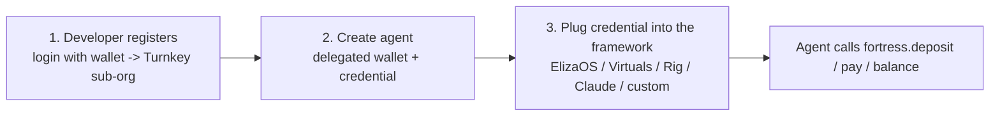
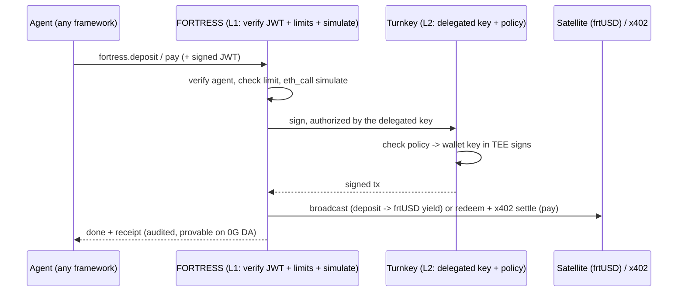
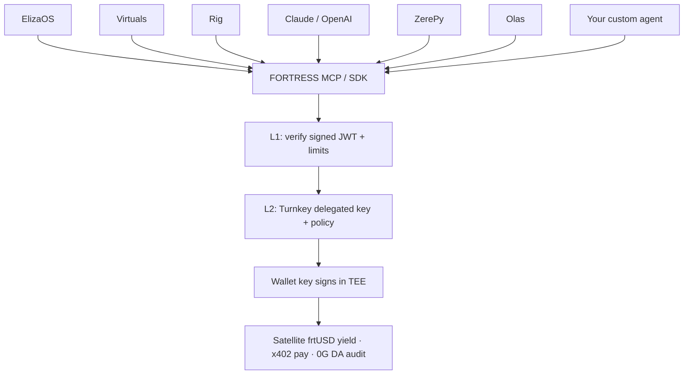

# How Agents Use FORTRESS — Platform Architectures & Integration Flows

**Purpose:** explain, in easy terms but at institution grade, exactly **how any AI agent uses
FORTRESS** — whether it runs on ElizaOS, Virtuals, Rig, Claude/MCP, ZerePy, Olas, or is something a
developer builds from scratch. It covers the **one universal model**, the **security model**
(delegated wallets + two auth layers), the **runtime flow**, and then the **per-platform wiring**.

> External facts are paraphrased from the linked sources for licensing compliance.

---

## Part 1 — The universal model (true for EVERY agent)

No matter the framework, using FORTRESS is always the **same three steps**:



1. **Developer registers** — logs into the FORTRESS dashboard with their wallet. Turnkey creates a
   private **sub-org** (their vault) where **their wallet is the root owner**.
2. **Create an agent** — one click provisions a **delegated wallet** (an agent address inside that
   vault) plus a **scoped credential** (an API key the agent signs requests with).
3. **Plug it in** — the developer pastes that credential into their agent's framework (or our SDK).
   The agent instantly gains tools: `fortress.deposit`, `fortress.withdraw`, `fortress.pay`,
   `fortress.balance`.

That's it. The agent itself is never rewritten — it just gains a treasury.

---

## Part 2 — The security model (easy terms)

Two ideas make this safe. Read these once and the rest of the doc is obvious.

### Idea 1 — The agent uses a *delegated wallet*, never the keys
The wallet's private key lives inside **Turnkey's secure enclave (TEE)** and never leaves. The
**user owns the wallet** (their login is the "root" owner). FORTRESS gets only a **delegated key**
with a **policy** (e.g., "only deposit/withdraw/pay on Satellite + USDC, max $500/day"), so the
agent can act 24/7 **without** the human, while the user keeps full control and **can revoke
anytime** — this is Turnkey's delegated-access model [(Turnkey)](https://docs.turnkey.com/concepts/policies/delegated-access-overview).

### Idea 2 — There are two separate auth layers (don't mix them)

| Layer | Credential | Answers | Checked by |
|-------|-----------|---------|------------|
| **L1: Agent → FORTRESS** | API key + short-lived **signed JWT** | "Is this a legit agent?" | FORTRESS |
| **L2: FORTRESS → Turnkey** | Delegated key + policy (root = the user) | "Can the wallet actually sign this?" | Turnkey |

The agent's credential lives **only in L1**. The signing keys live in **L2**, in the TEE. So if the
agent's credential is ever stolen, the attacker still can't reach the keys and can't exceed the
policy — and the user revokes it instantly. **A leaked agent credential is bounded; it is not a
drained wallet.**

---

## Part 3 — The universal runtime flow (one picture for all platforms)

Every platform below ends up doing exactly this when the agent acts:



So the **only thing that differs per platform is step 1** — *how the agent is wired to call the
tool*. Everything after is identical. The rest of this doc is just "how each platform does step 1."

---

## Part 4 — Per-platform usage

Each section: what the platform is, how its agents act in the market, and **how it connects to
FORTRESS** (the concrete step-1 wiring).

### 4.1 ElizaOS (ai16z) — the agent operating system
**What it is:** an open-source TypeScript "agent OS." A *Character* config + the **AgentRuntime**
brings an agent to life; capabilities are added as **plugins** (Actions = do things, Providers =
gather info, Evaluators = learn, Services = background jobs) with a vector **Memory**
[(runtime)](https://docs.elizaos.ai/agents/runtime-and-lifecycle), [(plugins)](https://docs.elizaos.ai/plugins/architecture).

**How its agents act:** live on X/Discord/Telegram and chains (Solana, Ethereum, Base, BSC); trade,
post, manage community funds.

**How it uses FORTRESS (config only — native MCP support):**
```json
// character.json
{ "plugins": ["@elizaos/plugin-mcp"],
  "settings": { "mcp": { "servers": {
    "fortress": { "url": "https://mcp.fortress.exchange",
                  "headers": { "Authorization": "Bearer <agent JWT>" } } } } } }
```
The agent now sees `fortress.deposit/pay/...`. (Optionally ship a branded `@fortress/plugin` that
also feeds balance/yield into the prompt via a Provider.)

### 4.2 Virtuals Protocol (VIRTUAL) — launchpad + agent commerce
**What it is:** a launchpad that tokenizes agents, the **GAME** engine (an **HLP** brain plans tasks;
**Worker** hands run **Functions** in a loop), and **ACP** — agent-to-agent commerce in 4 phases
(request -> negotiate -> transaction -> evaluation) settled in x402
[(GAME)](https://whitepaper.virtuals.io/about-virtuals/agentic-framework-game), [(ACP)](https://whitepaper.virtuals.io/get-started-with-acp).

**How its agents act:** sell services to other agents and earn fees constantly (~15,800+ agents,
~$477M agentic GDP) [(rpcfast)](https://rpcfast.com/blog/how-ai-agents-trade-onchain).

**How it uses FORTRESS:** wrap a FORTRESS call inside a GAME **Function** —
```python
def fortress_pay(url, amount): return mcp_call("fortress","fortress.pay",{"url":url,"amount":amount})
```
and sit **behind the ACP transaction phase** as the treasury + x402 settlement + audit layer (agents
park earnings in frtUSD, pay out just-in-time).

### 4.3 Rig (ARC) — the Rust performance framework
**What it is:** a Rust library for modular LLM agents (Provider + Agent + **Tools** + vector store),
by 0xPlaygrounds [(rig)](https://docs.rig.rs/).

**How its agents act:** high-performance trading/data bots; favored by infra/quant teams.

**How it uses FORTRESS (native MCP via `rig-mcp`):**
```rust
let fortress = rig_mcp::from_server("https://mcp.fortress.exchange", "<agent JWT>").await?;
let agent = client.agent("gpt-…").tools(fortress).build();  // fortress tools become Rig tools
```
[(Rig MCP)](https://docs.rig.rs/docs/integrations/model_context_protocol). Since the FORTRESS backend
is Rust, this is the most natural fit.

### 4.4 Claude / any MCP host — zero-code
**What it is:** any MCP-speaking host (Claude Desktop, Cursor, IDEs).

**How it uses FORTRESS:**
```json
{ "mcpServers": { "fortress": {
    "command": "fortress", "args": ["mcp"], "transport": "stdio",
    "env": { "FORTRESS_MCP_TOKEN": "<agent JWT>" } } } }
```
The model can now call `fortress.deposit/pay/...` directly. OpenAI's Responses API connects the same
way (remote MCP tool) [(OpenAI)](https://openai.com/index/new-tools-and-features-in-the-responses-api).

### 4.5 ZerePy (ZEREBRO) — Python social agents
**What it is:** a Python framework (Connections + Actions + LLM providers) for social/creative
agents [(repo)](https://github.com/blorm-network/ZerePy).

**How its agents act:** post on X/Farcaster, light on-chain activity.

**How it uses FORTRESS:** add a **Fortress connection** exposing `deposit`/`pay` — gives social
agents a treasury and the ability to pay for content/AI APIs from earnings.

### 4.6 Olas / Autonolas (OLAS) — autonomous services
**What it is:** always-on services built as multi-agent **FSM** apps, replicated across operators,
paying for AI work via **Mech** [(Open Autonomy)](https://stack.olas.network/open-autonomy/guides/overview_of_the_development_process/).

**How its agents act:** persistent traders/keepers that constantly pay for inference.

**How it uses FORTRESS:** an FSM `PAY`/`FUND` state calls `fortress.pay`; FORTRESS is the
yield-earning operating treasury behind the service.

---

## Part 5 — Building your own agent (from scratch)

Someone with no framework still uses the **same three steps**:

1. **Register** on the FORTRESS dashboard (wallet login) -> get a vault.
2. **Create an agent** -> get the agent's address + a **signed-JWT credential**.
3. **Call FORTRESS** one of two ways:
   - **MCP** — point any MCP client at `https://mcp.fortress.exchange` with the credential, or
   - **SDK/REST** — use the FORTRESS SDK (TS/Python/Rust) or hit REST directly:
     ```
     POST https://api.fortress.exchange/agents/{id}/deposit
     Authorization: <signed JWT>      { "amount": "5000000" }
     ```

The agent provides its own brain (any LLM/logic); FORTRESS provides the treasury + payments. No
blockchain code, no key management.

---

## Part 6 — Summary: one backend, many doors



| Platform | How it connects | Effort |
|----------|-----------------|--------|
| ElizaOS | native MCP plugin -> add server in config | Config only |
| Claude / OpenAI / any MCP host | add the `fortress` MCP server | Config only |
| Rig | `rig-mcp` wraps tools | Config + a few lines |
| Virtuals | wrap a call in a GAME Function; sit behind ACP | Small |
| ZerePy | a Fortress connection | Small |
| Olas | FSM state calls the tool | Small |
| Custom | MCP client or SDK/REST | Small |

### The one-paragraph takeaway
> Every agent — on any platform — uses FORTRESS the same way: the **developer registers** (wallet
> login -> Turnkey vault, user is root owner), **creates an agent** (a **delegated wallet** + a
> signed-JWT credential, limited by policy and revocable), and **plugs the credential into their
> framework**. At runtime the agent calls `fortress.deposit/pay`; FORTRESS verifies the agent (L1),
> Turnkey's delegated key signs inside the TEE within policy (L2), and the money parks as
> yield-bearing frtUSD or settles via x402 — all audited on 0G DA. ElizaOS/Claude/OpenAI/Rig connect
> with near-zero code via MCP; Virtuals/ZerePy/Olas need a tiny wrapper; custom agents use MCP or the
> SDK. **One backend, many doors — and the agent never holds a key.**

### Suggested integration priority
1. **ElizaOS** + **Claude/OpenAI (MCP)** — config-only, biggest reach.
2. **Virtuals** — biggest money flow; ACP already uses x402.
3. **Rig** — Rust-native, lowest build cost.
4. **ZerePy / Olas** — broaden coverage.
