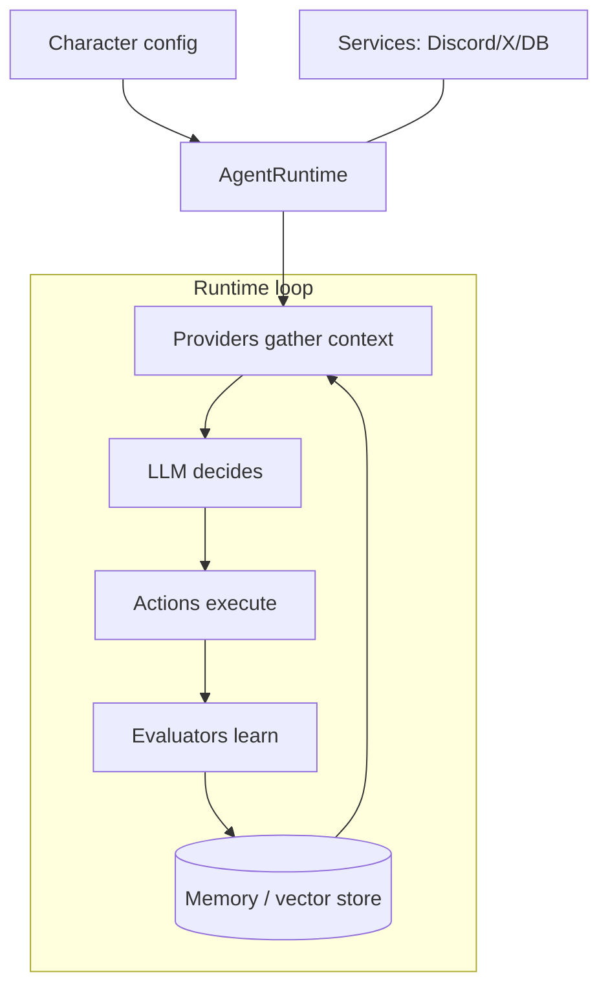
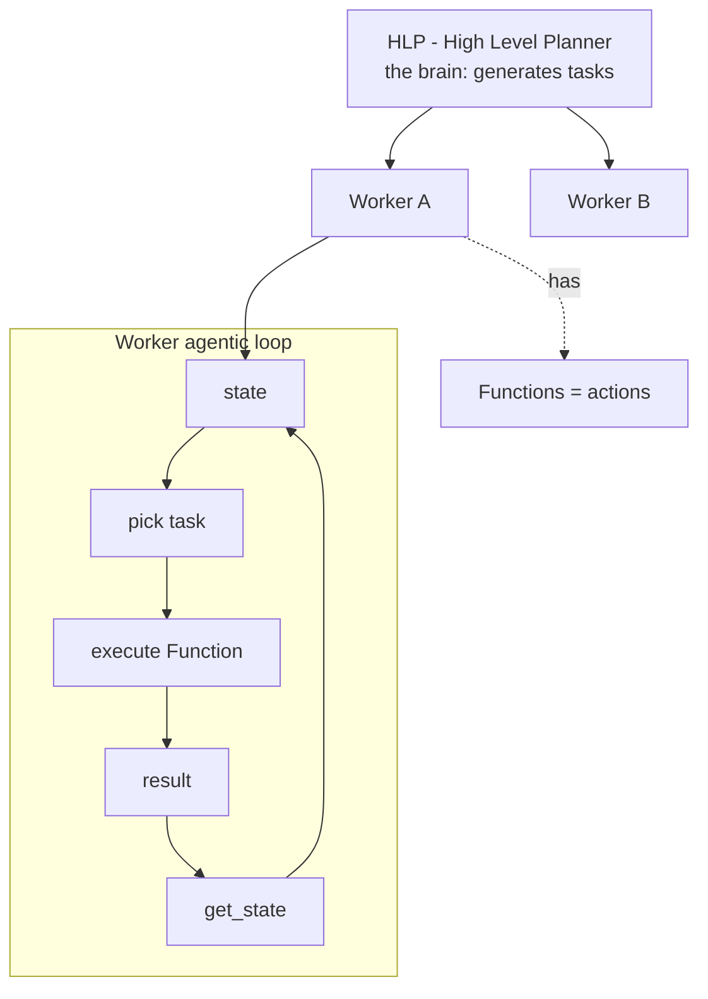
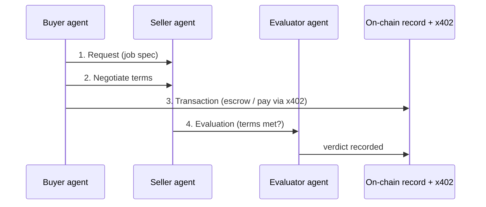
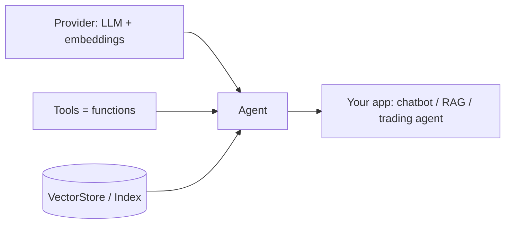
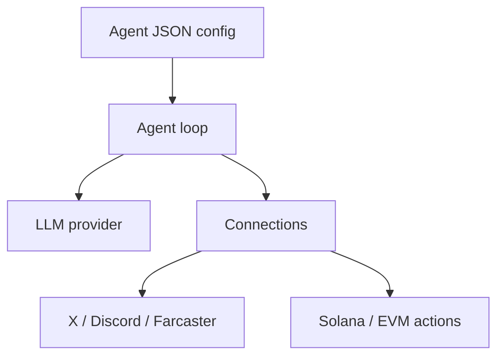
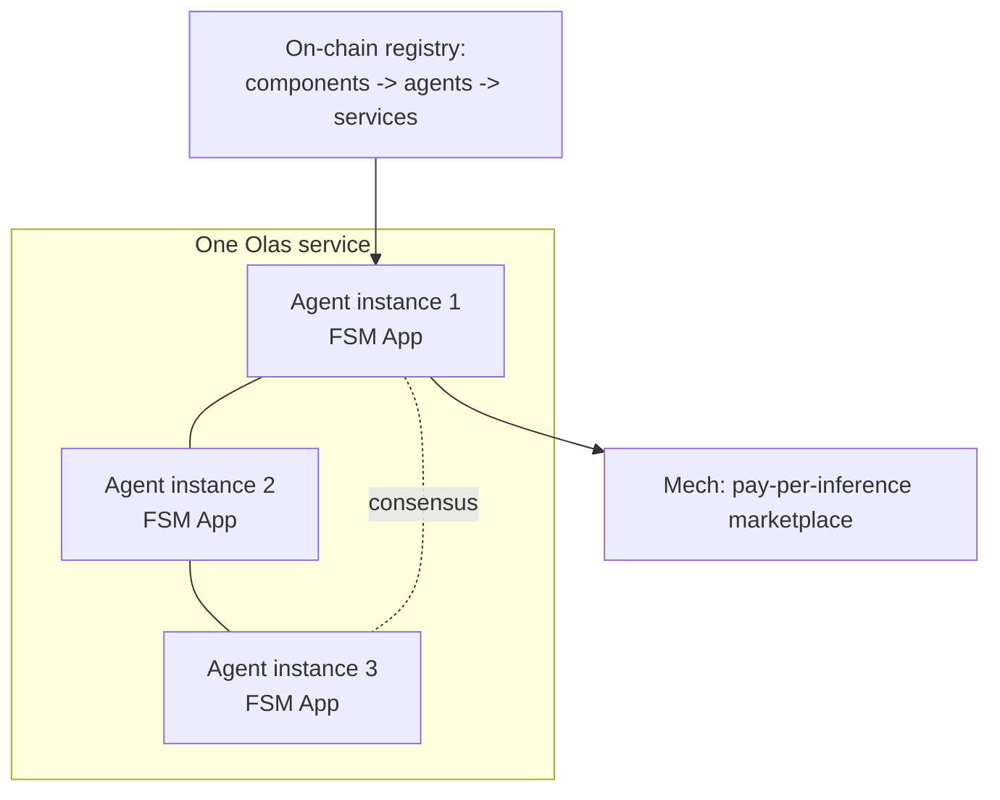

# Agent Platform Architectures — and where FORTRESS fits

**Purpose:** A detailed, readable breakdown of how the 5 biggest on-chain AI-agent platforms of
2026 actually work — their architecture and how their agents act in the market — so we can pinpoint
where FORTRESS (treasury + payments + guardrails) plugs in.

> External facts below are paraphrased from the linked sources for licensing compliance. Each
> platform section ends with a **FORTRESS touchpoint** (clearly marked) — candidate integration
> spots, not claims about the platform.

**TL;DR of where FORTRESS fits:** every one of these frameworks has a clean "action/tool/function"
extension point and a money problem (idle float + paying for things). FORTRESS attaches at the
**action layer** (as a tool/plugin) and becomes the **treasury + payment rail** behind the agent.

---

## 1. ElizaOS (ai16z) — the agent operating system

**What it is:** an open-source TypeScript "agent OS." A developer writes a *Character* (personality
+ config), and the runtime brings it to life across chat platforms and chains.

**Core architecture** — everything is orchestrated by the **AgentRuntime**, which turns a static
Character into a live agent [(runtime docs)](https://docs.elizaos.ai/agents/runtime-and-lifecycle).
Capabilities are added as **plugins**, and a plugin is just a manifest of four component types
[(plugin architecture)](https://docs.elizaos.ai/plugins/architecture):

| Component | Role (paraphrased from docs) | Analogy |
|-----------|------------------------------|---------|
| **Actions** | Execute tasks — call APIs, send messages, do on-chain ops [(components)](https://docs.elizaos.ai/plugins/components) | The hands |
| **Providers** | Gather data from memory/services/external sources and feed it into the LLM prompt [(providers)](https://docs.elizaos.ai/runtime/providers) | The senses |
| **Evaluators** | Post-process interactions, extract facts, learn | The reflection |
| **Services** | Long-running connections + background jobs (Discord, DBs, schedulers) [(services)](https://docs.elizaos.ai/runtime/services) | The organs |

Plus a **Memory system**: hierarchical storage for conversations, knowledge, and state, with
vector search/RAG so the agent keeps context [(memory)](https://docs.elizaos.ai/runtime/memory).



**How its agents act in the market:** a character connects to X/Discord/Telegram and to chains
(Solana, Ethereum, Base, BSC); plugins give it trading, posting, and contract-interaction actions.
It perceives (providers) → decides (LLM) → acts (actions) → learns (evaluators), continuously.

**FORTRESS touchpoint:** publish **`@fortress/plugin`** exposing Actions `deposit`, `withdraw`,
`pay`, `balance` (+ a Provider that reports the agent's frtUSD balance/yield into the prompt so the
LLM can reason about its treasury). Highest-leverage integration because of the plugin ecosystem.

---

## 2. Virtuals Protocol (VIRTUAL) — launchpad + agent commerce

**What it is:** a launchpad that **tokenizes** agents (co-ownership, paired with $VIRTUAL
liquidity) plus the runtime (**GAME**) and an inter-agent economy (**ACP**).

### 2a. GAME — the decision engine
GAME is a modular agentic framework that separates **planning from execution**
[(whitepaper)](https://whitepaper.virtuals.io/developer-documents/game-framework),
[(Messari)](https://messari.io/article/understanding-virtuals-protocol-a-comprehensive-overview):

- **HLP (High-Level Planner)** = the brain; produces tasks.
- **LLP Workers** = the hands and legs; each Worker owns **Functions** (the concrete actions it can
  take) and runs an **agentic loop**: take state → pick a task → execute a function → get result →
  refresh state → repeat [(GAME overview)](https://docs.game.virtuals.io/game-overview),
  [(reply worker docs)](https://docs.game.virtuals.io/how-to/articles/game-cloud-how-to-define-reply-worker-and-worker-prompts).



### 2b. ACP — Agent Commerce Protocol
ACP lets autonomous agents transact with each other, recorded on-chain for auditability
[(ACP overview)](https://whitepaper.virtuals.io/get-started-with-acp). Four phases: **request →
negotiation → transaction → evaluation**, where specialized **evaluator agents** check that a job
met its terms [(technical deep dive)](https://whitepaper.virtuals.io/about-virtuals/agent-commerce-protocol-acp/technical-deep-dive).
Settlement uses x402.



**How its agents act in the market:** an agent is launched + tokenized, runs on GAME (HLP plans,
Workers execute Functions), and earns by selling services to other agents through ACP, settling in
x402. Reportedly 15,800+ agents and ~$477M cumulative agentic GDP
[(rpcfast)](https://rpcfast.com/blog/how-ai-agents-trade-onchain).

**FORTRESS touchpoint:** two spots — (1) a GAME **Function pack** (`fortress_deposit`,
`fortress_pay`) so Workers can treasury/pay; (2) sit **behind the ACP transaction phase** as the
treasury + x402 settlement + audit layer (agents park earnings in frtUSD, pay out JIT). You
complement ACP, not replace it.

---

## 3. Rig (ARC) — the Rust performance framework

**What it is:** a Rust library for modular, lightweight, "fullstack" LLM agents, by 0xPlaygrounds
[(rig docs)](https://docs.rig.rs/), [(repo)](https://github.com/0xPlaygrounds/rig).

**Core architecture** — built on Rust traits for composability:

| Primitive | Role (paraphrased) |
|-----------|--------------------|
| **Providers** | Completion + embedding model backends |
| **Agent** | High-level abstraction combining model + context + tools + config [(agent)](https://docs.rig.rs/docs/concepts/agent) |
| **Tools** | Callable functions; a tool can be stored in a vector store for RAG-style retrieval [(tools)](https://docs.rig.rs/docs/concepts/tools) |
| **VectorStore / VectorStoreIndex** | Common traits for vector search backends (Qdrant, pgvector, etc.) [(architecture)](https://docs.rig.rs/docs/architecture) |



**How its agents act in the market:** developers compose an Agent with a model, a set of Tools
(including on-chain actions), and optional RAG; the binary runs anywhere Rust runs. Appeals to
infra/perf-sensitive and trading teams.

**FORTRESS touchpoint:** ship a **Rust SDK** implementing Rig `Tool`s (`FortressDeposit`,
`FortressPay`). Since the FORTRESS backend is already Rust, this is the most natural fit — your
treasury tools drop straight into a Rig agent.

---

## 4. ZerePy (ZEREBRO) — the Python social-agent framework

**What it is:** an open-source Python framework for AI agents (by Blorm, with roots in the Zerebro
agent) [(repo)](https://github.com/blorm-network/ZerePy). Strong for social/creative agents that
post and transact.

**Core architecture** — modular and config-driven:

| Piece | Role |
|-------|------|
| **Agent config (JSON)** | Personality + which connections/LLM to use |
| **Connections** | Pluggable integrations: X/Twitter, Discord, Farcaster, and chains (Solana, EVM) |
| **Actions** | Things the agent can do per connection (post, reply, transfer) |
| **LLM providers** | OpenAI/Anthropic/etc. swappable |
| **Agent loop (CLI)** | Perceive → decide → act, repeated |



**How its agents act in the market:** mostly social presence + light on-chain activity; the agent
posts content and can execute token actions through its blockchain connection.

**FORTRESS touchpoint:** add a **Fortress connection** (Python) exposing `deposit`/`pay` actions
— gives social agents a treasury + the ability to pay for compute/content APIs from earnings.

---

## 5. Olas / Autonolas (OLAS) — autonomous agent services

**What it is:** a stack for building **autonomous services** as *multi-agent systems* run by many
operators — closer to "decentralized always-on services" than single chatbots.

**Core architecture** — the **Open Autonomy** framework
[(dev process)](https://stack.olas.network/open-autonomy/guides/overview_of_the_development_process/):

- Business logic lives in an **FSM App** (a finite state machine) inside each agent instance —
  states encode the steps the service performs.
- A service is **replicated across multiple operator-run agents** that reach consensus (a
  mini-consensus per service) for fault tolerance.
- An **on-chain protocol** registers composable units: **components → agents → services**, with
  staking/rewards for operators.
- **Mech** = a marketplace where agents pay for inference/work requests; **Pearl** = an app-store to
  run agents locally.



**How its agents act in the market:** persistent services (e.g., prediction-market traders,
keepers) run continuously, coordinated on-chain, paying for AI work via Mech, funded by an
operating treasury.

**FORTRESS touchpoint:** be the **operating treasury** for a service — idle service funds earn
yield as frtUSD, and the service pays Mech/inference costs via `fortress.pay`. FSM states like
`PAY` or `FUND` call FORTRESS.

---

## Cross-platform pattern (the reusable insight)

Despite different languages, all five share the same shape:

```
PERCEIVE (providers/state)  ->  DECIDE (LLM/HLP/FSM)  ->  ACT (actions/functions/tools)  ->  repeat
```

FORTRESS always attaches at the **ACT layer** as one of the agent's actions/tools, and underneath
becomes the treasury + payment rail. So the integration surface is small and uniform:

| Platform | Extension point FORTRESS plugs into | Deliverable |
|----------|-------------------------------------|-------------|
| ElizaOS | Action + Provider (plugin) | `@fortress/plugin` (TS) |
| Virtuals GAME | Worker **Function** | GAME Function pack + ACP settlement |
| Rig | `Tool` trait | Rust SDK |
| ZerePy | Connection + Action | Python connection |
| Olas | FSM state action | Treasury integration |

Underneath all of them sits the **same FORTRESS MCP server + x402 client + Turnkey signing**. Build
once; expose through these thin per-platform adapters.

### Suggested priority
1. **ElizaOS** — biggest developer base, cleanest plugin model.
2. **Virtuals** — biggest commerce/$ flow; ACP already uses x402, so you slot in.
3. **Rig** — your Rust-native fit, lowest engineering cost.
4. **ZerePy / Olas** — broaden coverage (social + autonomous services).

> Where to read for FORTRESS placement: the FORTRESS touchpoints above mark candidate spots; the
> common answer is "the agent's action/tool layer + the treasury behind it." For agent-to-agent
> commerce specifically, the **Virtuals ACP transaction phase** is the single richest place FORTRESS
> can sit.
