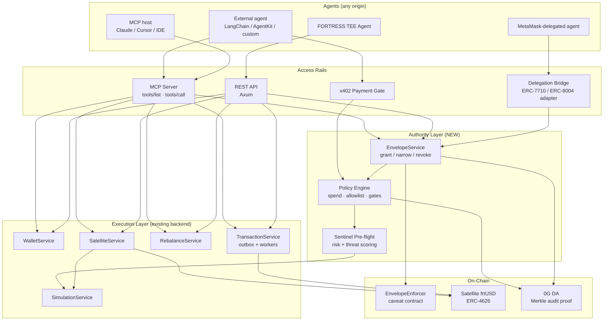
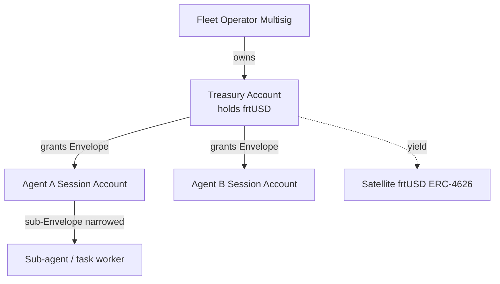
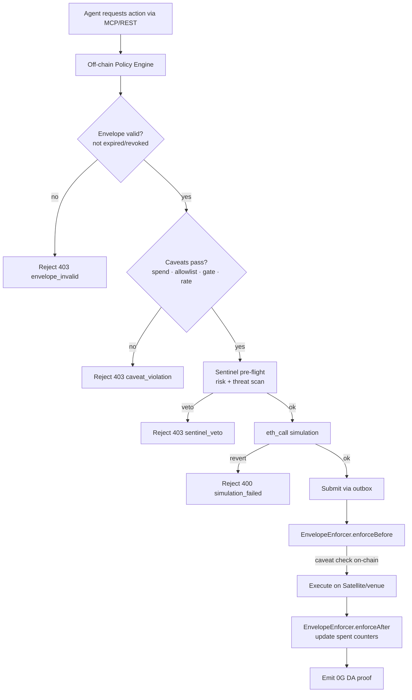
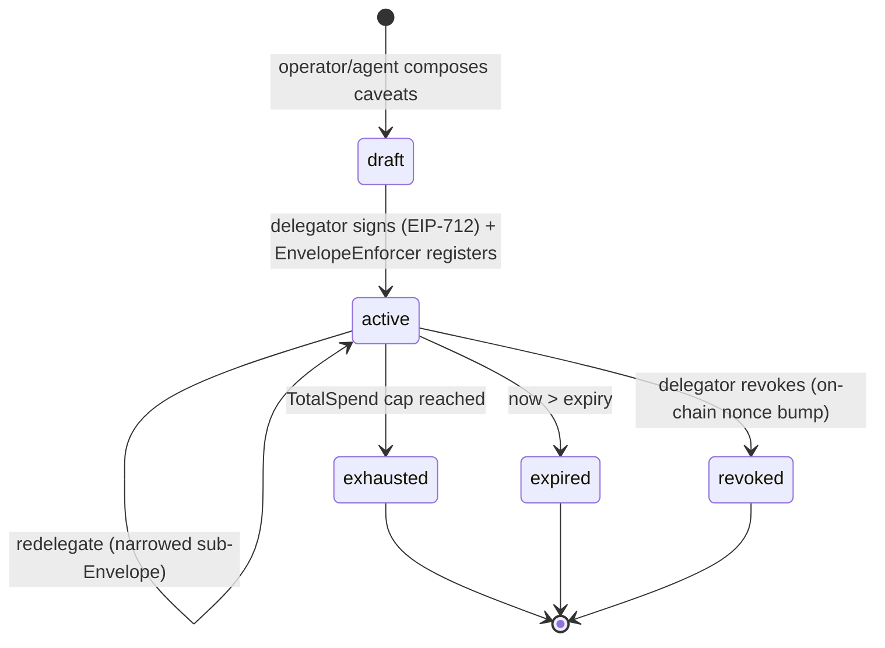
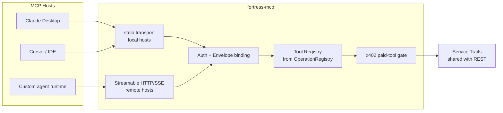
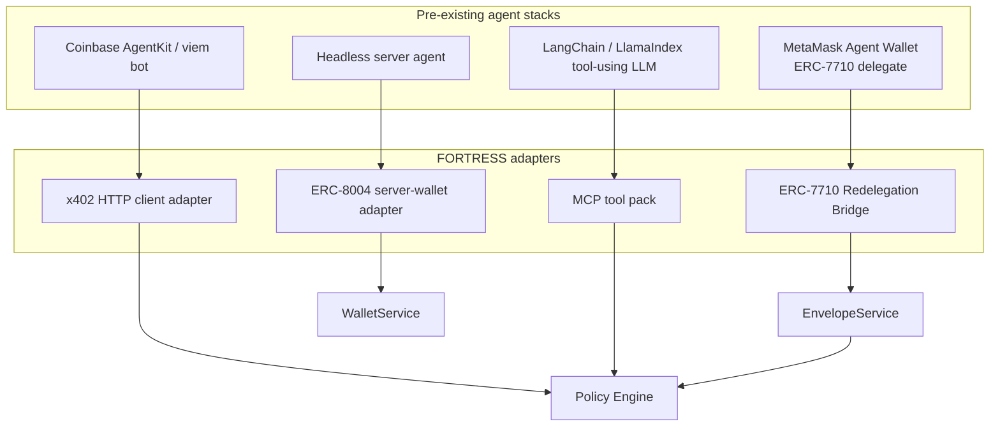
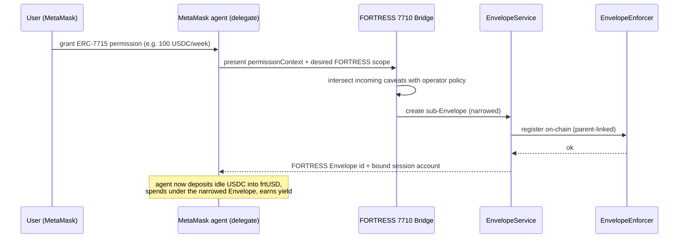

# Design Document: FORTRESS Agent Rails & MCP Layer

## Purpose

This document specifies how **any** AI agent — a FORTRESS-native treasury agent, a customer's
own bot, or a pre-existing agent built on a third-party stack (MetaMask Agent Wallet, a
LangChain/LlamaIndex agent, Claude Desktop, Cursor, an OpenAI Assistant, a Coinbase AgentKit
bot) — can safely custody float in **frtUSD**, spend under enforced limits, and settle payments
through FORTRESS infrastructure.

It extends the existing [`fortress-agent-backend`](./README.md) design with two new layers:

1. **Agent Rails** — a scoped, revocable, on-chain-enforced delegation layer ("Envelope")
   that grants an agent bounded authority over a FORTRESS treasury account.
2. **MCP Layer** — a Model Context Protocol server that exposes FORTRESS capabilities as
   discoverable tools, so any MCP-capable agent host can call FORTRESS without bespoke
   integration.

The design is informed by MetaMask's Agent Wallet, whose permission model we treat as the
interoperability target rather than a competitor: FORTRESS should be a *destination* that a
MetaMask-delegated agent can redelegate into.

---

## 1. Reference: How MetaMask Agent Wallet Works

> Sources, paraphrased for licensing compliance:
> [MetaMask Agent Wallet launch](https://metamask.io/news/metamask-launches-agent-wallet-giving-ai-agents-full-defi-access-with-default-security-on-every-transaction),
> [Smart Accounts Kit redelegation guide](https://docs.metamask.io/smart-accounts-kit/development/guides/advanced-permissions/create-redelegation.md),
> [ERC-7715 concepts](https://docs.metamask.io/delegation-toolkit/concepts/erc7715/),
> [Server wallets with ERC-8004](https://docs.metamask.io/tutorials/design-server-wallets/).

| Pillar | What it does | Mechanism |
|--------|--------------|-----------|
| Self-custodial agent wallet | Agent transacts across DeFi without a human signing each tx | Smart account owned by the user, operated by the agent |
| Default safety on every tx | Catches bad/looted/sandwiched transactions before send | Transaction simulation + Blockaid threat scanning + MEV protection |
| Advanced Permissions (ERC-7715) | User grants a dapp a *bounded* execution permission | e.g. `erc20-token-periodic` with `periodAmount` + `periodDuration` (spend N USDC per window) |
| Redelegation (ERC-7710) | A delegate passes a **narrowed** subset of its authority to a sub-agent | Caveat enforcers (e.g. `Erc20TransferAmount`, `ScopeType`); scope can only shrink, never expand |
| Server wallets (ERC-8004) | Backend signer holds keys; clients authenticate and receive signatures | Used for headless/autonomous agents |
| Multi-chain | One model spanning all EVM chains | Ethereum, Linea, Arbitrum, Avalanche, Optimism, Base, Polygon, BSC, Sei |

The key insight: **MetaMask separates *authority* (a signed, on-chain-enforceable permission
with caveats) from *execution* (the agent that redeems it).** FORTRESS already has the
execution layer (`fortress-agent-backend`) and the policy primitive (Envelope). We need to make
the authority layer (a) on-chain enforced, (b) redelegatable, and (c) reachable by external
agents over a standard protocol (MCP + x402).

---

## 2. Concept Mapping: MetaMask ↔ FORTRESS

| MetaMask / Delegation Toolkit | FORTRESS equivalent | Notes |
|-------------------------------|---------------------|-------|
| Smart account (user-owned) | **Treasury Account** holding frtUSD (ERC-4626) | Owned by fleet operator multisig |
| Delegate / session account | **Agent Session Account** | Per-agent key in Turnkey TEE |
| ERC-7715 Advanced Permission | **Envelope** (signed policy) | Spend limits, allowlist, periodic caps |
| Caveat enforcers | **Envelope caveats** (`EnvelopeEnforcer`) | On-chain `enforceBefore`/`enforceAfter` hooks |
| Redelegation (ERC-7710) | **Sub-Envelope** | Fleet → individual agent, scope can only narrow |
| Tx simulation + Blockaid | **SimulationService + Sentinel pre-flight** | `eth_call` + risk/threat scoring |
| MEV protection | Private-orderflow RPC / venue routing | Per-chain config |
| Revocation | **Envelope revoke + on-chain kill-switch** | Immediate, plus expiry |
| Server wallet (ERC-8004) | Turnkey-backed signer + `WalletService` | Already in backend |

FORTRESS-specific additions MetaMask does not have, which become differentiators:

- **Yield-bearing custody**: idle authority sits in frtUSD earning yield, not idle USDC.
- **JIT recall**: capital is pulled from yield venues just-in-time to fund a spend.
- **0G DA audit proof**: every Envelope decision + position is provable on-chain every 60s.
- **x402 settlement**: spend authority is also payment authority over HTTP.

---

## 3. System Architecture



The Authority Layer is new; the Execution Layer is the existing backend. The Access Rails are
how heterogeneous agents reach both.

---

## 4. Agent Rails — the Authority Layer

### 4.1 Account model



- **Treasury Account**: an ERC-4626 position in `Satellite` (frtUSD-C). Owned by the operator
  multisig. This is the float that earns yield.
- **Agent Session Account**: a Turnkey-sealed key (one per agent). Holds *no* funds; it holds
  *authority* via an Envelope.
- **Sub-account / task worker**: receives a redelegated, strictly-narrower Envelope.

### 4.2 The Envelope (authority primitive)

An Envelope is a signed grant from a delegator to a delegate with a set of **caveats**. It is
the FORTRESS analog of an ERC-7715 permission + ERC-7710 redelegation chain.

```rust
pub struct Envelope {
    pub id: Uuid,
    pub delegator: Address,        // Treasury Account or parent agent
    pub delegate: Address,         // Agent Session Account
    pub chain_id: u64,
    pub caveats: Vec<Caveat>,      // ALL must pass (AND semantics)
    pub parent: Option<Uuid>,      // Some(_) => this is a sub-Envelope (redelegation)
    pub expiry: i64,               // unix seconds; hard stop
    pub nonce: u64,                // for replay protection + revocation
    pub signature: Bytes,          // delegator signature over the struct hash (EIP-712)
}

pub enum Caveat {
    /// Max spend per rolling window (mirrors erc20-token-periodic).
    PeriodicSpend { token: Address, period_amount: U256, period_seconds: u64 },
    /// Absolute lifetime cap across the whole Envelope.
    TotalSpend { token: Address, max_amount: U256 },
    /// Only these contracts/venues may be called.
    Allowlist { targets: Vec<Address> },
    /// Only these function selectors on allowlisted targets.
    SelectorAllowlist { selectors: Vec<[u8; 4]> },
    /// Graduated gate: spends above `threshold` require `approvals` co-signers.
    GraduatedGate { threshold: U256, approvals: u8 },
    /// Time-of-day / rate limit (txs per window).
    RateLimit { max_txs: u32, window_seconds: u64 },
    /// Sentinel risk ceiling: reject if risk flag >= level (GREEN<YELLOW<RED<BLACK).
    RiskCeiling { max_flag: u8 },
}
```

**Narrowing rule (redelegation invariant):** a sub-Envelope's caveats must be a subset-or-tighter
of its parent. The `EnvelopeService` rejects any sub-Envelope that would widen authority — this
is the same "scope can only shrink" guarantee MetaMask enforces for ERC-7710.

### 4.3 Two-layer enforcement

Authority is enforced **twice**, defense-in-depth:



- **Off-chain (Policy Engine)**: fast rejection, good UX, cheap. Mirrors MetaMask's
  pre-send simulation + threat scanning.
- **On-chain (`EnvelopeEnforcer`)**: the trustless backstop. Even if the backend is
  compromised, the enforcer contract refuses transactions that violate the signed caveats,
  and updates spent counters atomically. This is the FORTRESS analog of caveat enforcers in
  the Delegation Framework.

### 4.4 Envelope lifecycle



Revocation is immediate: bumping the on-chain Envelope nonce invalidates the grant and every
sub-Envelope beneath it (cascading kill-switch), independent of the off-chain backend.

---

## 5. MCP Layer — making FORTRESS callable by any agent

The existing backend already routes HTTP handlers and a "future MCP transport" through the same
service traits and a `/capabilities` manifest. This section makes that concrete.

### 5.1 Transport & topology



Two transports:
- **stdio** for local hosts (Claude Desktop / Cursor) — the same packaging MetaMask uses for
  CLI early access.
- **Streamable HTTP + SSE** for remote/headless agents, gated by OAuth2 client-credentials or
  scoped API keys (reusing the existing `api_keys` table, scopes `read-only`/`transact`/`admin`).

### 5.2 Tool surface (derived from existing service traits)

Each MCP tool is a thin adapter over an existing trait method; the JSON Schema is generated from
the same `schemars`-derived types used by REST, so there is a single source of truth.

| MCP tool | Backing trait method | Scope | x402 | Envelope-checked |
|----------|----------------------|-------|------|------------------|
| `fortress.capabilities` | `CapabilitiesService` | read-only | no | no |
| `fortress.treasury.info` | `SatelliteService::vault_info` | read-only | no | no |
| `fortress.envelope.grant` | `EnvelopeService::grant` | admin | no | n/a (creates authority) |
| `fortress.envelope.redelegate` | `EnvelopeService::redelegate` | transact | no | parent-checked |
| `fortress.envelope.revoke` | `EnvelopeService::revoke` | admin | no | n/a |
| `fortress.envelope.status` | `EnvelopeService::status` | read-only | no | no |
| `fortress.deposit` | `SatelliteService::deposit` | transact | yes | yes |
| `fortress.withdraw` | `SatelliteService::withdraw` | transact | yes | yes |
| `fortress.buy` / `fortress.sell` | `SatelliteService::{buy,sell}` | transact | yes | yes |
| `fortress.pay` | `PaymentService::settle_x402` | transact | yes | yes |
| `fortress.tx.status` | `TransactionService::get_status` | read-only | no | no |

`tools/list` returns this manifest filtered by the caller's scope **and** by the caveats of the
Envelope bound to their credential — an agent only ever *sees* tools it is actually allowed to
call.

### 5.3 Tool call with Envelope binding

```mermaid
sequenceDiagram
    participant A as Agent (MCP host)
    participant M as fortress-mcp
    participant P as Policy Engine
    participant S as SatelliteService
    participant O as Outbox/Workers
    participant E as EnvelopeEnforcer

    A->>M: tools/call fortress.pay {to, amount, idempotency_key}
    M->>M: Resolve API key -> Envelope binding
    M->>P: authorize(envelope, action=pay, amount)
    alt caveat violation
        P-->>M: deny(reason)
        M-->>A: isError: true {code: caveat_violation}
    end
    P->>P: Sentinel pre-flight (risk/threat)
    M->>S: settle / queue (outbox write, status=queued)
    S-->>M: 202 {status: queued, nonce}
    M-->>A: tool result {status: queued, tx ref}
    Note over O,E: async broadcast; on-chain EnvelopeEnforcer re-checks caveats
    O->>E: enforceBefore(envelope, calldata)
    E-->>O: ok -> execute; enforceAfter updates spent
```

The MCP layer never holds keys and never bypasses the outbox/simulation path — it is purely an
alternate **front door** to the same audited execution layer.

### 5.4 Paid tools (x402 over MCP)

Tools marked x402 return a structured `402`-equivalent payment requirement inside the MCP error
payload; the agent pays (via `fortress.pay` or any x402 client) and retries with the settlement
proof. This lets an agent *earn* by exposing FORTRESS-settled services and *spend* under the same
Envelope — closing the loop the FORTRESS blurb calls the "x402 settlement layer."

---

## 6. Interop: onboarding pre-existing agents

The whole point is that a team does **not** rebuild their agent. Four adapters cover the field:



1. **ERC-7710 Redelegation Bridge** — a MetaMask-delegated agent already holds a permission
   context. The bridge accepts that context and mints a FORTRESS sub-Envelope whose caveats are
   the intersection of the incoming caveats and the operator's policy. The MetaMask agent keeps
   its wallet; FORTRESS becomes a redelegation target that adds yield + JIT recall.
2. **MCP tool pack** — any MCP host (Claude, Cursor, custom) drops in `fortress-mcp` and gets the
   tool surface in §5.2. Zero protocol code.
3. **x402 HTTP adapter** — any HTTP-capable agent hits the REST endpoints; `402` challenges are
   answered with x402 settlement. Works with AgentKit, viem, raw `fetch`.
4. **ERC-8004 server-wallet adapter** — headless agents that expect a backend signer get one via
   the existing Turnkey-backed `WalletService`, bound to an Envelope.

### 6.1 MetaMask → FORTRESS redelegation sequence



---

## 7. Changes to the existing backend

This layer is additive. Concretely:

- **New service trait** `EnvelopeService` (grant / redelegate / revoke / status / authorize),
  alongside the existing traits — same trait-based pattern, so both REST and MCP get it for free.
- **New service trait** `PaymentService` (`settle_x402`) wrapping the existing `x402` client.
- **New crate/binary** `fortress-mcp` that imports the service layer and exposes stdio + HTTP
  transports; it reuses `OperationRegistry`, `schemars` schemas, `api_keys`, and the audit log.
- **New on-chain contract** `EnvelopeEnforcer` (caveat enforcement + spent counters + revocation
  nonce), called from the broadcast path before/after execution.
- **New tables**:

```sql
-- envelopes: signed authority grants (off-chain mirror of on-chain registration)
CREATE TABLE envelopes (
    id            UUID PRIMARY KEY DEFAULT gen_random_uuid(),
    delegator     TEXT NOT NULL,
    delegate      TEXT NOT NULL,
    chain_id      INTEGER NOT NULL,
    parent_id     UUID REFERENCES envelopes(id),     -- redelegation chain
    caveats       JSONB NOT NULL,                    -- serialized Vec<Caveat>
    expiry        TIMESTAMPTZ NOT NULL,
    onchain_nonce BIGINT NOT NULL,
    signature     BYTEA NOT NULL,
    status        TEXT NOT NULL DEFAULT 'active'
                  CHECK (status IN ('active','exhausted','expired','revoked')),
    created_at    TIMESTAMPTZ NOT NULL DEFAULT now()
);
CREATE INDEX idx_envelopes_delegate ON envelopes(delegate, status);
CREATE INDEX idx_envelopes_parent ON envelopes(parent_id);

-- envelope_spend: rolling-window + lifetime spend counters per envelope+token
CREATE TABLE envelope_spend (
    envelope_id   UUID NOT NULL REFERENCES envelopes(id),
    token         TEXT NOT NULL,
    window_start  TIMESTAMPTZ NOT NULL,
    window_spent  NUMERIC(78,0) NOT NULL DEFAULT 0,
    total_spent   NUMERIC(78,0) NOT NULL DEFAULT 0,
    PRIMARY KEY (envelope_id, token)
);
```

- **New audit events**: `envelope_granted`, `envelope_redelegated`, `envelope_revoked`,
  `caveat_violation`, `sentinel_veto` — appended to the existing immutable `audit_logs`.

Everything else — outbox pattern, nonce reservation, two-phase confirmation, reorg handling,
webhook ingestion — is unchanged and now serves Envelope-gated traffic too.

---

## 8. Correctness Properties (additions)

These extend the property list in the main design doc.

### Property A1: Redelegation Narrowing
*For any* parent Envelope P and sub-Envelope S where `S.parent = P.id`, every caveat in S SHALL be
equal-or-tighter than the corresponding caveat in P. The system SHALL reject any S that widens
spend limits, expands the allowlist/selector set, lowers the approval threshold of a graduated
gate, or extends expiry beyond P's expiry.

### Property A2: Dual Enforcement Equivalence
*For any* action accepted by the off-chain Policy Engine, the on-chain `EnvelopeEnforcer` SHALL
also accept it under the same Envelope state; and *for any* action rejected on-chain, the
off-chain engine SHALL NOT have produced a `finalized` transaction. (No action is finalized that
violates a caveat.)

### Property A3: Periodic Spend Window Integrity
*For any* `PeriodicSpend { period_amount, period_seconds }` caveat, the sum of spends within any
window of length `period_seconds` SHALL NOT exceed `period_amount`, regardless of how spends
interleave across REST and MCP transports.

### Property A4: Cascading Revocation
*For any* Envelope E that is revoked (on-chain nonce bump), E and every Envelope in the subtree
rooted at E SHALL be treated as invalid for all subsequent authorizations, with no further
`finalized` transactions under any of them.

### Property A5: Transport Authority Parity
*For any* (agent, Envelope) pair, the set of actions authorized via the MCP transport SHALL be
identical to the set authorized via the REST transport. No transport SHALL grant authority the
other withholds.

### Property A6: Tool Visibility Reflects Authority
*For any* `tools/list` response, a tool SHALL appear if and only if the caller's scope and bound
Envelope caveats would permit at least one valid invocation of that tool.

---

## 9. Build Order (roadmap-aligned)

Mapped to the FORTRESS roadmap ("H1: agentic wallet, nine-pillar basket, x402 settlement layer,
agent SDK"):

1. **`EnvelopeService` + tables + EIP-712 signing** (off-chain authority).
2. **`EnvelopeEnforcer` contract + broadcast-path hooks** (on-chain enforcement).
3. **`fortress-mcp` (stdio first, then HTTP/SSE)** with the tool surface in §5.2.
4. **x402 paid-tool gate over MCP** (`PaymentService`).
5. **ERC-7710 redelegation bridge + ERC-8004 adapter** (external-agent onboarding).
6. **Agent SDK** (typed client wrapping MCP + x402 + Envelope helpers) — the developer-facing
   surface that ties it together.

---

## 10. Summary

FORTRESS already owns the hard part — a correctness-first execution layer with simulation,
outbox, and on-chain audit. To let *any* agent (including pre-existing ones) use it, we add an
**authority layer** (the Envelope: signed, caveat-bounded, redelegatable, dually enforced) and an
**access layer** (MCP tools + x402 + delegation bridges). The result mirrors MetaMask's
separation of authority from execution, but with three things MetaMask lacks: yield-bearing
custody (frtUSD), JIT recall, and 0G DA proof — and with an explicit interop path so a
MetaMask-delegated agent can redelegate *into* FORTRESS rather than around it.
