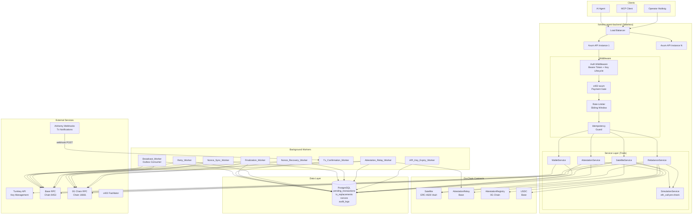
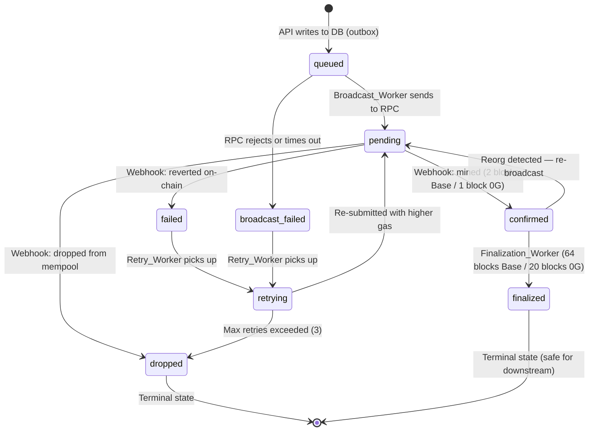
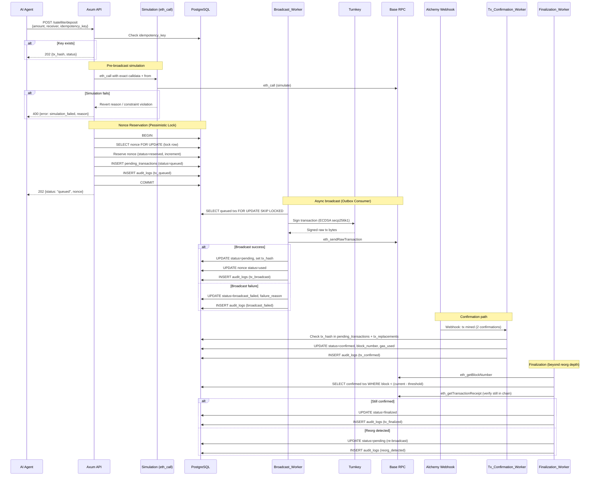
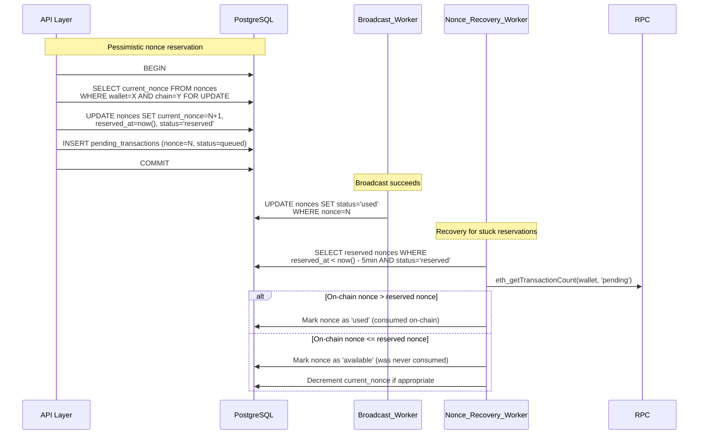
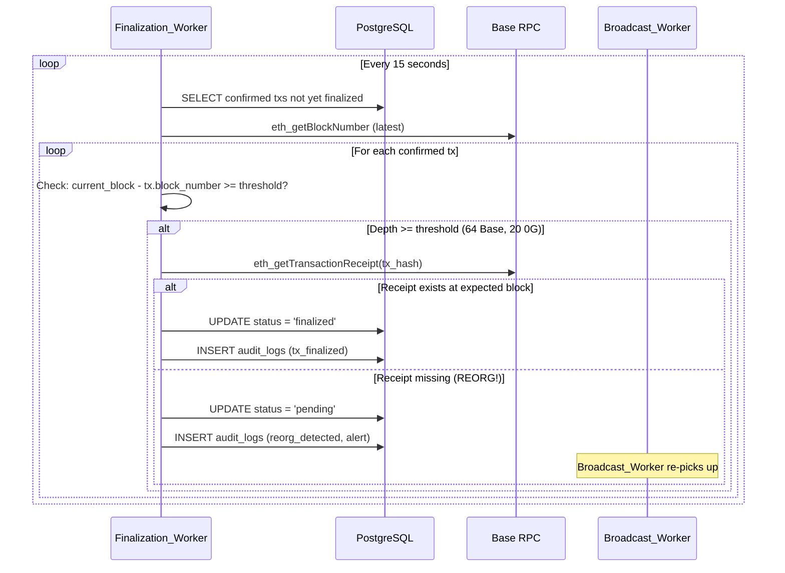
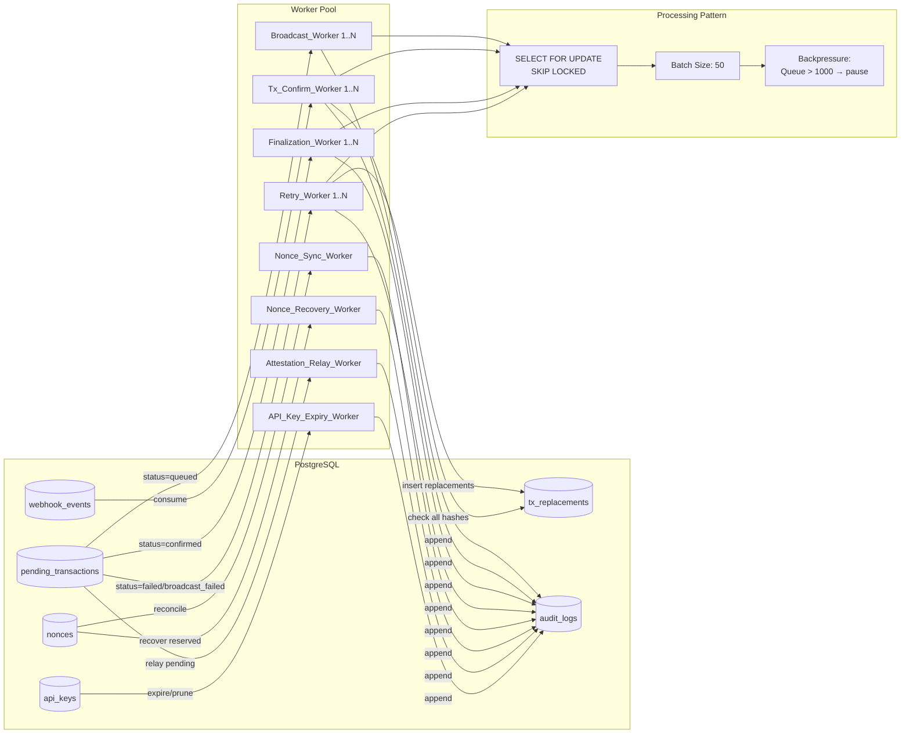
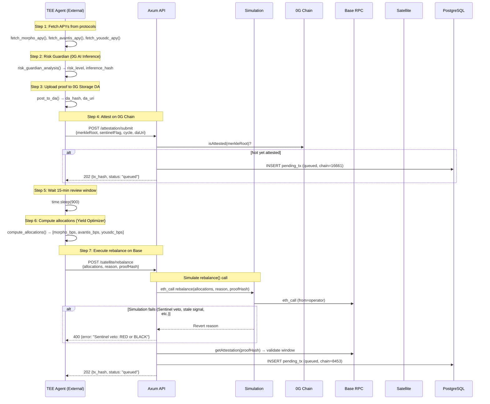
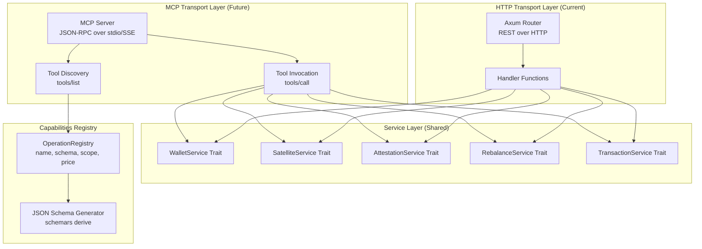
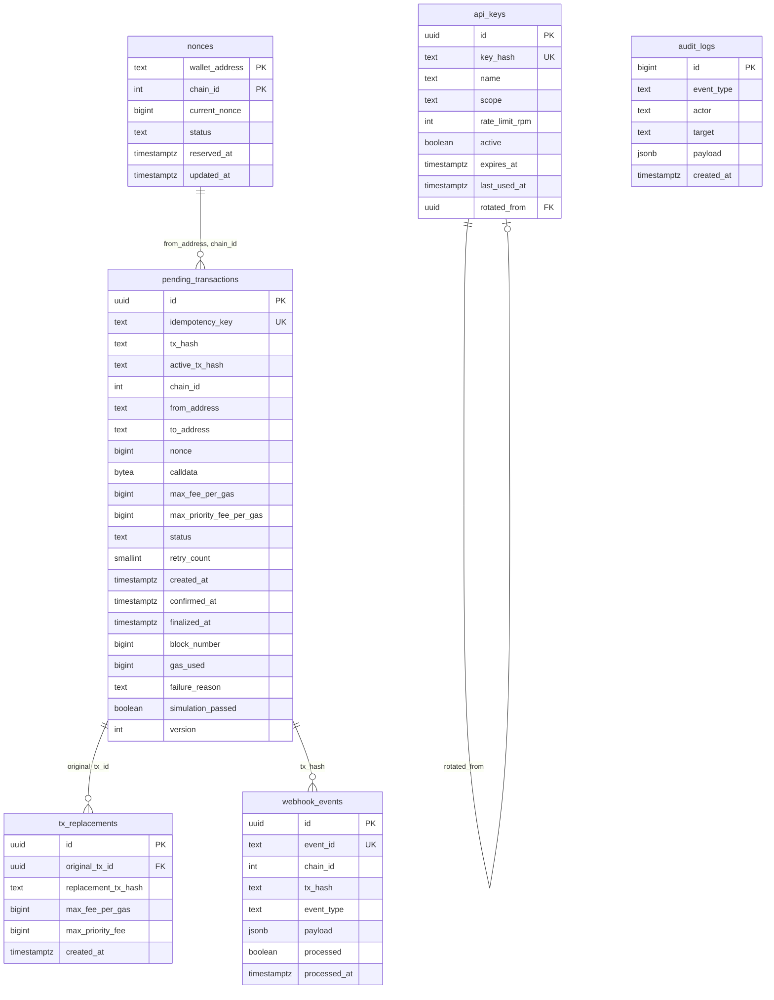
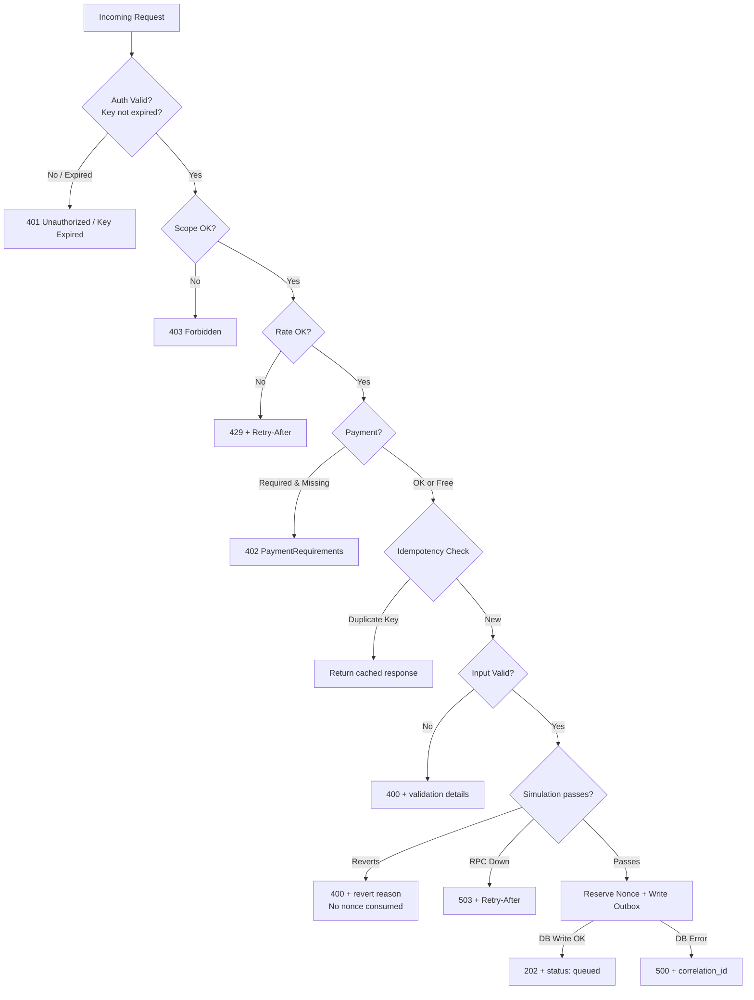

# Design Document: fortress-agent-backend

## Overview

The fortress-agent-backend is a production-grade Rust service built on Axum that provides non-custodial wallet infrastructure and blockchain interaction capabilities for AI agents operating within the FORTRESS protocol. It serves as the execution layer between TEE-sealed AI agents and on-chain smart contracts across Base (chain 8453) and 0G Chain (chain 16661).

The system follows a **write-ahead outbox architecture**: the API layer validates, simulates, and persists transactions to the database FIRST (status=`queued`), then specialized background workers broadcast and manage the transaction lifecycle. This guarantees atomicity between state persistence and blockchain broadcast — the DB write always completes before any RPC interaction.

Key design principles:
- **Stateless API**: No in-process state; all state lives in PostgreSQL
- **Idempotent writes**: Every mutation requires a client-supplied idempotency key
- **Outbox pattern**: All transactions are written to DB before broadcast (at-least-once delivery)
- **Nonce reservation with pessimistic locking**: Nonces are reserved atomically via `SELECT FOR UPDATE` before signing
- **Pre-broadcast simulation**: Every transaction is simulated via `eth_call` before nonce reservation
- **Two-phase confirmation**: Transactions go through `confirmed` (mined) → `finalized` (beyond reorg depth)
- **Transaction replacement tracking**: All speed-up/replacement tx hashes are tracked for a given nonce
- **Webhook-driven**: No polling; Alchemy Notify pushes tx state changes
- **Horizontal scaling**: Multiple API instances + multiple worker instances using `SELECT FOR UPDATE SKIP LOCKED`
- **Trait-based service layer**: All business logic behind traits, enabling both HTTP and future MCP transports
- **Immutable audit trail**: Every mutation is recorded in an append-only audit log

### Contract Addresses (Mainnet)

| Contract | Chain | Address |
|----------|-------|---------|
| Satellite (frtUSD-C) | Base 8453 | `0x1493522095857A3e28e6573E8a1f6b612dd30B40` |
| AttestationRelay | Base 8453 | `0x1f2Bda259365BF10210AB6C8C0F4A211eE2be5FC` |
| AttestationRegistry | 0G 16661 | `0x252709C4569E096BD4babe3be9175Ca2F49f152F` |
| USDC | Base 8453 | `0x833589fCD6eDb6E08f4c7C32D4f71b54bdA02913` |

## Architecture

### High-Level System Architecture



### Transaction State Machine

The transaction lifecycle uses an extended state machine with the outbox pattern and two-phase confirmation:



### Transaction Lifecycle Flow (Outbox Pattern)



### Nonce Reservation Flow



### Reorg Handling Flow



### Worker Architecture



### Rebalance Flow (Matching TEE.py)

The rebalance flow in the backend mirrors the existing TEE.py agent cycle:



### Pre-Broadcast Transaction Simulation

```mermaid
flowchart TD
    REQ[Incoming Transaction Request] --> BUILD[Build calldata + resolve from address]
    BUILD --> ETHCALL[eth_call with exact params]
    
    ETHCALL --> SUCCESS{Simulation<br/>succeeds?}
    
    SUCCESS -->|Yes| CHECKS{Contract-specific<br/>checks pass?}
    SUCCESS -->|No| PARSE[Parse revert reason]
    PARSE --> REJECT[Return 400 + decoded reason<br/>No DB write, no nonce reservation]
    
    CHECKS -->|Satellite deposit| DEP_CHECK[Check: paused()? maxDeposit()? depositLimit?]
    CHECKS -->|Satellite sell| SELL_CHECK[Check: maxSellSize()?]
    CHECKS -->|Rebalance| REB_CHECK[Check: attestation window?<br/>sentinelFlag < 3?]
    
    DEP_CHECK --> PASS_FAIL{All pass?}
    SELL_CHECK --> PASS_FAIL
    REB_CHECK --> PASS_FAIL
    
    PASS_FAIL -->|Yes| PROCEED[Reserve nonce + write to outbox]
    PASS_FAIL -->|No| REJECT
```

### MCP Server Architecture



## Components and Interfaces

### Rust Project File Structure

```
fortress-agent-backend/
├── Cargo.toml
├── Cargo.lock
├── chains.toml                     # Chain/contract configuration
├── config.toml                     # Operational settings
├── .env.example
├── migrations/
│   ├── 001_create_pending_transactions.sql
│   ├── 002_create_nonces.sql
│   ├── 003_create_webhook_events.sql
│   ├── 004_create_api_keys.sql
│   ├── 005_create_tx_replacements.sql
│   ├── 006_create_audit_logs.sql
│   └── 007_add_finalization_columns.sql
├── src/
│   ├── main.rs                     # Entrypoint, server bootstrap
│   ├── lib.rs                      # Library root, re-exports
│   ├── config/
│   │   ├── mod.rs
│   │   ├── chains.rs               # chains.toml parser + validation
│   │   ├── settings.rs             # config.toml + env var loading
│   │   └── types.rs                # ChainConfig, ContractAddresses types
│   ├── api/
│   │   ├── mod.rs
│   │   ├── router.rs               # Axum router assembly
│   │   ├── handlers/
│   │   │   ├── mod.rs
│   │   │   ├── wallet.rs           # POST /wallet/create, GET /wallet/list
│   │   │   ├── satellite.rs        # POST /satellite/{deposit,withdraw,buy,sell}
│   │   │   ├── rebalance.rs        # POST /satellite/rebalance
│   │   │   ├── attestation.rs      # POST /attestation/submit
│   │   │   ├── transaction.rs      # GET /tx/{hash}
│   │   │   ├── health.rs           # GET /health
│   │   │   ├── metrics.rs          # GET /metrics
│   │   │   ├── config_info.rs      # GET /config/chains
│   │   │   ├── capabilities.rs     # GET /capabilities
│   │   │   ├── webhook.rs          # POST /webhook/alchemy
│   │   │   └── api_key_mgmt.rs     # POST /keys/rotate, GET /keys
│   │   ├── middleware/
│   │   │   ├── mod.rs
│   │   │   ├── auth.rs             # Bearer token + key lifecycle (expiry check)
│   │   │   ├── rate_limit.rs       # Sliding window rate limiter
│   │   │   ├── idempotency.rs      # Idempotency key check
│   │   │   └── x402.rs             # x402-axum payment gate
│   │   ├── errors.rs               # AppError enum, IntoResponse impl
│   │   └── extractors.rs           # Custom Axum extractors
│   ├── services/
│   │   ├── mod.rs
│   │   ├── traits.rs               # Service trait definitions
│   │   ├── wallet.rs               # WalletService impl
│   │   ├── satellite.rs            # SatelliteService impl
│   │   ├── attestation.rs          # AttestationService impl
│   │   ├── rebalance.rs            # RebalanceService impl
│   │   ├── simulation.rs           # Pre-broadcast eth_call simulation
│   │   ├── audit.rs                # AuditService (append-only writes)
│   │   └── capabilities.rs         # CapabilitiesService (JSON Schema gen)
│   ├── workers/
│   │   ├── mod.rs
│   │   ├── broadcast.rs            # Outbox consumer: queued → pending
│   │   ├── tx_confirmation.rs      # Alchemy webhook consumer
│   │   ├── finalization.rs         # confirmed → finalized (reorg check)
│   │   ├── retry.rs                # Failed/stale tx resubmission
│   │   ├── nonce_sync.rs           # Periodic nonce reconciliation
│   │   ├── nonce_recovery.rs       # Resolve stuck "reserved" nonces
│   │   ├── attestation_relay.rs    # 0G → Base attestation relay
│   │   └── api_key_expiry.rs       # Prune expired API keys
│   ├── chain/
│   │   ├── mod.rs
│   │   ├── rpc.rs                  # JSON-RPC client (batch support)
│   │   ├── tx_builder.rs           # EIP-1559 transaction construction
│   │   ├── simulator.rs            # eth_call simulation + result parsing
│   │   ├── abi.rs                  # ABI encoding (Satellite, Registry, USDC)
│   │   └── types.rs                # EthAddress, TxHash, etc.
│   ├── turnkey/
│   │   ├── mod.rs
│   │   ├── client.rs               # Turnkey HTTP client
│   │   ├── stamper.rs              # API key stamping (P-256 ECDSA)
│   │   └── types.rs                # Turnkey request/response types
│   ├── x402/
│   │   ├── mod.rs
│   │   ├── server.rs               # x402-axum integration
│   │   └── client.rs               # x402-reqwest outbound payments
│   ├── db/
│   │   ├── mod.rs
│   │   ├── pool.rs                 # sqlx PgPool setup
│   │   ├── pending_transactions.rs # CRUD for pending_transactions
│   │   ├── tx_replacements.rs      # Replacement hash tracking
│   │   ├── nonces.rs               # Nonce reservation/release/sync
│   │   ├── webhook_events.rs       # Webhook event storage
│   │   ├── api_keys.rs             # API key lookup + lifecycle
│   │   └── audit_logs.rs           # Append-only audit log writes
│   ├── models/
│   │   ├── mod.rs
│   │   ├── transaction.rs          # PendingTransaction, TxStatus enum
│   │   ├── wallet.rs               # Wallet, WalletCreateResponse
│   │   ├── attestation.rs          # Attestation, AttestSubmitRequest
│   │   ├── rebalance.rs            # VaultAllocation, RebalanceRequest
│   │   ├── satellite.rs            # DepositRequest, WithdrawRequest, etc.
│   │   └── audit.rs                # AuditLogEntry, EventType enum
│   └── telemetry/
│       ├── mod.rs
│       ├── logging.rs              # tracing + JSON structured logs
│       └── metrics.rs              # Prometheus counters/histograms
├── tests/
│   ├── integration/
│   │   ├── mod.rs
│   │   ├── wallet_test.rs
│   │   ├── satellite_test.rs
│   │   ├── attestation_test.rs
│   │   ├── webhook_test.rs
│   │   ├── reorg_test.rs
│   │   ├── outbox_test.rs
│   │   └── helpers.rs
│   └── property/
│       ├── mod.rs
│       ├── tx_builder_props.rs
│       ├── nonce_reservation_props.rs
│       ├── state_machine_props.rs
│       ├── idempotency_props.rs
│       ├── config_props.rs
│       └── simulation_props.rs
└── benches/
    └── throughput.rs
```

### chains.toml Format

```toml
# chains.toml — Single source of truth for chain/contract configuration

[mainnet.base]
chain_id = 8453
rpc_url = "https://base-mainnet.g.alchemy.com/v2/${ALCHEMY_BASE_KEY}"
ws_url = "wss://base-mainnet.g.alchemy.com/v2/${ALCHEMY_BASE_KEY}"
block_confirmations = 2
finalization_block_threshold = 64
alchemy_webhook_signing_key = "${ALCHEMY_BASE_WEBHOOK_KEY}"

[mainnet.base.contracts]
satellite = "0x1493522095857A3e28e6573E8a1f6b612dd30B40"
attestation_relay = "0x1f2Bda259365BF10210AB6C8C0F4A211eE2be5FC"
usdc = "0x833589fCD6eDb6E08f4c7C32D4f71b54bdA02913"

[mainnet.og_chain]
chain_id = 16661
rpc_url = "https://evmrpc.0g.ai"
block_confirmations = 1
finalization_block_threshold = 20
alchemy_webhook_signing_key = ""

[mainnet.og_chain.contracts]
attestation_registry = "0x252709C4569E096BD4babe3be9175Ca2F49f152F"

[testnet.base]
chain_id = 84532
rpc_url = "https://base-sepolia.g.alchemy.com/v2/${ALCHEMY_BASE_SEPOLIA_KEY}"
ws_url = "wss://base-sepolia.g.alchemy.com/v2/${ALCHEMY_BASE_SEPOLIA_KEY}"
block_confirmations = 2
finalization_block_threshold = 64
alchemy_webhook_signing_key = "${ALCHEMY_BASE_SEPOLIA_WEBHOOK_KEY}"

[testnet.base.contracts]
satellite = "0x..."
attestation_relay = "0x..."
usdc = "0x..."

[testnet.og_chain]
chain_id = 16600
rpc_url = "https://evmrpc-testnet.0g.ai"
block_confirmations = 1
finalization_block_threshold = 20
alchemy_webhook_signing_key = ""

[testnet.og_chain.contracts]
attestation_registry = "0x..."
```

### Service Traits (Core Interface)

```rust
/// Core service traits — both HTTP handlers and future MCP transport delegate here.
/// Each operation is a single trait method with typed request/response.

#[async_trait]
pub trait WalletService: Send + Sync {
    async fn create_wallet(&self, req: CreateWalletRequest) -> Result<CreateWalletResponse, AppError>;
    async fn list_wallets(&self) -> Result<ListWalletsResponse, AppError>;
    async fn sign_transaction(&self, req: SignTransactionRequest) -> Result<SignTransactionResponse, AppError>;
}

#[async_trait]
pub trait SatelliteService: Send + Sync {
    async fn deposit(&self, req: DepositRequest) -> Result<TxSubmittedResponse, AppError>;
    async fn withdraw(&self, req: WithdrawRequest) -> Result<TxSubmittedResponse, AppError>;
    async fn buy(&self, req: BuyRequest) -> Result<TxSubmittedResponse, AppError>;
    async fn sell(&self, req: SellRequest) -> Result<TxSubmittedResponse, AppError>;
    async fn vault_info(&self) -> Result<VaultInfoResponse, AppError>;
}

#[async_trait]
pub trait RebalanceService: Send + Sync {
    async fn rebalance(&self, req: RebalanceRequest) -> Result<TxSubmittedResponse, AppError>;
}

#[async_trait]
pub trait AttestationService: Send + Sync {
    async fn submit(&self, req: AttestSubmitRequest) -> Result<AttestSubmitResponse, AppError>;
}

#[async_trait]
pub trait TransactionService: Send + Sync {
    async fn get_status(&self, tx_hash: TxHash) -> Result<TxStatusResponse, AppError>;
}

#[async_trait]
pub trait SimulationService: Send + Sync {
    /// Simulate a transaction via eth_call before any state mutation.
    /// Returns Ok(()) if simulation passes, Err with decoded revert reason otherwise.
    async fn simulate(&self, req: SimulationRequest) -> Result<SimulationResult, AppError>;
}

#[async_trait]
pub trait AuditService: Send + Sync {
    /// Append an audit log entry. Never fails silently — panics on write failure.
    async fn log_event(&self, entry: AuditLogEntry) -> Result<(), AppError>;
}

#[async_trait]
pub trait ApiKeyService: Send + Sync {
    async fn rotate_key(&self, req: RotateKeyRequest) -> Result<RotateKeyResponse, AppError>;
    async fn list_keys(&self) -> Result<Vec<ApiKeyInfo>, AppError>;
}
```

### SimulationRequest and Contract-Specific Checks

```rust
pub struct SimulationRequest {
    pub from: Address,
    pub to: Address,
    pub calldata: Bytes,
    pub value: U256,
    pub chain_id: u64,
}

pub struct SimulationResult {
    pub success: bool,
    pub return_data: Bytes,
    pub gas_used: u64,
}

/// Contract-specific pre-checks run BEFORE eth_call simulation
pub enum PreSimulationCheck {
    SatelliteDeposit {
        check_paused: bool,
        check_max_deposit: bool,
        check_deposit_limit: bool,
    },
    SatelliteSell {
        check_max_sell_size: bool,
    },
    Rebalance {
        check_attestation_exists: bool,
        check_review_window: bool,
        check_sentinel_flag: bool,
    },
}
```

## API Reference

### Authentication

All endpoints (except `/health` and `/webhook/alchemy`) require a `Bearer` token in the `Authorization` header.

```
Authorization: Bearer <api_key>
```

Permission scopes: `read-only`, `transact`, `admin`.

**Key Lifecycle**: Keys have `expires_at` and `last_used_at` timestamps. Expired keys return `401 { error: "key_expired" }`.

### Endpoints

| Method | Path | Scope | x402 | Description |
|--------|------|-------|------|-------------|
| GET | `/health` | none | no | Service health check |
| GET | `/metrics` | read-only | no | Prometheus metrics |
| GET | `/config/chains` | read-only | no | Resolved chain config (no secrets) |
| GET | `/capabilities` | read-only | no | MCP-ready operation manifest |
| POST | `/wallet/create` | admin | no | Create Turnkey wallet |
| GET | `/wallet/list` | admin | no | List all wallets |
| POST | `/satellite/deposit` | transact | yes | Deposit USDC into Satellite |
| POST | `/satellite/withdraw` | transact | yes | Withdraw USDC from Satellite |
| POST | `/satellite/buy` | transact | yes | PSM buy (USDC → frtUSD) |
| POST | `/satellite/sell` | transact | yes | PSM sell (frtUSD → USDC) |
| GET | `/satellite/info` | read-only | no | Vault totalAssets, sharePrice, vaultCount |
| POST | `/satellite/rebalance` | admin | no | Submit rebalance tx |
| POST | `/attestation/submit` | transact | yes | Submit attestation to 0G |
| GET | `/tx/{hash}` | read-only | no | Transaction lifecycle status |
| POST | `/webhook/alchemy` | none* | no | Alchemy webhook ingestion |
| POST | `/keys/rotate` | admin | no | Rotate API key |
| GET | `/keys` | admin | no | List API keys with lifecycle info |

*Webhook authenticated via HMAC signature verification.

### Request/Response Schemas

#### POST /satellite/deposit

```json
// Request
{
  "amount": "1000000",
  "receiver": "0x...",
  "wallet_id": "turnkey-key-uuid",
  "idempotency_key": "uuid-v4"
}

// Response 202
{
  "tx_hash": null,
  "status": "queued",
  "nonce": 42,
  "chain_id": 8453
}
```

Note: `tx_hash` is null for `queued` status. It gets populated once Broadcast_Worker sends the transaction.

#### POST /satellite/rebalance

```json
// Request
{
  "allocations": [
    {
      "vault_index": 0,
      "allocation_bps": 3000,
      "protocol_params": "0x..."
    }
  ],
  "reason": "Risk:YELLOW | Moderate yield divergence",
  "proof_hash": "0x...",
  "wallet_id": "turnkey-key-uuid",
  "idempotency_key": "uuid-v4"
}

// Response 202 (simulation passed)
{
  "tx_hash": null,
  "status": "queued",
  "nonce": 15,
  "chain_id": 8453
}

// Response 400 (simulation failed)
{
  "error": {
    "code": "SIMULATION_FAILED",
    "message": "Sentinel veto: RED or BLACK",
    "correlation_id": "uuid-v4",
    "details": {
      "revert_reason": "Sentinel veto: RED or BLACK",
      "sentinel_flag": 3,
      "attestation_timestamp": 1700000000
    }
  }
}
```

#### GET /tx/{hash}

```json
// Response 200
{
  "tx_hash": "0x...",
  "chain_id": 8453,
  "status": "finalized",
  "from_address": "0x...",
  "to_address": "0x...",
  "nonce": 42,
  "created_at": "2025-01-01T00:00:00Z",
  "confirmed_at": "2025-01-01T00:00:15Z",
  "finalized_at": "2025-01-01T00:02:30Z",
  "block_number": 12345678,
  "gas_used": 150000,
  "retry_count": 0,
  "failure_reason": null,
  "active_tx_hash": "0x...",
  "replacement_hashes": ["0xoriginal...", "0xspeedup1..."]
}
```

#### POST /keys/rotate

```json
// Request
{
  "current_key_id": "uuid-of-key-to-rotate"
}

// Response 200
{
  "new_key": "fortress_sk_live_...",
  "new_key_id": "uuid-new",
  "old_key_expires_at": "2025-01-02T00:00:00Z",
  "rotated_from": "uuid-old"
}
```

#### GET /health

```json
// Response 200 (healthy) or 503 (degraded)
{
  "version": "0.1.0",
  "uptime_seconds": 86400,
  "rpc_status": {
    "base": true,
    "og_chain": true
  },
  "workers": {
    "broadcast": "running",
    "tx_confirmation": "running",
    "finalization": "running",
    "retry": "running",
    "nonce_sync": "running",
    "nonce_recovery": "running",
    "attestation_relay": "running",
    "api_key_expiry": "running"
  },
  "database": true,
  "pending_tx_count": 42,
  "oldest_pending_age_seconds": 12
}
```

### Error Response Format

All errors follow a consistent structure:

```json
{
  "error": {
    "code": "SIMULATION_FAILED",
    "message": "Transaction would revert: Sentinel veto: RED or BLACK",
    "correlation_id": "uuid-v4",
    "details": {
      "revert_reason": "Sentinel veto: RED or BLACK",
      "contract": "0x1493522095857A3e28e6573E8a1f6b612dd30B40",
      "function": "rebalance"
    }
  }
}
```

## Data Models

### Database Schema

```sql
-- pending_transactions: Central lifecycle table (outbox pattern)
CREATE TABLE pending_transactions (
    id                       UUID PRIMARY KEY DEFAULT gen_random_uuid(),
    idempotency_key          TEXT NOT NULL,
    tx_hash                  TEXT,              -- NULL when status=queued
    active_tx_hash           TEXT,              -- Current/latest tx hash (after replacements)
    chain_id                 INTEGER NOT NULL,
    from_address             TEXT NOT NULL,
    to_address               TEXT NOT NULL,
    nonce                    BIGINT NOT NULL,
    calldata                 BYTEA NOT NULL,
    max_fee_per_gas          BIGINT NOT NULL,
    max_priority_fee_per_gas BIGINT NOT NULL,
    value                    NUMERIC(78, 0) NOT NULL DEFAULT 0,
    status                   TEXT NOT NULL DEFAULT 'queued'
                             CHECK (status IN (
                                 'queued',            -- Written to DB, not yet broadcast
                                 'pending',           -- Broadcast to RPC, awaiting confirmation
                                 'confirmed',         -- Mined (2 blocks Base, 1 block 0G)
                                 'finalized',         -- Beyond reorg depth (64 Base, 20 0G)
                                 'failed',            -- Reverted on-chain
                                 'retrying',          -- Failed, being resubmitted
                                 'broadcast_failed',  -- RPC rejected the broadcast
                                 'dropped'            -- Dropped from mempool permanently
                             )),
    retry_count              SMALLINT NOT NULL DEFAULT 0,
    created_at               TIMESTAMPTZ NOT NULL DEFAULT now(),
    updated_at               TIMESTAMPTZ NOT NULL DEFAULT now(),
    confirmed_at             TIMESTAMPTZ,
    finalized_at             TIMESTAMPTZ,
    block_number             BIGINT,
    gas_used                 BIGINT,
    failure_reason           TEXT,
    simulation_passed        BOOLEAN NOT NULL DEFAULT false,
    version                  INTEGER NOT NULL DEFAULT 1  -- optimistic locking
);

CREATE UNIQUE INDEX idx_pending_tx_idempotency ON pending_transactions(idempotency_key);
CREATE INDEX idx_pending_tx_hash ON pending_transactions(tx_hash);
CREATE INDEX idx_pending_tx_active_hash ON pending_transactions(active_tx_hash);
CREATE INDEX idx_pending_tx_status ON pending_transactions(status, created_at);
CREATE INDEX idx_pending_tx_queued ON pending_transactions(status, created_at)
    WHERE status = 'queued';
CREATE INDEX idx_pending_tx_confirmed ON pending_transactions(status, block_number)
    WHERE status = 'confirmed';
CREATE INDEX idx_pending_tx_stale ON pending_transactions(status, updated_at)
    WHERE status = 'pending';

-- tx_replacements: Track ALL replacement hashes for speed-ups
CREATE TABLE tx_replacements (
    id                UUID PRIMARY KEY DEFAULT gen_random_uuid(),
    original_tx_id    UUID NOT NULL REFERENCES pending_transactions(id),
    replacement_tx_hash TEXT NOT NULL,
    max_fee_per_gas   BIGINT NOT NULL,
    max_priority_fee  BIGINT NOT NULL,
    created_at        TIMESTAMPTZ NOT NULL DEFAULT now()
);

CREATE INDEX idx_tx_replacements_original ON tx_replacements(original_tx_id);
CREATE INDEX idx_tx_replacements_hash ON tx_replacements(replacement_tx_hash);

-- nonces: Local nonce tracker with reservation support
CREATE TABLE nonces (
    wallet_address   TEXT NOT NULL,
    chain_id         INTEGER NOT NULL,
    current_nonce    BIGINT NOT NULL DEFAULT 0,
    status           TEXT NOT NULL DEFAULT 'available'
                     CHECK (status IN ('available', 'reserved', 'used')),
    reserved_at      TIMESTAMPTZ,
    updated_at       TIMESTAMPTZ NOT NULL DEFAULT now(),
    PRIMARY KEY (wallet_address, chain_id)
);

-- webhook_events: Idempotent event processing
CREATE TABLE webhook_events (
    id              UUID PRIMARY KEY DEFAULT gen_random_uuid(),
    event_id        TEXT NOT NULL UNIQUE,  -- Alchemy event ID
    chain_id        INTEGER NOT NULL,
    tx_hash         TEXT NOT NULL,
    event_type      TEXT NOT NULL,         -- MINED_TRANSACTION, DROPPED_TRANSACTION
    payload         JSONB NOT NULL,
    processed       BOOLEAN NOT NULL DEFAULT false,
    processed_at    TIMESTAMPTZ,
    created_at      TIMESTAMPTZ NOT NULL DEFAULT now()
);

CREATE INDEX idx_webhook_unprocessed ON webhook_events(processed, created_at)
    WHERE processed = false;

-- api_keys: Authentication, rate limiting, and lifecycle management
CREATE TABLE api_keys (
    id              UUID PRIMARY KEY DEFAULT gen_random_uuid(),
    key_hash        TEXT NOT NULL UNIQUE,  -- SHA-256 of the API key
    name            TEXT NOT NULL,
    scope           TEXT NOT NULL CHECK (scope IN ('read-only', 'transact', 'admin')),
    rate_limit_rpm  INTEGER NOT NULL DEFAULT 60,
    active          BOOLEAN NOT NULL DEFAULT true,
    expires_at      TIMESTAMPTZ,           -- NULL = never expires
    last_used_at    TIMESTAMPTZ,
    rotated_from    UUID REFERENCES api_keys(id),  -- Previous key this was rotated from
    created_at      TIMESTAMPTZ NOT NULL DEFAULT now()
);

CREATE INDEX idx_api_keys_expiry ON api_keys(expires_at)
    WHERE active = true AND expires_at IS NOT NULL;

-- audit_logs: APPEND-ONLY immutable audit trail
-- NO UPDATE, NO DELETE EVER on this table
CREATE TABLE audit_logs (
    id              BIGSERIAL PRIMARY KEY,
    event_type      TEXT NOT NULL,
    actor           TEXT NOT NULL,         -- api_key_id or worker_name
    target          TEXT,                  -- tx_hash, wallet_address, key_id, etc.
    payload         JSONB NOT NULL DEFAULT '{}',
    created_at      TIMESTAMPTZ NOT NULL DEFAULT now()
);

-- Enforce append-only via trigger (defense in depth)
CREATE OR REPLACE FUNCTION prevent_audit_modification()
RETURNS TRIGGER AS $$
BEGIN
    RAISE EXCEPTION 'audit_logs is append-only: UPDATE and DELETE are prohibited';
END;
$$ LANGUAGE plpgsql;

CREATE TRIGGER audit_logs_no_update
    BEFORE UPDATE OR DELETE ON audit_logs
    FOR EACH ROW EXECUTE FUNCTION prevent_audit_modification();

CREATE INDEX idx_audit_logs_event_type ON audit_logs(event_type, created_at);
CREATE INDEX idx_audit_logs_actor ON audit_logs(actor, created_at);
CREATE INDEX idx_audit_logs_target ON audit_logs(target, created_at);
```

### Audit Log Event Types

| Event Type | Actor | Target | Payload |
|------------|-------|--------|---------|
| `wallet_created` | api_key_id | wallet_address | `{key_id, turnkey_org}` |
| `tx_queued` | api_key_id | idempotency_key | `{chain_id, to, nonce, calldata_hash}` |
| `tx_broadcast` | broadcast_worker | tx_hash | `{chain_id, nonce, gas_params}` |
| `tx_confirmed` | tx_confirmation_worker | tx_hash | `{block_number, gas_used}` |
| `tx_finalized` | finalization_worker | tx_hash | `{block_number, depth}` |
| `tx_failed` | tx_confirmation_worker | tx_hash | `{failure_reason}` |
| `tx_retried` | retry_worker | tx_hash | `{new_gas, retry_count, replacement_hash}` |
| `broadcast_failed` | broadcast_worker | idempotency_key | `{failure_reason}` |
| `reorg_detected` | finalization_worker | tx_hash | `{original_block, current_block}` |
| `nonce_corrected` | nonce_sync_worker | wallet_address | `{chain_id, old, new}` |
| `nonce_recovered` | nonce_recovery_worker | wallet_address | `{nonce, resolution}` |
| `rebalance_executed` | api_key_id | tx_hash | `{allocations, proof_hash, reason}` |
| `attestation_submitted` | api_key_id | merkle_root | `{cycle, sentinel_flag, da_uri}` |
| `config_changed` | api_key_id | config_key | `{old_value, new_value}` |
| `api_key_rotated` | api_key_id | old_key_id | `{new_key_id, expires_at}` |
| `api_key_expired` | api_key_expiry_worker | key_id | `{expired_at}` |
| `simulation_failed` | api_key_id | contract_address | `{function, revert_reason}` |

### Entity Relationship Diagram




## Correctness Properties

*A property is a characteristic or behavior that should hold true across all valid executions of a system — essentially, a formal statement about what the system should do. Properties serve as the bridge between human-readable specifications and machine-verifiable correctness guarantees.*

### Property 1: Idempotency Preservation

*For any* write operation (wallet creation, transaction broadcast, attestation submission) submitted with the same idempotency key N times (N ≥ 2), the system SHALL return identical responses for all submissions after the first, and the database SHALL contain exactly one row for that idempotency key.

**Validates: Requirements 1.2, 2.10, 5.4**

### Property 2: EIP-1559 Gas Parameter Construction

*For any* base fee B and priority fee P (where P is capped at 2 gwei), the constructed transaction envelope SHALL have `maxPriorityFeePerGas = min(P, 2_000_000_000)` and `maxFeePerGas = (2 × B) + maxPriorityFeePerGas`, and the transaction type SHALL be 2.

**Validates: Requirements 2.1**

### Property 3: ABI Encoding Round-Trip

*For any* valid Solidity function call parameters (uint256, address, bytes32, uint8, uint64, string, tuple arrays matching Satellite/AttestationRegistry signatures), encoding then decoding the calldata SHALL produce values equal to the original parameters. Additionally, for any ABI-encoded revert data, decoding then re-encoding SHALL produce the original bytes.

**Validates: Requirements 2.3, 2.5, 3.1, 4.1, 5.1**

### Property 4: Nonce Monotonic Increment (Sequential)

*For any* sequence of N successful transaction writes from the same wallet on the same chain, the nonce values assigned SHALL be consecutive integers (nonce_0, nonce_0+1, ..., nonce_0+N-1), and the local nonce tracker SHALL equal nonce_0+N after all writes complete.

**Validates: Requirements 2.2, 2.6**

### Property 5: Nonce Reservation Atomicity (Concurrent)

*For any* set of M concurrent transaction requests for the same wallet on the same chain, each request SHALL receive a unique nonce value. No two concurrent requests SHALL ever be assigned the same nonce, regardless of timing or interleaving.

**Validates: Requirements 2.2, 14.10**

### Property 6: Allowance-Conditional Approve

*For any* (current_allowance, required_amount) pair, the system SHALL construct an ERC-20 `approve()` transaction if and only if `current_allowance < required_amount`. When `current_allowance >= required_amount`, no approve transaction SHALL be constructed.

**Validates: Requirements 3.2, 3.4**

### Property 7: Deposit Limit Enforcement

*For any* (total_assets, deposit_limit, requested_amount) triple, the system SHALL reject the deposit if and only if `total_assets + requested_amount > deposit_limit`, and SHALL accept the deposit if and only if `total_assets + requested_amount <= deposit_limit`.

**Validates: Requirements 3.9**

### Property 8: PSM Sell Size Enforcement

*For any* (token_amount, max_sell_size) pair where max_sell_size > 0, the system SHALL reject the sell if and only if `token_amount > max_sell_size`. When max_sell_size = 0, all sell amounts SHALL be accepted.

**Validates: Requirements 3.10**

### Property 9: Rebalance Pre-Condition Validation

*For any* (current_timestamp, attestation_timestamp, sentinel_flag) triple, a rebalance request SHALL be accepted if and only if all three conditions hold: (1) `current_timestamp - attestation_timestamp >= 900`, (2) `current_timestamp - attestation_timestamp <= 3600`, and (3) `sentinel_flag < 3`. If any condition fails, the system SHALL indicate which specific check failed.

**Validates: Requirements 4.3, 4.4, 4.5**

### Property 10: Pre-Broadcast Simulation Prevents Invalid Transactions

*For any* transaction calldata that would revert on-chain (paused vault, exceeded deposit limit, sentinel veto, stale signal), the simulation service SHALL detect the failure via `eth_call` and return the decoded revert reason BEFORE any nonce reservation or DB write occurs.

**Validates: Requirements 2.5, 3.7, 3.9, 3.10, 4.5**

### Property 11: Outbox Pattern Atomicity

*For any* transaction request that passes simulation, the system SHALL atomically (within a single DB transaction) reserve a nonce AND insert a `pending_transactions` row with status `queued`. No transaction SHALL exist in the RPC mempool without a corresponding DB row. Every `queued` row SHALL eventually be processed by Broadcast_Worker.

**Validates: Requirements 2.6, 13.1**

### Property 12: Transaction Replacement Tracking

*For any* transaction that is resubmitted with higher gas (speed-up), the new tx_hash SHALL be recorded in the `tx_replacements` table linked to the original transaction. The Tx_Confirmation_Worker SHALL check both the original tx_hash AND all replacement hashes when processing webhook events for a given nonce.

**Validates: Requirements 12.3, 13.2**

### Property 13: Two-Phase Confirmation (Finalization)

*For any* confirmed transaction with block_number B on a chain with finalization_block_threshold T, the transaction SHALL NOT transition to `finalized` until `current_block - B >= T`. If at finalization check the transaction receipt is missing (reorg), the transaction SHALL revert to `pending` status for re-broadcast.

**Validates: Requirements 12.3**

### Property 14: Webhook Signature Verification

*For any* (payload, signing_key) pair, the system SHALL accept the webhook if and only if the provided HMAC-SHA256 signature matches the computed HMAC of the payload using the per-chain signing key. Invalid signatures SHALL be rejected with no state change.

**Validates: Requirements 12.2**

### Property 15: Transaction State Machine Correctness

*For any* pending transaction receiving a webhook event, the state transition SHALL follow the defined state machine: (1) mined event with confirmations ≥ threshold → `confirmed`, (2) dropped/failed event → `failed` or `dropped`, (3) event referencing unknown tx_hash (checked against both pending_transactions.tx_hash and tx_replacements.replacement_tx_hash) → no state change. No invalid transitions SHALL occur.

**Validates: Requirements 12.3, 12.4, 12.6**

### Property 16: Webhook Processing Idempotency

*For any* webhook event processed N times (N ≥ 1), the resulting database state SHALL be identical to processing it exactly once. Duplicate event_id insertions SHALL be silently ignored.

**Validates: Requirements 12.7**

### Property 17: Gas Escalation Formula

*For any* failed transaction with current maxFeePerGas G and retry_count R (0 ≤ R < 3), the resubmitted transaction SHALL have maxFeePerGas = min(G × 1.2, 500_000_000_000) and retry_count = R + 1. When R = 3, no resubmission SHALL occur and status SHALL become `dropped`.

**Validates: Requirements 13.2, 13.3**

### Property 18: Rate Limit Independence

*For any* two distinct API keys K1 and K2 with rate limits L1 and L2 respectively, requests made under K1 SHALL have no effect on the remaining capacity of K2, and vice versa. Each key's sliding window counter SHALL be independent.

**Validates: Requirements 10.3, 10.5**

### Property 19: Scope-Based Access Control

*For any* (api_key_scope, endpoint_required_scope) pair, access SHALL be granted if and only if the key's scope includes the required scope. Scope hierarchy: admin ⊃ transact ⊃ read-only.

**Validates: Requirements 10.5, 10.6**

### Property 20: API Key Lifecycle Enforcement

*For any* API key with `expires_at` timestamp, the system SHALL reject authentication if `now() > expires_at` and return HTTP 401 with error code "key_expired". Keys with `expires_at = NULL` SHALL never expire. The `last_used_at` field SHALL be updated on every successful authentication.

**Validates: Requirements 10.1, 10.2**

### Property 21: Configuration Validation Completeness

*For any* chains.toml configuration with one or more missing required fields, invalid Ethereum addresses (not 40-hex-character), or missing finalization_block_threshold, the startup validator SHALL reject the configuration and produce an error message naming each specific invalid field.

**Validates: Requirements 8.4, 8.7**

### Property 22: Nonce Recovery Resolution

*For any* nonce with status `reserved` that has been reserved for longer than the configured timeout (5 minutes), the Nonce_Recovery_Worker SHALL resolve it by comparing against `eth_getTransactionCount`: if on-chain nonce > reserved nonce, mark as `used`; if on-chain nonce ≤ reserved nonce, release back to `available`.

**Validates: Requirements 2.2, 14.7**

### Property 23: Audit Log Append-Only Invariant

*For any* sequence of operations on the system, the `audit_logs` table row count SHALL monotonically increase. No existing rows SHALL ever be modified or deleted. Every state-changing operation (tx submitted, confirmed, failed, retried, reorged, key rotated, config changed) SHALL produce exactly one audit log entry.

**Validates: Requirements 9.2**

### Property 24: Concurrent Worker Exclusivity (SKIP LOCKED)

*For any* set of N pending work items processed by M concurrent worker instances (M > 1), each item SHALL be processed by exactly one worker instance. No item SHALL be processed by two workers, and no item SHALL be skipped indefinitely.

**Validates: Requirements 14.10, 15.3**

## Error Handling

### Error Categories

| Category | HTTP Status | Retry Strategy |
|----------|-------------|----------------|
| Simulation Failed | 400 | No retry (fix calldata/params) |
| Validation Error | 400 | No retry (client fix) |
| Authentication Failed | 401 | No retry (fix credentials) |
| Key Expired | 401 | Rotate key, retry with new key |
| Payment Required | 402 | Retry with valid payment |
| Insufficient Scope | 403 | No retry (upgrade key) |
| Resource Not Found | 404 | No retry |
| Rate Limited | 429 | Retry after `Retry-After` seconds |
| RPC Unavailable | 503 | Retry with exponential backoff |
| Settlement Timeout | 504 | Retry payment flow |
| Internal Error | 500 | Report correlation ID |

### Error Propagation Flow



### Worker Error Handling

- **Broadcast_Worker failures**: If RPC rejects or times out, status becomes `broadcast_failed`. Retry_Worker picks these up.
- **Recoverable errors** (RPC timeout, temporary DB lock): Retry with backoff, item returns to queue
- **Unrecoverable errors** (malformed data, impossible state): Log at `error!` level with full context, skip item, increment failure metric, emit audit log, continue processing
- **Worker crash prevention**: Each item is processed in a `catch_unwind` boundary; panics are logged but don't kill the worker
- **Reorg recovery**: Finalization_Worker detects reorgs and reverts transactions to `pending` for Broadcast_Worker to re-process
- **Dead letter**: Items that fail 3 times across all retry strategies transition to `dropped` status for manual investigation

### Correlation ID Propagation

Every request receives a UUID v4 correlation ID at the middleware layer. This ID is:
1. Included in all log entries for the request lifecycle
2. Propagated to Turnkey API calls as `X-Request-Id`
3. Stored in `pending_transactions` as metadata
4. Returned in error responses for support debugging
5. Included in webhook processing logs to trace tx → webhook → worker chain
6. Recorded in `audit_logs.payload` for full traceability

## Testing Strategy

### Testing Approach

The testing strategy uses a **dual approach** combining property-based tests for universal correctness guarantees with example-based tests for specific scenarios and integration points.

### Property-Based Testing

**Library**: [proptest](https://crates.io/crates/proptest) (Rust)

**Configuration**: Minimum 100 iterations per property test (256 default cases in proptest).

**Tag format**: Each property test includes a doc comment referencing the design property:
```rust
/// Feature: fortress-agent-backend, Property 5: Nonce Reservation Atomicity
#[test]
fn prop_nonce_reservation_no_duplicates() { ... }
```

**Properties tested via PBT (from Correctness Properties above):**

| Property | Test File | Key Generators |
|----------|-----------|----------------|
| 1: Idempotency | `idempotency_props.rs` | Random request payloads + same key |
| 2: EIP-1559 Gas | `tx_builder_props.rs` | Random (base_fee: u64, priority_fee: u64) |
| 3: ABI Round-Trip | `tx_builder_props.rs` | Random valid Solidity params per signature |
| 4: Nonce Sequential | `nonce_reservation_props.rs` | Random broadcast sequences |
| 5: Nonce Concurrent | `nonce_reservation_props.rs` | Concurrent request simulation |
| 6: Allowance Check | `validation_props.rs` | Random (u256, u256) pairs |
| 7: Deposit Limit | `validation_props.rs` | Random (u256, u256, u256) triples |
| 8: Sell Size | `validation_props.rs` | Random (u256, u256) pairs |
| 9: Rebalance Pre-cond | `validation_props.rs` | Random (timestamp, timestamp, u8) triples |
| 10: Simulation | `simulation_props.rs` | Random calldata with known revert conditions |
| 11: Outbox Atomicity | `state_machine_props.rs` | Random write sequences |
| 12: Replacement Track | `state_machine_props.rs` | Random retry sequences |
| 13: Two-Phase Confirm | `state_machine_props.rs` | Random (block, current, threshold) triples |
| 14: Webhook HMAC | `webhook_props.rs` | Random (payload, key) pairs |
| 15: State Machine | `state_machine_props.rs` | Random events for pending txs |
| 16: Webhook Idempotency | `webhook_props.rs` | Random events, process N times |
| 17: Gas Escalation | `gas_props.rs` | Random (gas: u64, retry: u8) pairs |
| 18: Rate Limit | `auth_props.rs` | Random key pairs + request sequences |
| 19: Scope Access | `auth_props.rs` | Random (scope, endpoint) pairs |
| 20: Key Lifecycle | `auth_props.rs` | Random keys with various expiry times |
| 21: Config Validation | `config_props.rs` | Random configs with invalid fields |
| 22: Nonce Recovery | `nonce_reservation_props.rs` | Random (reserved, on_chain) nonce pairs |
| 23: Audit Append-Only | `audit_props.rs` | Random operation sequences |
| 24: Worker Exclusivity | `worker_props.rs` | Simulated concurrent processing |

### Unit Tests (Example-Based)

Focus areas:
- Turnkey API error mapping (401, 503, timeout)
- Specific contract interaction examples (deposit 1 USDC, sell 100 frtUSD)
- Webhook payload parsing for each event type (MINED, DROPPED, REPLACED)
- Configuration loading from known TOML files with finalization thresholds
- Health endpoint response format with all worker statuses
- API key rotation flow (new key created, old key gets 24h expiry)
- Simulation failure for specific Satellite revert reasons
- Reorg detection edge cases

### Integration Tests

- Full outbox lifecycle: API → queued → Broadcast_Worker → pending → webhook → confirmed → Finalization_Worker → finalized
- Reorg simulation: confirm tx, then simulate missing receipt → verify revert to pending
- Nonce recovery: reserve nonce, simulate timeout, verify recovery worker resolves
- Transaction replacement: submit tx, fail, retry with higher gas, verify tx_replacements tracking
- Webhook checks all hashes: submit + speed-up, send webhook for replacement hash, verify confirmation
- Turnkey mock: wallet creation, signing flows
- x402 payment flow: 402 → payment → success
- API key lifecycle: create, use, rotate, old expires, verify 401
- Audit log completeness: perform operations, verify all entries present and unmodifiable

### Test Infrastructure

```
tests/
├── integration/                    # Full HTTP tests with test DB
│   ├── helpers.rs                 # Test harness: spawn server, mock RPCs
│   ├── wallet_test.rs
│   ├── satellite_test.rs
│   ├── attestation_test.rs
│   ├── webhook_test.rs
│   ├── outbox_test.rs             # Outbox pattern lifecycle
│   ├── reorg_test.rs              # Reorg detection + recovery
│   ├── replacement_test.rs        # Tx replacement tracking
│   ├── api_key_lifecycle_test.rs  # Key rotation + expiry
│   └── audit_test.rs             # Audit log immutability
└── property/                      # proptest-based property tests
    ├── tx_builder_props.rs        # Properties 2, 3
    ├── nonce_reservation_props.rs # Properties 4, 5, 22
    ├── state_machine_props.rs     # Properties 11, 12, 13, 15
    ├── simulation_props.rs        # Property 10
    ├── idempotency_props.rs       # Properties 1, 16
    ├── config_props.rs            # Property 21
    ├── auth_props.rs              # Properties 18, 19, 20
    ├── validation_props.rs        # Properties 6, 7, 8, 9
    ├── gas_props.rs               # Property 17
    ├── webhook_props.rs           # Properties 14, 16
    ├── audit_props.rs             # Property 23
    └── worker_props.rs            # Property 24
```
