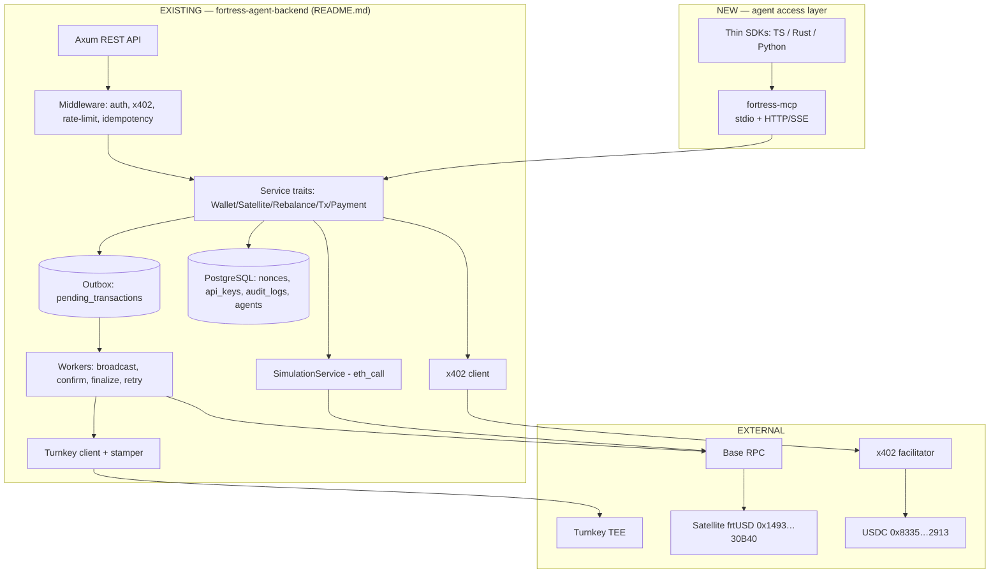
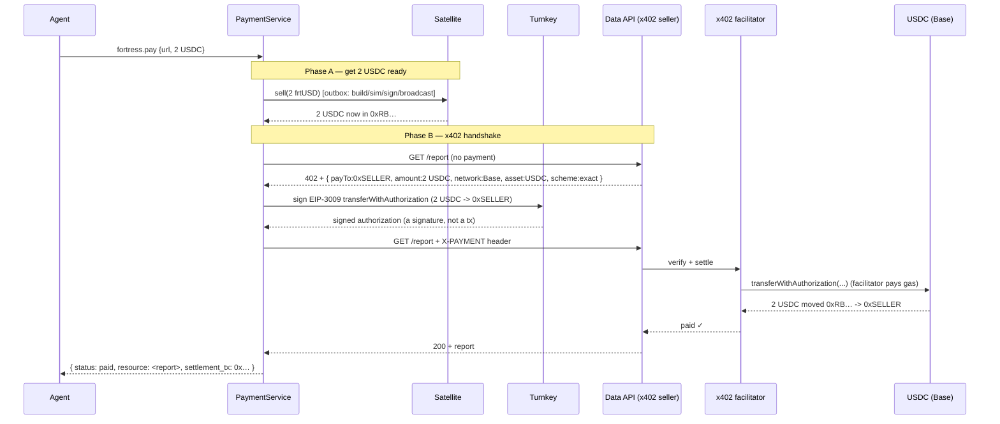
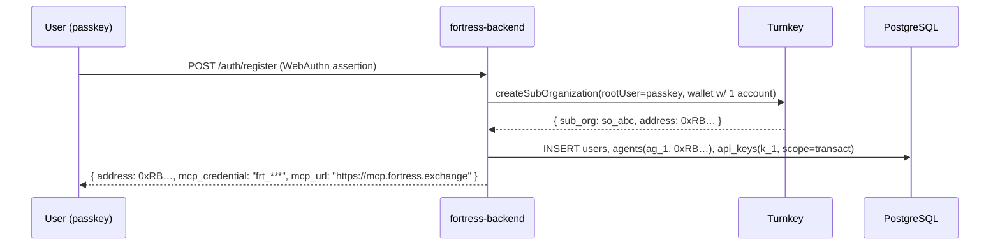

# FORTRESS — Production Integration & Flow Guide

**Audience:** engineers and integrators who need to understand, build, or trace every flow from a
user landing on the dashboard to an external agent (ElizaOS / Virtuals / Rig / Olas) transacting and
paying through FORTRESS.

**How to read this:** each section is a *flow* with concrete examples — real endpoints, JSON
payloads, DB rows, signed artifacts, and the exact hop-by-hop sequence. If you read top to bottom
you can trace a dollar from "agent earns it" to "agent pays with it," and you can trace an
integration from "developer has an ElizaOS bot" to "bot calls `fortress.pay`."

This guide builds directly on the backend design in [`README.md`](./README.md) (outbox pattern,
Turnkey signing, simulation, workers, service traits) and the layers in
[`AGENT_RAILS_AND_MCP.md`](./AGENT_RAILS_AND_MCP.md), [`USER_FLOWS.md`](./USER_FLOWS.md), and
[`PLATFORM_INTEGRATIONS.md`](./PLATFORM_INTEGRATIONS.md).

> **MVP scope note.** This guide describes the **Turnkey-as-the-whole-wallet** MVP: per-agent
> spend rules are enforced **off-chain** (FORTRESS service checks + Turnkey policies), not via the
> on-chain `EnvelopeEnforcer`. The Envelope/on-chain-enforcer described in `AGENT_RAILS_AND_MCP.md`
> is the **v2** hardening and is called out where relevant.

---

## 0. The component map (what exists vs. what we add)



**Key point:** `fortress-mcp` is a thin new transport that delegates to the **same service traits**
the REST API already uses. Nothing about the outbox, nonce reservation, simulation, or workers
changes — MCP is just another front door. (`README.md` already anticipates this: "trait-based
service layer, enabling both HTTP and future MCP transports.")

---

## 1. Identity & auth model (who an agent is)

An agent's identity is a chain of three records. Example for an agent named `ResearchBot` owned by
user `maya`:

```
Turnkey:  sub_org "user-maya"  ->  wallet  ->  account 0xRB… (path m/44'/60'/0'/0/0)

FORTRESS DB:
  users        { id: u_1, name: maya, turnkey_sub_org: "so_abc" }
  agents       { id: ag_1, owner: u_1, address: 0xRB…, derivation: "…/0",
                 daily_limit_usdc: 500, allow_targets: [Satellite, USDC] }
  api_keys     { id: k_1, key_hash: sha256(frt_***), agent_id: ag_1,
                 scope: "transact", rate_limit_rpm: 120, expires_at: … }
```

- The agent presents `Authorization: Bearer frt_***`.
- Middleware hashes it, looks up `api_keys` → `agent_id` → `address` + `scope` + limits.
- **Scopes** (from `README.md`): `read-only ⊂ transact ⊂ admin`. `fortress.pay` needs `transact`.

**MVP guardrail:** `daily_limit_usdc` and `allow_targets` are enforced **in the service layer**
before simulation. (v2 moves these into a signed on-chain Envelope.)

---

## 2. The canonical action lifecycle (trace a deposit)

Every state-changing tool follows the **outbox** lifecycle from `README.md`. Let's trace
`fortress.deposit` of 5 USDC end to end.

### 2.1 Request (MCP tool call)

```json
{ "method": "tools/call",
  "params": {
    "name": "fortress.deposit",
    "arguments": { "amount": "5000000", "idempotency_key": "8f3c…-v4" }
  } }
```
> `amount` is in USDC base units (6 decimals) → `5000000` = 5 USDC. `receiver` defaults to the
> agent's own address; `wallet_id` is resolved from the credential, not passed by the agent.

### 2.2 What the backend does (hop by hop)

```mermaid
sequenceDiagram
    participant AG as Agent
    participant MCP as fortress-mcp
    participant SVC as SatelliteService
    participant SIM as SimulationService
    participant DB as PostgreSQL
    participant BW as Broadcast worker
    participant TK as Turnkey
    participant RPC as Base RPC

    AG->>MCP: tools/call fortress.deposit {5 USDC, idem_key}
    MCP->>SVC: deposit(req)  (credential -> agent ag_1, 0xRB…)
    SVC->>DB: idempotency check on idem_key
    SVC->>SVC: MVP guardrail: 5 <= daily remaining? target allowed?
    SVC->>SIM: simulate approve(5) + Satellite.deposit(5, 0xRB…)
    SIM->>RPC: eth_call (paused? over depositLimit?)
    SVC->>DB: BEGIN; reserve nonce (SELECT…FOR UPDATE);<br/>INSERT pending_transactions(status=queued);<br/>INSERT audit_logs(tx_queued); COMMIT
    SVC-->>MCP: 202 { status: queued, nonce: 42, chain_id: 8453 }
    MCP-->>AG: tool result { status: queued }

    BW->>DB: pick queued (SKIP LOCKED)
    BW->>TK: signTransaction(signWith=0xRB…, rawTx)
    TK-->>BW: signed raw tx
    BW->>RPC: eth_sendRawTransaction -> status=pending, tx_hash set
    Note over RPC: Satellite mints ~5 frtUSD to 0xRB…<br/>and routes USDC to adapters per operator weights
    RPC-->>BW: webhook mined -> confirm worker: status=confirmed
    Note over BW: finalize worker: status=finalized after 64 blocks
```

### 2.3 The DB row evolving (the outbox)

```
t0  pending_transactions: { id, idem_key:8f3c…, status:queued,  tx_hash:NULL, nonce:42 }
t1  -> status:pending,   tx_hash:0xdep…      (broadcast worker)
t2  -> status:confirmed, block_number:NNN    (webhook)
t3  -> status:finalized                      (finalize worker, >64 blocks)
```

### 2.4 Responses the agent may see

```json
// 202 happy path
{ "status": "queued", "nonce": 42, "chain_id": 8453 }

// 400 simulation failed (no nonce consumed, no DB mutation)
{ "error": { "code": "SIMULATION_FAILED",
             "message": "Transaction would revert: deposit limit exceeded",
             "correlation_id": "…" } }

// 403 MVP guardrail
{ "error": { "code": "LIMIT_EXCEEDED", "message": "5 USDC exceeds remaining daily limit of 2" } }
```

**Trace tip:** to follow any action later, call `fortress.tx.status` (→ `GET /tx/{hash}` in REST),
which returns the full lifecycle incl. `replacement_hashes` for speed-ups.

---

## 3. The MCP server, concretely

### 3.1 Transports
- **stdio** for local hosts (Cursor, Claude Desktop, a dev's machine).
- **Streamable HTTP + SSE** at `https://mcp.fortress.exchange` for remote/headless agents, gated by
  the `Bearer` credential (reusing `api_keys`).

### 3.2 `tools/list` (filtered by scope + limits)

```json
{ "tools": [
  { "name": "fortress.balance",  "description": "Agent frtUSD balance, share price, yield",
    "inputSchema": { "type": "object", "properties": {} } },
  { "name": "fortress.deposit",  "description": "Park USDC into frtUSD (earns yield)",
    "inputSchema": { "type": "object",
      "properties": { "amount": {"type":"string"}, "idempotency_key": {"type":"string"} },
      "required": ["amount","idempotency_key"] } },
  { "name": "fortress.withdraw", "description": "Redeem frtUSD back to USDC", "inputSchema": {…} },
  { "name": "fortress.pay",      "description": "Pay an x402 URL or an address from balance",
    "inputSchema": { "type":"object",
      "properties": { "url": {"type":"string"}, "to": {"type":"string"},
                      "amount": {"type":"string"}, "idempotency_key": {"type":"string"} } } }
] }
```
> A `read-only` credential only sees `fortress.balance` / `fortress.tx.status`. This is
> Property A6 ("tool visibility reflects authority") applied at the MVP level.

### 3.3 Mapping tools → existing service traits (single source of truth)

| MCP tool | Trait method (README.md) | Scope | x402 |
|----------|--------------------------|-------|------|
| `fortress.balance` | `SatelliteService::vault_info` + balanceOf | read-only | no |
| `fortress.deposit` | `SatelliteService::deposit` | transact | yes |
| `fortress.withdraw` | `SatelliteService::withdraw` | transact | yes |
| `fortress.buy`/`sell` | `SatelliteService::{buy,sell}` | transact | yes |
| `fortress.pay` | `PaymentService::settle` (+ redeem) | transact | yes |
| `fortress.tx.status` | `TransactionService::get_status` | read-only | no |

The MCP handler is ~10 lines per tool: resolve credential → call the trait → map result. The schema
is generated from the same `schemars` types REST uses, so REST and MCP never drift.

---

## 4. The payment flow (trace `fortress.pay` over x402)

Paying a $2 x402-enabled data API. Two phases: **redeem** then **x402 handshake**.

### 4.1 Request

```json
{ "method": "tools/call",
  "params": { "name": "fortress.pay",
    "arguments": { "url": "https://dataapi.com/report", "amount": "2000000",
                   "idempotency_key": "p-91a…" } } }
```

### 4.2 Hop by hop



### 4.3 Notes that matter in production
- **Redeem first** because x402/EIP-3009 moves *USDC*, not frtUSD.
- The Phase-B signature is **gasless for the agent** — the facilitator submits on-chain.
- **Direct pay** (no URL, just `to`+`amount`) skips the 402 dance and broadcasts a normal USDC
  transfer via the outbox.
- **Non-x402 sellers** (e.g., OpenAI) won't return a 402 → use the "FORTRESS-fronts-the-API" bridge
  (FORTRESS holds the key, meters usage, charges the agent's balance). Document which sellers are
  supported.
- **Facilitator:** MVP points at a hosted facilitator (Coinbase's on Base). Running your own is a
  later, monetization-phase option.

---

## 5. Onboarding flows (with examples)

### 5.1 Human (dashboard) — creates room + first agent



### 5.2 Add another agent (multi-agent)

```http
POST /agents            Authorization: Bearer <admin or owner key>
{ "name": "TradingBot", "daily_limit_usdc": 1000, "allow_targets": ["Satellite","USDC"] }

200 { "agent_id": "ag_2", "address": "0xTB…", "mcp_credential": "frt_***2" }
```
Internally: `createWalletAccounts` derives `…/1` → new address; new `agents` + `api_keys` rows. One
room, many agents.

---

## 6. Platform integration flows (copy-paste shaped)

All four target the **same** `https://mcp.fortress.exchange` server; only the wiring differs.

### 6.1 ElizaOS (config only — native MCP plugin)

```json
// character.json
{ "plugins": ["@elizaos/plugin-mcp"],
  "settings": { "mcp": { "servers": {
    "fortress": { "url": "https://mcp.fortress.exchange",
                  "headers": { "Authorization": "Bearer frt_***" } } } } } }
```
The agent now has `fortress.deposit/pay/...`. The agent's LLM decides when to call them; give clear
tool descriptions so it uses them correctly.

### 6.2 Rig (Rust — `rig-mcp` wraps tools)

```rust
let fortress = rig_mcp::from_server("https://mcp.fortress.exchange", "frt_***").await?;
let agent = client.agent("gpt-…")
    .preamble("You manage a trading treasury. Park idle USDC; pay costs from balance.")
    .tools(fortress)            // FORTRESS tools become Rig tools
    .build();
```

### 6.3 Virtuals (GAME Function wraps an MCP call)

```python
def fortress_pay(url: str, amount: str):
    return mcp_call("fortress", "fortress.pay", {"url": url, "amount": amount})

pay_fn = Function(fn_name="fortress_pay",
    fn_description="Pay for a service from the agent's yield-earning balance",
    args=[Argument(name="url"), Argument(name="amount")], executable=fortress_pay)
# Attach pay_fn to a Worker; HLP will call it when a job needs paying.
# For ACP: FORTRESS sits behind the transaction phase as treasury + settlement.
```

### 6.4 Olas (FSM state calls the tool)

```python
class PayInferenceBehaviour(BaseBehaviour):
    def act(self):
        mcp_call("fortress", "fortress.pay", {"to": MECH_ADDRESS, "amount": "1000000"})
```

---

## 7. End-to-end traced example (the headline scenario)

**Maya's Virtuals `ResearchBot`: earns $5, parks it, pays $2 for data.** Every hop + artifact.

| # | Actor | Action | Artifact / state |
|---|-------|--------|------------------|
| 1 | Maya | `POST /auth/register` (passkey) | Turnkey `so_abc`, `0xRB…`, `api_keys.k_1` |
| 2 | Maya | sets ResearchBot's Virtuals payout → `0xRB…` | (Virtuals side) |
| 3 | ResearchBot | sells a report on Virtuals (ACP) | +5 USDC to `0xRB…` |
| 4 | ResearchBot | `tools/call fortress.deposit {5}` | outbox row → queued |
| 5 | Broadcast worker | Turnkey signs, broadcasts `Satellite.deposit` | tx `0xdep…` → confirmed; `0xRB…` holds ~5 frtUSD |
| 6 | ResearchBot | `tools/call fortress.pay {url, 2}` | — |
| 7 | PaymentService | redeem 2 frtUSD → 2 USDC (`Satellite.sell`) | tx `0xsell…` → confirmed |
| 8 | PaymentService | x402: GET → 402 → Turnkey signs EIP-3009 → GET+X-PAYMENT | settlement tx `0xpay…` |
| 9 | Data API | returns report | agent gets data |
| 10 | Audit log | rows appended throughout | `tx_queued, tx_broadcast, tx_confirmed, payment_settled` |

Net: $5 earned → parked as yield-bearing frtUSD → $2 redeemed JIT and paid via x402 → ~$3 still
earning. Maya did nothing after step 2. Every step is in the immutable audit log.

---

## 8. Security & guardrails (production posture)

| Control | Where | Example |
|---------|-------|---------|
| **Auth + scope** | middleware | `transact` required for `pay`; expired key → 401 `key_expired` |
| **Server-side limits** | service layer (MVP) | reject if amount > remaining daily limit; never trust the agent |
| **Idempotency** | DB unique index on `idempotency_key` | replays return the original result, one DB row |
| **Pre-broadcast simulation** | `SimulationService` | reverts caught before nonce/DB write |
| **Nonce atomicity** | `SELECT…FOR UPDATE` | no two txs share a nonce |
| **Keys never exposed** | Turnkey TEE | FORTRESS only holds a policy-scoped API key |
| **Immutable audit** | append-only `audit_logs` (trigger-protected) | full trace per `correlation_id` |
| **Rate limiting** | per-key sliding window | independent per agent credential |

> The agent's LLM is **untrusted input**. All money rules are enforced by FORTRESS server-side and
> by Turnkey policy — the agent can *ask* for anything, but only allowed actions execute.

---

## 9. Error handling & edge cases (trace table)

| Situation | Response / behavior | Recovery |
|-----------|---------------------|----------|
| Sim would revert | `400 SIMULATION_FAILED` + reason; no nonce consumed | fix args |
| Over daily limit (MVP) | `403 LIMIT_EXCEEDED` | wait/limit raise |
| Insufficient frtUSD for pay | `400 INSUFFICIENT_BALANCE` (caught pre-redeem) | deposit more |
| Seller not x402 | `422 UNSUPPORTED_SELLER` | use FORTRESS-fronted bridge or direct pay |
| RPC down | `503` + Retry-After | exponential backoff |
| Tx stuck | retry worker speeds up; `tx_replacements` tracks hashes | automatic |
| Reorg | finalize worker reverts `confirmed`→`pending` | auto re-broadcast |
| Duplicate webhook | ignored via `event_id` unique | idempotent |

---

## 10. What to build (MVP checklist)

**New (this layer):**
1. `fortress-mcp` binary — stdio + HTTP/SSE transports, `tools/list`/`tools/call`, credential auth.
2. `PaymentService` trait — `settle(url|to, amount)` = redeem frtUSD→USDC + x402 client (hosted facilitator).
3. `agents` table + service-layer limit checks (daily limit, allowlist).
4. `POST /agents` + dashboard onboarding (Turnkey `createSubOrganization` / `createWalletAccounts`).
5. Thin SDKs: TS (Eliza/Virtuals), Rust (Rig), Python (Olas/ZerePy) — optional sugar over MCP.

**Reused as-is (from `README.md`):** outbox, nonce reservation, simulation, broadcast/confirm/
finalize/retry workers, Turnkey client, x402 client module, audit log, api_keys/scopes/rate-limit.

**Deferred to v2:** on-chain `EnvelopeEnforcer` + signed Envelopes (move limits from off-chain to
trustless on-chain enforcement); running your own x402 facilitator (monetization).

---

## Appendix A — Reference addresses (Base mainnet, from README.md)

| Contract | Address |
|----------|---------|
| Satellite (frtUSD-C) | `0x1493522095857A3e28e6573E8a1f6b612dd30B40` |
| USDC | `0x833589fCD6eDb6E08f4c7C32D4f71b54bdA02913` |
| AttestationRelay | `0x1f2Bda259365BF10210AB6C8C0F4A211eE2be5FC` |

## Appendix B — The mental model in one paragraph

A human signs up with a passkey; FORTRESS asks Turnkey to mint a private room + agent wallet and
hands back an MCP credential. The agent (native or pre-existing) adds the FORTRESS MCP server and
gains tools. When it earns, it calls `fortress.deposit` — the backend builds, simulates, reserves a
nonce, writes the outbox, Turnkey signs, a worker broadcasts, and the Satellite vault farms the
yield using the operator's strategy. When it needs to pay, `fortress.pay` redeems exactly enough
frtUSD→USDC and runs the x402 handshake — Turnkey signs a gasless authorization, the facilitator
settles. Limits are enforced server-side (MVP) and every step is written to an immutable audit log.
Build the MCP server + payment service once; every agent platform plugs into the same backend.
