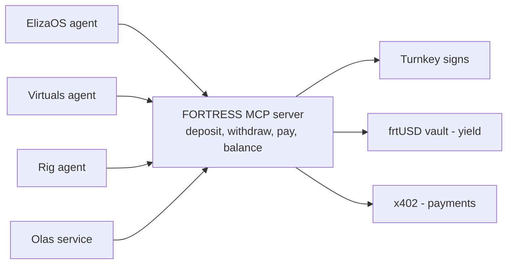

# How Agent Platforms Work — and How They Use FORTRESS via MCP

A plain-language guide to the biggest AI-agent platforms: **what they do in the market**, **how they
work**, **why FORTRESS matters to them**, and **exactly how they connect to FORTRESS through MCP**.

> External facts are paraphrased from the linked sources for licensing compliance.

---

## First: what MCP is (the one connector behind all of this)

**MCP (Model Context Protocol)** is a standard way for any AI agent to discover and call external
tools — Anthropic describes it as a "USB-C port for AI applications"
[(overview)](https://rabot.medium.com/winning-in-the-autonomous-ai-agents-race-a0c03d52acad).

FORTRESS runs **one MCP server** that exposes tools like `fortress.deposit`, `fortress.withdraw`,
`fortress.pay`, `fortress.balance`. Any agent that "speaks MCP" can plug into it and instantly get a
**treasury + wallet + payment rail** — no blockchain code on their side.



The rest of this doc shows the connection for each platform.

---

## 1. ElizaOS

**What they do in the market**
- Run as chatbots/personalities on X, Discord, Telegram.
- Trade tokens, manage community wallets, tip, post content.
- Many have their own token and a treasury of fees.

**How they work (simple)**
- A *Character* config defines the personality; the **AgentRuntime** runs it.
- Capabilities come from **plugins** made of Actions (do things), Providers (gather info),
  Evaluators (learn), Services (background jobs).

**Why FORTRESS matters to them**
- Treasury cash sits idle -> FORTRESS makes it **earn yield** automatically.
- They need to pay for APIs/data -> FORTRESS lets them **pay safely** from that balance.
- One plugin gives every Eliza agent a built-in **bank + wallet**, with no extra code.

**How they connect to FORTRESS via MCP**
ElizaOS already has an **MCP plugin** that connects agents to any MCP server with no custom code
[(Fleek Eliza MCP plugin)](https://resources.fleek.xyz/blog/announcements/fleek-eliza-mcp-plugin).
So integration is literally configuration:

```json
// character.json
{
  "plugins": ["@elizaos/plugin-mcp"],
  "settings": {
    "mcp": {
      "servers": {
        "fortress": {
          "url": "https://mcp.fortress.exchange",
          "headers": { "Authorization": "Bearer frt_key_***" }
        }
      }
    }
  }
}
```

Now the agent sees `fortress.deposit/pay/...` as usable tools. (For a more branded experience we can
also ship a thin **`@fortress/plugin`** that wraps these calls and adds a balance Provider.)

---

## 2. Virtuals Protocol

**What they do in the market**
- Get launched and tokenized (people co-own them).
- Sell services to other agents (research, trading, content) and get paid — their core business (ACP).
- Earn fees constantly from agent-to-agent jobs.

**How they work (simple)**
- The **GAME** engine separates thinking from doing: an **HLP** (brain) plans tasks; **Workers**
  (hands) run **Functions** in a loop [(GAME)](https://whitepaper.virtuals.io/about-virtuals/agentic-framework-game).
- The **ACP** lets agents trade services in 4 steps — request -> negotiate -> transaction ->
  evaluation — recorded on-chain, settled with x402
  [(ACP)](https://whitepaper.virtuals.io/get-started-with-acp).

**Why FORTRESS matters to them**
- Job earnings pile up idle -> FORTRESS grows it as frtUSD.
- They already pay each other -> FORTRESS becomes the **wallet + payment + receipt** behind those deals.
- Adds spending limits + proof, so owners trust the agent with real money.

**How they connect to FORTRESS via MCP**
A GAME Worker calls actions through **Functions**, so we wrap a FORTRESS MCP call inside one Function:

```python
# A GAME Function the Worker can call
def fortress_pay(to: str, amount: str):
    # calls the FORTRESS MCP server tool fortress.pay
    return mcp_call("fortress", "fortress.pay", {"to": to, "amount": amount})

pay_fn = Function(
    fn_name="fortress_pay",
    fn_description="Pay for a service from the agent's yield-earning balance",
    args=[Argument(name="to"), Argument(name="amount")],
    executable=fortress_pay,
)
```

And because the **ACP SDK is framework-agnostic** [(ACP playbook)](https://whitepaper.virtuals.io/get-started-with-acp/acp-tech-playbook),
FORTRESS can sit **behind the ACP transaction phase** as the treasury + x402 settlement + audit layer.

---

## 3. Rig (ARC)

**What they do in the market**
- High-performance trading and data bots built in Rust.
- Used by serious infra/quant teams that care about speed and reliability.

**How they work (simple)**
- Compose an **Agent** = model + context + **Tools** + optional vector store (RAG), all in Rust.

**Why FORTRESS matters to them**
- They move money fast -> FORTRESS gives them a reliable treasury + pay rail that's also
  **Rust-native** (same language), so it drops right in.
- Idle trading capital earns yield between trades.

**How they connect to FORTRESS via MCP**
Rig has a native MCP integration — the `rig-mcp` crate wraps remote MCP tools as Rig tools using the
official rmcp SDK [(Rig MCP docs)](https://docs.rig.rs/docs/integrations/model_context_protocol),
[(rig-mcp)](https://www.lib.rs/crates/rig-mcp). So FORTRESS tools become Rig tools automatically:

```rust
// Point Rig at the FORTRESS MCP server; its tools become Rig tools
let fortress_tools = rig_mcp::from_server("https://mcp.fortress.exchange", bearer);
let agent = client.agent("gpt-...")
    .preamble("You manage a trading treasury.")
    .tools(fortress_tools)   // fortress.deposit / pay / ... now callable
    .build();
```

---

## 4. Olas / Autonolas

**What they do in the market**
- Run always-on autonomous services (prediction-market traders, keepers, automations) operated by
  many people together.
- Constantly pay for AI work (inference) to keep running.

**How they work (simple)**
- Each service is logic encoded as a **finite state machine (FSM)**, replicated across multiple
  operator-run agents that reach consensus
  [(Open Autonomy)](https://stack.olas.network/open-autonomy/guides/overview_of_the_development_process/).

**Why FORTRESS matters to them**
- They need a standing operating budget -> FORTRESS holds it as yield-earning frtUSD and pays their
  running costs just-in-time.

**How they connect to FORTRESS via MCP**
An FSM state (e.g., a `PAY` or `FUND` step) calls the FORTRESS MCP server like any other tool:

```python
# Inside an Olas FSM state's behaviour
def act(self):
    # pay inference / running costs from the service treasury
    mcp_call("fortress", "fortress.pay", {"to": mech_address, "amount": "1"})
```

---

## The big picture: one server, many doors

Every platform plugs into the **same FORTRESS MCP server** through its own native extension point:

| Platform | How it connects | Effort |
|----------|-----------------|--------|
| **ElizaOS** | Built-in MCP plugin -> add server in `character.json` | Config only |
| **Virtuals** | Wrap MCP call in a GAME **Function**; sit behind ACP | Small |
| **Rig** | `rig-mcp` turns FORTRESS tools into Rig tools | Config + a few lines |
| **Olas** | FSM state calls the MCP tool | Small |

And behind that one server: **Turnkey signs, frtUSD earns the yield, x402 moves the money.**

### What FORTRESS builds (once)
- The **MCP server** (the tools above).
- The **x402 client** (for `fortress.pay`).
- **Turnkey** wiring (signing) + the frtUSD deposit/redeem logic.

Build it once -> every platform above can use it. Priority: **ElizaOS** (config-only, biggest base)
-> **Virtuals** (biggest money flow) -> **Rig** (Rust-native) -> **Olas**.

> Note: other frameworks (ZerePy in Python, Coinbase AgentKit, exchange toolkits) connect the same
> way — either they speak MCP directly, or we wrap one `fortress.pay` call in their action/tool format.
