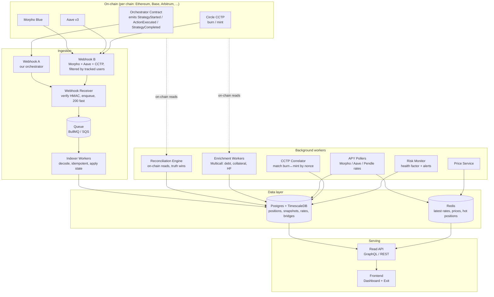
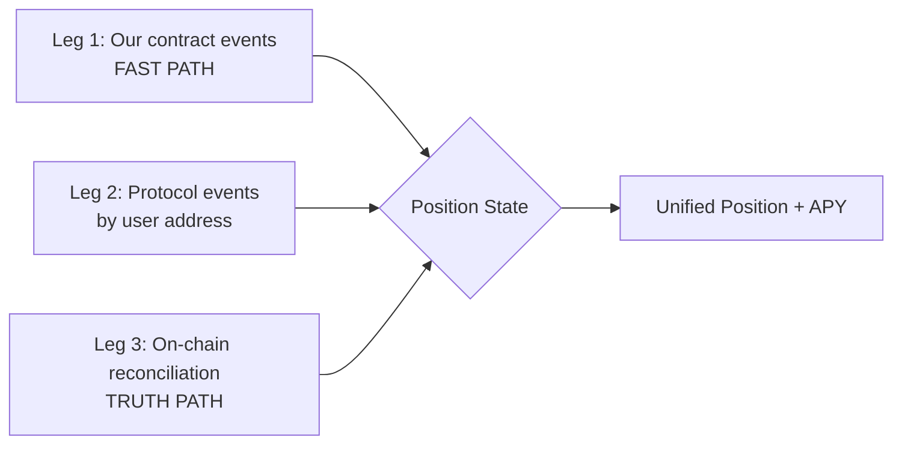
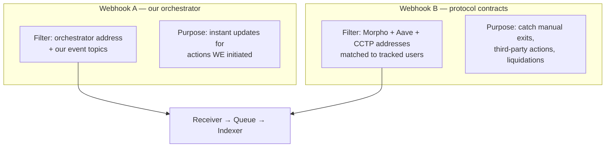
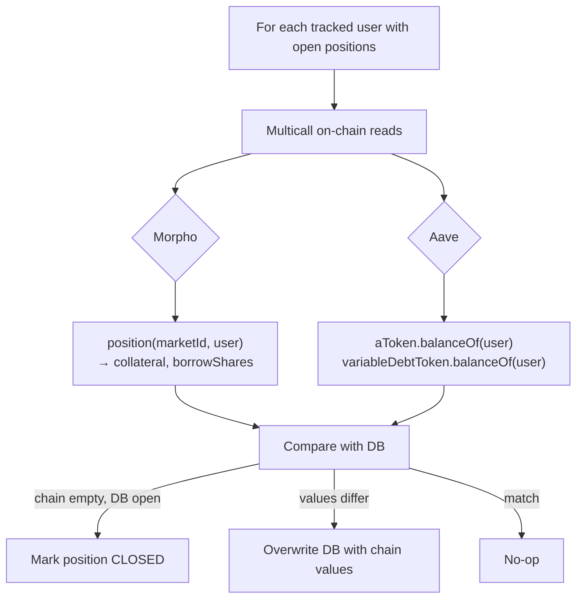
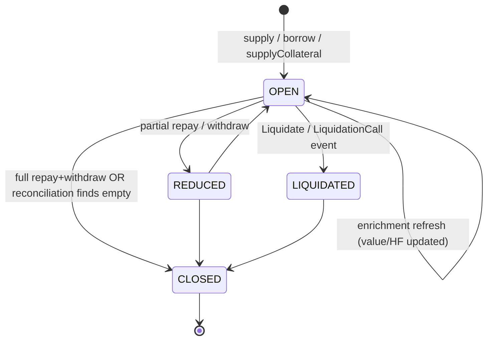
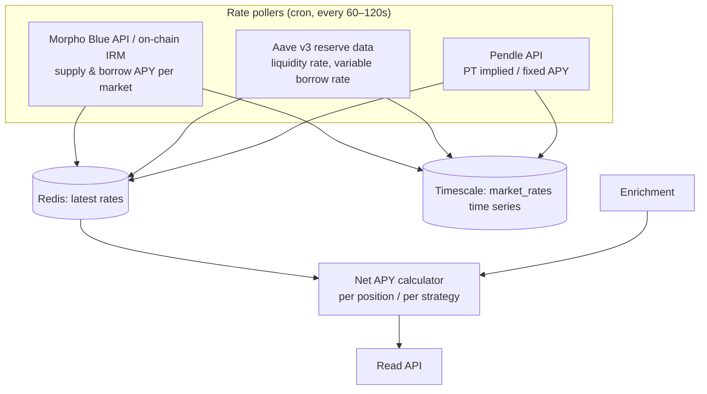
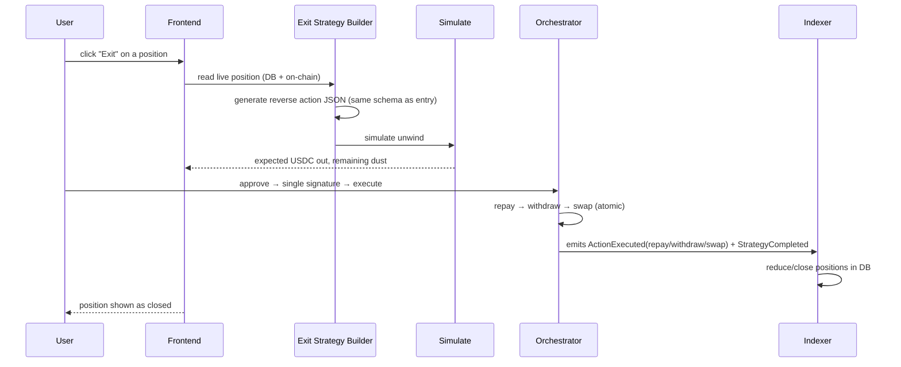

# Position Tracking & APY Engine — Architecture

> A production-grade backend that tracks every DeFi position a user opens through our
> prompt-to-execution platform, keeps their balances, debt, health and **APY always up to
> date**, and lets them **exit any position from our own frontend** — our own DeBank, built so we
> own and can extend it.

This document is meant to be read top to bottom. By the end you should understand **what we are
building, why each piece exists, how data flows, what can go wrong, and how we guarantee the user's
view is always correct.** No other doc is required.

---

## Table of contents

1. [What this system is](#1-what-this-system-is)
2. [The hard problem (read this first)](#2-the-hard-problem-read-this-first)
3. [Design principles](#3-design-principles)
4. [High-level architecture](#4-high-level-architecture)
5. [The three-legged truth model](#5-the-three-legged-truth-model)
6. [Smart-contract event specification](#6-smart-contract-event-specification)
7. [Ingestion pipeline (events → backend)](#7-ingestion-pipeline-events--backend)
8. [Dual-webhook strategy (catching everything)](#8-dual-webhook-strategy-catching-everything)
9. [The reconciliation engine (on-chain truth wins)](#9-the-reconciliation-engine-on-chain-truth-wins)
10. [Cross-chain: CCTP correlation](#10-cross-chain-cctp-correlation)
11. [The position model & state machine](#11-the-position-model--state-machine)
12. [Enrichment: turning raw state into live values](#12-enrichment-turning-raw-state-into-live-values)
13. [The APY engine](#13-the-apy-engine)
14. [Pricing service](#14-pricing-service)
15. [Risk & liquidation monitoring](#15-risk--liquidation-monitoring)
16. [Data model](#16-data-model)
17. [Read API (what the frontend consumes)](#17-read-api-what-the-frontend-consumes)
18. [The exit flow](#18-the-exit-flow)
19. [End-to-end user flows](#19-end-to-end-user-flows)
20. [Failure handling & correctness guarantees](#20-failure-handling--correctness-guarantees)
21. [Recommended tech stack](#21-recommended-tech-stack)
22. [Phased delivery plan](#22-phased-delivery-plan)
23. [Invariants & glossary](#23-invariants--glossary)

---

## 1. What this system is

Our platform turns a natural-language prompt (e.g. *"Swap USDC → PT, supply as collateral, borrow
USDC, loop 5×"*) into a JSON action plan, simulates it, and executes it through a single
orchestrator smart contract that the user signs once. The orchestrator integrates **Morpho**,
**Aave**, and **LiFi/CCTP**.

This document covers the **layer that comes after execution**:

- **Position tracking** — a unified view of every position a user holds across protocols and
  chains (our own "DeBank").
- **APY tracking** — the live, continuously-updated yield of each position, including the *net*
  APY of leveraged loops.
- **Exit** — closing any position directly from our frontend, instead of the user visiting each
  protocol manually.

> **Scope boundary:** The orchestrator contract is **execution-only**. It does *not* compute APY or
> store position history. All tracking, enrichment, APY and risk logic lives in **this backend**.

---

## 2. The hard problem (read this first)

A naive tracker listens to its own contract's events and rebuilds positions from them. **This is
wrong and it will silently corrupt every dashboard.** Here is why:

1. **Events are point-in-time; positions are alive.** The moment we record "borrowed 100 USDC", the
   debt starts accruing interest. On Morpho debt grows every block; on Aave the debt-token balance
   rebases. An event-only view is stale the instant it is written.
2. **Users can act outside our contract.** A user can open through us, then repay/withdraw directly
   on Morpho's or Aave's own UI. Our contract never emits an event for that — so our DB would show
   the position as still open forever.
3. **Third parties change positions.** A **liquidation** is triggered by a liquidator, not by us or
   the user. No event from *our* contract is emitted, yet the position changes drastically.
4. **Webhooks drop messages.** Any push-based delivery occasionally loses events. If that is our
   only source of truth, we permanently miss state.

**The consequence:** we must track the **on-chain position state itself**, not merely the actions
our contract performed. Our events are the *fast path*; protocol events and periodic on-chain reads
are the *truth path*. This single insight shapes the entire architecture.

---

## 3. Design principles

| # | Principle | Why |
|---|-----------|-----|
| P1 | **On-chain state is the single source of truth.** Event-derived state is a cache. | Reconciliation can always repair drift. |
| P2 | **The contract is execution-only.** APY/positions/history live in the backend. | Keeps the contract small, cheap, auditable. |
| P3 | **Events = fast path; reads = truth path.** Both run; reads win on conflict. | Instant UX + provable correctness. |
| P4 | **Idempotency everywhere.** Every event handler is replay-safe via `(txHash, logIndex)`. | Webhooks retry and duplicate. |
| P5 | **Track the position owner's address, not our contract.** | Catches manual exits & liquidations. |
| P6 | **Decouple market data from user requests.** Pollers fill a cache; the API never calls a protocol inline. | Dashboard stays fast even if Pendle/Morpho APIs are slow. |
| P7 | **Money in transit is a first-class state.** CCTP bridges are modeled explicitly. | Totals never appear to "drop" mid-bridge. |
| P8 | **Every chain is independent.** One ingestion lane per chain, shared DB. | Multi-chain by construction. |

---

## 4. High-level architecture



---

## 5. The three-legged truth model

Everything the dashboard shows is produced by combining three independent data sources. Each
covers the others' blind spots.



| Leg | Source | Covers | Blind to |
|-----|--------|--------|----------|
| **1. Our contract events** | `StrategyStarted`, `ActionExecuted`, `StrategyCompleted` (Webhook A) | Actions we initiated — instant updates | Manual exits, liquidations, interest accrual |
| **2. Protocol events** | Morpho/Aave/CCTP events filtered by user (Webhook B) | Manual exits, third-party actions, liquidations | Dropped webhooks, interest accrual |
| **3. Reconciliation reads** | Direct on-chain reads on a schedule + on demand | Live values (debt, collateral, HF), anything missed | Nothing — this is ground truth (just not instant) |

**Rule:** when sources disagree, **Leg 3 wins.** Legs 1 & 2 exist for speed; Leg 3 exists for
correctness.

---

## 6. Smart-contract event specification

These are the events the orchestrator emits. **Lock this schema before more contracts ship — it is
the hardest thing to change later.**

### 6.1 Strategy lifecycle

```solidity
event StrategyStarted(
    uint256 indexed strategyId,
    address indexed user,
    uint16  chainId,
    uint8   actionCount,
    bytes32 promptHash        // ties back to the parsed JSON plan
);

event StrategyCompleted(
    uint256 indexed strategyId,
    address indexed user,
    bool    success
);
```

### 6.2 The generic action event (the workhorse)

```solidity
event ActionExecuted(
    uint256 indexed strategyId,
    address indexed user,
    uint8   protocol,     // 0 = Morpho, 1 = Aave, 2 = LiFi/CCTP
    uint8   action,       // see enum below
    bytes32 indexed marketId,  // Morpho marketId, Aave reserve id, or 0
    address asset,
    uint256 amount,       // asset amount
    uint256 shares,       // Morpho shares (0 for Aave / CCTP)
    bytes   extraData     // abi-encoded protocol-specifics (e.g. Aave rateMode, CCTP nonce/domains)
);
```

**Why one generic event instead of many per-protocol events:** every emitted log costs gas, and a
5× loop emits many logs. A single self-describing event keeps gas low and the indexer simple. The
`extraData` blob carries anything that does not fit the common shape, decoded in the backend.

#### `protocol` enum
| Value | Protocol |
|-------|----------|
| 0 | Morpho |
| 1 | Aave |
| 2 | LiFi / CCTP |

#### `action` enum
| Value | Action | Effect on position |
|-------|--------|--------------------|
| 0 | `swap` | no position; asset conversion (audit only) |
| 1 | `supplyCollateral` | + collateral |
| 2 | `supply` (lend) | + supply position |
| 3 | `borrow` | + debt |
| 4 | `repay` | − debt |
| 5 | `withdrawCollateral` | − collateral |
| 6 | `withdraw` (lend) | − supply position |
| 7 | `bridgeOut` | − balance on source chain (CCTP burn) |
| 8 | `bridgeIn` | + balance on dest chain (CCTP mint) |

#### `extraData` encoding by protocol
| Protocol / action | `extraData` (abi-encoded) |
|-------------------|---------------------------|
| Aave borrow/repay | `(uint8 rateMode)` — 1 = stable, 2 = variable |
| CCTP bridgeOut | `(uint32 sourceDomain, uint32 destDomain, uint64 nonce, address mintRecipient)` |
| CCTP bridgeIn | `(uint32 sourceDomain, uint64 nonce)` |
| everything else | empty (`0x`) |

> **Critical fields:** Morpho **`shares`** must be emitted (Morpho tracks shares internally; assets
> are derived). CCTP **`nonce` + domains** must be in `extraData` — they are the only way to pair a
> burn on one chain with a mint on another.

### 6.3 How a log reaches the backend (decoding)

A log on a tx receipt looks like:

```
topic0 = keccak256("ActionExecuted(uint256,address,uint8,uint8,bytes32,address,uint256,uint256,bytes)")
topic1 = strategyId   (indexed)
topic2 = user         (indexed)
topic3 = marketId     (indexed)
data   = abi-encoded (protocol, action, asset, amount, shares, extraData)
```

The indexer decodes it with the ABI:

```ts
const iface = new ethers.Interface(ORCHESTRATOR_ABI);
const parsed = iface.parseLog({ topics: log.topics, data: log.data });
// parsed.args.strategyId, .user, .protocol, .action, .marketId, .asset, .amount, .shares, .extraData
```

---

## 7. Ingestion pipeline (events → backend)

```mermaid
sequenceDiagram
    participant SC as Orchestrator / Protocols
    participant AL as Alchemy Webhook
    participant RV as Webhook Receiver
    participant Q as Queue
    participant IX as Indexer Worker
    participant DB as Postgres

    SC->>AL: emits log (matches address + topic filter)
    AL->>RV: POST /webhooks/alchemy (+ HMAC signature)
    RV->>RV: verify HMAC; reject if invalid
    RV->>Q: enqueue raw payload
    RV-->>AL: 200 OK (fast — no DB work inline)
    Q->>IX: deliver job
    IX->>IX: ABI-decode log
    IX->>DB: SELECT processed_logs WHERE (txHash, logIndex)
    alt already processed
        IX->>IX: skip (idempotent)
    else new
        IX->>DB: apply state change + insert processed_logs
    end
```

**Receiver rules (non-negotiable):**
- Verify the Alchemy signing key (HMAC) on every request — reject spoofed calls.
- Do **zero** heavy work inline: validate → enqueue → return `200` immediately. Webhooks time out
  and retry, so a slow receiver causes duplicate deliveries and lost events.

**Indexer rules:**
- **Idempotency key = `(txHash, logIndex)`.** Every handler checks-then-applies so replays and
  duplicates are harmless.
- Maintain a per-chain **block cursor** (`last_processed_block`) for backfill (see §20).

---

## 8. Dual-webhook strategy (catching everything)

A single webhook on our own contract is insufficient (see §2). We run **two** webhook lanes per
chain:



**Webhook B watches the protocols themselves**, keyed to the user addresses we track. Since
positions are owned by the **user's address** (non-custodial, on-behalf-of model), Morpho and Aave
emit events naming that user even when our contract is not involved:

- Morpho: `Repay(id, …, onBehalf=user)`, `WithdrawCollateral(id, …, onBehalf=user)`,
  `Liquidate(id, …, borrower=user, …)`
- Aave: `Repay(reserve, user, …)`, `Withdraw(reserve, user, …)`,
  `LiquidationCall(…, user, …)`

This is how a user closing on Morpho's own UI — or a liquidator seizing collateral — still updates
our DB in near real-time.

> **Note on the ownership model:** this design assumes positions are registered to the **user's
> address** (the trust-minimized model — users always have an escape hatch). If instead the
> orchestrator custodies positions, Webhook B filters by the **contract address** and the indexer
> attributes sub-positions to users via the `user` field already present in `ActionExecuted`.

---

## 9. The reconciliation engine (on-chain truth wins)

Webhooks are best-effort. Reconciliation is the safety net that makes the system **eventually
correct no matter what** — even if every webhook failed.



**Two triggers:**
1. **Scheduled** — a cron worker sweeps tracked users. Active positions reconcile frequently (e.g.
   every minute), stale/closed ones rarely.
2. **On-read** — when a user opens the dashboard, we refresh *their* positions immediately so what
   they see matches the chain right now.

**Conflict resolution:** on-chain value always overwrites the event-derived value (P1). Example:
*"DB says position open with 100 USDC debt; chain reads `collateral=0, borrowShares=0` → mark
CLOSED."* This is exactly what catches the "user exited on Morpho directly" case.

---

## 10. Cross-chain: CCTP correlation

CCTP makes the platform multi-chain by definition: USDC is **burned** on the source chain and
**minted** on the destination chain, with an attestation delay in between. A bridge is therefore
**two events on two chains** that we must stitch together — and we must represent the "in-transit"
gap so the user's total never appears to drop.

```mermaid
sequenceDiagram
    participant SRC as Source chain
    participant CORR as CCTP Correlator
    participant CIR as Circle Attestation API
    participant DST as Dest chain
    participant DB as Postgres

    SRC->>CORR: ActionExecuted(bridgeOut) extraData=(srcDomain,dstDomain,nonce,recipient)
    CORR->>DB: bridges row status=PENDING; add IN_TRANSIT balance
    loop until attested
        CORR->>CIR: poll attestation for nonce
        CIR-->>CORR: status PENDING → ATTESTED
    end
    DST->>CORR: ActionExecuted(bridgeIn) extraData=(srcDomain,nonce)
    CORR->>CORR: match by (srcDomain, nonce)
    CORR->>DB: bridges row status=COMPLETE; move balance to dest chain
```

**Correlation key = `(sourceDomain, nonce)`.** The correlator:
- On `bridgeOut`: opens a `bridges` row (`PENDING`), decrements source balance, and records an
  **in-transit** balance row so the portfolio total stays whole.
- Polls Circle's attestation API for the nonce to surface `PENDING → ATTESTED` status.
- On `bridgeIn`: matches by `(sourceDomain, nonce)`, marks `COMPLETE`, and moves the balance to the
  destination chain.

---

## 11. The position model & state machine

A **position** is one ongoing exposure: a collateral, a debt, or a supply (lend) balance, scoped to
`(user, chain, protocol, market, asset, type)`.



A **strategy** (one `strategyId`) groups the positions created by a single prompt — e.g. a 5× loop
produces one strategy spanning multiple collateral and debt positions, possibly across chains.

---

## 12. Enrichment: turning raw state into live values

Raw position rows store *shares* and *amounts at action time*. Enrichment converts these into the
**current** USD values, debt, and health factor the user actually sees. It runs on a schedule and
on-read, batched via **Multicall** for efficiency.

| Protocol | Stored | How we read current value | Notes |
|----------|--------|---------------------------|-------|
| **Morpho** | `supplyShares`, `borrowShares`, `collateral` | `position(marketId,user)` + market totals → convert shares → current assets | Debt accrues per block → must convert every refresh |
| **Aave v3** | aToken / variableDebtToken | `aToken.balanceOf(user)`, `variableDebtToken.balanceOf(user)`, `getUserAccountData(user)` | Balances are rebasing = already current; no share math |
| **CCTP** | in-transit amount | from bridge row | shown as its own portfolio line |

Each refresh writes a **`position_snapshots`** row (time series) so we can show history and current
state, including `value_usd`, `health_factor`, and `net_apy`.

---

## 13. The APY engine

APY is **market-level** (not per-user), so we poll a small set of markets cheaply and reuse the
data for everyone. This is what keeps APY "always up to date" without hammering protocol APIs on
every dashboard load.



**Design:**
- Pollers write `latest` to Redis and append a time-series row to `market_rates`. Rates move slowly
  enough that a 60–120s cadence is ample.
- The Read API serves APY from the cache — it **never** calls Pendle/Morpho/Aave inline. If a
  protocol API is slow or rate-limits us, the dashboard is unaffected (P6).
- Sources can be cross-checked against **on-chain IRM** reads for independence / as a fallback.

### Net APY of a leveraged loop (the number that matters)

For a PT-loop with leverage `L = totalCollateral / equity`:

```
netAPY ≈ L × collateralYield − (L − 1) × borrowAPY        (then subtract amortized swap/loop fees)
```

Worked example — `L = 5`, PT fixed yield = `9%`, USDC borrow APY = `6%`:

```
netAPY ≈ 5 × 9%  −  4 × 6%   =  45%  −  24%   =  21%   (gross, before fees/slippage)
```

We store both the **raw market APYs** and the computed **net position/strategy APY** on every
enrichment cycle, and we expose the projected APY at simulation time using the same calculator.

---

## 14. Pricing service

USD valuation and yield math need token prices.

- A price poller maintains `token_prices` (latest in Redis, history in Timescale).
- Sources: on-chain oracles (Chainlink/protocol oracles) preferred for assets we hold; a market
  data API as fallback for long-tail tokens.
- Stablecoins and PT tokens get special handling (PT trades at a discount to par that converges to
  1 at maturity — value it from the Pendle market, not as $1).

---

## 15. Risk & liquidation monitoring

Because the headline use case is **leveraged**, liquidation risk is a first-class feature — and one
DeBank does not give us.

- The risk monitor rides the enrichment cycle: it reads **health factor** (Aave `getUserAccountData`;
  Morpho LTV vs LLTV) for every open leveraged position.
- Thresholds trigger alerts (e.g. HF < 1.10 → warn, HF < 1.03 → urgent) via the user's notification
  channel.
- A `Liquidate` / `LiquidationCall` event on Webhook B immediately flips the position to
  `LIQUIDATED` and notifies the user — we never wait for reconciliation for this.

---

## 16. Data model

Postgres for relational state, **TimescaleDB** (hypertables) for the time series.

```sql
-- Identities
wallets(address PK, first_seen_at, ...)

-- One prompt = one strategy (may span chains)
strategies(
  id PK, wallet, prompt_text, parsed_json JSONB, prompt_hash,
  primary_chain_id, status,            -- executing | active | exited | failed
  tx_hash, created_at
)

-- Market metadata (Morpho marketId, Aave reserve, etc.)
markets(
  market_id PK, protocol, chain_id, address,
  collateral_token, loan_token, lltv, metadata JSONB
)

-- Live position state (the heart of the system)
positions(
  id PK, wallet, chain_id, protocol, market_id,
  type,                                -- collateral | debt | supply
  asset,
  shares NUMERIC,                      -- Morpho shares (null for Aave)
  amount NUMERIC,                      -- last known asset amount
  strategy_id,
  status,                              -- open | reduced | closed | liquidated
  last_event_block, last_reconciled_at,
  UNIQUE(wallet, chain_id, protocol, market_id, asset, type)
)

-- Time series of enriched values (Timescale hypertable)
position_snapshots(
  position_id, ts,
  amount_assets NUMERIC, value_usd NUMERIC,
  health_factor NUMERIC, net_apy NUMERIC
)

-- Market APYs over time (Timescale hypertable)
market_rates(
  market_id, ts,
  supply_apy NUMERIC, borrow_apy NUMERIC, pt_fixed_apy NUMERIC
)

-- Token prices over time (Timescale hypertable)
token_prices(token, chain_id, ts, price_usd NUMERIC)

-- CCTP bridges in flight
bridges(
  id PK, strategy_id, wallet,
  source_domain, dest_domain, nonce,
  asset, amount,
  status,                              -- pending | attested | complete
  src_tx_hash, dst_tx_hash, created_at, completed_at,
  UNIQUE(source_domain, nonce)
)

-- Idempotency + backfill
processed_logs(tx_hash, log_index, PRIMARY KEY(tx_hash, log_index))
ingestion_cursor(source, chain_id, last_processed_block, PRIMARY KEY(source, chain_id))
```

---

## 17. Read API (what the frontend consumes)

A thin GraphQL/REST layer that reads **only** from Postgres + Redis (never from protocols inline).

| Endpoint | Returns |
|----------|---------|
| `GET /portfolio/:wallet` | All open positions across chains/protocols with current value, debt, health factor, supply/borrow APY, net strategy APY, and any in-transit CCTP balances |
| `GET /position/:id/history` | `position_snapshots` time series (value, HF, APY over time) |
| `GET /strategy/:id` | Strategy summary: legs, leverage, net APY, status |
| `POST /portfolio/:wallet/refresh` | Triggers on-read reconciliation + enrichment, then returns fresh data |
| `GET /alerts/:wallet` | Active risk/liquidation alerts |

On `refresh` (and on dashboard open), we kick the reconciliation + enrichment path for that wallet
so the user always sees chain-accurate values.

---

## 18. The exit flow

"Exit from our frontend" reuses the **entire entry pipeline in reverse** — no new execution path.
To unwind a PT loop we go backwards through the leverage:

```
repay USDC debt → withdraw PT collateral → swap PT → USDC      (repeat per loop level)
```



Because positions are user-owned, the exit can be one-click through our contract **and** the user
retains the ability to exit directly on the protocol — our path is the convenience, not a lock-in.

---

## 19. End-to-end user flows

### Flow 1 — Enter a strategy (prompt → tracked position)
```
1. User types prompt ("swap USDC→PT, supply, borrow, loop 5×").
2. Frontend → Strategy API → OpenAI → parsed JSON action plan.
3. Frontend → Simulate API → projected end state + projected net APY.
4. User reviews, approves.
5. Single signature → orchestrator executes atomically.
6. Contract emits StrategyStarted → ActionExecuted (per step) → StrategyCompleted.
7. Webhook A → receiver → queue → indexer → positions written.
8. Enrichment + APY fill live values → dashboard shows the position within seconds.
```

### Flow 2 — View portfolio (our DeBank)
```
1. User opens dashboard.
2. Read API serves positions from DB/Redis; triggers on-read reconciliation + enrichment.
3. Shows current collateral, current debt, health factor, supply/borrow APY,
   net leveraged APY, and in-transit CCTP balances.
4. Risk alerts surfaced for low health factors.
```

### Flow 3 — Cross-chain (CCTP) tracking
```
1. Strategy includes a bridge step.
2. Source: orchestrator burns USDC → ActionExecuted(bridgeOut, extraData=nonce/domains).
3. Correlator: bridges row PENDING; balance shown as in-transit.
4. Bridge poller hits Circle attestation API → PENDING → ATTESTED.
5. Dest: orchestrator mints → ActionExecuted(bridgeIn, extraData=nonce).
6. Correlator matches (sourceDomain, nonce) → COMPLETE; balance moves to dest chain.
7. Portfolio total stays whole the entire time.
```

### Flow 4 — Exit / unwind (and the manual-exit case)
```
A) Through us: one-click Exit → reverse JSON → simulate → single signature → execute →
   events reduce/close positions in DB.

B) User exits directly on Morpho/Aave (no event from our contract):
   1. Webhook B sees the protocol's Repay/Withdraw event for that user → indexer reduces/closes.
   2. Even if that webhook is missed, the reconciliation engine reads the position on-chain,
      finds it empty, and marks it CLOSED.
   → The dashboard stays correct either way.
```

---

## 20. Failure handling & correctness guarantees

| Failure | Mitigation |
|---------|------------|
| **Dropped webhook** | Backfill job runs `eth_getLogs` over `[last_processed_block, head]` per chain via the block cursor; reconciliation catches anything still missed. |
| **Duplicate / replayed webhook** | Idempotency on `(txHash, logIndex)` — applying twice is a no-op. |
| **Chain reorg** | Process logs only after N confirmations; on reorg, re-fetch the affected block range and re-derive state (idempotent). On-chain reconciliation self-heals. |
| **Spoofed webhook** | HMAC signature verification on the receiver; reject unsigned/invalid. |
| **Protocol API down/slow** | Pollers fail gracefully and keep last-good cached rates; API serves from cache, never inline. |
| **RPC failure** | Multiple providers (Alchemy + backup) with failover for reads. |
| **Indexer crash mid-job** | Queue redelivers; idempotency makes redelivery safe. |
| **Stuck job / poison message** | Dead-letter queue + alerting after N retries. |
| **Stale dashboard** | On-read reconciliation refreshes the user's positions before serving. |
| **CCTP mint never arrives** | Bridge stays `PENDING`/`ATTESTED`; alert after timeout; attestation poller surfaces status. |

**The guarantee:** even under total webhook loss, the reconciliation engine reading on-chain state
makes every tracked position **eventually correct** (P1, P3). Events make it *fast*; reconciliation
makes it *true*.

---

## 21. Recommended tech stack

| Concern | Choice | Rationale |
|---------|--------|-----------|
| Language/runtime | **Node.js + TypeScript** | Matches the existing platform; strong web3 ecosystem |
| On-chain reads | **viem** + Multicall | Batched, typed, fast |
| Event decoding | **viem / ethers Interface** | ABI-driven decode |
| Webhooks | **Alchemy Custom Webhooks** (per chain) | Address + topic filtering, signed payloads |
| Queue | **BullMQ (Redis)** to start; **SQS/Kafka** at scale | Reliable redelivery + DLQ |
| Relational DB | **Postgres** | Positions, strategies, bridges |
| Time series | **TimescaleDB** | Snapshots, rates, prices |
| Cache | **Redis** | Latest rates/prices, hot positions |
| API | **GraphQL or REST (Fastify)** | Frontend consumption |
| Scheduling | cron workers / BullMQ repeatable jobs | Reconciliation, pollers, enrichment |
| Observability | structured logs + metrics + alerting | Webhook gap, DLQ depth, reconciliation drift |

---

## 22. Phased delivery plan

| Phase | Deliverable | Exit criteria |
|-------|-------------|---------------|
| **0. Lock events** | Finalize `ActionExecuted` + `extraData` + lifecycle events; confirm Morpho `shares` and CCTP `nonce` are emitted | Contract emits the locked schema |
| **1. Ingestion backbone** | Receiver (HMAC), queue, idempotent indexer, per-chain block cursor, backfill | Events from Webhook A produce position rows reliably |
| **2. Dual webhooks + reconciliation** | Webhook B (protocols by user), scheduled + on-read reconciliation | Manual exits & liquidations reflected; on-chain wins on conflict |
| **3. Enrichment** | Multicall readers (Morpho shares→assets, Aave balances + HF) → snapshots | Dashboard shows live debt/collateral/HF |
| **4. APY + pricing + risk** | Morpho/Aave/Pendle pollers, net-APY calculator, price service, liquidation alerts | "Always up-to-date" APY + alerts |
| **5. Read API + dashboard** | Portfolio/history/strategy endpoints; the DeBank UI | Unified multi-chain view |
| **6. CCTP correlator** | Burn↔mint matching, in-transit balances, attestation polling | Totals never drop mid-bridge |
| **7. Exit flow** | Reverse-strategy builder → simulate → execute | One-click exit closes positions |
| **8. Hardening** | Reorg handling, DLQ, RPC failover, gap monitoring, metrics | Production SLOs met |

---

## 23. Invariants & glossary

### Invariants (must always hold)
- **I1.** On-chain state overrides event-derived state on any conflict.
- **I2.** Every event handler is idempotent on `(txHash, logIndex)`.
- **I3.** The contract never computes APY or stores history; the backend owns all tracking.
- **I4.** Positions are keyed by **owner address**, so anyone's action on a position is observable.
- **I5.** A CCTP transfer is never "lost": it is always in exactly one of `PENDING / ATTESTED /
  COMPLETE`, with an in-transit balance until `COMPLETE`.
- **I6.** The Read API never calls a protocol/3rd-party API inline — only DB + cache.

### Glossary
- **Strategy** — all positions created by one prompt (one `strategyId`), possibly multi-chain.
- **Position** — one ongoing exposure: collateral, debt, or supply, keyed by
  `(user, chain, protocol, market, asset, type)`.
- **Enrichment** — converting stored shares/amounts into current USD value, debt, and health factor.
- **Reconciliation** — reading the chain to repair/confirm DB state; the truth path.
- **Net APY** — the leverage-adjusted yield of a loop: `L × collateralYield − (L−1) × borrowAPY`.
- **In-transit** — USDC burned on the source chain but not yet minted on the destination chain.
- **Fast path / truth path** — events (instant) vs. on-chain reads (authoritative).

---

> **In one paragraph:** Our orchestrator emits lean, self-describing events
> (`StrategyStarted` / `ActionExecuted` / `StrategyCompleted`). Two Alchemy webhook lanes — one on
> our contract, one on the protocols keyed to user addresses — feed an idempotent indexer that
> builds positions. A reconciliation engine reads the chain on a schedule and on-read so on-chain
> truth always wins, catching manual exits, liquidations, and dropped webhooks. Enrichment turns
> raw shares into live debt/collateral/health, APY pollers keep market and net-leverage yields
> continuously fresh in cache, and a CCTP correlator keeps cross-chain balances whole. The frontend
> reads a unified portfolio and exits any position with one signature through the same pipeline run
> in reverse. **Events make it fast; reconciliation makes it true.**
