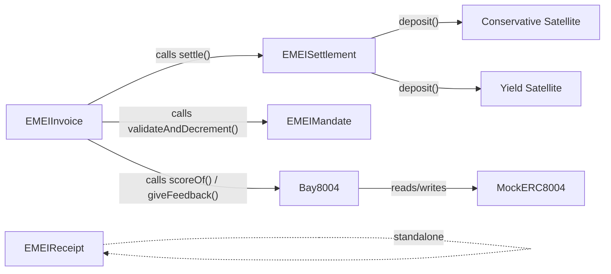
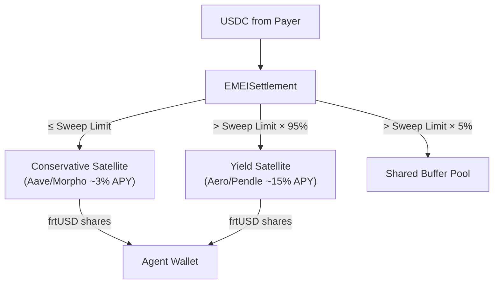

# EMEI Contracts Reference

> Complete reference for every EMEI smart contract, its role, and every function with 3-point explanations.

---

## Contract Overview



| Contract | Role |
|----------|------|
| **EMEIInvoice** | Invoice lifecycle state machine. Central orchestrator. |
| **EMEIMandate** | Programmable spending pre-authorizations for autonomous agents. |
| **EMEISettlement** | USDC routing engine with dual-tranche vaults, sweep limits, and buffer pool. |
| **EMEIReceipt** | On-chain Merkle root anchoring for verifiable payment proofs. |
| **Bay8004** | Reputation gate adapter with weighted scoring. |
| **MockERC8004** | Identity registry (ERC-8004 testnet implementation). |

---

## 1. EMEIInvoice

**File**: `src/EMEIInvoice.sol`  
**Role**: Central contract managing the invoice lifecycle. Owns the state machine and orchestrates calls to Bay8004, EMEISettlement, and EMEIMandate.

### State Machine

```
ISSUED → PRESENTED → PAID
                   → OVERDUE → PAID
         → REJECTED
→ REJECTED
```

### Functions

#### `createInvoice(CreateInvoiceParams params) → uint256 invoiceId`
- **What it does**: Creates a new invoice with line items, payment terms, and collection mode (MANDATE or PAY_LINK). Assigns a unique auto-incrementing ID.
- **Access control**: Any registered address can call it. Both the issuer (msg.sender) and the payer must pass the Bay8004 reputation gate (score ≥ minReputation).
- **Validation**: Requires non-zero amount, non-zero payer, 1-50 line items, valid term type (NET_N_DAYS requires 1-365 days, MILESTONES requires milestone amounts summing to invoice amount).

#### `present(uint256 invoiceId)`
- **What it does**: Transitions an invoice from ISSUED to PRESENTED, recording the presentation timestamp. This timestamp is used to calculate due dates for NET_N_DAYS and DUE_ON_RECEIPT terms.
- **Access control**: Only the invoice issuer (the address that created the invoice) can present it.
- **State requirement**: Invoice must be in ISSUED status. Reverts with `InvalidStatusTransition` otherwise.

#### `pay(uint256 invoiceId)`
- **What it does**: Executes manual payment by the payer. Calls `EMEISettlement.settle()` to transfer USDC, then calls `Bay8004.giveFeedback()` for both issuer and payer to update their reputation scores.
- **Access control**: Only the designated payer can call this function. The payer must pass the reputation gate at payment time (score rechecked).
- **Failure handling**: If settlement fails, the transaction reverts with `SettlementFailed`. If the payer's reputation drops below threshold between presentation and payment, the invoice is automatically moved to REJECTED.

#### `collect(uint256 invoiceId, uint256 mandateId)`
- **What it does**: Executes automatic collection against a pre-authorized mandate. First validates the mandate (cap, counterparty, category, time window), then calls settlement. This is the function triggered by the EMEI Facilitator's auto-collector worker.
- **Access control**: Anyone can call collect (it's designed for backend automation). Authorization is enforced by EMEIMandate's `validateAndDecrement()` which checks that the invoice issuer is an approved counterparty.
- **Side effects**: Decrements the mandate's remaining spending cap by the invoice amount. If the cap reaches zero, the mandate status transitions to EXHAUSTED.

#### `markOverdue(uint256 invoiceId)`
- **What it does**: Transitions an invoice from PRESENTED to OVERDUE when the payment deadline has passed. The deadline depends on the term type: DUE_ON_RECEIPT (immediate), NET_N_DAYS (presentedAt + netDays), MILESTONES (first milestone dueDate).
- **Access control**: Anyone can call this (it's a public state transition based on time).
- **Requirement**: `block.timestamp` must be past the calculated due date. Reverts if the invoice is not yet overdue.

#### `reject(uint256 invoiceId, string reason)`
- **What it does**: Cancels an invoice by transitioning it to REJECTED. Emits a reason string for auditability.
- **Access control**: Only the invoice issuer can reject. The invoice must be in ISSUED or PRESENTED status.
- **Use case**: Issuer discovers the invoice was created in error, or the payer requests cancellation and the issuer agrees.

#### `getInvoice(uint256 invoiceId) → Invoice`
- **What it does**: Returns the full invoice struct including line items, milestones, settlement proof, and all metadata.
- **Access control**: Public view function, anyone can read.
- **Note**: Reconstructs dynamic arrays (line items, milestones) from separate gas-efficient storage mappings.

#### `getInvoiceCount() → uint256`
- **What it does**: Returns the total number of invoices created (the next ID minus 1).
- **Access control**: Public view function.
- **Use case**: Used by the Facilitator's indexer to detect new invoices.

#### `setMinReputation(uint256 threshold)`
- **What it does**: Updates the minimum reputation score required to create or pay invoices. Threshold must be between 1 and 10000.
- **Access control**: Owner only.
- **Impact**: Affects all future invoice creation and payment attempts. Existing invoices are not retroactively affected at creation time, but payers are re-checked at payment time.

---

## 2. EMEIMandate

**File**: `src/EMEIMandate.sol`  
**Role**: Manages payer pre-authorizations for scoped automatic collection. Mandates define who can collect, how much, for what categories, and during what time window.

### Functions

#### `createMandate(CreateMandateParams params) → uint256 mandateId`
- **What it does**: Creates a new spending pre-authorization. The caller (msg.sender) becomes the payer/grantor. Stores approved counterparties and categories in both array form (for retrieval) and mapping form (for O(1) validation).
- **Access control**: Self-authorized — the caller is always the payer. No admin override.
- **Validation**: Requires non-zero spendCap, future validUntil, 1-50 counterparties, 1-20 categories.

#### `validateAndDecrement(uint256 mandateId, address issuer, uint256 amount, string category) → bool`
- **What it does**: Validates that a collection request passes all mandate rules (active status, time window, counterparty allowlist, category allowlist, sufficient remaining cap), then atomically decrements the remaining cap.
- **Access control**: Only the EMEIInvoice contract can call this (enforced by `onlyInvoiceContract` modifier). This prevents external callers from manipulating mandate state.
- **Side effects**: Reduces `remainingCap` by `amount`. If `remainingCap` reaches zero, the mandate status transitions to EXHAUSTED.

#### `revokeMandate(uint256 mandateId)`
- **What it does**: Permanently deactivates a mandate by setting its status to REVOKED. No further collections can be made against it.
- **Access control**: Only the mandate's payer (the address that created it) can revoke.
- **Requirement**: Mandate must be in ACTIVE status. Cannot revoke an already EXHAUSTED or REVOKED mandate.

#### `getMandate(uint256 mandateId) → Mandate`
- **What it does**: Returns the full mandate struct including all approved counterparties, categories, caps, and status.
- **Access control**: Public view function.
- **Data**: Reconstructs the full struct from gas-efficient storage mappings.

#### `getMandatesByPayer(address payer) → uint256[]`
- **What it does**: Returns an array of all mandate IDs created by a specific payer address.
- **Access control**: Public view function.
- **Use case**: The Facilitator queries this to find active mandates for auto-collection matching.

#### `setInvoiceContract(address invoiceContract)`
- **What it does**: Sets the EMEIInvoice contract address that is authorized to call `validateAndDecrement`. Must be called after deployment to link contracts.
- **Access control**: Owner only.
- **Critical**: If not set, no auto-collections can execute because `validateAndDecrement` will revert for all callers.

---

## 3. EMEISettlement

**File**: `src/EMEISettlement.sol`  
**Role**: USDC routing engine with dual-tranche vault integration, automated treasury sweeping via sweep limits, and a shared liquidity buffer pool for instant payments.

### Architecture



### Functions

#### `settle(uint256 invoiceId, address payer, address payee, uint256 amount, address asset) → bytes32 proof`
- **What it does**: Pulls USDC from the payer, then splits it between the Conservative Satellite, Yield Satellite, and Buffer Pool based on the payee's sweep limit. Deposits into Satellites with the payee (agent wallet) as the share receiver. Returns a keccak256 settlement proof.
- **Access control**: Only the EMEIInvoice contract can call this (via `onlyInvoiceContract`).
- **Split logic**: If payee has no sweep limit, all goes to Conservative (safe default). If payee's Conservative balance is below the sweep limit, fills it up first. Any excess is split: 95% to Yield Satellite, 5% to Buffer Pool.

#### `withdraw(uint256 amount)`
- **What it does**: Allows an agent to withdraw USDC from their vault positions. Cascades through Conservative → Yield → Buffer Pool to find sufficient funds. Transfers USDC to the caller.
- **Access control**: Any agent can withdraw their own funds (msg.sender).
- **Cascade**: First redeems from Conservative (cheapest, most liquid). If insufficient, redeems from Yield. If still insufficient, loans from the shared Buffer Pool (tracked as a debt to be repaid by the sweeper).

#### `withdrawTo(address agent, address destination, uint256 amount)`
- **What it does**: Withdraws USDC from an agent's vault position and sends it to a different destination address. Used when the Facilitator backend redeems an agent's funds to their owner's embedded wallet via Privy-signed transactions.
- **Access control**: Only the owner or facilitator can call this. This is the function that enables the "Alice withdraws Charlie's earnings to her wallet" flow.
- **Cascade**: Same Conservative → Yield → Buffer logic as `withdraw()`.

#### `topUpFromYield(address agent)`
- **What it does**: Redeems frtUSD shares from the agent's Yield Satellite position and deposits the USDC into their Conservative Satellite position. Also repays any outstanding buffer loan for the agent first.
- **Access control**: Only the facilitator can call this. Triggered by the Sweeper background worker when it detects an agent's spendable balance dropped below their sweep limit.
- **Safety**: If the agent has no sweep limit, or their Conservative balance already meets the limit, this is a no-op.

#### `setSweepLimit(address agent, uint256 limit)`
- **What it does**: Configures the USDC threshold for an agent's "checking account." Funds below this limit stay in the Conservative Satellite (safe, instant access). Funds above are swept to the Yield Satellite (higher returns).
- **Access control**: Owner or facilitator only.
- **Default**: If no sweep limit is set (0), all settled funds go to Conservative as a safe default.

#### `getVaultBalance(address payee) → uint256`
- **What it does**: Returns the total USDC value across both the Conservative and Yield Satellite positions for a payee.
- **Calculation**: `Conservative.convertToAssets(Conservative.balanceOf(payee)) + Yield.convertToAssets(Yield.balanceOf(payee))`.
- **Note**: This reflects real-time value including any yield accrued from share price appreciation.

#### `getAccruedYield(address payee) → uint256`
- **What it does**: Returns the yield earned by a payee (current total vault value minus total principal deposited).
- **Calculation**: `getVaultBalance(payee) - totalDeposited[payee]`. Returns 0 if current value is less than or equal to deposited principal.
- **Use case**: Displayed on the agent dashboard to show earnings.

#### `getSpendableBalance(address agent) → uint256`
- **What it does**: Returns the USDC value of an agent's Conservative Satellite shares only. This is the "checking account" balance available for instant payments.
- **Access control**: Public view function.
- **Importance**: The Sweeper worker compares this against the sweep limit to decide whether to trigger a top-up.

#### `getInvestmentBalance(address agent) → uint256`
- **What it does**: Returns the USDC value of an agent's Yield Satellite shares only. This is the "savings account" balance earning higher APY.
- **Access control**: Public view function.
- **Note**: This balance may not be instantly liquid if the Yield Satellite has funds locked in Pendle PTs or LP positions.

#### `getSweepLimit(address agent) → uint256`
- **What it does**: Returns the configured sweep limit for an agent.
- **Access control**: Public view function.
- **Default**: Returns 0 if no limit has been set.

#### `setBufferBps(uint256 bps)`
- **What it does**: Updates the percentage of swept funds retained in the Buffer Pool (in basis points). Default is 500 (5%). Maximum is 2000 (20%).
- **Access control**: Owner only.
- **Trade-off**: Higher buffer = more instant liquidity but lower yield. Lower buffer = more yield but risk of failed instant payments.

#### `setInvoiceContract(address invoiceContract)`
- **What it does**: Sets which contract is authorized to call `settle()`. Must be called post-deployment to link EMEIInvoice.
- **Access control**: Owner only.
- **Critical**: Settlement is impossible until this is set.

#### `setFacilitator(address facilitator)`
- **What it does**: Sets which address is authorized to call `topUpFromYield()`, `withdrawTo()`, and `setSweepLimit()`.
- **Access control**: Owner only.
- **Use case**: Points to the Facilitator backend's hot wallet address.

---

## 4. EMEIReceipt

**File**: `src/EMEIReceipt.sol`  
**Role**: Anchors Merkle roots of settled payment batches on-chain. Enables trustless verification that a specific payment was included in a batch.

### Functions

#### `postMerkleRoot(uint256 batchNumber, bytes32 merkleRoot)`
- **What it does**: Posts a Merkle root for a numbered batch of settled invoices. The Facilitator's Batcher worker computes the root off-chain from all settled invoice hashes in the batch window and submits it here.
- **Access control**: Only the authorized poster (Facilitator's hot wallet) can call this.
- **Validation**: Root must be non-zero. Each batch number can only be posted once (prevents overwriting).

#### `getMerkleRoot(uint256 batchNumber) → bytes32`
- **What it does**: Returns the Merkle root for a specific batch number. Returns `bytes32(0)` if the batch hasn't been posted.
- **Access control**: Public view function.
- **Use case**: Clients fetch the root to verify their own inclusion proofs offline.

#### `getLatestBatch() → uint256`
- **What it does**: Returns the highest batch number that has been posted.
- **Access control**: Public view function.
- **Use case**: The Facilitator uses this to determine the next batch number.

#### `verifyInclusion(uint256 batchNumber, bytes32 leaf, bytes32[] proof) → bool`
- **What it does**: Verifies that a given leaf (payment hash) is included in the Merkle tree of the specified batch. Uses sorted-pair hashing (smaller hash first) for deterministic proof verification.
- **Access control**: Public view function.
- **Algorithm**: Iteratively hashes the leaf with each proof element (always sorting the pair), then compares the final computed root against the stored root.

---

## 5. Bay8004

**File**: `src/Bay8004.sol`  
**Role**: Reputation gate adapter that reads from the ERC-8004 registry, applies weighted scoring, and exposes `scoreOf()` for the EMEI protocol.

### Scoring Formula

```
finalScore = min((rawScore × (txSizeWeight + timeDecayFactor + categoryWeight)) / 10000, 10000)
```

Default weights: txSizeWeight=3000 (30%), timeDecayFactor=2000 (20%), categoryWeight=5000 (50%). Sum=10000, so finalScore = rawScore (capped at 10000).

### Functions

#### `scoreOf(address account) → uint256`
- **What it does**: Computes a weighted reputation score for the given address by reading the raw score from the ERC-8004 registry and applying three weight factors. Caches the result for gas efficiency.
- **Access control**: Public (non-view — it writes to cache and emits events).
- **Failure**: Reverts with `RegistryUnavailable` if the registry call fails.

#### `giveFeedback(address subject, uint256 invoiceId, uint256 amount)`
- **What it does**: Forwards feedback to the underlying ERC-8004 registry after a successful payment. Called by EMEIInvoice after both `pay()` and `collect()`.
- **Access control**: Public (anyone can call, but only meaningful when called from EMEIInvoice).
- **Effect**: Increases the subject's raw score in the registry by the feedback amount (capped at the registry's MAX_SCORE).

#### `setRegistry(address registry)`
- **What it does**: Updates the address of the ERC-8004 reputation registry.
- **Access control**: Owner only.
- **Use case**: Migrate to a new registry implementation without redeploying Bay8004.

#### `setWeights(uint256 txSizeWeight, uint256 timeDecayFactor, uint256 categoryWeight)`
- **What it does**: Updates the three weight factors used in the scoring formula.
- **Access control**: Owner only.
- **Note**: Weights do not need to sum to 10000. If they sum to more, scores will be amplified; if less, scores will be dampened.

#### `getThreshold() → uint256`
- **What it does**: Returns the current minimum reputation threshold configured in this contract.
- **Access control**: Public view function.
- **Note**: This threshold is informational. The actual enforcement happens in EMEIInvoice via `minReputation`.

#### `setThreshold(uint256 threshold)`
- **What it does**: Updates the minimum reputation threshold stored in Bay8004.
- **Access control**: Owner only.
- **Note**: EMEIInvoice has its own `minReputation` which is the one actually enforced during invoice creation and payment.

---

## 6. MockERC8004

**File**: `src/mocks/MockERC8004.sol`  
**Role**: Testnet implementation of the ERC-8004 reputation registry. Stores per-address scores and allows registration and feedback.

### Functions

#### `register(uint256 initialScore)`
- **What it does**: Registers `msg.sender` in the identity registry with a specified initial score (capped at 10000).
- **Access control**: Self-registration only. Each address can only register once.
- **Revert**: `AlreadyRegistered` if the address has already registered.

#### `register()`
- **What it does**: Registers `msg.sender` with a default initial score of 100.
- **Access control**: Same as above.
- **Use case**: Convenience overload for agents that don't need a custom starting score.

#### `scoreOf(address account) → uint256`
- **What it does**: Returns the current reputation score for an address. Returns 0 if the address is not registered.
- **Access control**: Public view function.
- **Range**: 0 to 10000.

#### `giveFeedback(address subject, uint256 invoiceId, uint256 amount)`
- **What it does**: Increases the subject's score by the feedback amount. Capped at MAX_SCORE (10000). The invoiceId is used for event emission.
- **Access control**: Public (in production, this would be restricted to authorized callers).
- **Revert**: `NotRegistered` if the subject address hasn't registered.

#### `isRegistered(address account) → bool`
- **What it does**: Returns whether an address is registered in the identity registry.
- **Access control**: Public view function.
- **Use case**: Pre-check before attempting operations that require registration.

---

## Cross-Contract Interaction Matrix

| Caller | Target | Function | When |
|--------|--------|----------|------|
| EMEIInvoice | EMEISettlement | `settle()` | On `pay()` or `collect()` |
| EMEIInvoice | EMEIMandate | `validateAndDecrement()` | On `collect()` |
| EMEIInvoice | Bay8004 | `scoreOf()` | On `createInvoice()` and `pay()` |
| EMEIInvoice | Bay8004 | `giveFeedback()` | After successful `pay()` or `collect()` |
| Bay8004 | MockERC8004 | `scoreOf()` | When EMEIInvoice checks reputation |
| Bay8004 | MockERC8004 | `giveFeedback()` | When EMEIInvoice reports payment |
| EMEISettlement | Conservative Satellite | `deposit()` / `redeem()` | On `settle()` / `withdraw()` |
| EMEISettlement | Yield Satellite | `deposit()` / `redeem()` | On `settle()` / `withdraw()` / `topUpFromYield()` |
| Facilitator | EMEISettlement | `topUpFromYield()` | Background sweeper detects low balance |
| Facilitator | EMEISettlement | `withdrawTo()` | User requests withdrawal via dashboard |
| Facilitator | EMEIReceipt | `postMerkleRoot()` | Every 30s batch cycle |
