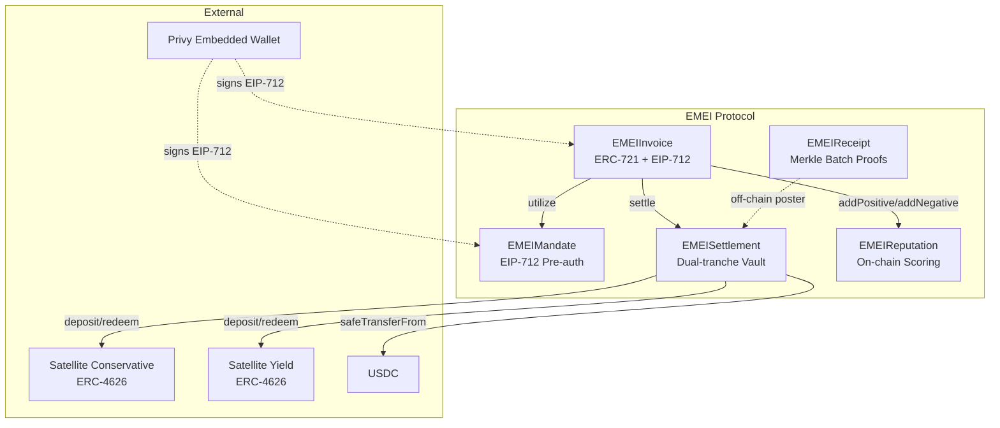
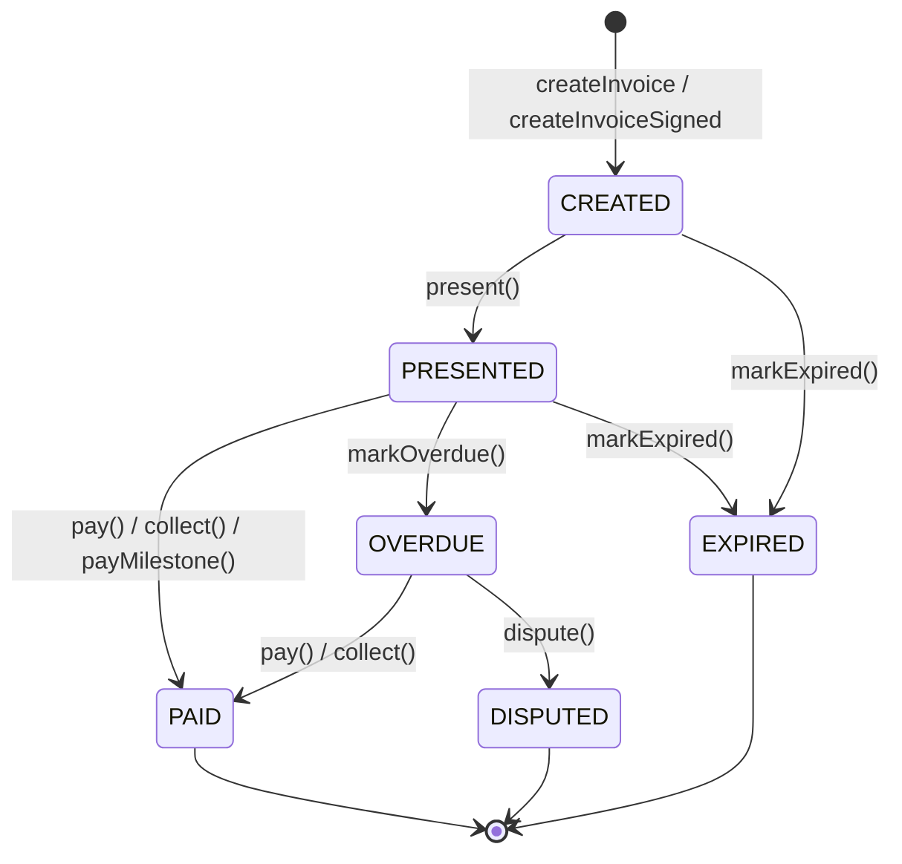
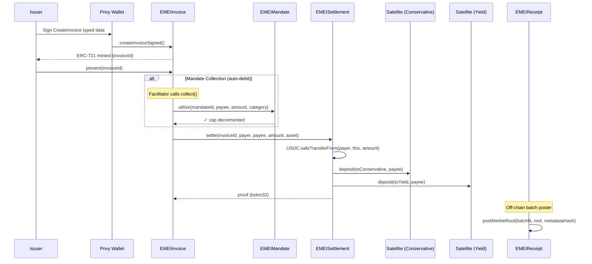

# EMEI Protocol

On-chain invoice lifecycle, pre-authorized mandates, dual-tranche vault settlement, and non-blocking reputation — built on ERC-721, EIP-712, and ERC-4626.

<!-- Badges: CI, coverage, license -->


---

## Architecture Overview



---

## Contract Summary

| Contract | Path | Role | Patterns | LoC (approx) |
|----------|------|------|----------|:---:|
| **EMEIInvoice** | `src/EMEIInvoice.sol` | Invoice lifecycle, NFT ownership, payment orchestration | ERC-721, EIP-712, AccessControl, Pausable | ~280 |
| **EMEIMandate** | `src/EMEIMandate.sol` | Payer pre-authorizations with per-counterparty limits | EIP-712, AccessControl, Pausable | ~240 |
| **EMEISettlement** | `src/EMEISettlement.sol` | Dual-tranche vault routing, buffer pool, withdrawals | AccessControl, Pausable, ReentrancyGuard, SafeERC20 | ~270 |
| **EMEIReceipt** | `src/EMEIReceipt.sol` | Merkle root anchoring for settlement proof batches | AccessControl, Pausable, MerkleProof | ~110 |
| **EMEIReputation** | `src/EMEIReputation.sol` | Non-blocking reputation scoring per account | AccessControl, Pausable | ~120 |

---

## Invoice Lifecycle



**State constants** (`InvoiceStateLib`):
| Value | State |
|:---:|-------|
| 0 | CREATED |
| 1 | PRESENTED |
| 2 | PAID |
| 3 | OVERDUE |
| 4 | EXPIRED |
| 5 | DISPUTED |

---

## Payment Flow



---

## Contract Reference

### EMEIInvoice

**Purpose:** ERC-721 invoice tokens with full state-machine lifecycle, EIP-712 gasless creation, milestone payments, and settlement integration.

**Roles:**
| Role | Constant | Grants |
|------|----------|--------|
| Admin | `DEFAULT_ADMIN_ROLE` | Dependency updates, freeze, min reputation |
| Arbiter | `ARBITER_ROLE` | Dispute resolution |
| Facilitator | `FACILITATOR_ROLE` | Gasless relay, mandate collection |
| Pauser | `PAUSER_ROLE` | Emergency pause/unpause |

**Key Functions:**

| Function | Access | Description | Emits |
|----------|--------|-------------|-------|
| `createInvoice(params)` | Any (whenNotPaused) | Mint invoice NFT to caller | `InvoiceCreated` |
| `createInvoiceSigned(params, issuer, deadline, sig)` | Any (whenNotPaused) | Gasless creation via EIP-712 | `InvoiceCreated` |
| `present(invoiceId)` | NFT owner | Transition CREATED→PRESENTED | `InvoicePresented` |
| `pay(invoiceId)` | Payer only | Full payment, triggers settlement | `InvoicePaid` |
| `collect(invoiceId, mandateId)` | FACILITATOR_ROLE | Auto-debit via mandate | `InvoicePaid` |
| `payMilestone(invoiceId, idx)` | Payer only | Pay single milestone (sequential) | `MilestonePaid`, `InvoicePaid` (if final) |
| `markOverdue(invoiceId)` | Any | Transition to OVERDUE after due date | `InvoiceOverdue` |
| `markExpired(invoiceId)` | Any | Transition to EXPIRED after expiresAt | `InvoiceExpired` |
| `dispute(invoiceId)` | ARBITER_ROLE | Transition OVERDUE→DISPUTED | `InvoiceDisputed` |
| `setReputation(addr)` | DEFAULT_ADMIN_ROLE | Update reputation contract | `DependencyUpdated` |
| `setSettlement(addr)` | DEFAULT_ADMIN_ROLE | Update settlement contract | `DependencyUpdated` |
| `setMandate(addr)` | DEFAULT_ADMIN_ROLE | Update mandate contract | `DependencyUpdated` |
| `setSettlementFrozen(bool)` | DEFAULT_ADMIN_ROLE | Freeze/unfreeze pay/collect | `SettlementFrozenSet` |
| `setMinReputation(uint256)` | DEFAULT_ADMIN_ROLE | Set rep threshold for creation | — |
| `pause()` / `unpause()` | PAUSER_ROLE | Emergency circuit breaker | `Paused` / `Unpaused` |

**Storage Layout (packed):**
- `InvoiceCore` (3 slots): payer, status, termType, collectionMode, netDays, expiresAt, asset, amount, category
- `InvoiceMeta`: metadataHash, presentedAt, createdAt, paidAmount, milestoneCount
- `_milestones[invoiceId]`: dynamic array of `Milestone{amount, dueDate, paid}`

---

### EMEIMandate

**Purpose:** Pre-authorized spending rules with per-counterparty limits, category scoping, recurring resets, and EIP-712 signed creation/revocation.

**Roles:**
| Role | Constant | Grants |
|------|----------|--------|
| Admin | `DEFAULT_ADMIN_ROLE` | Role management |
| Invoice | `INVOICE_ROLE` | Call `utilize()` |
| Pauser | `PAUSER_ROLE` | Emergency pause/unpause |

**Key Functions:**

| Function | Access | Description | Emits |
|----------|--------|-------------|-------|
| `createMandate(params)` | Any (whenNotPaused) | Create mandate as msg.sender | `MandateCreated` |
| `createMandateSigned(params, payer, deadline, sig)` | Any (whenNotPaused) | Gasless mandate creation | `MandateCreated` |
| `utilize(mandateId, counterparty, amount, category)` | INVOICE_ROLE | Debit mandate cap | `MandateUtilized` |
| `revokeMandate(mandateId)` | Payer only | Revoke active mandate | `MandateRevoked` |
| `revokeMandateSigned(mandateId, deadline, sig)` | Any (verified) | Gasless revocation | `MandateRevoked` |
| `topUp(mandateId, additionalCap)` | Payer only | Add cap to active mandate | `MandateTopUp` |
| `statusOf(mandateId)` | View | Auto-detects EXPIRED state | — |
| `remainingCapOf(mandateId)` | View | Current remaining cap | — |
| `getMandatesByPayer(payer)` | View | All mandate IDs for payer | — |

**Storage Layout (packed):**
- `MandateCore` (3 slots): payer, status, validFrom, validUntil, spendCap, remainingCap, resetIntervalDays, resetAmount, lastResetTimestamp
- `_isApprovedCounterparty[mandateId][addr]`: O(1) lookup
- `_isApprovedCategory[mandateId][category]`: O(1) lookup
- `counterpartyLimit` / `counterpartySpent`: per-counterparty spend tracking

---

### EMEISettlement

**Purpose:** Dual-tranche vault settlement — routes USDC into Conservative (spendable) and Yield (investment) Satellite vaults with a liquidity buffer pool.

**Roles:**
| Role | Constant | Grants |
|------|----------|--------|
| Admin | `DEFAULT_ADMIN_ROLE` | Buffer config, satellite rotation, emergency drain |
| Invoice | `INVOICE_ROLE` | Call `settle()` |
| Facilitator | `FACILITATOR_ROLE` | `withdrawTo()`, `topUpFromYield()`, `setSweepLimit()` |
| Pauser | `PAUSER_ROLE` | Emergency pause/unpause |
| Asset Manager | `ASSET_MANAGER` | Whitelist/delist settlement assets |

**Key Functions:**

| Function | Access | Description | Emits |
|----------|--------|-------------|-------|
| `settle(invoiceId, payer, payee, amount, asset)` | INVOICE_ROLE | Pull USDC, split into tranches + buffer | `SettlementExecuted` |
| `withdraw(amount)` | Any | Withdraw from own vault (waterfall: conservative→yield→buffer) | `WithdrawalExecuted` |
| `withdrawTo(agent, dest, amount)` | FACILITATOR_ROLE | Withdraw on behalf of agent | `WithdrawalExecuted` |
| `topUpFromYield(agent)` | FACILITATOR_ROLE | Rebalance yield→conservative up to sweep limit | `TopUpExecuted` |
| `setSweepLimit(agent, limit)` | FACILITATOR_ROLE | Set spendable target for agent | `SweepLimitSet` |
| `setAcceptedAsset(asset, bool)` | ASSET_MANAGER | Whitelist settlement asset | `AssetWhitelisted` |
| `setBufferBps(bps)` | DEFAULT_ADMIN_ROLE | Buffer retention (max 2000 = 20%) | `BufferBpsSet` |
| `setBufferCap(cap)` | DEFAULT_ADMIN_ROLE | Max buffer pool size | `BufferCapSet` |
| `setConservativeSatellite(addr)` | DEFAULT_ADMIN_ROLE | Rotate vault | `SatelliteUpdated` |
| `setYieldSatellite(addr)` | DEFAULT_ADMIN_ROLE | Rotate vault | `SatelliteUpdated` |
| `emergencyDrainBuffer(dest)` | DEFAULT_ADMIN_ROLE | Drain entire buffer to recovery addr | `EmergencyDrain` |
| `getVaultBalance(payee)` | View | Total across both tranches | — |
| `getSpendableBalance(agent)` | View | Conservative tranche only | — |
| `getInvestmentBalance(agent)` | View | Yield tranche only | — |
| `getAccruedYield(payee)` | View | Current value minus deposited principal | — |

**Storage:**
- `USDC`: immutable ERC-20 reference
- `conservativeSatellite` / `yieldSatellite`: ERC-4626 vault references (rotatable)
- `bufferBps`, `bufferPool`, `bufferCap`: liquidity buffer state
- `sweepLimits[agent]`: target spendable per agent
- `totalDeposited[agent]`: cumulative deposits for yield calculation
- `bufferLoans[agent]`: outstanding buffer loans
- `settlementProofHistory[invoiceId]`: proof chain

---

### EMEIReceipt

**Purpose:** On-chain Merkle root anchoring for verifiable settlement proof batches. Proofs are posted sequentially with rate limiting.

**Roles:**
| Role | Constant | Grants |
|------|----------|--------|
| Admin | `DEFAULT_ADMIN_ROLE` | Set batch interval |
| Poster | `POSTER_ROLE` | Post Merkle roots |
| Pauser | `PAUSER_ROLE` | Emergency pause/unpause |

**Key Functions:**

| Function | Access | Description | Emits |
|----------|--------|-------------|-------|
| `postMerkleRoot(batchNumber, root, metadataHash)` | POSTER_ROLE | Post next sequential batch root | `MerkleRootPosted`, `BatchMetadataSet` |
| `verifyInclusion(batchNumber, leaf, proof)` | View | Verify leaf in posted batch | — |
| `getMerkleRoot(batchNumber)` | View | Retrieve root for batch | — |
| `getLatestBatch()` | View | Latest batch number | — |
| `batchExists(batchNumber)` | View | Whether batch was posted | — |
| `totalBatches()` | View | Total posted count | — |
| `setMinBatchInterval(interval)` | DEFAULT_ADMIN_ROLE | Rate-limit posting | — |

**Storage (1 packed slot):**
- `latestBatch` (uint64) + `_totalBatches` (uint64) + `minBatchInterval` (uint64) + `lastPostTimestamp` (uint64)
- `merkleRoots[batchNumber]`: mapping
- `metadataHashes[batchNumber]`: mapping

---

### EMEIReputation

**Purpose:** Non-blocking on-chain reputation. Stores raw scoring data and computes scores from a view function. Called via try/catch from EMEIInvoice so reputation failures never block payments.

**Roles:**
| Role | Constant | Grants |
|------|----------|--------|
| Admin | `DEFAULT_ADMIN_ROLE` | Role management |
| Scorer | `SCORER_ROLE` | Record positive/negative events |
| Pauser | `PAUSER_ROLE` | Pause scoring updates |

**Key Functions:**

| Function | Access | Description | Emits |
|----------|--------|-------------|-------|
| `addPositive(account, invoiceId, weight)` | SCORER_ROLE | Record positive event (weight = USDC volume) | `PositiveAdded` |
| `addNegative(account, invoiceId, weight)` | SCORER_ROLE | Record negative event (overdue) | `NegativeAdded` |
| `scoreOf(account)` | View | Compute score: `500 + (volumeSettled/1e6) - (overdue*50)`, clamped [0, 10000] | — |
| `getReputationData(account)` | View | Raw aggregates | — |
| `getHistory(account)` | View | Full event log | — |
| `getHistoryLength(account)` | View | Event count | — |

**Storage:**
- `ReputationData`: volumeSettled (uint128), invoicesPaid (uint64), invoicesOverdue (uint64), totalPositiveWeight (uint128), totalNegativeWeight (uint128)
- `ReputationEvent[]`: invoiceId, weight, timestamp, positive

---

## Libraries

### InvoiceStateLib

Pure state-transition validator. Defines allowed transitions:

```
CREATED   → PRESENTED, EXPIRED
PRESENTED → PAID, OVERDUE, EXPIRED
OVERDUE   → PAID, DISPUTED
```

All other transitions revert with `InvalidStatusTransition(current, target)`.

### Error Libraries

| Library | Scope |
|---------|-------|
| `InvoiceErrors.sol` | Invoice-specific reverts (state, auth, params, milestones) |
| `MandateErrors.sol` | Mandate-specific reverts (cap, scope, auth) |
| `ReceiptErrors.sol` | Receipt-specific reverts (sequencing, rate limit) |
| `ReputationErrors.sol` | Reputation-specific reverts (zero checks) |
| `SettlementErrors.sol` | Settlement-specific reverts (balance, buffer, assets) — namespaced in `library SettlementErrors` |

---

## EIP-712 Signatures

### Domain

```solidity
EIP712("EMEIInvoice", "2")  // Invoice contract
EIP712("EMEIMandate", "2")  // Mandate contract
```

### Invoice Creation TypeHash

```solidity
bytes32 CREATE_TYPEHASH = keccak256(
    "CreateInvoice(address payer,uint96 amount,address asset,bytes32 category,bytes32 metadataHash,uint8 termType,uint16 netDays,uint8 collectionMode,uint40 expiresAt,uint256 nonce,uint256 deadline)"
);
```

Struct hash is split into two `keccak256(abi.encode(...))` halves to avoid stack-too-deep, then concatenated and hashed.

### Mandate Creation TypeHash

```solidity
bytes32 CREATE_TYPEHASH = keccak256(
    "CreateMandate(address payer,uint96 spendCap,address[] approvedCounterparties,bytes32[] approvedCategories,uint96[] counterpartyLimits,uint40 validFrom,uint40 validUntil,uint16 resetIntervalDays,uint96 resetAmount,uint256 nonce,uint256 deadline)"
);
```

Array fields are hashed as `keccak256(abi.encodePacked(array))` before encoding.

### Mandate Revocation TypeHash

```solidity
bytes32 REVOKE_TYPEHASH = keccak256(
    "RevokeMandate(uint256 mandateId,uint256 nonce,uint256 deadline)"
);
```

### Nonce Management

Each signer has an auto-incrementing nonce per contract (`nonces[address]`). Replay protection is per-chain via `EIP712Domain.chainId`.

---

## Deployment

### Prerequisites

```bash
# Install Foundry
curl -L https://foundry.paradigm.xyz | bash
foundryup

# Install dependencies
forge install
```

### Environment Variables

Create `.env`:

```bash
DEPLOYER_PRIVATE_KEY=0x...
USDC_ADDRESS=0x...
CONSERVATIVE_SATELLITE=0x...
YIELD_SATELLITE=0x...
ADMIN_ADDRESS=0x...
FACILITATOR_ADDRESS=0x...
POSTER_ADDRESS=0x...
BUFFER_BPS=500            # 5% buffer retention
BUFFER_CAP=10000000000    # 10,000 USDC (6 decimals)
MIN_BATCH_INTERVAL=10     # 10 seconds between receipt posts
```

### Deploy

```bash
source .env
forge script script/Deploy.s.sol --broadcast --rpc-url $RPC_URL --verify
```

### Post-Deployment Linking

The `Deploy.s.sol` script handles all role wiring automatically:

1. Deploys contracts in dependency order: Reputation → Receipt → Mandate → Settlement → Invoice
2. Grants `SCORER_ROLE` on Reputation to Invoice
3. Grants `INVOICE_ROLE` on Settlement to Invoice (revokes temp admin holder)
4. Grants `INVOICE_ROLE` on Mandate to Invoice
5. Grants `FACILITATOR_ROLE` on Invoice to facilitator address
6. Saves addresses to `deployments/deployment.json`

---

## Testing

```bash
# Unit tests
forge test --match-path "test/unit/*"

# Fuzz tests (256 runs default)
forge test --match-path "test/fuzz/*"

# Invariant tests (256 runs, depth 50)
forge test --match-path "test/invariant/*"

# Security tests (signature verification)
forge test --match-path "test/security/*"

# Integration tests (Satellite interaction)
forge test --match-path "test/integration/*"

# All tests with gas report
forge test --gas-report

# All tests with verbosity
forge test -vvv
```

### Test Structure

```
test/
├── unit/            # Per-contract unit tests
│   ├── EMEIInvoice.t.sol
│   ├── EMEIMandate.t.sol
│   ├── EMEIReceipt.t.sol
│   ├── EMEIReputation.t.sol
│   └── EMEISettlement.t.sol
├── fuzz/            # Fuzz testing
│   ├── EMEIMandate.fuzz.t.sol
│   ├── EMEIReputation.fuzz.t.sol
│   └── EMEISettlement.fuzz.t.sol
├── invariant/       # Stateful invariant tests
│   ├── InvoiceInvariant.t.sol
│   └── MandateInvariant.t.sol
├── security/        # Signature & auth edge cases
│   └── Signature.t.sol
└── integration/     # Cross-contract flows
    ├── BaseIntegration.sol
    └── SatelliteIntegration.t.sol
```

---

## Security Model

### Role Hierarchy

```
DEFAULT_ADMIN_ROLE (cold multisig)
├── ARBITER_ROLE        → dispute()
├── FACILITATOR_ROLE    → collect(), withdrawTo(), topUpFromYield(), setSweepLimit()
├── PAUSER_ROLE         → pause(), unpause()
├── INVOICE_ROLE        → settle(), utilize() [granted to EMEIInvoice only]
├── SCORER_ROLE         → addPositive(), addNegative() [granted to EMEIInvoice only]
├── POSTER_ROLE         → postMerkleRoot()
└── ASSET_MANAGER       → setAcceptedAsset()
```

### Pause Mechanisms

Every contract implements OpenZeppelin `Pausable`. When paused:
- **EMEIInvoice**: No creation, presentation, or payment
- **EMEIMandate**: No creation or utilization
- **EMEISettlement**: No settlements or withdrawals
- **EMEIReceipt**: No batch posting (verification still works)
- **EMEIReputation**: No scoring updates (views still work)

### Settlement Freeze

`EMEIInvoice.setSettlementFrozen(true)` blocks `pay()` and `collect()` without pausing the entire contract. Useful for coordinated upgrades.

### Non-Blocking Reputation

Reputation calls from EMEIInvoice use `try/catch`. If the reputation contract reverts (paused, bug, gas), payment still succeeds and emits `FeedbackFailed`.

### Emergency Procedures

1. **Pause protocol**: Call `pause()` on all contracts via PAUSER_ROLE
2. **Freeze settlement**: `setSettlementFrozen(true)` on Invoice
3. **Drain buffer**: `emergencyDrainBuffer(recoveryAddress)` on Settlement
4. **Rotate vaults**: `setConservativeSatellite()` / `setYieldSatellite()` — revokes old approvals
5. **Update deps**: `setReputation()`, `setSettlement()`, `setMandate()` on Invoice

---

## Gas Estimates

Approximate gas costs (optimizer 200 runs, Cancun EVM):

| Operation | Gas (approx) |
|-----------|:---:|
| `createInvoice` (no milestones) | ~180k |
| `createInvoice` (5 milestones) | ~280k |
| `createInvoiceSigned` | ~200k |
| `present` | ~50k |
| `pay` (full, with settlement) | ~250k |
| `collect` (mandate + settlement) | ~280k |
| `payMilestone` (single) | ~200k |
| `markOverdue` | ~80k |
| `markExpired` | ~45k |
| `createMandate` (5 counterparties) | ~180k |
| `createMandateSigned` | ~200k |
| `revokeMandate` | ~35k |
| `utilize` | ~60k |
| `settle` (dual-tranche) | ~200k |
| `withdraw` (waterfall) | ~150k |
| `postMerkleRoot` | ~55k |
| `addPositive` | ~65k |
| `addNegative` | ~65k |
| `verifyInclusion` (8-leaf proof) | ~30k |

---

## License

MIT
