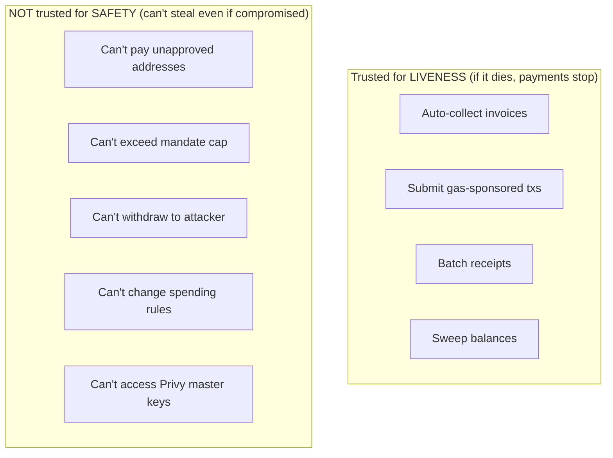
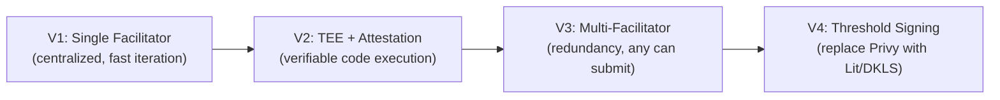
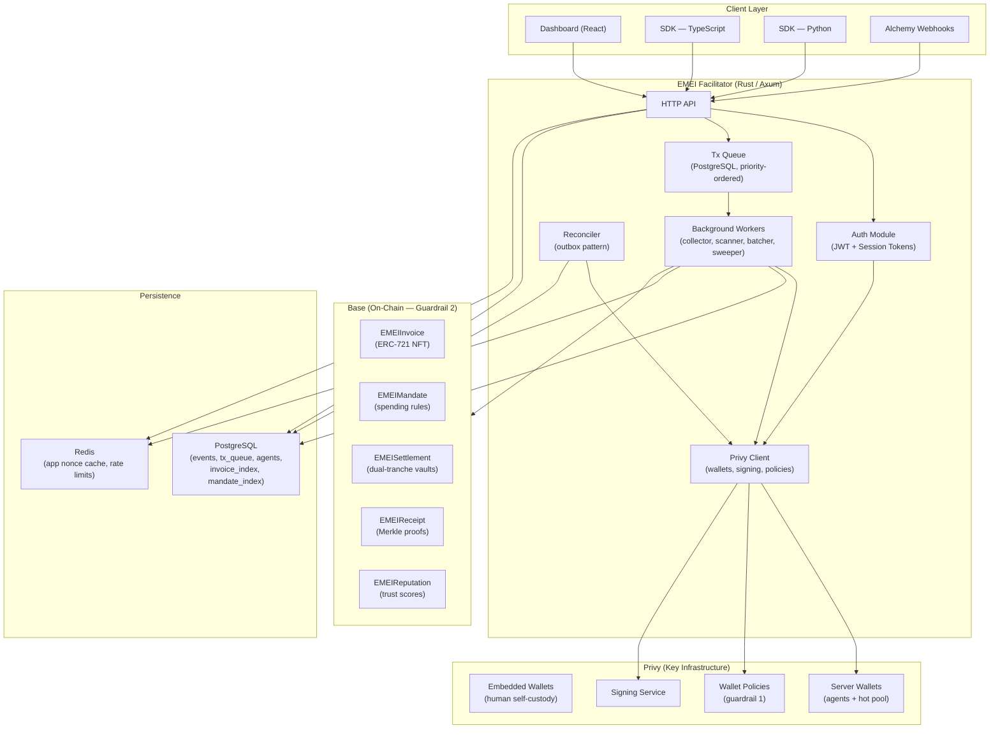
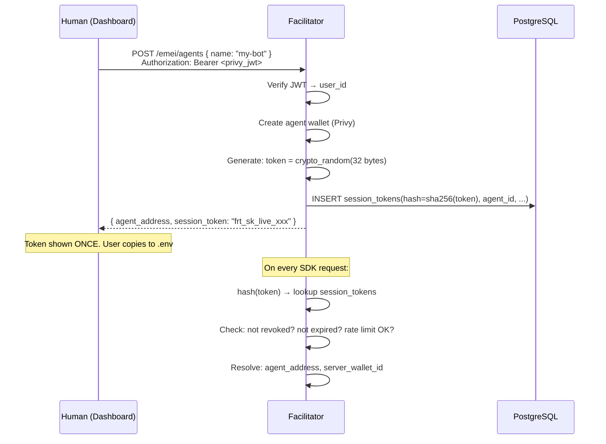
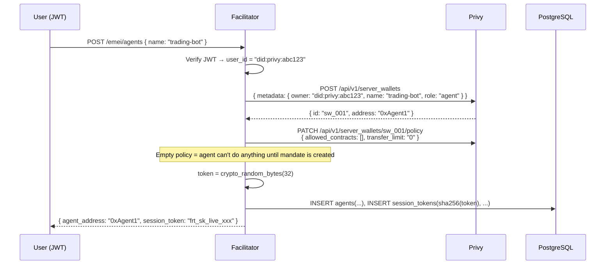
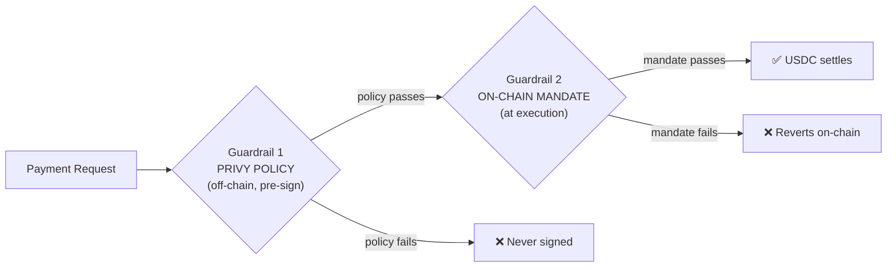
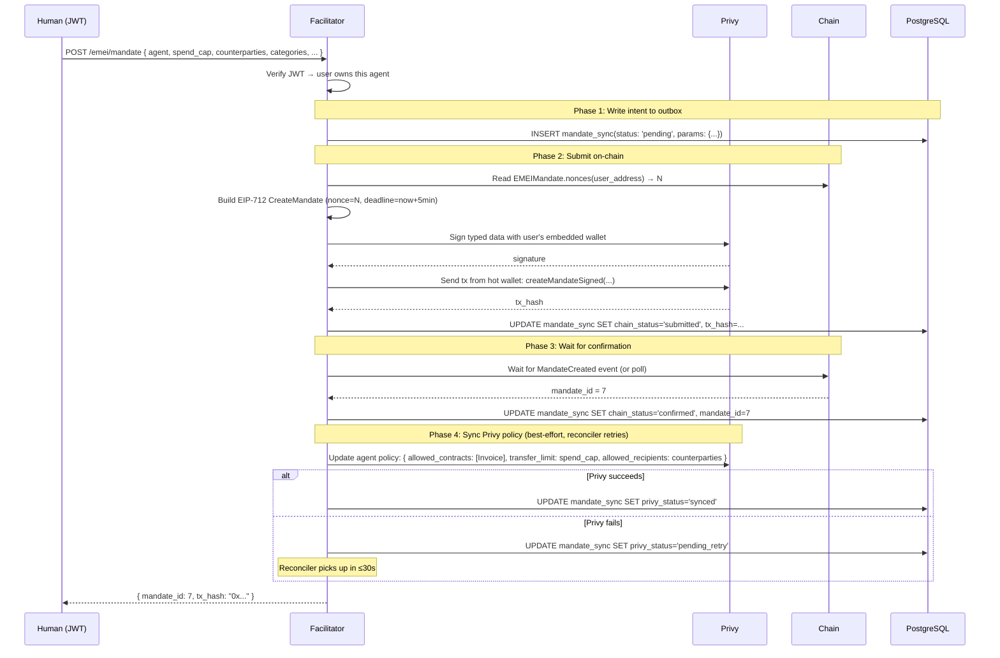
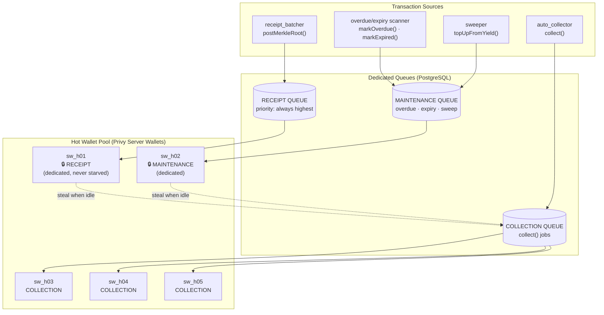
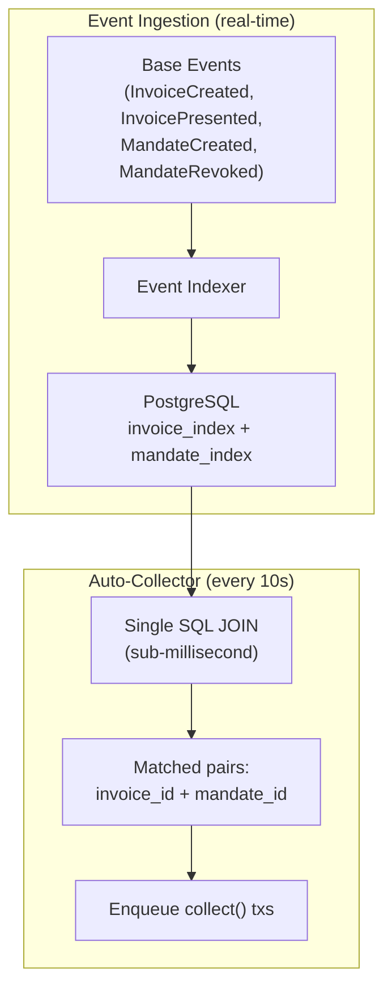

# EMEI Facilitator — Engineering Specification

> Institutional-grade technical reference for the EMEI Facilitator service.
> Covers trust model, architecture, authentication, wallet management, scalability patterns, distributed consistency, SDK design, and deployment.

**Version:** 2.0  
**Chain:** Base (8453)  
**Asset:** USDC (6 decimals)  
**Key Custody:** Privy  
**Language:** Rust (Axum)

---

## Table of Contents

1. [Trust Model & Security Boundaries](#1-trust-model--security-boundaries)
2. [System Architecture](#2-system-architecture)
3. [Authentication Design](#3-authentication-design)
4. [Wallet Management](#4-wallet-management)
5. [Mandate Lifecycle & Two-Guardrail Sync](#5-mandate-lifecycle--two-guardrail-sync)
6. [Distributed Consistency (Outbox Pattern)](#6-distributed-consistency-outbox-pattern)
7. [EIP-712 Nonce Management](#7-eip-712-nonce-management)
8. [Transaction Pipeline](#8-transaction-pipeline)
9. [Auto-Collector (Scalable Design)](#9-auto-collector-scalable-design)
10. [Background Services](#10-background-services)
11. [API Reference](#11-api-reference)
12. [SDK Design](#12-sdk-design)
13. [Database Schema](#13-database-schema)
14. [Contract Interactions](#14-contract-interactions)
15. [Security & Anomaly Detection](#15-security--anomaly-detection)
16. [Configuration & Deployment](#16-configuration--deployment)
17. [Build Order](#17-build-order)

---

## 1. Trust Model & Security Boundaries

### What the Facilitator IS and ISN'T

The facilitator is trusted for **liveness** (payments flow) but NOT for **safety** (money protection). It holds no keys. It cannot move money outside the rules set by the human on-chain.



### Compromise Analysis

| Scenario | Attacker capability | Max damage | Why limited |
|----------|-------------------|-----------|-------------|
| **Facilitator DB stolen** | Gets session token hashes (not usable), mandate cache | Zero financial loss | Hashes can't be reversed; on-chain is source of truth |
| **Facilitator code compromised** | Can request signatures within existing Privy policies | Drain remaining mandate caps to approved addresses only | Privy policy blocks unapproved recipients; on-chain mandate blocks everything else |
| **Session token stolen** | Same as compromised facilitator for one agent | One agent's remaining mandate cap | Bounded by mandate; human revokes in 1 tap |
| **Privy compromised** | Could sign arbitrary operations | On-chain mandate still rejects unauthorized payments | Even with a valid signature, `utilize()` reverts if rules fail |
| **Both Privy + Facilitator compromised** | Could pay approved counterparties up to cap | Sum of all active mandate remaining caps | Human revokes all mandates; vault funds still safe (withdrawal needs embedded wallet) |

### Mitigations (layered)

| Layer | Mitigation | Status |
|-------|-----------|--------|
| 1 | On-chain mandate (mathematical guarantee) | Built into contracts |
| 2 | Privy policy (pre-sign filter) | Synced by facilitator |
| 3 | TEE deployment (code attestation) | AWS Nitro Enclave |
| 4 | Open-source facilitator (verifiable) | Public repo |
| 5 | Rate limiting + anomaly detection | Facilitator-level |
| 6 | Instant revoke (kill switch) | Dashboard + mobile |
| 7 | Stateless design (rebuildable from chain) | Architecture choice |

### Progressive Decentralization Path



The contracts are designed so that FACILITATOR_ROLE can be granted to multiple addresses. Any holder can call `collect()`, `topUpFromYield()`, `postMerkleRoot()`. V3 is a config change, not a contract upgrade.

---

## 2. System Architecture



### Key Design Decisions

| Decision | Rationale |
|----------|-----------|
| All wallets (including hot pool) managed by Privy | No local key material. Eliminates Redis nonce management for tx nonces. Privy handles Ethereum nonce internally. |
| Event-driven indexing (not chain polling) | Scalable to 100k+ invoices/day. Single SQL query replaces N² RPC calls. |
| Outbox pattern for two-system writes | On-chain + Privy policy must both succeed. Outbox guarantees eventual consistency with safe failure modes. |
| Session tokens (not Privy JWTs) for agents | Headless agents can't do browser OAuth. Long-lived tokens with bounded blast radius. |
| On-chain is always source of truth | If Postgres dies, rebuild from chain events. If Privy policy is stale, on-chain mandate still protects. |

---

## 3. Authentication Design

### Two-tier model

| Tier | Credential | Lifetime | Used By | Operations |
|------|-----------|----------|---------|-----------|
| **User Auth** | Privy JWT | Hours (browser session) | Dashboard, admin ops | Create agent, mandate, revoke, withdraw |
| **Agent Auth** | Session Token (`frt_sk_live_...`) | Until revoked | SDK (headless) | Sign payments, create invoices, present, reads |

### Session Token Lifecycle



### Token format

```
frt_sk_live_7f8a9b2c4d5e6f...
 │   │  │    └─ 32 bytes random (crypto-secure)
 │   │  └─ environment: "live" | "test"  
 │   └─ type: "sk" (session key)
 └─ prefix: "frt" (fortress)
```

### Security properties of session tokens

| Property | Implementation |
|----------|---------------|
| Never stored in plaintext | DB stores `sha256(token)` only |
| Revocable instantly | `UPDATE session_tokens SET revoked_at = NOW() WHERE id = ?` |
| Bounded blast radius | Token inherits agent's mandate limits |
| Optional IP binding | `ip_allowlist CIDR[]` column |
| Rate limited | Per-token RPM limit (default 60/min) |
| Audit trail | `last_used_at`, `last_ip` updated on each use |

---

## 4. Wallet Management

### Three wallet categories

| Category | Privy Type | Who Holds Key | Purpose | Count |
|----------|-----------|---------------|---------|-------|
| Human wallet | Embedded | Human (self-custody, exportable) | Fund, mandate, revoke, withdraw | 1 per user |
| Agent wallet | Server | Privy HSM (policy-gated) | Sign invoices/payments within mandate | N per user |
| Hot wallet | Server | Privy HSM (FACILITATOR_ROLE on-chain) | Submit gas-sponsored txs | 3-10 globally |

### Agent wallet creation



### Wallet linkage (metadata as the glue)

```
┌─────────────────────────────────────────────────┐
│  Privy Server Wallet "sw_001"                    │
│    address: 0xAgent1                             │
│    metadata: {                                   │
│      owner_user_id: "did:privy:abc123"  ←──────── linkage to human
│      owner_address: "0xAlice"                    │
│      agent_name: "trading-bot"                   │
│      role: "agent"                               │
│    }                                             │
│    policy: { ... }                               │
└─────────────────────────────────────────────────┘

┌─────────────────────────────────────────────────┐
│  PostgreSQL agents table                         │
│    user_id: "did:privy:abc123"  ←─────────────── same linkage
│    agent_address: "0xAgent1"                     │
│    server_wallet_id: "sw_001"                    │
│    name: "trading-bot"                           │
└─────────────────────────────────────────────────┘
```

---

## 5. Mandate Lifecycle & Two-Guardrail Sync

### The two guardrails (both must pass for money to move)



### Create mandate flow



---

## 6. Distributed Consistency (Outbox Pattern)

### The problem

Two systems must be updated (chain + Privy). They can't be atomic. Partial failure creates inconsistency.

### Failure mode analysis

| Chain TX | Privy Update | User Impact | Safety | Recovery |
|----------|-------------|-------------|--------|----------|
| ✓ | ✓ | Happy path | Safe | N/A |
| ✓ | ✗ | Agent temporarily can't spend (policy too restrictive) | **SAFE** — no money at risk | Reconciler retries Privy in ≤30s |
| ✗ | ✓ | Agent has permissive policy but chain rejects payments | **SAFE** — on-chain mandate doesn't exist, `utilize()` reverts | Reconciler detects mismatch, resets policy |
| ✗ | ✗ | Nothing happened | Safe | User retries |

**Key insight:** The system fails **safe** in all cases. Worst case is temporary liveness loss (agent can't spend for ~30s), never money loss.

### Outbox schema

```sql
CREATE TABLE mandate_sync (
    id BIGSERIAL PRIMARY KEY,
    mandate_id BIGINT,                          -- NULL until chain confirms
    agent_id BIGINT NOT NULL REFERENCES agents(id),
    operation TEXT NOT NULL,                     -- 'create' | 'revoke' | 'topup'
    params JSONB NOT NULL,
    
    -- Chain state
    chain_status TEXT DEFAULT 'pending',         -- pending | submitted | confirmed | failed
    chain_tx_hash TEXT,
    chain_confirmed_at TIMESTAMPTZ,
    
    -- Privy state  
    privy_status TEXT DEFAULT 'pending',         -- pending | synced | failed
    privy_attempts INT DEFAULT 0,
    privy_last_error TEXT,
    privy_synced_at TIMESTAMPTZ,
    
    created_at TIMESTAMPTZ DEFAULT NOW(),
    updated_at TIMESTAMPTZ DEFAULT NOW()
);

CREATE INDEX idx_unsynced ON mandate_sync(privy_status) 
    WHERE chain_status = 'confirmed' AND privy_status != 'synced';
```

### Reconciler service

```rust
/// Runs every 30s. Finds mandates confirmed on-chain but not synced to Privy.
async fn mandate_reconciler(state: Arc<AppState>, cancel: CancellationToken) {
    let mut ticker = tokio::time::interval(Duration::from_secs(30));
    loop {
        select! {
            _ = cancel.cancelled() => break,
            _ = ticker.tick() => {
                // 1. Retry pending Privy syncs
                let unsynced = db.query(
                    "SELECT * FROM mandate_sync WHERE chain_status = 'confirmed' AND privy_status != 'synced'"
                ).await;
                
                for row in unsynced {
                    match row.operation.as_str() {
                        "create" => {
                            let policy = build_policy_from_params(&row.params);
                            match privy.update_wallet_policy(wallet_id, policy).await {
                                Ok(_) => db.mark_privy_synced(row.id).await,
                                Err(e) => {
                                    db.increment_privy_attempts(row.id, &e).await;
                                    if row.privy_attempts >= 10 { alert_ops(&row).await; }
                                }
                            }
                        }
                        "revoke" => {
                            // Disable policy (empty allowlist)
                            match privy.disable_wallet_policy(wallet_id).await {
                                Ok(_) => db.mark_privy_synced(row.id).await,
                                Err(e) => db.increment_privy_attempts(row.id, &e).await,
                            }
                        }
                        _ => {}
                    }
                }
                
                // 2. Detect orphaned Privy policies (chain tx failed but policy was set)
                let orphans = db.query(
                    "SELECT * FROM mandate_sync WHERE chain_status = 'failed' AND privy_status = 'synced'"
                ).await;
                for row in orphans {
                    privy.disable_wallet_policy(wallet_id).await;
                    db.update(row.id, "privy_status", "rolled_back").await;
                }
            }
        }
    }
}
```

---

## 7. EIP-712 Nonce Management

### Two independent nonce systems

| Nonce Type | Purpose | Where | Managed By |
|-----------|---------|-------|------------|
| Ethereum tx nonce | Prevents raw tx replay | Per-EOA on-chain counter | **Privy** (for all wallets — hot + agent) |
| EIP-712 app nonce | Prevents signed message replay | `nonces[signer]` in EMEI contracts | **Facilitator** (query from contract, include in typed data) |

### Why they don't conflict

```
Hot wallet 0xHot submits createMandateSigned(signature_by_0xAlice_with_app_nonce_3)

Ethereum layer: verifies 0xHot's tx nonce (Privy manages this)
Contract layer: verifies 0xAlice's app nonce == 3 in the signed message (Facilitator manages this)

Different addresses, different systems, zero interaction.
```

### App nonce handling

```rust
/// Serialize EIP-712 signing per signer address to prevent nonce races.
async fn sign_eip712(
    state: &AppState,
    signer: Address,
    contract: Address,
    build_typed_data: impl FnOnce(u64, u64) -> TypedData,  // (nonce, deadline) -> message
) -> Result<Bytes, EmeiError> {
    // 1. Per-signer mutex (prevents two concurrent requests using same nonce)
    let lock = state.eip712_locks.entry(signer).or_default();
    let _guard = lock.lock().await;

    // 2. Get app nonce (from cache or chain)
    let nonce = state.app_nonce_cache.get_or_fetch(signer, contract).await?;
    let deadline = now() + 300; // 5 min

    // 3. Build typed data
    let typed_data = build_typed_data(nonce, deadline);

    // 4. Sign via Privy
    let wallet_id = state.resolve_wallet_id(signer).await?;
    let signature = state.privy.sign_typed_data(wallet_id, &typed_data).await?;

    // 5. Increment local cache
    state.app_nonce_cache.increment(signer);

    Ok(signature)
    // Lock releases here — next request for this signer can proceed
}
```

### Nonce recovery on failure

If a transaction fails with "invalid nonce" on-chain, the reconciler re-syncs:

```rust
// On tx failure with nonce-related error:
let fresh_nonce = contract.nonces(signer).call().await?;
state.app_nonce_cache.set(signer, fresh_nonce);
// Next attempt will use the correct nonce
```

---

## 8. Transaction Pipeline

### Architecture: Dedicated Queue System (prevents hot wallet exhaustion)

A single shared queue risks starvation: a flood of low-priority collections can block critical receipt anchoring and overdue marking. The solution is three dedicated queues with reserved wallet capacity.



**Key guarantee:** Receipt and maintenance wallets process their dedicated queues first. Only when idle do they steal from the collection queue. Collection wallets never touch receipt or maintenance. This ensures critical operations always have available capacity regardless of collection volume.

### Queue schema

```sql
CREATE TABLE tx_queue (
    id BIGSERIAL PRIMARY KEY,
    queue TEXT NOT NULL DEFAULT 'collection',  -- 'receipt' | 'maintenance' | 'collection'
    to_address TEXT NOT NULL,
    calldata BYTEA NOT NULL,
    priority SMALLINT DEFAULT 5,
    source TEXT NOT NULL,
    status TEXT DEFAULT 'pending',
    assigned_wallet TEXT,
    tx_hash TEXT,
    attempts SMALLINT DEFAULT 0,
    max_attempts SMALLINT DEFAULT 3,
    created_at TIMESTAMPTZ DEFAULT NOW(),
    assigned_at TIMESTAMPTZ,
    submitted_at TIMESTAMPTZ,
    confirmed_at TIMESTAMPTZ,
    error TEXT
);

CREATE INDEX idx_receipt_pending ON tx_queue(priority DESC) WHERE queue = 'receipt' AND status = 'pending';
CREATE INDEX idx_maintenance_pending ON tx_queue(priority DESC) WHERE queue = 'maintenance' AND status = 'pending';
CREATE INDEX idx_collection_pending ON tx_queue(priority DESC) WHERE queue = 'collection' AND status = 'pending';
```

### Queue routing

```rust
fn queue_for_source(source: &str) -> &str {
    match source {
        "receipt_batcher" => "receipt",
        "overdue_scanner" | "expiry_scanner" | "sweeper" => "maintenance",
        "collector" | "auto_collector" | "user_collect" => "collection",
        _ => "collection"
    }
}
```

**No Redis nonce management needed.** Privy handles Ethereum tx nonces internally for all server wallets.

### Job lifecycle

```
pending → assigned → submitted → confirmed
                                → failed (retry up to max_attempts)
```

### tx_sender worker (with work stealing)

```rust
async fn tx_sender_loop(state: Arc<AppState>, hot_wallet_id: String, primary_queue: String, cancel: CancellationToken) {
    loop {
        select! {
            _ = cancel.cancelled() => break,
            _ = sleep(Duration::from_millis(500)) => {
                // Try own queue first
                let job = state.db.claim_from_queue(&primary_queue, &hot_wallet_id).await;
                // If dedicated queue empty, steal from collection
                let job = match job {
                    Some(j) => Some(j),
                    None if primary_queue != "collection" => {
                        state.db.claim_from_queue("collection", &hot_wallet_id).await
                    }
                    None => None,
                };
                
                if let Some(job) = job {
                    match state.privy.send_transaction(&hot_wallet_id, &job.to_address, &job.calldata).await {
                        Ok(tx_hash) => {
                            state.db.mark_submitted(job.id, &tx_hash).await;
                        }
                        Err(e) if job.attempts < job.max_attempts => {
                            state.db.release_job(job.id).await;
                        }
                        Err(e) => {
                            state.db.mark_failed(job.id, &e.to_string()).await;
                            alert_if_critical(&job, &e).await;
                        }
                    }
                }
            }
        }
    }
}
```

---

## 9. Auto-Collector (Scalable Design)

### The old approach (O(N × M) RPC calls — doesn't scale)

```
for invoice in last_20_invoices:          # chain RPC per invoice
    mandates = getMandatesByPayer(payer)   # chain RPC
    for mandate in mandates:              # chain RPC per mandate
        if matches(invoice, mandate):     # check rules
            enqueue collect()
```

At 100k invoices/day this means millions of RPC calls. Unacceptable.

### The new approach: Event-driven Postgres index



### Indexed tables

```sql
-- Invoices (populated by event indexer from InvoiceCreated + InvoicePresented events)
CREATE TABLE invoice_index (
    invoice_id BIGINT PRIMARY KEY,
    issuer TEXT NOT NULL,
    payer TEXT NOT NULL,
    amount NUMERIC NOT NULL,
    category TEXT NOT NULL,                    -- bytes32 hex
    collection_mode SMALLINT NOT NULL,         -- 0=MANDATE
    status SMALLINT NOT NULL,                  -- 1=PRESENTED
    expires_at BIGINT NOT NULL,
    presented_at BIGINT,
    created_at BIGINT NOT NULL,
    collect_submitted BOOLEAN DEFAULT FALSE,   -- prevent double-submit
    updated_at TIMESTAMPTZ DEFAULT NOW()
);

-- Composite index for the collector query
CREATE INDEX idx_collectible ON invoice_index(payer, status, collection_mode, expires_at)
    WHERE status = 1 AND collection_mode = 0 AND collect_submitted = FALSE;

-- Mandates (populated from MandateCreated events + periodic sync)
CREATE TABLE mandate_index (
    mandate_id BIGINT PRIMARY KEY,
    payer TEXT NOT NULL,
    remaining_cap NUMERIC NOT NULL,
    status SMALLINT NOT NULL DEFAULT 0,        -- 0=ACTIVE
    valid_from BIGINT NOT NULL,
    valid_until BIGINT NOT NULL,
    counterparties TEXT[] NOT NULL,
    categories TEXT[] NOT NULL,                 -- bytes32 hex array
    updated_at TIMESTAMPTZ DEFAULT NOW()
);

CREATE INDEX idx_mandate_active ON mandate_index(payer) WHERE status = 0;
CREATE INDEX idx_mandate_counterparties ON mandate_index USING GIN(counterparties);
CREATE INDEX idx_mandate_categories ON mandate_index USING GIN(categories);
```

### The collector query: Atomic claim with `FOR UPDATE SKIP LOCKED`

This prevents race conditions when multiple facilitator replicas (or re-entrant collector cycles) run simultaneously. The query atomically finds matches, locks the rows, marks them claimed, and returns the pairs — in one transaction.

```sql
WITH claimable AS (
    SELECT i.invoice_id, m.mandate_id
    FROM invoice_index i
    JOIN mandate_index m 
        ON m.payer = i.payer
        AND m.status = 0
        AND m.remaining_cap >= i.amount
        AND m.valid_from <= EXTRACT(EPOCH FROM NOW())
        AND m.valid_until >= EXTRACT(EPOCH FROM NOW())
        AND i.issuer = ANY(m.counterparties)
        AND i.category = ANY(m.categories)
    WHERE i.status = 1
        AND i.collection_mode = 0
        AND i.collect_submitted = FALSE
        AND i.expires_at > EXTRACT(EPOCH FROM NOW())
    ORDER BY i.created_at ASC
    LIMIT 50
    FOR UPDATE OF i SKIP LOCKED
)
UPDATE invoice_index
SET collect_submitted = TRUE, updated_at = NOW()
FROM claimable
WHERE invoice_index.invoice_id = claimable.invoice_id
RETURNING claimable.invoice_id, claimable.mandate_id;
```

**Why `FOR UPDATE OF i SKIP LOCKED`:**
- `FOR UPDATE` — locks the selected invoice rows within the transaction
- `OF i` — only locks the invoice_index rows (not mandate_index)
- `SKIP LOCKED` — if another transaction already locked a row, skip it instead of waiting

Two concurrent collectors will never process the same invoice. No double-enqueue. No wasted gas on reverted `collect()` calls.

### Performance characteristics

| Invoices/day | RPC calls (old) | SQL query time (new) | Improvement |
|-------------|----------------|---------------------|-------------|
| 1,000 | ~5,000 | <1ms | 5000x |
| 100,000 | ~500,000 | <5ms | 100,000x |
| 1,000,000 | infeasible | <20ms | ∞ |

The collector now runs at O(1) per cycle regardless of invoice volume. The event indexer does O(N) work but it's amortized across real-time event ingestion.

---

## 10. Background Services

| Service | Interval | Logic | RPC Calls |
|---------|----------|-------|-----------|
| **event_indexer** | 2s (or webhook) | Subscribe to chain events → INSERT into invoice_index, mandate_index, events | 1 `eth_getLogs` per cycle |
| **auto_collector** | 10s | Atomic SQL `FOR UPDATE SKIP LOCKED` → claim + enqueue `collect()` | 0 (pure SQL) |
| **overdue_scanner** | 60s | `SELECT FROM invoice_index WHERE presented + due < now AND status = 1` → enqueue `markOverdue()` | 0 (pure SQL) |
| **expiry_scanner** | 60s | `SELECT FROM invoice_index WHERE expires_at < now AND status IN (0,1,3)` → enqueue `markExpired()` | 0 (pure SQL) |
| **receipt_batcher** | 30s | Drain pending_receipts → Merkle tree → enqueue `postMerkleRoot(batch, root, metadataHash)` | 1 `getLatestBatch` on startup |
| **sweeper** | 30s | Check agents with `spendableBalance < sweepLimit` → enqueue `topUpFromYield()` | N agents × 2 view calls (cacheable) |
| **buffer_monitor** | 30s | Check buffer utilization → adjust max_instant_withdrawal → alert if <20% | 2 view calls |
| **tx_sender** (×N) | 500ms poll | Claim job from assigned queue → Privy send_transaction → confirm. Dedicated wallets steal from collection when idle. | 1 per job |
| **tx_reaper** | 120s | Reclaim jobs stuck in assigned/submitted > 2min | 0 |
| **mandate_reconciler** | 30s | Retry failed Privy policy syncs, rollback orphaned policies | 0-N Privy API calls |
| **webhook_worker** | event-driven | Process Alchemy notifications → update event status | 0 |

---

## 11. API Reference

### Route map

```rust
Router::new()
    // Agent management (User Auth — Privy JWT)
    .route("/emei/agents", post(agents::create_agent))
    .route("/emei/agents", get(agents::list_agents))
    .route("/emei/agents/{id}/rotate", post(agents::rotate_token))
    .route("/emei/agents/{id}/revoke", post(agents::revoke_token))

    // Mandate lifecycle (User Auth)
    .route("/emei/mandate", post(mandate::create_mandate))
    .route("/emei/mandate/{id}", delete(mandate::revoke_mandate))
    .route("/emei/mandate/{id}/topup", post(mandate::top_up))

    // Invoice lifecycle (Agent Auth — Session Token)
    .route("/emei/invoice", post(invoice::create_invoice))
    .route("/emei/present", post(invoice::present_invoice))
    .route("/emei/pay", post(invoice::pay_invoice))
    .route("/emei/collect", post(invoice::collect_invoice))
    .route("/emei/milestone", post(invoice::pay_milestone))

    // x402 pay-per-use (Agent Auth)
    .route("/emei/x402/sign", post(x402::sign_payment))
    .route("/emei/x402/verify", post(x402::verify_and_settle))

    // Query (Public — no auth)
    .route("/emei/invoice/{id}", get(query::get_invoice))
    .route("/emei/statement", get(query::get_statement))
    .route("/emei/reputation/{address}", get(query::get_reputation))
    .route("/emei/balance/{address}", get(query::get_balance))
    .route("/emei/verify/{id}", get(receipt::verify_receipt))
    .route("/emei/paylink/{id}", get(paylink::get_paylink))

    // Withdrawal (User Auth)
    .route("/emei/withdraw", post(withdraw::withdraw_funds))

    // Public dashboard (no auth)
    .nest("/emei/public", public::router())

    // Ops
    .route("/health", get(health::health_check))
    .route("/emei/ops/status", get(dashboard::ops_status))
    .route("/emei/webhook", post(webhook::handle_webhook))
```

### Key request/response types

```rust
// --- Mandate (new ABI fields) ---
struct CreateMandateRequest {
    agent_address: String,
    spend_cap: String,                      // uint96, USDC 6 decimals
    approved_counterparties: Vec<String>,    // 1-50 addresses
    approved_categories: Vec<String>,       // human-readable, keccak'd to bytes32
    counterparty_limits: Option<Vec<String>>, // per-counterparty sub-limits
    valid_from: u64,
    valid_until: u64,
    reset_interval_days: Option<u16>,       // 0 = one-time, 30 = monthly
    reset_amount: Option<String>,           // amount to reset to
}

// --- Invoice (new ABI — lighter on-chain footprint) ---
struct CreateInvoiceRequest {
    payer: String,
    amount: String,                         // uint96
    asset: String,
    category: String,                       // keccak'd to bytes32
    metadata_hash: Option<String>,          // IPFS CID of line items (off-chain)
    terms: TermsRequest,
    collection_mode: String,                // "mandate" | "pay_link"
    expires_at: u64,
}

// --- x402 ---
struct X402SignRequest {
    invoice_id: u64,
    amount: String,
    pay_to: String,
}
struct X402SignResponse {
    signature: String,
    signer: String,
    deadline: u64,
}
```

---

## 12. SDK Design

### Two classes, two audiences

```typescript
// FortressSDK — for humans (setup operations, needs Privy JWT)
class FortressSDK {
    constructor(opts: { authToken: string; baseUrl?: string })
    createAgent(opts: { name: string }): Promise<Agent>
    listAgents(): Promise<Agent[]>
    createMandate(opts: MandateParams): Promise<Mandate>
    revokeMandate(id: number): Promise<void>
    withdraw(amount: string): Promise<TxHash>
}

// FortressAgent — for agents (headless, needs session token)
class FortressAgent {
    constructor(opts: { sessionToken: string; baseUrl?: string })
    fortressFetch(url: string, opts?: { maxPayment?: string }): Promise<Response>
    createInvoice(params: InvoiceParams): Promise<Invoice>
    present(invoiceId: number): Promise<TxHash>
    balance(): Promise<{ balance: string; yield: string }>
    reputation(address?: string): Promise<number>
    statement(opts?: QueryOpts): Promise<Event[]>
    verify(invoiceId: number): Promise<{ verified: boolean }>
}
```

### fortressFetch (x402 transparent payment)

```typescript
async fortressFetch(url: string, opts?: FetchOpts): Promise<Response> {
    const res = await fetch(url, opts);
    if (res.status !== 402) return res;

    const { price, pay_to, invoice_id } = await res.json();
    if (opts?.maxPayment && BigInt(price) > BigInt(opts.maxPayment))
        throw new PaymentTooExpensiveError(price, opts.maxPayment);

    const sig = await this.post("/emei/x402/sign", { invoice_id, amount: price, pay_to });

    return fetch(url, {
        ...opts,
        headers: { ...opts?.headers, "X-PAYMENT": JSON.stringify(sig) }
    });
}
```

### Developer integration (complete)

```bash
# One-time setup (dashboard)
# 1. Sign up at fortress.xyz
# 2. Click "Create Agent" → copy session token
# 3. Click "Create Mandate" → set spending rules
# 4. Add to .env:
FORTRESS_SESSION_TOKEN=frt_sk_live_7f8a9b...
```

```typescript
// Agent code (runs forever, headless)
import { FortressAgent } from "@fortress/sdk";
const agent = new FortressAgent({ sessionToken: process.env.FORTRESS_SESSION_TOKEN });

// Pay for APIs transparently
const data = await agent.fortressFetch("https://api.data-provider.com/prices");

// Charge other agents
const invoice = await agent.createInvoice({
    payer: "0xBuyer...", amount: "5000000", category: "compute",
    terms: { type: "due_on_receipt" }, mode: "mandate"
});
await agent.present(invoice.id);
```

---

## 13. Database Schema

```sql
-- Core tables
CREATE TABLE users (
    id BIGSERIAL PRIMARY KEY,
    privy_user_id TEXT UNIQUE NOT NULL,
    embedded_address TEXT NOT NULL,
    created_at TIMESTAMPTZ DEFAULT NOW()
);

CREATE TABLE agents (
    id BIGSERIAL PRIMARY KEY,
    user_id BIGINT REFERENCES users(id) NOT NULL,
    name TEXT NOT NULL,
    agent_address TEXT UNIQUE NOT NULL,
    server_wallet_id TEXT UNIQUE NOT NULL,
    status TEXT DEFAULT 'active',
    created_at TIMESTAMPTZ DEFAULT NOW(),
    UNIQUE(user_id, name)
);

CREATE TABLE session_tokens (
    id BIGSERIAL PRIMARY KEY,
    token_hash TEXT UNIQUE NOT NULL,
    agent_id BIGINT REFERENCES agents(id) NOT NULL,
    scopes TEXT[] DEFAULT '{sign,read}',
    ip_allowlist CIDR[],
    rate_limit_rpm INT DEFAULT 60,
    max_ttl_days INT NOT NULL DEFAULT 90,
    created_at TIMESTAMPTZ DEFAULT NOW(),
    expires_at TIMESTAMPTZ NOT NULL DEFAULT (NOW() + INTERVAL '90 days'),
    revoked_at TIMESTAMPTZ,
    last_used_at TIMESTAMPTZ,
    last_ip INET
);

-- Event-driven indexes (fed by event_indexer)
CREATE TABLE invoice_index (
    invoice_id BIGINT PRIMARY KEY,
    issuer TEXT NOT NULL,
    payer TEXT NOT NULL,
    amount NUMERIC NOT NULL,
    category TEXT NOT NULL,
    collection_mode SMALLINT NOT NULL,
    status SMALLINT NOT NULL,
    expires_at BIGINT NOT NULL,
    presented_at BIGINT,
    created_at BIGINT NOT NULL,
    collect_submitted BOOLEAN DEFAULT FALSE,
    updated_at TIMESTAMPTZ DEFAULT NOW()
);
CREATE INDEX idx_collectible ON invoice_index(payer, status, collection_mode, expires_at)
    WHERE status = 1 AND collection_mode = 0 AND collect_submitted = FALSE;

CREATE TABLE mandate_index (
    mandate_id BIGINT PRIMARY KEY,
    payer TEXT NOT NULL,
    remaining_cap NUMERIC NOT NULL,
    status SMALLINT NOT NULL DEFAULT 0,
    valid_from BIGINT NOT NULL,
    valid_until BIGINT NOT NULL,
    counterparties TEXT[] NOT NULL,
    categories TEXT[] NOT NULL,
    updated_at TIMESTAMPTZ DEFAULT NOW()
);
CREATE INDEX idx_mandate_active ON mandate_index(payer) WHERE status = 0;
CREATE INDEX idx_mandate_cp ON mandate_index USING GIN(counterparties);

-- Outbox for two-system consistency
CREATE TABLE mandate_sync (
    id BIGSERIAL PRIMARY KEY,
    mandate_id BIGINT,
    agent_id BIGINT REFERENCES agents(id) NOT NULL,
    operation TEXT NOT NULL,
    params JSONB NOT NULL,
    chain_status TEXT DEFAULT 'pending',
    chain_tx_hash TEXT,
    chain_confirmed_at TIMESTAMPTZ,
    privy_status TEXT DEFAULT 'pending',
    privy_attempts INT DEFAULT 0,
    privy_last_error TEXT,
    privy_synced_at TIMESTAMPTZ,
    created_at TIMESTAMPTZ DEFAULT NOW()
);
CREATE INDEX idx_unsynced ON mandate_sync(privy_status)
    WHERE chain_status = 'confirmed' AND privy_status != 'synced';

-- Transaction queue (dedicated queues for priority isolation)
CREATE TABLE tx_queue (
    id BIGSERIAL PRIMARY KEY,
    queue TEXT NOT NULL DEFAULT 'collection',  -- 'receipt' | 'maintenance' | 'collection'
    to_address TEXT NOT NULL,
    calldata BYTEA NOT NULL,
    priority SMALLINT DEFAULT 5,
    source TEXT NOT NULL,
    status TEXT DEFAULT 'pending',
    assigned_wallet TEXT,
    tx_hash TEXT,
    attempts SMALLINT DEFAULT 0,
    max_attempts SMALLINT DEFAULT 3,
    created_at TIMESTAMPTZ DEFAULT NOW(),
    assigned_at TIMESTAMPTZ,
    submitted_at TIMESTAMPTZ,
    confirmed_at TIMESTAMPTZ,
    error TEXT
);
CREATE INDEX idx_receipt_pending ON tx_queue(priority DESC) WHERE queue = 'receipt' AND status = 'pending';
CREATE INDEX idx_maintenance_pending ON tx_queue(priority DESC) WHERE queue = 'maintenance' AND status = 'pending';
CREATE INDEX idx_collection_pending ON tx_queue(priority DESC) WHERE queue = 'collection' AND status = 'pending';

-- Indexed chain events
CREATE TABLE events (
    id BIGSERIAL PRIMARY KEY,
    event_type TEXT NOT NULL,
    block_number BIGINT NOT NULL,
    tx_hash TEXT NOT NULL,
    log_index INT NOT NULL,
    timestamp BIGINT NOT NULL,
    invoice_id BIGINT,
    payer TEXT,
    issuer TEXT,
    amount TEXT,
    params JSONB,
    status TEXT DEFAULT 'confirmed',
    UNIQUE(tx_hash, log_index)
);

-- Receipt batching
CREATE TABLE pending_receipts (
    id BIGSERIAL PRIMARY KEY,
    receipt_hash BYTEA NOT NULL,
    invoice_id BIGINT,
    created_at TIMESTAMPTZ DEFAULT NOW()
);

-- App nonce cache
CREATE TABLE app_nonces (
    signer_address TEXT NOT NULL,
    contract_address TEXT NOT NULL,
    current_nonce BIGINT NOT NULL DEFAULT 0,
    synced_at TIMESTAMPTZ DEFAULT NOW(),
    PRIMARY KEY (signer_address, contract_address)
);
```

---

## 14. Contract Interactions

### ABI Changes (Old → New)

| Contract | Key Changes |
|----------|-------------|
| **EMEIInvoice** | `amount: uint256→uint96`, `category: bytes32` (not string), adds `metadataHash`, `expiresAt: uint40`, `createInvoiceSigned`, `payMilestone`, `markExpired`, `dispute`. States: adds EXPIRED + DISPUTED. |
| **EMEIMandate** | `spendCap: uint96`, categories as `bytes32[]`, adds `counterpartyLimits`, `resetIntervalDays`, `resetAmount`, `createMandateSigned`, `revokeMandateSigned`, `topUp`, `statusOf`, `remainingCapOf`. Replaces `validateAndDecrement` with `utilize`. |
| **EMEISettlement** | Adds `getSettlementProofs`, `setAcceptedAsset`, `setBufferBps/Cap`, `setConservative/YieldSatellite`, `emergencyDrainBuffer`. |
| **EMEIReceipt** | `postMerkleRoot` now takes 3 params: `(batch, root, metadataHash)`. Adds `getMetadataHash`, `batchExists`, `totalBatches`. |
| **EMEIReputation** | Replaces Bay8004 + ERC8004. New interface: `addPositive`, `addNegative`, `scoreOf`, `getReputationData`, `getHistory`. Called by Invoice contract internally (try/catch). |

### EIP-712 Type Hashes

```
CreateInvoice(address payer,uint96 amount,address asset,bytes32 category,bytes32 metadataHash,uint8 termType,uint16 netDays,uint8 collectionMode,uint40 expiresAt,uint256 nonce,uint256 deadline)

CreateMandate(uint96 spendCap,address[] approvedCounterparties,bytes32[] approvedCategories,uint96[] counterpartyLimits,uint40 validFrom,uint40 validUntil,uint16 resetIntervalDays,uint96 resetAmount,uint256 nonce,uint256 deadline)

RevokeMandate(uint256 mandateId,uint256 nonce,uint256 deadline)
```

---

## 15. Security, Resilience & Anti-Abuse

### 15.1 Session Token Protection (Mandatory TTL + Rotation)

Session tokens have a **mandatory 90-day TTL**. No infinite-lived tokens.

```sql
-- Schema enforcement
ALTER TABLE session_tokens 
    ADD COLUMN max_ttl_days INT NOT NULL DEFAULT 90;
-- expires_at is auto-computed: created_at + max_ttl_days
```

**Rotation lifecycle:**

```
Day 1:   Token A created (expires day 90)
Day 75:  SDK receives warning header: X-Token-Expires-In: 15
Day 80:  User rotates → Token B created (expires day 170)
         Token A still valid for 10-day grace period
Day 90:  Token A dies. Only Token B works.
```

**Facilitator enforcement:**

```rust
async fn validate_session_token(token_hash: &str) -> Result<(Agent, Headers), EmeiError> {
    let session = db.get_session_by_hash(token_hash).await?;
    
    if session.revoked_at.is_some() { return Err(EmeiError::TokenRevoked); }
    if let Some(expires) = session.expires_at {
        if Utc::now() > expires { return Err(EmeiError::TokenExpired); }
        let days_left = (expires - Utc::now()).num_days();
        if days_left <= 15 {
            headers.insert("X-Token-Expires-In", days_left.to_string());
        }
    }
    // IP allowlist check
    if !session.ip_allowlist.is_empty() && !session.ip_allowlist.contains(&request_ip) {
        return Err(EmeiError::IpNotAllowed);
    }
    Ok((session.agent, headers))
}
```

### 15.2 Rate Limiting & Anomaly Detection

| Scope | Limit | Action on breach |
|-------|-------|-----------------|
| Per session token | 60 requests/min | 429 Too Many Requests |
| Per agent (all tokens) | 200 payments/hour | Block + alert user |
| Per agent single payment | Configurable threshold | Flag for review |
| Velocity (burst) | >10 payments in 60s | Alert user, continue |
| Geographic anomaly | Token used from new country | Alert user, continue |

### 15.3 Buffer Pool Run Protection

**Problem:** Mass simultaneous withdrawals drain the buffer to zero.

**Multi-layer defense:**

```rust
// sweeper also monitors buffer health
async fn check_buffer_health(state: &AppState) {
    let buffer_balance = settlement.bufferBalance().call().await?;
    let buffer_cap = settlement.bufferCap().call().await?;
    let utilization_pct = buffer_balance * 100 / buffer_cap;

    match utilization_pct {
        0..=5 => {
            // CRITICAL: cap instant withdrawals at 100 USDC
            state.set_max_instant_withdrawal(100_000_000).await;
            alert_ops("Buffer critically low (<5%). Large withdrawals queued.").await;
        }
        6..=20 => {
            // WARNING: cap instant withdrawals at 1000 USDC
            state.set_max_instant_withdrawal(1_000_000_000).await;
            alert_ops("Buffer below 20%. Monitoring.").await;
        }
        _ => {
            // Normal: no cap
            state.set_max_instant_withdrawal(u128::MAX).await;
        }
    }
}
```

**Withdrawal throttling:**

```rust
async fn handle_withdraw(state: &AppState, agent: Address, amount: u128) -> Result<Response> {
    if amount > state.max_instant_withdrawal() {
        // Queue for next rebalance cycle instead of instant execution
        let job_id = state.db.insert_queued_withdrawal(agent, amount).await?;
        return Ok(Json(WithdrawResponse {
            status: "queued",
            reason: "Buffer pool low — withdrawal queued for next rebalance (~30s)",
            job_id,
        }));
    }
    // Normal instant path
    enqueue_tx(settlement, withdrawTo(agent, dest, amount), 6, "withdrawal").await
}
```

**On-chain safeguards (already built into Settlement):**
- `emergencyDrainBuffer(recoveryAddress)` — admin-only nuclear option
- Buffer cap: once full, settlement skips buffer contribution (no revert)
- Withdrawal waterfall: Conservative → Yield → Buffer means buffer is last resort

### 15.4 Reputation Spam Prevention (Wash Trading Attack)

**Attack:** Agent A ↔ Agent B (same owner) exchange 1 USDC millions of times. Volume skyrockets. Reputation inflates.

**Defense layers:**

**Layer 1: On-chain scoring reform (view function update, no storage migration)**

```solidity
function scoreOf(address account) public view returns (uint256) {
    ReputationData memory d = data[account];

    // Volume: LOGARITHMIC (diminishing returns, not linear)
    uint256 volumePoints = log2(d.volumeSettled / 1e6 + 1) * 10;

    // Diversity: unique counterparties (1M txs to same address = 1 point)
    uint256 diversityPoints = d.uniqueCounterparties * 20;

    // Consistency: on-time payment ratio
    uint256 total = d.invoicesPaid + d.invoicesOverdue;
    uint256 consistencyPoints = total > 0 ? (d.invoicesPaid * 100 / total) : 0;

    // Penalty
    uint256 penalty = d.invoicesOverdue * 50;

    uint256 raw = 500 + volumePoints + diversityPoints + consistencyPoints;
    return raw > penalty ? min(raw - penalty, 10000) : 0;
}
```

**Layer 2: On-chain unique counterparty tracking**

```solidity
mapping(address => mapping(address => bool)) public hasTransactedWith;
mapping(address => uint64) public uniqueCounterparties;

function addPositive(address account, uint256 invoiceId, uint128 weight) external {
    // ... existing logic ...
    address counterparty = _getCounterparty(invoiceId);
    if (!hasTransactedWith[account][counterparty]) {
        hasTransactedWith[account][counterparty] = true;
        uniqueCounterparties[account]++;
    }
}
```

**Layer 3: Facilitator-level wash detection (pre-sign check)**

```rust
async fn check_wash_trading(state: &AppState, payer: Address, payee: Address) -> WashScore {
    // Same owner? Block entirely.
    let payer_owner = state.db.get_owner(payer).await;
    let payee_owner = state.db.get_owner(payee).await;
    if payer_owner == payee_owner { return WashScore::SameOwner; }

    // Reciprocal spam: A→B and B→A both >5 in 24h
    let reverse = state.db.count_payments(payee, payer, Duration::hours(24)).await;
    let forward = state.db.count_payments(payer, payee, Duration::hours(24)).await;
    if reverse > 5 && forward > 5 { return WashScore::ReciprocalSpam; }

    // Micro-payment flood: >20 payments below 5 USDC to same recipient in 24h
    let micro = state.db.count_micro_payments(payer, payee, 5_000_000, Duration::hours(24)).await;
    if micro > 20 { return WashScore::MicroSpam; }

    WashScore::Clean
}
```

**Actions per score:**
- `SameOwner` → Block collection. Log. Same human's agents can't wash trade through EMEI.
- `ReciprocalSpam` → Allow payment (user's money) but suppress reputation feedback.
- `MicroSpam` → Rate limit: max 10 payments per pair per 24h.
- `Clean` → Normal processing.

**Layer 4: Time decay (reputation fades without continued activity)**

Events older than 90 days contribute 50% weight. Older than 180 days contribute 25%. Wash traders must keep spending forever to maintain inflated scores.

### 15.5 Session Token Theft Response

1. User taps "Revoke" on dashboard
2. Facilitator: `UPDATE session_tokens SET revoked_at = NOW()`
3. Facilitator: submit `revokeMandateSigned()` on-chain
4. Facilitator: disable Privy policy
5. All three layers frozen in <5 seconds

---

## 16. Configuration & Deployment

### Environment variables

```bash
# Chain
EMEI_RPC_URL=https://mainnet.base.org
EMEI_CHAIN_ID=8453
EMEI_INVOICE_ADDRESS=0x...
EMEI_MANDATE_ADDRESS=0x...
EMEI_SETTLEMENT_ADDRESS=0x...
EMEI_RECEIPT_ADDRESS=0x...
EMEI_REPUTATION_ADDRESS=0x...

# Privy
PRIVY_APP_ID=...
PRIVY_APP_SECRET=...
PRIVY_HOT_WALLET_IDS=sw_h01,sw_h02,sw_h03

# Storage
DATABASE_URL=postgres://...
REDIS_URL=redis://...

# Intervals (seconds)
EMEI_BATCH_INTERVAL=30
EMEI_COLLECT_INTERVAL=10
EMEI_OVERDUE_INTERVAL=60
EMEI_SWEEP_INTERVAL=30
EMEI_RECONCILE_INTERVAL=30

# Alerts
ALERT_WEBHOOK_URL=https://hooks.slack.com/...
```

### Infrastructure requirements

| Service | Purpose | SLA | Recommended |
|---------|---------|-----|-------------|
| PostgreSQL 15+ | All state | 99.99% | Neon / RDS Multi-AZ |
| Redis 7+ | App nonce cache, rate limits | 99.9% | Upstash / ElastiCache |
| Base RPC | Chain queries + events | 99.9% | Alchemy (Growth plan) |
| Privy | Wallets + signing + policies | 99.9% | privy.io (Enterprise) |

### Deployment

```dockerfile
FROM rust:1.79-slim AS builder
WORKDIR /app
COPY . .
RUN cargo build --release -p emei-facilitator

FROM debian:bookworm-slim
RUN apt-get update && apt-get install -y ca-certificates && rm -rf /var/lib/apt/lists/*
COPY --from=builder /app/target/release/emei-server /usr/local/bin/
EXPOSE 8080
CMD ["emei-server"]
```

For TEE deployment (AWS Nitro):
```
nitro-cli build-enclave --docker-uri emei-facilitator:latest --output-file emei.eif
nitro-cli run-enclave --eif-path emei.eif --memory 4096 --cpu-count 2
```

---

## 17. Build Order

| Phase | Deliverable | Depends On | Risk |
|-------|------------|-----------|------|
| 1 | Regenerate ABIs from new Solidity interfaces | Contracts deployed on testnet | Low |
| 2 | Privy client module (wallets, signing, policies) | Privy Enterprise account | Medium (API learning curve) |
| 3 | Auth module (JWT verify + session tokens) | Privy client, PostgreSQL schema | Low |
| 4 | Agent management routes (`POST/GET /emei/agents`) | Auth + Privy client | Low |
| 5 | Mandate routes + outbox + reconciler | Auth, EIP-712 signing, Privy policies | High (distributed consistency) |
| 6 | Event indexer + invoice_index + mandate_index | Alchemy webhooks or `eth_getLogs` | Medium |
| 7 | Refactored auto_collector (SQL-based) | Event indexer populating tables | Low |
| 8 | Scanner services (overdue + expiry, SQL-based) | Event indexer | Low |
| 9 | Receipt batcher (3-param postMerkleRoot) | New receipt ABI | Low |
| 10 | Sweeper service | Settlement ABI view functions | Low |
| 11 | tx_sender (Privy send_transaction) | Privy hot wallets with FACILITATOR_ROLE | Medium |
| 12 | x402 routes | Agent auth + signing flow | Medium |
| 13 | TypeScript SDK | Facilitator API stable | Low |
| 14 | Python SDK | Facilitator API stable | Low |
| 15 | Anomaly detection + rate limiting | All services running | Low |
| 16 | TEE deployment + attestation | Infrastructure ready | High (ops complexity) |
| 17 | Load testing (100k invoices/day simulation) | Everything running | Medium |
