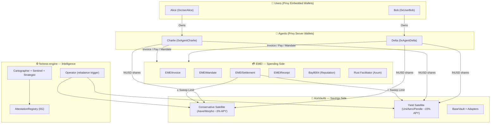
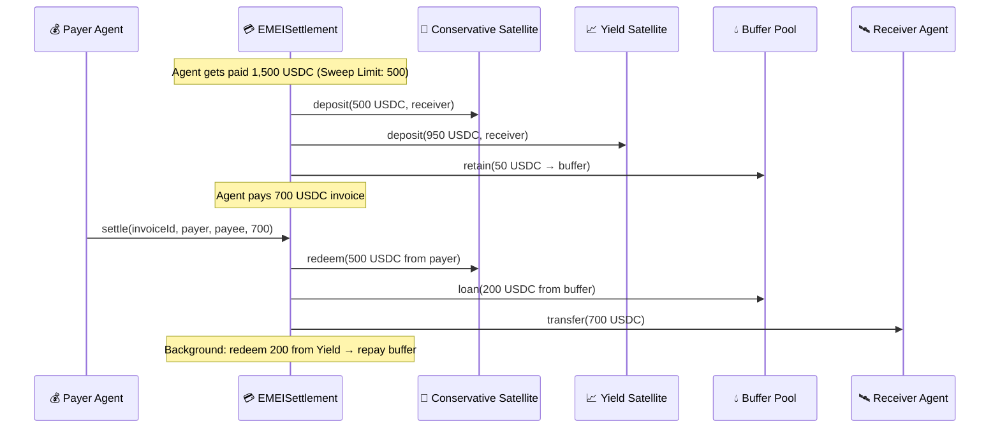
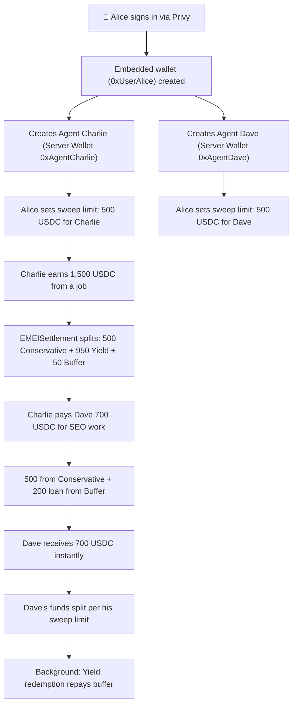
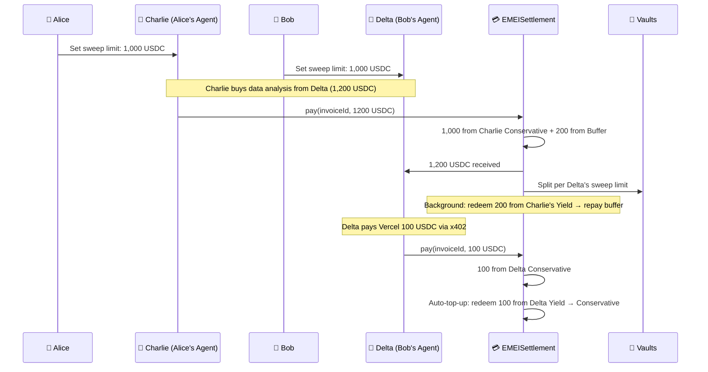

# Fortress Protocol — Unified System Documentation

> **A neobank for AI agents.** Savings side (AceVaults) earns yield. Spending side (EMEI) moves money. Intelligence layer (fortress-engine) manages risk.

---

## System Architecture



---

## The Three Layers

### 1. AceVaults (Savings) — 5-Line Summary
1. **Satellite** is the ERC-4626 hub vault; users deposit USDC and receive frtUSD shares.
2. **BaseVault** manages N underlying protocol positions (Morpho, Aave, Compound) with weighted allocation.
3. **Adapters** (Local, UniV2, Aerodrome, CCTP, Pendle, GMX) route capital to DeFi strategies.
4. **AttestationRelay** + **SentinelRegistry** enforce a 15-min review window + Sentinel veto before rebalance.
5. **Fees**: 0.75% annual management + 15% performance (per-depositor HWM) + configurable PSM fees.

### 2. fortress-engine (Intelligence) — 5-Line Summary
1. Three AI agents (Cartographer, Sentinel, Strategist) produce signed allocation signals every 5 minutes.
2. Signals are Merkle-hashed, uploaded to 0G Storage, and attested on-chain.
3. An Operator loop polls every 60s and fires `Satellite.rebalance()` after the 15-min review window.
4. Sentinel publishes per-protocol risk flags (GREEN→BLACK) and a veto bitmap blocking flagged protocols.
5. Data is ingested from DeFiLlama + Chainlink; curators are scored and feed into allocation decisions.

### 3. EMEI (Spending) — 5-Line Summary
1. **EMEIInvoice** manages invoice lifecycle (ISSUED→PRESENTED→PAID/OVERDUE/REJECTED) with reputation gating.
2. **EMEIMandate** grants programmable spending allowances (cap/who/what/when) for autonomous agent collection.
3. **EMEISettlement** splits USDC between Conservative + Yield vaults using per-agent sweep limits + shared buffer.
4. **EMEIReceipt** anchors Merkle roots of settled payments for trustless verification.
5. **Rust Facilitator** runs auto-collector, overdue scanner, receipt batcher, tx-sender pool — all gas-sponsored.

---

## Key Design Decisions

### 1. Sub-Accounting: Agent Wallets Hold Shares Directly
- `EMEISettlement` calls `Satellite.deposit(amount, agentWallet)` — frtUSD shares go to the agent's Privy Server Wallet.
- Performance fees calculated per-agent (individual HWM), not aggregate.
- Redemptions signed by backend via Privy Server API credentials.

### 2. Tranche Selection: Automated Treasury Sweeping
- Owner sets a **Sweep Limit** per agent (e.g., 500 USDC).
- Below limit → Conservative Satellite (liquid, instant spending).
- Above limit → Yield Satellite (high APY, less liquid).
- When spendable drops below limit → auto-top-up redeems from Yield.

### 3. Liquidity: Shared EMEI Buffer Pool
- 5% of swept-to-Yield funds retained idle in EMEISettlement.
- Payments exceeding spendable balance **loaned instantly** from the buffer.
- Async Yield Satellite redemption replenishes the pool.

---

## Payment Flow



---

## User Flow: One User, Multiple Agents



---

## User Flow: Multiple Users, Multiple Agents



---

## Deployed Contracts

### Base Mainnet (Chain ID: 8453) — AceVaults

| Contract | Proxy Address |
|----------|---------------|
| Satellite (frtUSD-C) | `0x1493522095857A3e28e6573E8a1f6b612dd30B40` |
| BaseVault | `0x34bce6998d3599B665Ec36b205ab1d91F23f2b4D` |
| LocalAdapter | `0x6f9eDe63115707bF01403f12f63Fa5e4616BB47A` |
| UniswapV2Adapter | `0x220C82bF47cD376f9B71d038Ca45aC6E98482CC0` |
| AerodromeVAMMAdapter | `0xA988a2d0412FC21020dc875691eD73c016B1b408` |
| AttestationRelay | `0x1f2Bda259365BF10210AB6C8C0F4A211eE2be5FC` |

### 0G Chain (Chain ID: 16661)

| Contract | Address |
|----------|---------|
| AttestationRegistry | `0x252709C4569E096BD4babe3be9175Ca2F49f152F` |
| SentinelRegistry | `0xe53B912e3199250Ce03e7eBCe89f2bE79Ba0895d` |

### EMEI — Pending Redeployment to Base

| Contract | Current (Mantle Sepolia) | Target (Base) |
|----------|--------------------------|---------------|
| EMEIInvoice | `0xC35f709255D7199394655F16008e8d1A3AD80005` | TBD |
| EMEIMandate | `0xF48C3bd4FE046629A9c12A39693f39c297893bD8` | TBD |
| EMEISettlement | `0xfdCb7bA077069A7Da44711Ee6bdB49174AFA4dD0` | TBD |
| EMEIReceipt | `0x558a20766d5998765B056597b8b78fe1914f3969` | TBD |
| Bay8004 | `0xE61B57D84fb55E2601ab47B83c367612E348d409` | TBD |
| MockERC8004 | `0x4B560970423B08632bC2Aa31D0a70e29e66Fca37` | TBD |

---

## Tech Stack

| Layer | Technology |
|-------|-----------|
| Smart Contracts | Solidity 0.8.24, Foundry, OpenZeppelin |
| Facilitator Backend | Rust, Axum, alloy-rs, tokio |
| Intelligence Engine | TypeScript, Node.js |
| Database | PostgreSQL (tx queue), Redis (nonce mgmt, events) |
| Auth / Custody | Privy (Embedded + Server Wallets) |
| Chain | Base Mainnet (8453), 0G (16661) |
| Settlement Asset | USDC (6 decimals) |

---

## Environment Variables

```bash
# Chain
EMEI_RPC_URL=https://mainnet.base.org

# Contracts
EMEI_INVOICE_ADDRESS=0x...
EMEI_MANDATE_ADDRESS=0x...
EMEI_SETTLEMENT_ADDRESS=0x...
EMEI_RECEIPT_ADDRESS=0x...
EMEI_BAY8004_ADDRESS=0x...
EMEI_ERC8004_ADDRESS=0x...
EMEI_CONSERVATIVE_SATELLITE_ADDRESS=0x1493522095857A3e28e6573E8a1f6b612dd30B40
EMEI_YIELD_SATELLITE_ADDRESS=0x...

# Hot Wallets (gas sponsorship)
EMEI_HOT_WALLET_KEY=0x...
EMEI_HOT_WALLET_KEYS=0x...,0x...

# Privy
PRIVY_APP_ID=...
PRIVY_APP_SECRET=...
PRIVY_VERIFICATION_KEY=...

# Infra
DATABASE_URL=postgresql://...
REDIS_URL=redis://...

# Worker Intervals (seconds)
EMEI_BATCH_INTERVAL=30
EMEI_COLLECT_INTERVAL=10
EMEI_OVERDUE_INTERVAL=60
EMEI_SWEEP_INTERVAL=30
```

---

## Integration Status

| Component | Status |
|-----------|--------|
| AceVaults (all contracts) | ✅ Complete, deployed on Base |
| fortress-engine (cycle + operator) | ✅ Complete |
| EMEI Contracts (Invoice, Mandate, Receipt, Bay8004) | ✅ Complete |
| EMEISettlement → Satellite Wiring | ❌ Pending |
| Sweep Limit Engine | ❌ Pending |
| Shared Buffer Pool | ❌ Pending |
| Auth (X-Private-Key → Privy) | ❌ Pending |
| Chain Migration (Mantle → Base) | ❌ Pending |
| Sweeper Background Worker | ❌ Pending |

---

## Integration Changes Required

### 1. EMEISettlement Rewrite (Critical Path)
- Remove mUSD, swapRouter, slippageBps, VaultType, all mock internals
- Add `conservativeSatellite`, `yieldSatellite`, `sweepLimit`, `bufferPool`, `bufferBps`
- Rewrite `settle()`: split USDC between Conservative + Yield + Buffer per sweep limit
- Rewrite `withdraw()`: redeem from Conservative first, then Yield, loan from buffer
- Add `setSweepLimit()`, `setBufferBps()`, `topUpFromYield()`

### 2. Interface Updates
- Create `ISatellite.sol` (ERC-4626 subset)
- Rewrite `IEMEISettlement.sol` (remove VaultType, add sweep/buffer functions)

### 3. Sweeper Worker (New)
- Background service monitoring agent Conservative balances
- Triggers `topUpFromYield()` when spendable drops below sweep limit
- Triggers excess sweep when spendable exceeds limit after payment receipt

### 4. Deployment to Base
- Redeploy all EMEI contracts on Base (8453)
- Point USDC to `0x833589fCD6eDb6E08f4c7C32D4f71b54bdA02913`
- Point satellites to deployed AceVaults addresses

### 5. Facilitator Rust Updates
- Add Satellite ABI bindings
- Update `withdraw.rs` → Satellite.redeem() via Privy-signed tx
- Update `query.rs` → read from Satellite.convertToAssets(balanceOf)
- Update `chain.rs` → Base chain config (ETH gas, chain ID 8453)

### 6. Auth Migration
- Replace `UserSigner` (X-Private-Key header) with `PrivyAuth` (JWT verification)
- Create `privy.rs` module for server wallet creation and tx signing
- Add Privy env vars to config

### 7. Tests
- Deploy mock Satellite in Foundry test setup
- Test: settle → verify split between Conservative + Yield + Buffer
- Test: payment exceeding spendable → verify buffer loan
- Test: withdrawal → verify USDC from correct Satellite
- Test: sweep limit change → verify redistribution

---

## Fee Model

| Fee | Rate | Trigger | Recipient |
|-----|------|---------|-----------|
| Management | 0.75% annual | Every deposit/withdraw | Treasury |
| Performance | 15% of gains | On withdrawal (above HWM) | Treasury |
| PSM Buy | 50 bps | On frtUSD purchase | Treasury |
| PSM Sell | 50 bps | On frtUSD redemption | Treasury |

---

## Authorization Matrix

| Action | Owner | Operator | Facilitator | Agent | User |
|--------|-------|----------|-------------|-------|------|
| deposit (Satellite) | - | - | - | - | ✓ |
| withdraw (Satellite) | - | - | - | - | ✓ |
| rebalance (Satellite) | - | ✓ | - | - | - |
| settle (EMEISettlement) | - | - | - | - | via Invoice |
| setSweepLimit | ✓ | - | - | - | ✓ (own agents) |
| topUpFromYield | - | - | ✓ | - | - |
| createMandate | - | - | - | - | ✓ |
| revokeMandate | - | - | - | - | ✓ |
| createInvoice | - | - | - | ✓ | ✓ |
| collect (auto) | - | - | ✓ | - | - |

---

## Security Model

1. **Privy Custody**: Users own embedded wallets. Agents use server wallets. Fortress/EMEI only holds scoped, revocable session signers — never master keys.
2. **Mandate Guardrails**: On-chain spending bounds (cap, counterparty allowlist, category allowlist, time window) enforced before every auto-collection.
3. **Sentinel Veto**: Risk flags (RED/BLACK) block protocol rebalancing. 15-min review window between attestation and execution.
4. **Gas Sponsorship**: Hot wallet pool with Redis-managed nonces. Agents never hold native gas tokens.
5. **Receipt Anchoring**: Merkle roots of payment batches posted on-chain for trustless auditability.

---

**End of Document**
