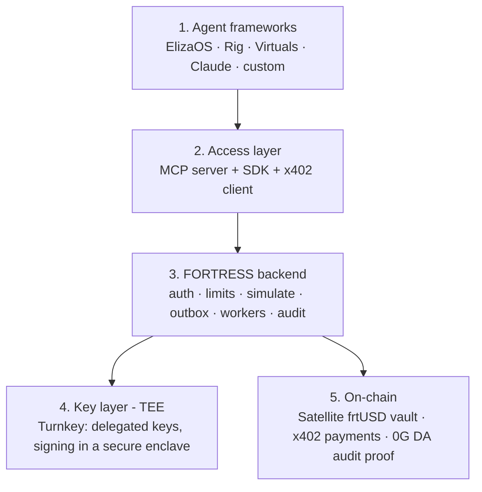
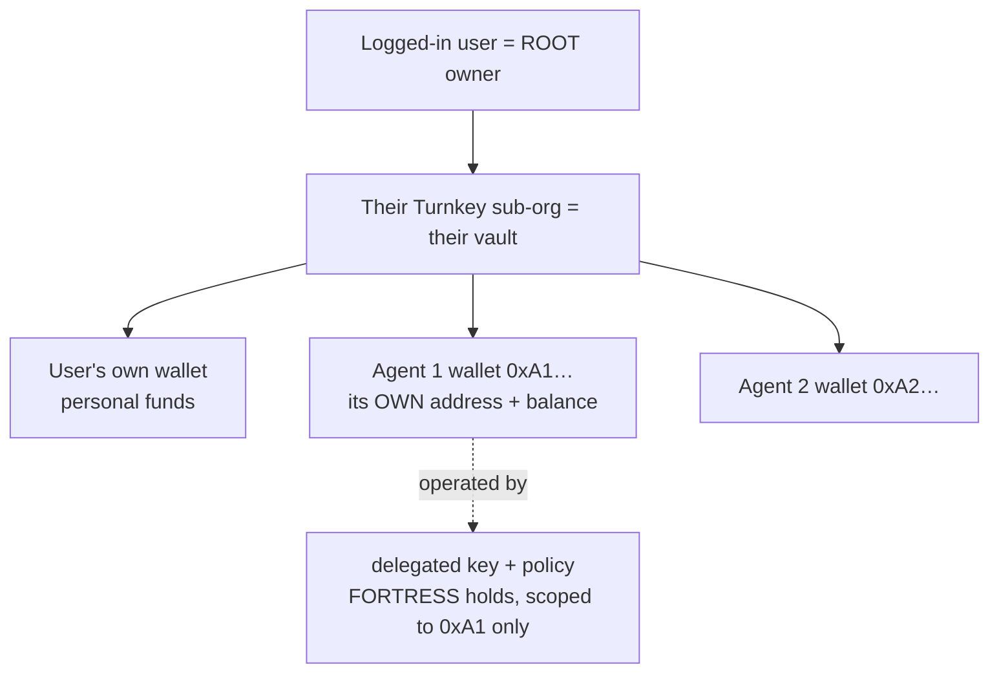
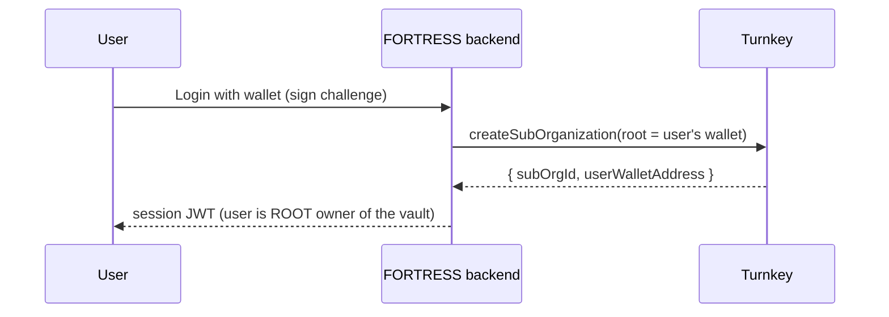
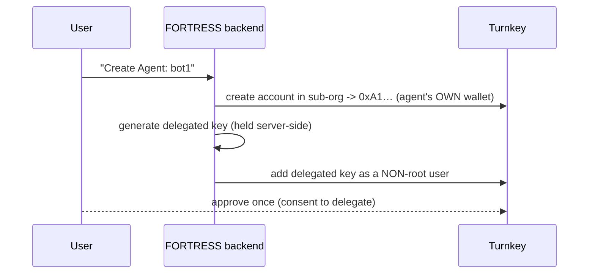
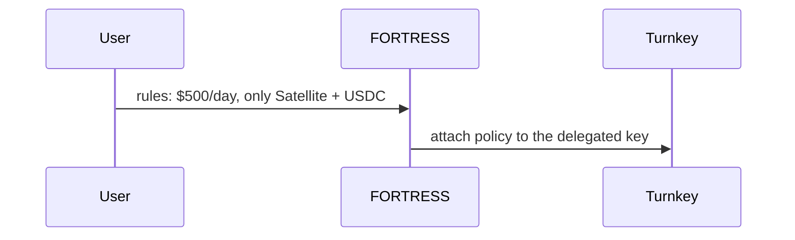
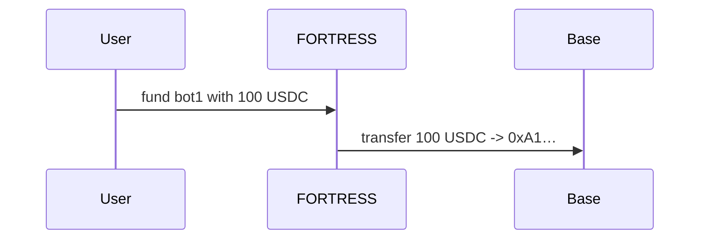
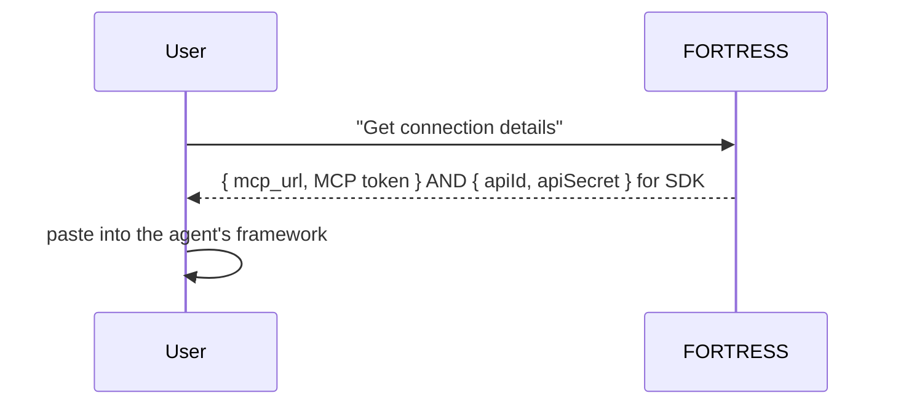
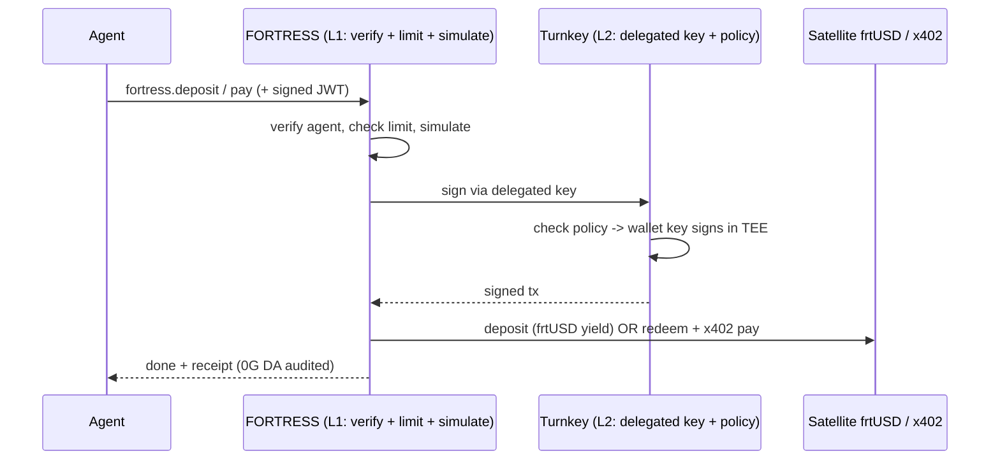

# FORTRESS — Treasury Infrastructure for AI Agents

FORTRESS gives any AI agent a **yield-bearing treasury + safe payments**, the way a bank gives a
business an account + a debit card. Agents earn and spend all day; FORTRESS makes their idle money
**earn yield**, lets them **pay safely under limits**, and **never lets them hold private keys**.

> This is the complete, point-wise overview. Deeper docs:
> - **Backend internals** → [`BACKEND_DESIGN.md`](./BACKEND_DESIGN.md)
> - **Integration flows with examples** → [`INTEGRATION_GUIDE.md`](./INTEGRATION_GUIDE.md)
> - **Platform usage** → [`AGENT_PLATFORMS_ARCHITECTURE.md`](./AGENT_PLATFORMS_ARCHITECTURE.md)
> - **User flows** → [`USER_FLOWS.md`](./USER_FLOWS.md)

---

## 1. The problem (why FORTRESS exists)

- AI agents drive a large and growing share of on-chain activity.
- They **earn** (fees, jobs) and **spend** (compute, data, other agents) constantly.
- Between actions, their money **sits idle** — earning nothing.
- They have **no treasury built for them**: no safe wallet, no spend limits, no audit.
- **FORTRESS fills that gap.**

---

## 2. The architecture in simple words (5 layers)



- **Layer 1 — Agent frameworks:** where the agent's "brain" lives (any framework).
- **Layer 2 — Access:** how an agent reaches FORTRESS — an **MCP server**, an **SDK**, and an
  **x402 client** for payments.
- **Layer 3 — FORTRESS backend:** authenticates the agent, checks limits, simulates the tx, queues
  it (outbox), broadcasts it, writes an audit log.
- **Layer 4 — Key layer (TEE):** **Turnkey** holds wallet keys in a secure enclave and signs; keys
  **never leave**. FORTRESS uses a **delegated key** (limited by policy) to sign for the agent.
- **Layer 5 — On-chain:** the **Satellite** vault (frtUSD) earns yield, **x402** moves payments,
  **0G DA** proves every position.

### The two safety rules (memorize these)
1. **Delegated wallet:** the **user owns** the wallet; FORTRESS holds only a **policy-limited
   delegated key** so the agent acts 24/7, and the user can **revoke anytime**. The agent never holds
   a key.
2. **Two auth layers:**
   - **L1 (Agent → FORTRESS):** API key + short-lived **signed JWT** → "is this a legit agent?"
   - **L2 (FORTRESS → Turnkey):** delegated key + policy → "can the wallet actually sign this?"
   - A stolen L1 credential can't reach the keys (L2/TEE) or exceed the policy.

---

## 3. Who owns what (the account model)



- **Each agent gets its OWN wallet** (address) inside the user's vault — own balance, own limits.
- **The user funds the agent wallet** (or the agent's earnings land there). The agent spends **only
  from its own balance** — it does **not** touch the user's personal/embedded wallet.
- **Root vs delegate:**
  - **Root = the logged-in user.** Can create/delete agents, set policies, fund/defund, **revoke**,
    withdraw everything. Full control.
  - **Delegate = the agent's key.** Can only do the policy-allowed ops (e.g., deposit/pay on
    Satellite + USDC, daily cap, its own wallet). A narrow, revocable subset.
- **Two key types:**
  - **Session key** — the human's dashboard login (short-lived, broad while logged in).
  - **Delegated key** — the agent's headless key (long-lived, scoped to its own wallet only).

---

## 4. Core concepts (one line each)

- **frtUSD** — a yield-bearing dollar (ERC-4626). Put USDC in, get frtUSD that grows.
- **Satellite** — the on-chain vault that mints frtUSD and farms yield (Aerodrome, Morpho, Uniswap).
  Only does yield; knows nothing about agents.
- **Turnkey sub-org** — a private vault per user; the **user's login is root owner**.
- **Delegated key** — a scoped, revocable key FORTRESS holds so an agent signs within limits.
- **MCP** — the "USB-C for AI": one connector any agent host plugs into.
- **x402** — pay over HTTP with stablecoins (the agent's payment rail).
- **Sentinel** — a pre-flight risk/threat check before any action.
- **0G DA** — tamper-proof on-chain audit proof.
- **Envelope (v2)** — on-chain-enforced spend policy (trustless hardening of limits).

---

## 5. How things get created (the 5 setup flows)

### Flow 1 — Register (user + vault)


### Flow 2 — Create an agent (its own delegated wallet)


### Flow 3 — Set the policy (limits)


### Flow 4 — Fund the agent wallet


### Flow 5 — Issue credential + connect


---

## 6. How ANY agent uses FORTRESS (the universal runtime)

After setup, **every platform does the same thing** when the agent acts:



Only the **connect step** differs per platform (sections 7–10). The runtime above is identical.

---

## 7. ElizaOS — how it works + 3 flows

**How it works:** a *Character* + the **AgentRuntime**; capabilities are **plugins** (Actions,
Providers, Evaluators, Services) + vector Memory; loops perceive → decide → act → learn.

**Flow 1 — Connect**
- **MCP (config only):**
  ```json
  { "plugins": ["@elizaos/plugin-mcp"],
    "settings": { "mcp": { "servers": {
      "fortress": { "url": "https://mcp.fortress.exchange",
                    "headers": { "Authorization": "Bearer <MCP token>" } } } } } }
  ```
- **SDK:** add `@fortress/plugin` with `apiId/apiSecret`; registers `deposit/pay/balance` as Actions.

**Flow 2 — Deposit:** LLM calls `fortress.deposit {5}` → universal runtime (§6) → frtUSD minted.

**Flow 3 — Pay:** LLM calls `fortress.pay {url, 2}` → limit + Sentinel → JIT redeem → x402 settle.

---

## 8. Rig — how it works + 3 flows

**How it works:** a Rust library; an **Agent** = model + context + **Tools** + optional RAG.

**Flow 1 — Connect**
- **MCP (native `rig-mcp`):**
  ```rust
  let fortress = rig_mcp::from_server("https://mcp.fortress.exchange", "<MCP token>").await?;
  let agent = client.agent("gpt-…").tools(fortress).build();
  ```
- **SDK:** `let fx = fortress_rs::Client::new(api_id, api_secret);` exposed as a Rig `Tool`.

**Flow 2 — Deposit:** `fortress.deposit {5}` → universal runtime (§6) → frtUSD minted.

**Flow 3 — Pay:** `fortress.pay {to|url, 2}` → JIT redeem → TEE signs → settle.

---

## 9. Virtuals — how it works + 3 flows

**How it works:** a launchpad that tokenizes agents; **GAME** (HLP brain plans, Workers run
Functions); **ACP** = agent-to-agent commerce (request → negotiate → transaction → evaluation),
settled in x402.

**Flow 1 — Connect**
- **MCP:** wrap a FORTRESS call in a GAME Function:
  ```python
  def fortress_pay(url, amount): return mcp_call("fortress","fortress.pay",{"url":url,"amount":amount})
  ```
- **SDK:** `fx = Fortress(api_id, api_secret)` used inside a Worker Function.

**Flow 2 — Deposit:** a Worker calls `fortress.deposit {5}` → universal runtime (§6).

**Flow 3 — Pay (+ ACP):** Worker pays via `fortress.pay`; FORTRESS can also sit **behind the ACP
transaction phase** as the treasury + x402 settlement + audit layer.

---

## 10. Claude / any MCP host — how it works + 3 flows

**How it works:** any MCP host (Claude Desktop, Cursor, OpenAI Responses API) plugs into the
FORTRESS MCP server and gains the tools.

**Flow 1 — Connect**
- **MCP (stdio):**
  ```json
  { "mcpServers": { "fortress": {
      "command": "fortress", "args": ["mcp"], "transport": "stdio",
      "env": { "FORTRESS_MCP_TOKEN": "<MCP token>" } } } }
  ```
- **Remote/SDK:** OpenAI Responses API attaches the FORTRESS MCP server over HTTP with the token.

**Flow 2 — Deposit (stdio trace)**
```
Claude: "Park 5 USDC"
 -> stdin:  { "tool": "fortress_deposit", "params": { "amount": "5000000" } }
 -> FORTRESS: verify -> limit -> simulate -> Turnkey delegated key signs in TEE -> broadcast
 -> stdout: { "txHash": "0x…", "status": "confirmed", "frtUSD": "5.00" }
```

**Flow 3 — Pay (stdio trace)**
```
Claude: "Pay 2 USDC for this report"
 -> stdin:  { "tool": "fortress_pay", "params": { "url": "https://dataapi.com/report", "amount": "2000000" } }
 -> FORTRESS: JIT redeem 2 frtUSD->USDC -> 402 -> Turnkey signs EIP-3009 -> facilitator settles
 -> stdout: { "status": "paid", "resource": "<report>" }
```

---

## 11. The deposit flow (point-wise)

1. Agent calls `fortress.deposit { amount }`.
2. FORTRESS verifies the agent (L1) + checks its **daily limit + allowlist**.
3. Builds `approve + Satellite.deposit`, **simulates** (rejects if it would fail).
4. Reserves a nonce, writes to the **outbox** (`queued`).
5. A worker asks **Turnkey** to sign with the **delegated key** (policy checked; key signs in TEE).
6. Broadcasts to Base → Satellite mints **frtUSD** → now earning yield.
7. Confirms → finalizes → writes **audit log** + **0G DA proof**.

---

## 12. The pay flow (x402, point-wise)

1. Agent calls `fortress.pay { url | to, amount }`.
2. FORTRESS verifies agent + limit (L1) and runs **Sentinel**.
3. **JIT recall:** redeems just-enough **frtUSD → USDC** (Turnkey signs in TEE).
4. Calls the seller URL → gets a **402** rulebook.
5. Turnkey signs a **gasless** EIP-3009 payment authorization.
6. Resends with payment → seller's **x402 facilitator** settles on-chain.
7. Seller returns the resource; FORTRESS audits it; the rest keeps earning.

> x402 works with x402-enabled sellers. For card-only APIs (e.g., OpenAI), FORTRESS fronts the API
> and charges the agent's balance.

---

## 13. Security (point-wise)

- **Keys never leave the TEE** (Turnkey) — not the agent, not FORTRESS, holds the wallet key.
- **Delegated key + policy** — agent can only do allowed ops (specific contracts, daily caps).
- **User is root** — owns the vault, can **revoke** any agent instantly.
- **Two auth layers** — a stolen L1 credential can't reach keys (L2) or exceed policy.
- **Signed JWTs** — short-lived, so captured requests can't be replayed.
- **Pre-flight simulation** — bad transactions caught before signing.
- **Immutable audit + 0G DA** — every action provable and tamper-proof.
- **v2 Envelope** — moves limits on-chain for trustless enforcement.

---

## 14. Build your own agent (no framework)

1. **Register** on the dashboard (wallet login) → get a vault.
2. **Create an agent** → get the agent address + `apiId/apiSecret`.
3. **Call FORTRESS** via **MCP** (point any MCP client at `mcp.fortress.exchange`) or **SDK/REST**:
   ```
   POST https://api.fortress.exchange/agents/{id}/deposit
   Authorization: <signed JWT>      { "amount": "5000000" }
   ```
- You bring the brain (any LLM); FORTRESS brings the treasury + payments. No keys, no chain code.

---

## 15. The whole thing in one paragraph

> FORTRESS is a treasury for AI agents. A developer logs in with their wallet (Turnkey makes a vault
> they own as root), creates an agent (its **own wallet** + a **delegated key** limited by policy and
> revocable, plus an `apiId/apiSecret`), funds it, and plugs the credential into ElizaOS / Rig /
> Virtuals / Claude / a custom agent — via **MCP** in most cases. At runtime the agent calls
> `fortress.deposit` or `fortress.pay`; FORTRESS verifies the agent (L1), Turnkey's delegated key
> signs inside the **TEE** within policy (L2), and the money parks as yield-bearing **frtUSD** or
> settles via **x402** — simulated first, proven on **0G DA**. **One backend, many doors — the agent
> never holds a key, and the user stays in control.**

---

## 16. Doc index

| Doc | What's in it |
|-----|--------------|
| [`BACKEND_DESIGN.md`](./BACKEND_DESIGN.md) | Full backend internals: outbox, workers, nonces, schema, properties |
| [`INTEGRATION_GUIDE.md`](./INTEGRATION_GUIDE.md) | End-to-end integration flows with concrete examples |
| [`AGENT_PLATFORMS_ARCHITECTURE.md`](./AGENT_PLATFORMS_ARCHITECTURE.md) | How each platform works + uses FORTRESS |
| [`PLATFORM_INTEGRATIONS.md`](./PLATFORM_INTEGRATIONS.md) | Per-platform MCP wiring |
| [`USER_FLOWS.md`](./USER_FLOWS.md) | Dashboard onboarding, Turnkey, x402 phases |
| [`AGENT_RAILS_AND_MCP.md`](./AGENT_RAILS_AND_MCP.md) | The rails + MCP + Envelope (v2) design |
