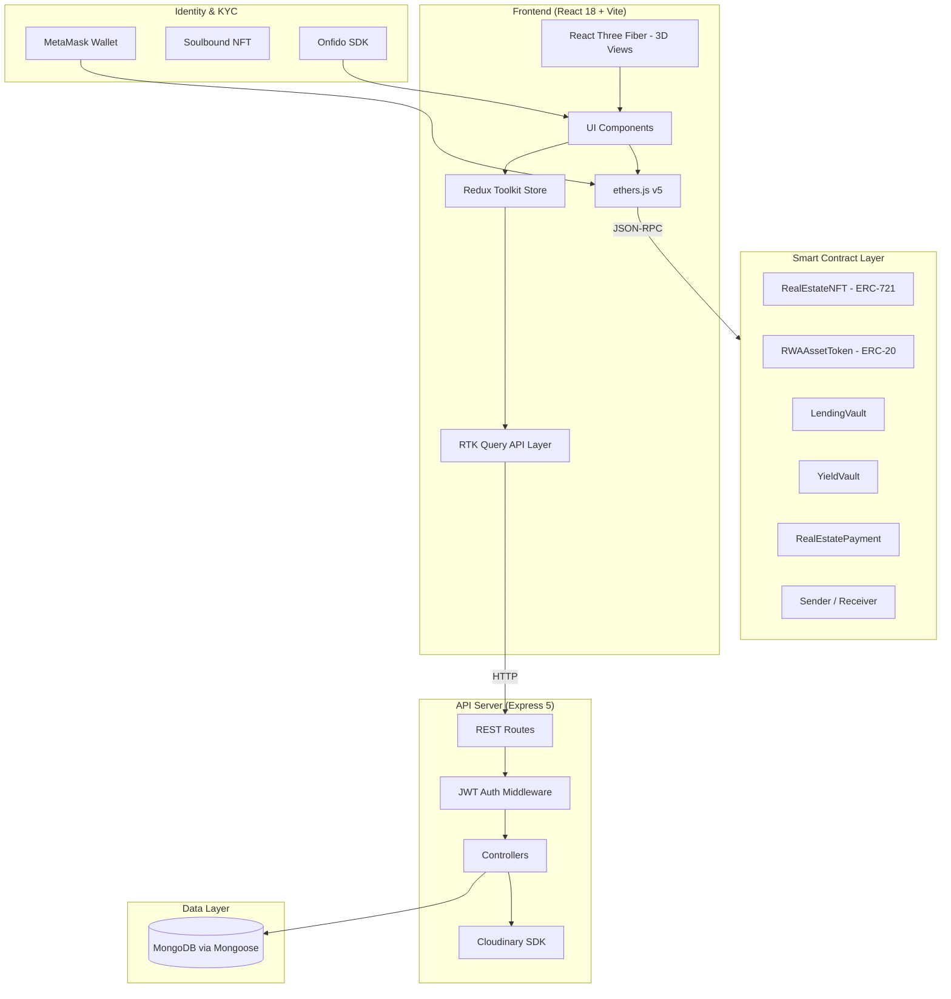
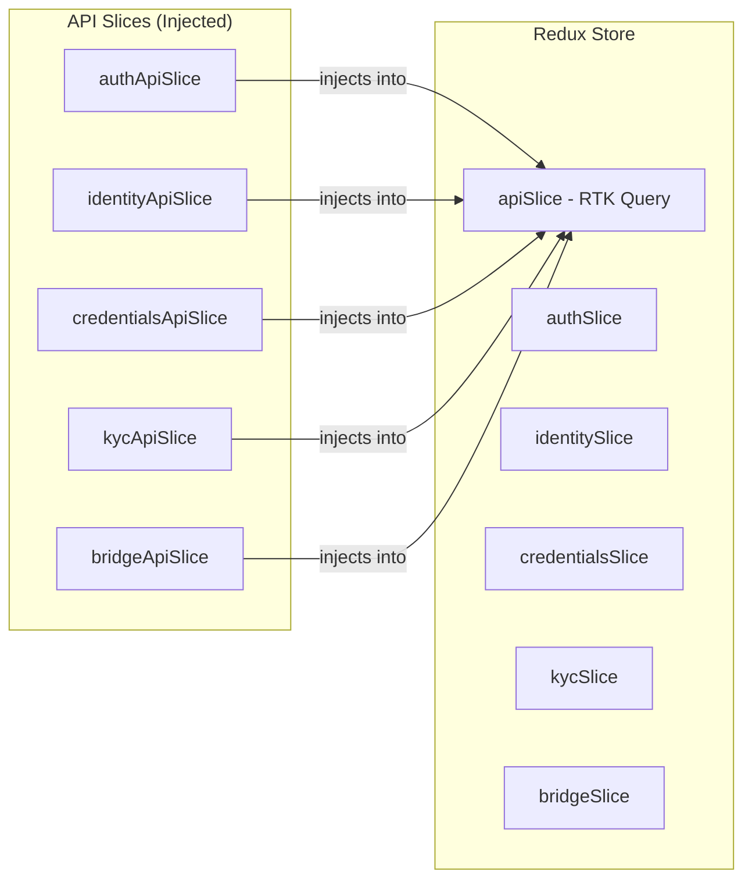
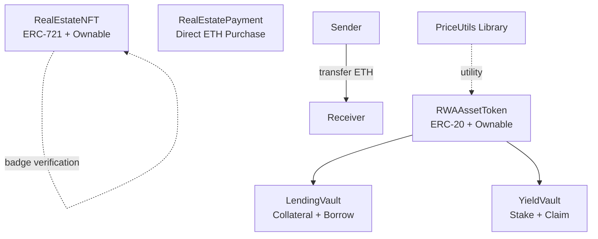
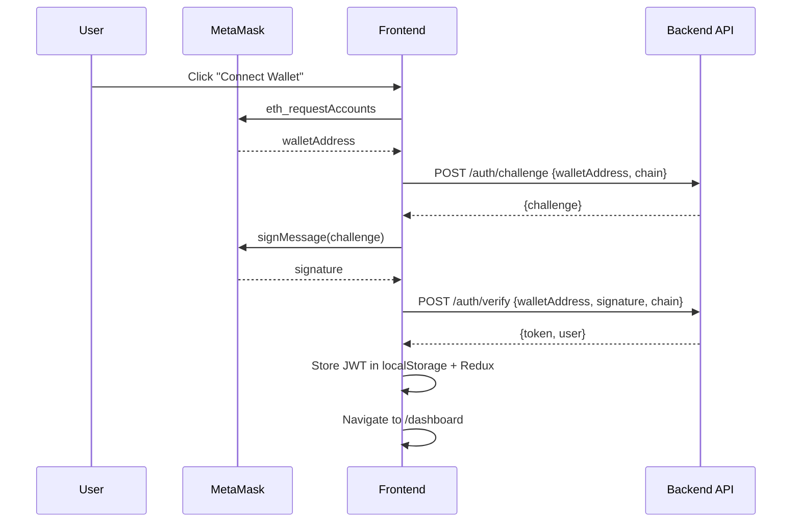
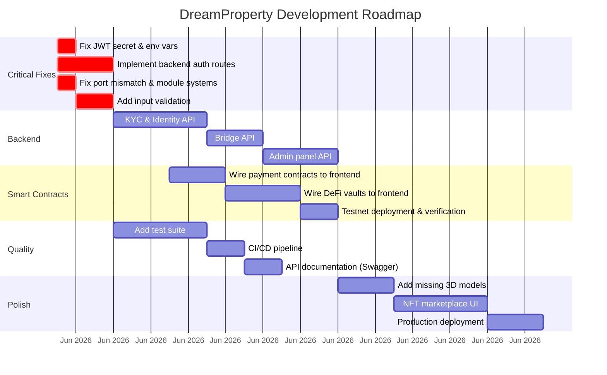

<p align="center">
  
</p>

<h1 align="center">🏠 DreamProperty</h1>

<p align="center">
  <strong>Tokenized Real Estate Investment Platform — Powered by Blockchain, Web3 & DeFi</strong>
</p>

<p align="center">
  
  
  
  
  
  
</p>

---

## Table of Contents

- [Overview](#overview)
- [Architecture](#architecture)
- [Tech Stack](#tech-stack)
- [Project Structure](#project-structure)
- [Smart Contracts](#smart-contracts)
- [Frontend Application](#frontend-application)
- [Backend API](#backend-api)
- [Authentication Flow](#authentication-flow)
- [Deployment](#deployment)
- [Getting Started](#getting-started)
- [Environment Variables](#environment-variables)
- [Gap Analysis & Known Issues](#-gap-analysis--known-issues)
- [Roadmap](#roadmap)
- [Contributing](#contributing)
- [License](#license)

---

## Overview

**DreamProperty** is a Web3-native real estate investment platform that enables fractional property ownership through NFT tokenization. Users can browse properties, invest with as little as $10, and earn passive rental income — all powered by smart contracts on Ethereum/Polygon.

Key capabilities:
- **Fractional Ownership** — Properties tokenized as ERC-721 NFTs with RWA (Real World Asset) ERC-20 backing
- **3D Property Visualization** — Interactive Three.js/React Three Fiber property walkthroughs
- **DeFi Primitives** — Lending vaults, yield farming, and cross-chain token bridging
- **KYC/Identity** — Onfido-powered identity verification with Soulbound NFT credentials
- **Multi-Chain** — RPC configs for 16+ EVM chains (Ethereum, Polygon, BSC, Arbitrum, Avalanche, etc.)
- **PWA Support** — Service worker with stale-while-revalidate caching strategy

---

## Architecture

### System Architecture



### Frontend State Architecture



### Smart Contract Relationships



---

## Tech Stack

| Layer | Technology | Version |
|-------|-----------|---------|
| **Frontend Framework** | React | 18.3.1 |
| **Build Tool** | Vite | 5.4.2 |
| **Styling** | TailwindCSS | 3.4.1 |
| **State Management** | Redux Toolkit + RTK Query | 2.8.2 |
| **Atomic State** | Jotai | 2.4.2 |
| **3D Rendering** | Three.js + React Three Fiber | 0.153.0 / 8.13.3 |
| **Animations** | Framer Motion | 12.4.10 |
| **Routing** | React Router DOM | 7.3.0 |
| **Blockchain** | ethers.js | 5.8.0 |
| **Backend** | Express.js | 5.1.0 |
| **Database** | MongoDB (Mongoose) | 8.14.3 |
| **Image Storage** | Cloudinary | 2.6.1 |
| **Auth** | JWT (jsonwebtoken) | 9.0.2 |
| **KYC** | Onfido SDK | CDN-loaded |
| **Smart Contracts** | Solidity | 0.8.20 |
| **Contract Tooling** | Hardhat | (devDep) |
| **Containerization** | Docker (nginx) | Node 18 + Alpine |

---

## Project Structure

```
dreamproperty/
├── api/                          # Express.js Backend
│   ├── index.js                  # Server entry — port 8080
│   ├── config/
│   │   ├── constant.js           # 16 EVM chain RPC endpoints
│   │   ├── getContract.js        # Chain-specific contract callers
│   │   ├── GlobalStateContract.js
│   │   ├── web3Config_AGNG.js    # Peaq Agung testnet config
│   │   └── web3Config_SEPOLIA.js # Sepolia testnet config
│   ├── controllers/
│   │   ├── property.controller.js # CRUD + Cloudinary upload
│   │   └── user.controller.js     # User CRUD
│   ├── middleware/
│   │   ├── auth.js               # JWT verification + chain callers
│   │   └── checkObjectId.js      # MongoDB ObjectId validator
│   ├── mongodb/
│   │   ├── connect.js            # Mongoose connection
│   │   └── models/
│   │       ├── property.js       # Property schema
│   │       └── user.js           # User schema
│   └── routes/
│       ├── property.routes.js    # GET/POST/PATCH/DELETE
│       └── user.routes.js        # GET/POST
│
├── contracts/                    # Solidity Smart Contracts
│   ├── RealEstateNFT.sol         # ERC-721 building badge NFT
│   ├── RWAAssetToken.sol         # ERC-20 RWA token
│   ├── LendingVault.sol          # Collateralized lending
│   ├── YieldVault.sol            # Staking + yield distribution
│   ├── RealEstatePayment.sol     # Direct ETH property purchase
│   ├── Receiver.sol              # ETH receiver contract
│   ├── sender.sol                # ETH sender contract
│   └── utils/
│       └── PriceUtils.sol        # Token price calculation library
│
├── scripts/                      # Hardhat deployment scripts
│   ├── deploy.js                 # Full deployment pipeline
│   ├── deployReceiver.js         # Receiver-only deployment
│   └── sendEther.js              # ETH transfer test script
│
├── src/                          # React Frontend
│   ├── main.jsx                  # App entry point
│   ├── App.jsx                   # Router + Provider setup
│   ├── ThemeSwitcher.jsx         # Dark/light mode toggle
│   ├── app/
│   │   ├── store.js              # Redux store configuration
│   │   └── api.js                # RTK Query base API slice
│   ├── components/
│   │   ├── CustomCursor.jsx      # Animated cursor effect
│   │   ├── WalletConnect.jsx     # MetaMask wallet integration
│   │   ├── auth/
│   │   │   └── RequireAuth.jsx   # Protected route guard
│   │   ├── layout/
│   │   │   ├── AppLayout.jsx     # Dashboard layout shell
│   │   │   ├── Footer.jsx
│   │   │   ├── Navbar.jsx        # Main navigation bar
│   │   │   └── ProfileNavbar.jsx # Dashboard navigation
│   │   └── property/
│   │       ├── Experience.jsx    # 3D scene orchestrator
│   │       ├── Overlay.jsx       # 3D UI overlay
│   │       └── Scene.jsx         # GLB model renderer
│   ├── consts/
│   │   └── ProfileSidebarMenu.jsx
│   ├── features/
│   │   ├── auth/                 # Auth state + API
│   │   ├── bridge/               # Cross-chain bridge state + API
│   │   ├── credentials/          # Verifiable credentials state + API
│   │   ├── identity/             # DID identity state + API
│   │   └── kyc/                  # KYC verification state + API
│   ├── hooks/
│   │   └── useTheme.js           # Theme class toggler
│   ├── pages/
│   │   ├── Home.jsx              # Landing page (617 lines)
│   │   ├── Properties.jsx        # Property listing
│   │   ├── PropertyDetail.jsx    # Single property view
│   │   ├── Property3D.jsx        # 3D property viewer
│   │   ├── About.jsx
│   │   ├── Blog.jsx / BlogPost.jsx
│   │   ├── FAQ.jsx
│   │   ├── Privacy.jsx
│   │   ├── NotFound.jsx
│   │   └── profile/              # Authenticated dashboard
│   │       ├── index.jsx         # Profile route config
│   │       ├── DashboardPage.jsx
│   │       ├── CreateIdentityPage.jsx
│   │       ├── CredentialPage.jsx
│   │       ├── CredentialDetailPage.jsx
│   │       ├── KycPage.jsx
│   │       ├── OnfidoVerificationPage.jsx
│   │       ├── BridgePage.jsx
│   │       └── WalletConnectPage.jsx
│   ├── services/
│   │   ├── contractService.js    # Blockchain contract interactions
│   │   └── onfidoService.js      # Onfido KYC SDK wrapper
│   └── styles/
│       ├── dark-theme.css
│       └── onfido.css
│
├── public/
│   ├── models/
│   │   └── house1.glb            # 3D house model (824KB)
│   ├── service-worker.js         # PWA service worker
│   └── manifest.json             # PWA manifest
│
├── Dockerfile                    # Multi-stage: node build → nginx serve
├── hardhat.config.js             # Solidity 0.8.20, localhost network
├── vite.config.js                # COEP/COOP headers for WASM
├── tailwind.config.js            # Custom color palette + Inter font
├── package.json
├── CODE_OF_CONDUCT.md
└── CONTRIBUTING.md
```

---

## Smart Contracts

### RealEstateNFT.sol (ERC-721)
Building verification badge system. Each property gets a soulbound-style badge NFT with verification status that **resets on transfer**.

| Function | Access | Description |
|----------|--------|-------------|
| `issueBadge()` | Owner | Mint NFT with building metadata |
| `verifyBuilding()` | Owner | Mark badge as verified |
| `revokeVerification()` | Owner | Revoke verification status |
| `getBuildingBadge()` | Public | Read badge details |
| `isVerified()` | Public | Check verification status |

### RWAAssetToken.sol (ERC-20)
Standard ERC-20 with initial supply minted to deployer. Serves as the base token for DeFi vaults.

### LendingVault.sol
Collateralized lending with 60% LTV ratio. Deposit RWA tokens as collateral → borrow against them.

### YieldVault.sol
Stake RWA tokens → admin distributes yield → users claim rewards.

### RealEstatePayment.sol
Simple one-shot ETH payment contract. Buyer sends exact property price, ETH transfers to builder.

### Sender.sol / Receiver.sol
ETH transfer pair for cross-contract payment forwarding.

---

## Frontend Application

### Route Map

| Path | Component | Auth Required |
|------|-----------|:---:|
| `/` | Home | ✗ |
| `/properties` | Properties | ✗ |
| `/properties/:id` | PropertyDetail | ✗ |
| `/property-3d` | Property3D | ✗ |
| `/about` | About | ✗ |
| `/faq` | FAQ | ✗ |
| `/blog` | Blog | ✗ |
| `/blog/:slug` | BlogPost | ✗ |
| `/privacy` | Privacy | ✗ |
| `/profile/` | DashboardPage | ✓ |
| `/profile/dashboard` | DashboardPage | ✓ |
| `/profile/identity/create` | CreateIdentityPage | ✓ |
| `/profile/credentials` | CredentialsPage | ✓ |
| `/profile/credentials/:hash` | CredentialDetailPage | ✓ |
| `/profile/kyc` | KycPage | ✓ |
| `/profile/kyc/verify` | OnfidoVerificationPage | ✓ |
| `/profile/bridge` | BridgePage | ✓ |

### Key Features
- **3D Property Viewer** — GLB model rendering with orbit controls, auto-rotation, and accumulative shadows
- **Custom Cursor** — Animated dual-ring cursor with hover state detection
- **Theme System** — Dark/light toggle with localStorage persistence
- **PWA** — Service worker + manifest for installable web app
- **Framer Motion** — Scroll-triggered animations throughout

---

## Backend API

### Endpoints

| Method | Path | Auth | Description |
|--------|------|:----:|-------------|
| `GET` | `/` | ✗ | Health check |
| `GET` | `/api/v1/properties` | ✗ | List properties (paginated, filterable) |
| `GET` | `/api/v1/properties/:id` | ✗ | Get property detail |
| `POST` | `/api/v1/properties` | ✗ | Create property (Cloudinary upload) |
| `PATCH` | `/api/v1/properties/:id` | ✗ | Update property |
| `DELETE` | `/api/v1/properties/:id` | ✗ | Delete property |
| `GET` | `/api/v1/users` | ✓ | List users |
| `POST` | `/api/v1/users` | ✓ | Create user |
| `GET` | `/api/v1/users/:id` | ✓ | Get user by ID |

### Database Models

**Property**: `title`, `description`, `propertyType`, `location`, `price`, `photo`, `creator` (ref → User)

**User**: `name`, `email`, `avatar`, `allProperties[]` (ref → Property)

---

## Authentication Flow



> **Note**: The auth API endpoints (`/auth/challenge`, `/auth/verify`) are defined in the frontend RTK Query slice but **do not have corresponding backend routes implemented**.

---

## Deployment

### Docker (Frontend Only)

```dockerfile
# Multi-stage build
FROM node:18 as builder    →  npm install + vite build
FROM nginx:mainline-alpine →  serve /dist on port 80
```

```bash
docker build -t dreamproperty .
docker run -p 80:80 dreamproperty
```

### Hardhat Contracts

```bash
npx hardhat compile
npx hardhat run scripts/deploy.js --network localhost
```

The deploy script deploys: `RealEstateNFT` → `Sender` → `RWAAssetToken` → `YieldVault` → `LendingVault`

---

## Getting Started

```bash
# Clone
git clone https://github.com/klasmalabs/property-mvp.git
cd property-mvp

# Install
npm install

# Frontend dev server (port 5173)
npm start

# Backend API server (port 8080)
npm run api

# Build for production
npm run build
```

---

## Environment Variables

```env
# Backend
MONGODB_URL=mongodb+srv://...
CLOUDINARY_CLOUD_NAME=
CLOUDINARY_API_KEY=
CLOUDINARY_API_SECRET=

# Frontend (prefix with VITE_)
VITE_API_URL=http://localhost:8000/api
VITE_CUSTOM_CURSOR_HIDE=true

# Hardhat
RECEIVER_ADDRESS=0x...
```

---

## ⚠ Gap Analysis & Known Issues

### 🔴 Critical — Security

| # | Issue | Location | Impact |
|---|-------|----------|--------|
| 1 | **Hardcoded JWT secret** `"hello"` | `api/middleware/auth.js:96` | Full auth bypass. Must use env var with 256-bit random secret |
| 2 | **Infura API key exposed** in source | `api/config/constant.js` | Key leaked in Git history. Must use env vars |
| 3 | **Contract addresses hardcoded** with trailing whitespace | `src/services/contractService.js:28` | Will cause transaction failures |
| 4 | **No .env file exists** | Project root | No secrets management at all |
| 5 | **Property routes unprotected** | `api/index.js:21` | Anyone can create/update/delete properties without auth |
| 6 | **No input validation/sanitization** | All controllers | SQL injection & XSS vectors via MongoDB query injection |
| 7 | **CORS wide open** | `api/index.js:13` | `cors()` with no origin restriction |

### 🔴 Critical — Broken Functionality

| # | Issue | Location | Impact |
|---|-------|----------|--------|
| 8 | **Auth endpoints don't exist** on backend | Frontend calls `/auth/challenge` and `/auth/verify` — no backend routes | Wallet login is completely broken |
| 9 | **Frontend API port mismatch** | Frontend: `localhost:8000`, Backend: port `8080` | API calls will fail |
| 10 | **`checkObjectId` uses CommonJS** (`require`) in ESM project | `api/middleware/checkObjectId.js` | Will crash if imported |
| 11 | **`getContract.js` uses CommonJS** imports in ESM context | `api/config/getContract.js` | Module system conflict |
| 12 | **`web3Config_*.js` use CommonJS** | `api/config/web3Config_*.js` | Mixed module systems will crash |
| 13 | **Deprecated `document.remove()`** used | `api/controllers/property.controller.js:140` | Should use `deleteOne()` (Mongoose 7+) |
| 14 | **Missing 3D model files** | `Scene.jsx` preloads `house2c.glb` and `house3c.glb` | Only `house1.glb` exists — 404 errors |
| 15 | **Missing HDR environment file** | `Scene.jsx:66` references `spree_bank_1k.hdr` | File not in public/ — 3D scene breaks |

### 🟡 Major — Architecture & Design

| # | Issue | Location | Impact |
|---|-------|----------|--------|
| 16 | **Chain name hardcoded to `polygon`** regardless of actual chain | `WalletConnect.jsx:71` | `chainId === 80002 ? 'polygon' : 'polygon'` — always polygon |
| 17 | **16 unused chain caller functions** | `api/middleware/auth.js:21-83` | Dead code imported+defined but never called in auth flow |
| 18 | **`getContract.js` functions return nothing** | `api/config/getContract.js` | All 16 functions call axios but don't return/store results |
| 19 | **Duplicate state managers** | Jotai (3D scenes) + Redux (app state) | Unnecessary complexity, pick one |
| 20 | **No error boundaries** | Entire React app | Any component crash kills the whole app |
| 21 | **CustomCursor creates/removes anon functions** | `CustomCursor.jsx:26-29` | `removeEventListener` with arrow functions won't actually remove them (memory leak) |
| 22 | **Dockerfile uses `yarn`** but project uses `npm` | `Dockerfile:5` | `yarn install` may produce different dependency tree |
| 23 | **`package-lock.json` in `.gitignore`** | `.gitignore:14` | Non-reproducible builds across environments |
| 24 | **Blog/property data is hardcoded** | `Home.jsx`, `Blog.jsx` | No CMS or API integration for content |

### 🟡 Major — Missing Features

| # | Feature | Status | Notes |
|---|---------|--------|-------|
| 25 | **Backend auth system** | ❌ Not implemented | Challenge-verify-JWT flow exists only in frontend slices |
| 26 | **KYC backend** | ❌ Not implemented | Frontend Onfido UI exists but no `/kyc/*` backend routes |
| 27 | **Identity/DID backend** | ❌ Not implemented | Frontend slices defined, no backend |
| 28 | **Credentials backend** | ❌ Not implemented | Frontend slices defined, no backend |
| 29 | **Bridge backend** | ❌ Not implemented | Frontend UI + state exists, no backend |
| 30 | **Marketplace / NFT trading** | ❌ Not implemented | Referenced in UI copy but no code |
| 31 | **Payment integration** | ❌ Not connected | `RealEstatePayment.sol` exists but not wired to frontend |
| 32 | **DeFi vault integration** | ❌ Not connected | Lending/Yield vaults not wired to frontend |
| 33 | **Admin panel** | ❌ Missing | No way to manage properties, users, or verify buildings |
| 34 | **Search & filtering backend** | ⚠ Partial | Frontend sends query params, backend has basic regex filter |

### 🟢 Minor — Code Quality

| # | Issue | Location |
|---|-------|----------|
| 35 | No tests whatsoever | No `/test` dir, no test files, no test runner configured |
| 36 | No ESLint config file | `lint` script exists but no `.eslintrc` |
| 37 | No TypeScript | `tsconfig.app.json` exists but all code is `.jsx`/`.js` |
| 38 | No API documentation | No Swagger/OpenAPI spec |
| 39 | No CI/CD pipeline | No GitHub Actions, no deployment automation |
| 40 | No rate limiting | Backend API has no request throttling |
| 41 | No logging framework | Uses only `console.log` |
| 42 | No database migrations/seeds | No way to bootstrap data |
| 43 | `comos-sdk` dependency | `package.json:29` — likely typo for `cosmos-sdk`, unclear if used |
| 44 | `leva` debug controls in production | `Experience.jsx` exposes `useControls` slider |
| 45 | README claims Next.js | `README.md:44` says Next.js but project uses Vite |

---

## What's Working ✅

| Area | Status | Details |
|------|--------|---------|
| Vite dev server | ✅ | Hot reload, COEP/COOP headers configured |
| React routing | ✅ | 11 public routes + 7 protected profile routes |
| Redux state management | ✅ | 5 feature slices + RTK Query base |
| TailwindCSS theming | ✅ | Custom primary/secondary palette with dark mode |
| 3D property viewer | ⚠ | Works for `house1.glb` only (other models missing) |
| MetaMask detection | ✅ | Provider detection + chain/account change listeners |
| PWA setup | ✅ | Service worker + manifest + stale-while-revalidate |
| Docker build | ⚠ | Builds but uses wrong package manager |
| Property CRUD API | ✅ | Full REST endpoints with Cloudinary integration |
| User API | ✅ | Basic CRUD |
| MongoDB connection | ✅ | Conditional connect (skips if no URL) |
| Smart contracts | ✅ | All 7 contracts compile with Hardhat |
| Framer Motion animations | ✅ | Scroll animations + accordion FAQ |
| Responsive layout | ✅ | Mobile hamburger menu + grid breakpoints |

---

## Roadmap



---

## Contributing

We welcome contributions! Please fork the repository, create a new branch, and submit a pull request.
Read our [CONTRIBUTING](CONTRIBUTING.md) guide before participating.

## 📄 Code of Conduct

Please read our [Code of Conduct](CODE_OF_CONDUCT.md) before participating. We're committed to a welcoming and harassment-free community.

## 📄 License

This project is licensed under the MIT License — see the [LICENSE](MIT_LICENSE.md) file for details.

---

<p align="center">
  <sub>Built with ❤️ by <a href="https://github.com/klasmalabs">KlasmaLabs</a></sub>
</p>
