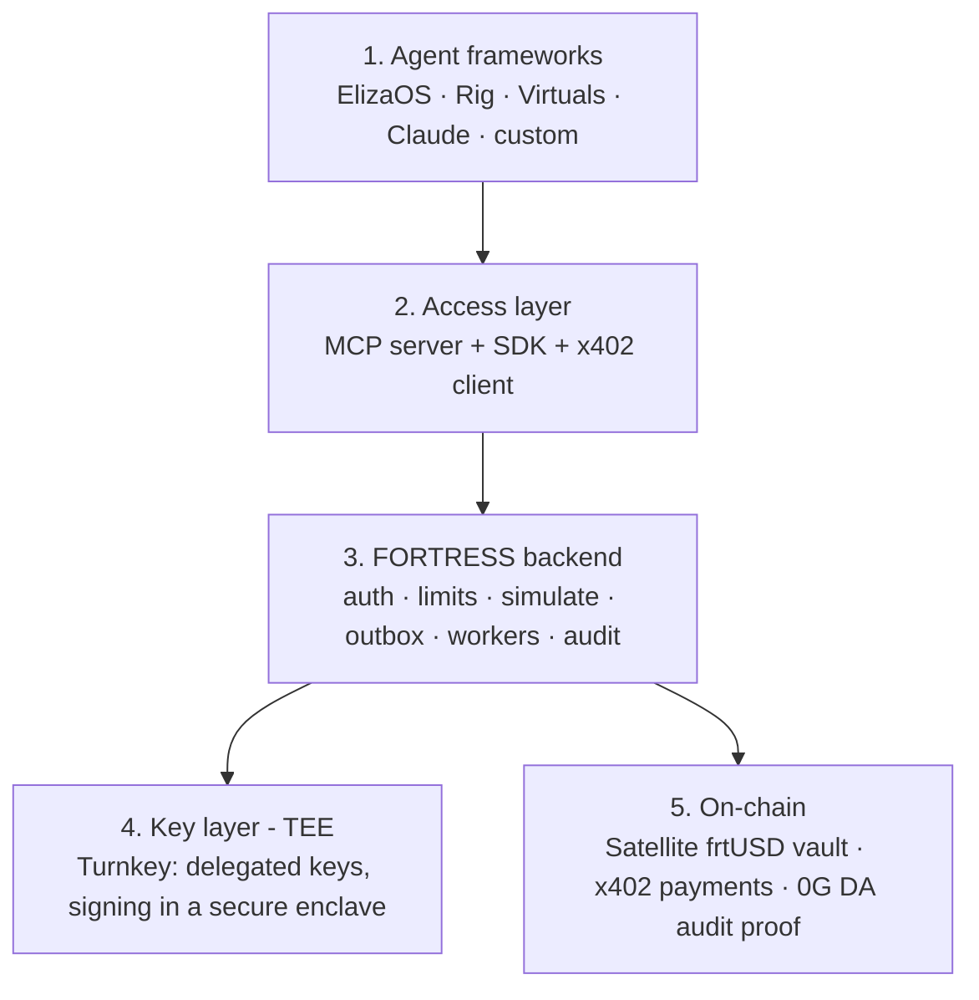
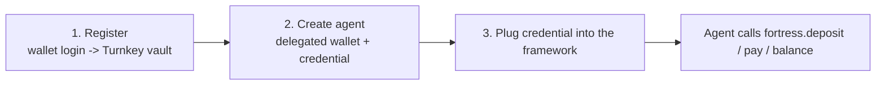
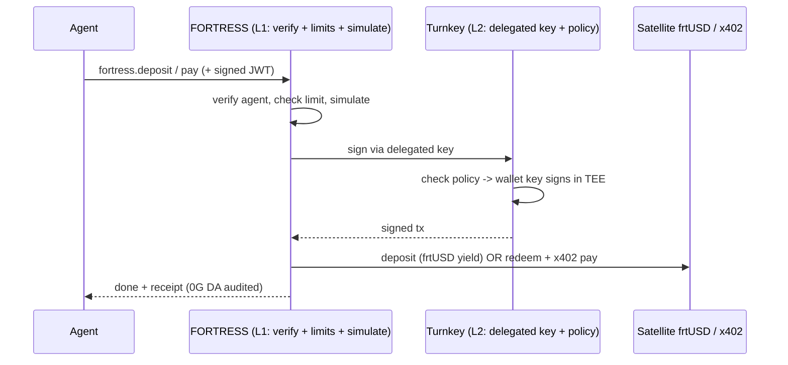

# FORTRESS — Treasury Infrastructure for AI Agents

FORTRESS gives any AI agent a **yield-bearing treasury + safe payments**, the way a bank gives a
business an account + a debit card. Agents earn and spend all day; FORTRESS makes their idle money
**earn yield**, lets them **pay safely under limits**, and **never lets them hold private keys**.

> This is the simple, point-wise overview. Deeper docs:
> - **Backend internals** → [`BACKEND_DESIGN.md`](./BACKEND_DESIGN.md)
> - **Integration flows with examples** → [`INTEGRATION_GUIDE.md`](./INTEGRATION_GUIDE.md)
> - **Platform usage** → [`AGENT_PLATFORMS_ARCHITECTURE.md`](./AGENT_PLATFORMS_ARCHITECTURE.md)
> - **User flows** → [`USER_FLOWS.md`](./USER_FLOWS.md)

---

## 1. The problem (why FORTRESS exists)

- AI agents now drive a large share of on-chain activity; thousands launch every month.
- They **earn** (fees, jobs) and **spend** (compute, data, other agents) constantly.
- Between actions, their money **sits idle** — earning nothing.
- They have **no treasury built for them**: no safe wallet, no spend limits, no audit.
- **FORTRESS fills that gap.**

---

## 2. The architecture in simple words

Think of it as **5 layers**, top to bottom:



- **Layer 1 — Agent frameworks:** where the agent's "brain" lives (any framework).
- **Layer 2 — Access:** how an agent reaches FORTRESS — an **MCP server** (universal connector),
  an **SDK**, and an **x402 client** for payments.
- **Layer 3 — FORTRESS backend:** the brain of the operation — authenticates the agent, checks
  limits, simulates the transaction, queues it (outbox), broadcasts it, and writes an audit log.
- **Layer 4 — Key layer (TEE):** **Turnkey** holds the wallet keys inside a secure enclave and
  signs; keys **never leave**. FORTRESS uses a **delegated key** (limited by policy) to sign for the
  agent.
- **Layer 5 — On-chain:** the **Satellite** vault (frtUSD, ERC-4626) earns the yield, **x402** moves
  payments, and **0G DA** proves every position on-chain.

### The two safety rules (memorize these)
1. **Delegated wallet:** the **user owns** the wallet; FORTRESS only holds a **policy-limited
   delegated key** so the agent can act 24/7, and the user can **revoke anytime**. The agent never
   holds a key.
2. **Two auth layers:**
   - **L1 (Agent → FORTRESS):** an API key + short-lived **signed JWT** → "is this a legit agent?"
   - **L2 (FORTRESS → Turnkey):** the delegated key + policy → "can the wallet actually sign this?"
   - A stolen L1 credential can't reach the keys (L2/TEE) or exceed the policy.

---

## 3. Core concepts (one line each)

- **frtUSD** — a yield-bearing dollar (ERC-4626). Put USDC in, get frtUSD that grows.
- **Satellite** — the on-chain vault that mints frtUSD and farms yield (Aerodrome, Morpho, Uniswap).
  It only does yield; it knows nothing about agents.
- **Turnkey sub-org** — a private vault per user; the **user's login is the root owner**.
- **Delegated key** — a scoped, revocable key FORTRESS holds so an agent can sign within limits.
- **MCP** — the "USB-C for AI" — one connector any agent host can plug into.
- **x402** — pay over HTTP with stablecoins (the agent's payment rail).
- **Sentinel** — a pre-flight risk/threat check before any action.
- **0G DA** — tamper-proof on-chain audit proof of every position/decision.
- **Envelope (v2)** — on-chain-enforced spend policy (the trustless hardening of limits).

---

## 4. How ANY agent uses FORTRESS (the universal 3 steps)



1. **Register** — developer logs in with their wallet → Turnkey makes their vault (they are root).
2. **Create an agent** — one click → a **delegated wallet** (agent address + scoped key) + an
   **API credential** (apiId + secret).
3. **Plug it in** — paste the credential into ElizaOS / Rig / Virtuals / Claude / custom.

Then at runtime, **every platform does the same thing**:



Only **step 1 (the wiring)** differs per platform. Everything after is identical.

---

## 5. How ElizaOS works — and uses FORTRESS

**How ElizaOS works (point-wise):**
- A **Character** config defines the agent; the **AgentRuntime** runs it.
- Capabilities are **plugins** = Actions (do things), Providers (gather info), Evaluators (learn),
  Services (background jobs), plus vector **Memory**.
- It loops: **perceive → decide (LLM) → act → learn**, across X/Discord and chains.

**How it uses FORTRESS (config only — native MCP support):**
```json
// character.json
{ "plugins": ["@elizaos/plugin-mcp"],
  "settings": { "mcp": { "servers": {
    "fortress": { "url": "https://mcp.fortress.exchange",
                  "headers": { "Authorization": "Bearer <agent JWT>" } } } } } }
```
- Agent instantly sees `fortress.deposit / pay / withdraw / balance`.
- Effort: **config only.**

---

## 6. How Rig works — and uses FORTRESS

**How Rig works (point-wise):**
- A **Rust** library for LLM agents.
- An **Agent** = model + context + **Tools** + optional vector store (RAG).
- Tools are plain functions; the binary runs anywhere Rust runs. Favored by trading/infra teams.

**How it uses FORTRESS (native MCP via `rig-mcp`):**
```rust
let fortress = rig_mcp::from_server("https://mcp.fortress.exchange", "<agent JWT>").await?;
let agent = client.agent("gpt-…").tools(fortress).build();  // FORTRESS tools = Rig tools
```
- Effort: **config + a few lines.** Best fit since the FORTRESS backend is also Rust.

---

## 7. How Virtuals works — and uses FORTRESS

**How Virtuals works (point-wise):**
- A **launchpad** that tokenizes agents (co-ownership).
- **GAME** engine: an **HLP** (brain) plans tasks; **Workers** (hands) run **Functions** in a loop.
- **ACP**: agents sell services to each other in 4 phases (request → negotiate → transaction →
  evaluation), settled in **x402**, recorded on-chain.

**How it uses FORTRESS:**
- Wrap a FORTRESS call in a GAME **Function**:
  ```python
  def fortress_pay(url, amount): return mcp_call("fortress","fortress.pay",{"url":url,"amount":amount})
  ```
- And sit **behind the ACP transaction phase** as the treasury + x402 settlement + audit layer.
- Effort: **small wrapper.**

---

## 8. How Claude / any MCP agent uses FORTRESS (via MCP)

**The idea:** MCP is a universal tool protocol. Any MCP host (Claude Desktop, Cursor, OpenAI
Responses API) plugs into the FORTRESS MCP server and gains the tools.

**Claude Desktop config:**
```json
{ "mcpServers": { "fortress": {
    "command": "fortress", "args": ["mcp"], "transport": "stdio",
    "env": { "FORTRESS_MCP_TOKEN": "<agent JWT>" } } } }
```

**What happens when Claude calls a tool (stdio flow):**
```
Claude: "Park my idle 5 USDC"
   -> MCP client writes to stdin: { "tool": "fortress_deposit", "params": { "amount": "5000000" } }
   -> FORTRESS MCP server reads stdin
   -> L1 verify agent  ->  check limit  ->  Sentinel pre-flight  ->  simulate
   -> L2 Turnkey delegated key signs in TEE  ->  broadcast  ->  Satellite mints frtUSD
   -> 0G DA audit proof
   -> writes to stdout: { "txHash": "0x…", "status": "confirmed", "frtUSD": "5.00" }
   -> Claude reads stdout -> "Parked. Now earning yield."
```
- Remote agents (OpenAI Responses API) connect the same way via HTTP/SSE with the credential.
- Effort: **config only.**

---

## 9. The deposit flow (point-wise)

1. Agent calls `fortress.deposit { amount }`.
2. FORTRESS verifies the agent (L1), checks its **daily limit + allowlist**.
3. Builds `approve + Satellite.deposit`, **simulates** via `eth_call` (rejects if it would fail).
4. Reserves a nonce, writes to the **outbox** (status `queued`).
5. A worker asks **Turnkey** to sign with the **delegated key** (Turnkey checks policy; key signs in
   the TEE).
6. Broadcasts to Base → Satellite mints **frtUSD** → money now earns yield.
7. Confirms → finalizes → writes the **audit log** + **0G DA proof**.

---

## 10. The pay flow (x402, point-wise)

1. Agent calls `fortress.pay { url | to, amount }`.
2. FORTRESS verifies the agent + limit (L1) and runs **Sentinel** pre-flight.
3. **JIT recall:** redeems just-enough **frtUSD → USDC** (Turnkey signs in TEE).
4. Calls the seller URL → gets a **402** "pay me" rulebook.
5. Turnkey signs a **gasless** EIP-3009 payment authorization (a signature, not a tx).
6. Resends with the payment → the seller's **x402 facilitator** settles the USDC on-chain.
7. Seller returns the resource; FORTRESS writes the audit log. The rest keeps earning yield.

> Note: x402 works with x402-enabled sellers. For card-only APIs (e.g., OpenAI), FORTRESS fronts the
> API and charges the agent's balance.

---

## 11. Security (point-wise)

- **Keys never leave the TEE** (Turnkey) — not the agent, not FORTRESS, holds the wallet key.
- **Delegated key + policy** — the agent can only do allowed ops (specific contracts, daily caps).
- **User is root** — owns the vault, can **revoke** any agent instantly.
- **Two auth layers** — a stolen L1 credential can't reach keys (L2) or exceed policy.
- **Signed JWTs** — short-lived, so a captured request can't be replayed.
- **Pre-flight simulation** — bad transactions are caught before signing.
- **Immutable audit + 0G DA** — every action is provable and tamper-proof.
- **v2 Envelope** — moves limits on-chain for trustless enforcement.

---

## 12. Build your own agent (no framework)

Same 3 steps:
1. **Register** on the dashboard (wallet login) → get a vault.
2. **Create an agent** → get the agent address + `apiId/apiSecret`.
3. **Call FORTRESS** via **MCP** (point any MCP client at `mcp.fortress.exchange`) or **SDK/REST**:
   ```
   POST https://api.fortress.exchange/agents/{id}/deposit
   Authorization: <signed JWT>      { "amount": "5000000" }
   ```
- You bring the brain (any LLM); FORTRESS brings the treasury + payments. No keys, no chain code.

---

## 13. The whole thing in one paragraph

> FORTRESS is a treasury for AI agents. A developer logs in with their wallet (Turnkey makes a vault
> they own), creates an agent (a **delegated wallet** + a credential, limited by policy and
> revocable), and plugs the credential into ElizaOS / Rig / Virtuals / Claude / a custom agent — via
> **MCP** in most cases. At runtime the agent calls `fortress.deposit` or `fortress.pay`; FORTRESS
> verifies the agent (L1), Turnkey's delegated key signs inside the **TEE** within policy (L2), and
> the money either parks as yield-bearing **frtUSD** or settles via **x402** — all simulated first
> and proven on **0G DA**. **One backend, many doors — and the agent never holds a key.**

---

## 14. Doc index

| Doc | What's in it |
|-----|--------------|
| [`BACKEND_DESIGN.md`](./BACKEND_DESIGN.md) | Full backend internals: outbox, workers, nonces, schema, properties |
| [`INTEGRATION_GUIDE.md`](./INTEGRATION_GUIDE.md) | End-to-end integration flows with concrete examples |
| [`AGENT_PLATFORMS_ARCHITECTURE.md`](./AGENT_PLATFORMS_ARCHITECTURE.md) | How each platform works + uses FORTRESS |
| [`PLATFORM_INTEGRATIONS.md`](./PLATFORM_INTEGRATIONS.md) | Per-platform MCP wiring |
| [`USER_FLOWS.md`](./USER_FLOWS.md) | Dashboard onboarding, Turnkey, x402 phases |
| [`AGENT_RAILS_AND_MCP.md`](./AGENT_RAILS_AND_MCP.md) | The rails + MCP + Envelope (v2) design |
