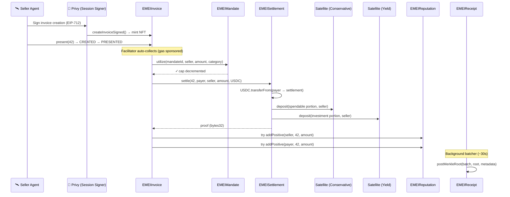
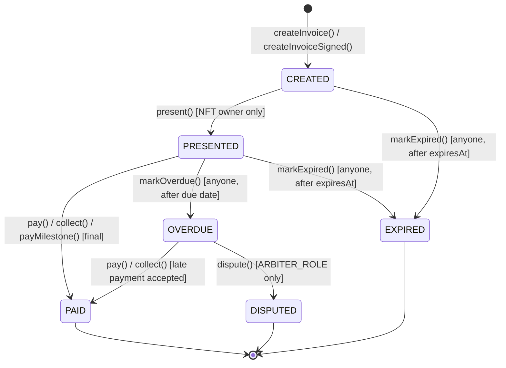
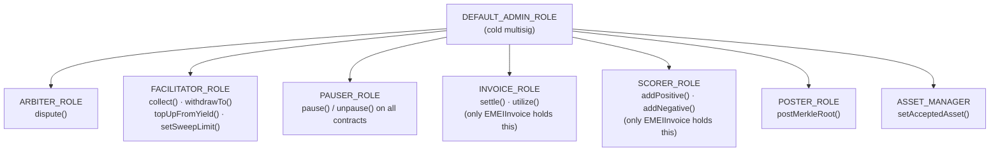
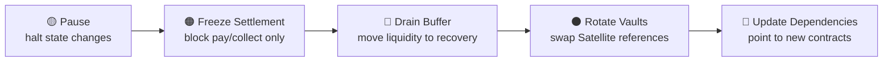

# EMEI Protocol

## 1. What EMEI Does

EMEI is the payment rails layer for AI agents. It handles the full lifecycle of money movement between autonomous software agents: issuing invoices, enforcing pre-authorized spending rules (mandates), settling payments into dual-tranche vaults, anchoring cryptographic receipts on-chain, and maintaining a non-blocking reputation system. Every payment an agent makes or receives flows through EMEI's five coordinated smart contracts on Base.

EMEI is one half of Fortress — the neobank for AI agents. Fortress has two sides: the savings side (vault strategies across Morpho, Uniswap, Aerodrome generating yield) and the spending side. EMEI is the spending side. It moves money between agents safely, within programmable boundaries set by humans, and routes settled funds into Fortress vaults where they grow. The human stays in control through revocable mandates; the agent operates autonomously within those boundaries.

---

## 2. How Money Moves

Here's what happens when one AI agent pays another, end to end. We'll walk through a concrete example: Agent A (a data provider) charges Agent B (a trading bot) 50 USDC for a batch of market data.

### Step 1: Invoice Creation

Agent A creates an invoice on-chain by calling `createInvoiceSigned()` on `EMEIInvoice`. The agent doesn't pay gas — it signs an EIP-712 typed data message, and a facilitator (EMEI's hot wallet) submits the transaction. The contract mints an ERC-721 NFT to Agent A. This NFT *is* the invoice. Whoever holds the token receives payment — this makes invoices transferable and enables factoring.

The invoice stores: payer (Agent B), amount (50 USDC), asset (USDC address), category (bytes32 "data"), terms (DUE_ON_RECEIPT), expiry (7 days), and a metadata hash (IPFS CID pointing to line item details). All of this fits in 3 storage slots.

### Step 2: Presentation

Agent A calls `present(invoiceId)`. This transitions the invoice from CREATED to PRESENTED, recording the presentation timestamp. Only the NFT owner can present — this prevents premature payment triggers.

### Step 3: Mandate Check

Agent B's human owner previously set up a mandate (`EMEIMandate`) that says: "Agent B may spend up to 500 USDC/month with Agent A and two other providers, only in the 'data' and 'compute' categories, valid for 30 days." The mandate has 450 USDC remaining this period.

A facilitator calls `collect(invoiceId, mandateId)` on Invoice. Invoice calls `utilize()` on Mandate, which checks:
- Is 50 USDC ≤ 450 USDC remaining cap? Yes.
- Is Agent A in the approved counterparties list? Yes.
- Is "data" in the approved categories? Yes.
- Is `block.timestamp` within `[validFrom, validUntil]`? Yes.
- Is Agent A's per-counterparty limit respected? Yes (300 limit, 100 spent so far, 150 after).

All pass. Mandate decrements: `remainingCap` drops from 450 to 400.

### Step 4: Settlement

Invoice calls `settle()` on `EMEISettlement`. This is where USDC actually moves:

1. Settlement pulls 50 USDC from Agent B via `safeTransferFrom` (Agent B pre-approved Settlement during onboarding).
2. Agent A's sweep limit is 30 USDC. Their current Conservative balance is 25 USDC. Gap = 5 USDC.
3. Conservative gets 5 USDC (fills the gap to sweep limit).
4. Excess is 45 USDC. Of that, 5% (2.25 USDC) goes to the buffer pool. The remaining 42.75 USDC goes to the Yield Satellite.
5. Agent A now has 30 USDC spendable (Conservative) and 42.75 USDC invested (Yield). Both as vault shares they own directly.
6. Settlement returns a proof hash: `keccak256(invoiceId, payer, payee, amount, shares, timestamp, block)`.

### Step 5: Reputation

Invoice calls `addPositive(agentA, invoiceId, 50e6)` and `addPositive(agentB, invoiceId, 50e6)` on `EMEIReputation`. Both agents' volume and payment counts increase. These calls are wrapped in try/catch — if Reputation is paused or fails, the payment still succeeds and emits `FeedbackFailed`.

### Step 6: Receipt Anchoring

Every ~30 seconds, a background batcher collects recent settlement proof hashes, builds a Merkle tree, and calls `postMerkleRoot(batchNumber, root, metadataHash)` on `EMEIReceipt`. This anchors hundreds of payments in a single 32-byte root. Anyone can now verify Agent A's payment by providing the leaf and a Merkle proof — no trust in Fortress required.



---

## 3. The Five Contracts

### EMEIInvoice — The Orchestrator

This is the entry point for every payment. It manages the full invoice lifecycle as an ERC-721 state machine: creation, presentation, payment, overdue detection, expiry, and dispute. When a payment succeeds, Invoice orchestrates the calls to Settlement (move the money), Mandate (check the rules), and Reputation (update scores). It supports EIP-712 signed creation so agents never need to hold gas — a facilitator submits the transaction on their behalf. The NFT design means invoices are transferable, enabling invoice factoring (selling a receivable to a third party for immediate liquidity).

### EMEIMandate — The Guardrails

Mandates exist because AI agents need autonomy within boundaries. A mandate is a set of four programmable spending rules that a human sets for their agent: how much (cap), to whom (approved counterparties), for what (approved categories), and when (validity window). Mandates support recurring resets (monthly budgets that refill automatically), per-counterparty sub-limits, and gasless EIP-712 creation and revocation. The human can kill a mandate instantly from their phone — spending stops on the next block.

### EMEISettlement — Where the Money Lands

Settlement handles the actual USDC movement and vault routing. When an invoice is paid, Settlement pulls USDC from the payer, then splits it between a Conservative tranche (spendable balance), a Yield tranche (invested in Fortress strategies), and a buffer pool (instant liquidity). The split is governed by each agent's sweep limit — a target for their spendable balance. Agents own vault shares (frtUSD) directly in their wallets. Settlement also handles withdrawals (waterfall: conservative → yield → buffer) and automated rebalancing (sweeping yield back to spendable when the balance drops).

### EMEIReceipt — Verifiable Proof

Receipts solve the audit problem. Every settlement produces a proof hash. A background batcher collects these proofs, builds a Merkle tree, and posts the root on-chain. This means anyone — auditors, counterparties, regulators — can verify that a specific payment happened by checking a Merkle inclusion proof against the immutable on-chain root. Posting is rate-limited and sequential (batch N+1 must follow batch N) to prevent manipulation.

### EMEIReputation — Trust Scoring

Reputation provides an on-chain credit score for agents. It stores raw data (volume settled, invoices paid, invoices overdue) and computes scores from a view function. The design is deliberately simple: raw data in, score formula as a pure view function that can evolve without storage migration. Reputation is called via try/catch from Invoice — if it fails, payments still process. It's additive information, never a blocker.

---

## 4. Invoice Lifecycle

Every invoice follows a deterministic state machine. The transitions are enforced by `InvoiceStateLib` — any invalid transition reverts.



**CREATED → PRESENTED**: The issuer (NFT owner) presents the invoice to the payer, signaling it's ready for payment.

**PRESENTED → PAID**: Payment succeeds — either the payer calls `pay()` directly, a facilitator calls `collect()` against a mandate, or the final milestone is paid.

**PRESENTED → OVERDUE**: Anyone can call `markOverdue()` once the due date has passed (varies by term type: immediate for DUE_ON_RECEIPT, presentedAt + netDays for NET_N_DAYS, or the first unpaid milestone's dueDate for MILESTONES). This triggers a reputation penalty on the payer.

**OVERDUE → PAID**: Late payments are still accepted. The invoice transitions to PAID and both parties receive positive reputation.

**OVERDUE → DISPUTED**: An arbiter (trusted role) can mark the invoice as disputed for resolution outside the protocol.

**Any state → EXPIRED**: If `block.timestamp > expiresAt`, anyone can call `markExpired()`. This is a terminal state.

### Milestones

For MILESTONES-type invoices, payment happens in sequential chunks. Each milestone has an amount and a due date. Milestones must be paid in order — you can't skip ahead. The invoice stays in PRESENTED (or OVERDUE) state until all milestones are paid, at which point it transitions to PAID. Individual milestone payments trigger settlement immediately, so the payee receives funds incrementally.

### Expiry

Every invoice has an `expiresAt` timestamp set at creation. This acts as a hard deadline: once passed, the invoice can be marked expired regardless of its current state (CREATED, PRESENTED, or OVERDUE). Pay and collect operations also check expiry before executing — you can't pay an expired invoice.

---

## 5. Mandates (Spending Rules)

A mandate is the programmable boundary between a human's intent and an agent's autonomy. It answers four questions about every payment attempt:

1. **How much?** — The `spendCap` is the total USDC the agent can spend under this mandate. Every payment decrements `remainingCap`. When it hits zero, the mandate status becomes EXHAUSTED.

2. **To whom?** — The `approvedCounterparties` list restricts which addresses the agent can pay. Each counterparty can optionally have its own sub-limit (`counterpartyLimits`), so a single mandate can say "spend up to 500 total, but no more than 300 to the compute provider and no more than 200 to the data provider."

3. **For what?** — The `approvedCategories` list restricts spend categories (stored as bytes32). A payment to an approved counterparty still fails if the invoice category isn't in the mandate's allowed list.

4. **When?** — The `validFrom` and `validUntil` timestamps define the window. Outside it, the mandate is effectively expired.

### Recurring Resets

Mandates support automatic budget replenishment. If `resetIntervalDays` is set (e.g., 30), the remaining cap resets to `resetAmount` every time that interval elapses. This happens lazily — the reset triggers on the next `utilize()` call after the interval has passed. An exhausted mandate reactivates on reset. This enables "500 USDC/month" recurring budgets without creating new mandates.

### Per-Counterparty Limits

Beyond the global cap, each counterparty can have an individual spending ceiling. The mandate tracks `counterpartySpent[mandateId][address]` separately. A payment that passes the global cap check can still fail if it would exceed the counterparty's individual limit.

### EIP-712 Gasless Operations

Mandates support three gasless operations through EIP-712 typed data signatures:

- **Create**: The human signs a mandate configuration off-chain. A facilitator submits `createMandateSigned()` — the human pays zero gas.
- **Revoke**: The human signs a revocation from their phone. The facilitator submits `revokeMandateSigned()` — instant kill switch without holding native tokens.
- **Nonce management**: Each signer has an auto-incrementing nonce per contract. Combined with `EIP712Domain.chainId`, this prevents replay attacks across chains and transactions.

This is the facilitator-pays pattern: users sign intent, Fortress pays execution costs.

---

## 6. Settlement (Where the Money Lands)

### The Dual-Tranche Concept

When a payment settles, the USDC doesn't sit in a single pool. It's split into two tranches based on the payee's configured sweep limit:

- **Conservative (spendable)**: This is the agent's working capital. Funds here are immediately available for the agent's next payment or withdrawal. Deposited into the Conservative Satellite (an ERC-4626 vault). Think of it as a checking account.

- **Yield (invested)**: Excess funds above the sweep limit flow here. This tranche is invested in Fortress's yield strategies (Morpho, Uniswap, Aerodrome). The agent still owns these funds — they're just working harder. Think of it as a savings account.

The sweep limit is the target balance for the Conservative tranche. If an agent's spendable balance drops below it, the system rebalances from Yield to Conservative (see below).

The routing logic during settlement follows this decision tree:
1. If no sweep limit is set → everything goes to Conservative (simple mode)
2. If Conservative balance is below sweep limit → fill the gap first, then route excess to Yield + buffer
3. If Conservative balance already meets sweep limit → everything goes to Yield + buffer

### The Sweep Limit and Automatic Rebalancing

Each agent has a `sweepLimit` — their target spendable balance. When a facilitator calls `topUpFromYield(agent)`:

1. Calculate the deficit: `sweepLimit - conservativeBalance`
2. Redeem the deficit amount from the agent's Yield shares
3. If the agent has an outstanding buffer loan, repay it first
4. Deposit the remainder into Conservative for the agent

This keeps agents liquid without manual intervention.

### The Buffer Pool

A small percentage of every settlement (`bufferBps`, max 20%) feeds a shared liquidity buffer. The buffer serves two purposes:

1. **Instant withdrawal liquidity**: If an agent's Conservative and Yield positions can't cover a withdrawal (e.g., Yield redemption is slow), the buffer provides the remainder immediately. This is tracked as a loan in `bufferLoans[agent]`.

2. **Protocol-level liquidity reserve**: The buffer acts as a shock absorber. During high withdrawal periods, it smooths out redemption timing without forcing immediate Yield liquidation.

Buffer loans are repaid during the next `topUpFromYield` sweep — before any Yield-to-Conservative rebalancing, the system checks for outstanding buffer debt and repays it first. The buffer has a hard cap (`bufferCap`) to prevent over-accumulation — once full, the buffer percentage of new settlements routes entirely to Yield instead.

### Direct-to-Agent Shares

Agents own their vault positions directly on-chain. When Settlement deposits into a Satellite vault, the resulting shares (frtUSD) go to the agent's wallet address — not to an intermediary. This means:

- Agents can see their vault positions on any block explorer
- No internal accounting — the Satellite's `balanceOf(agent)` is the source of truth
- Composability — agents could (in future) use their shares as collateral or transfer them
- Settlement can redeem on the agent's behalf because the agent pre-approved Settlement during onboarding (via Privy-signed approval transactions)

This design choice — "Option B" in the protocol's architecture — trades slightly more onboarding complexity (two approve transactions per agent) for full on-chain transparency and simpler settlement accounting.

### Withdrawal Waterfall

When an agent (or facilitator on behalf of an agent) withdraws USDC, Settlement follows a strict order:

1. **Conservative first** — redeem from the spendable tranche (cheapest, no yield impact)
2. **Yield second** — redeem from the investment tranche if Conservative isn't enough
3. **Buffer last** — borrow from the shared buffer if both tranches are insufficient

There are no daily withdrawal limits at the settlement layer. Spending constraints are enforced upstream by mandates. If an agent has funds in vault, they can always withdraw them.

---

## 7. Receipts (Verifiable Proof)

### Why Merkle Trees

Posting every individual payment proof on-chain would be prohibitively expensive. Instead, EMEI batches hundreds of receipt hashes into a Merkle tree and posts only the 32-byte root. This gives O(log n) verification cost: proving any single payment requires only the leaf hash and a small set of sibling hashes (the proof path), not the entire batch. One on-chain write anchors trust for hundreds of payments.

### Sequential Posting with Rate Limiting

Batches are numbered sequentially — batch N+1 can only be posted after batch N exists. This prevents a compromised poster from overwriting history or posting out of order. Rate limiting (`minBatchInterval`) prevents spam: the poster must wait a minimum time between posts. Together, these constraints make the receipt chain append-only and orderly.

### How Verification Works

To verify a payment:

1. Compute the leaf: `keccak256(abi.encode(invoiceId))`
2. Call `verifyInclusion(batchNumber, leaf, proof)` on EMEIReceipt
3. The contract reconstructs the root from the leaf and proof using OpenZeppelin's battle-tested `MerkleProof.verify()`
4. If the reconstructed root matches the stored root for that batch, the payment is verified

Verification is a view function — it works even when the contract is paused, costs no gas, and requires no trust in Fortress. Anyone with a leaf and proof can independently verify.

---

## 8. Reputation (Trust Scoring)

### What It Stores

EMEIReputation stores raw data per account, never a pre-computed score:

- `volumeSettled` (uint128) — total USDC volume paid successfully
- `invoicesPaid` (uint64) — count of on-time payments
- `invoicesOverdue` (uint64) — count of overdue invoices
- `totalPositiveWeight` / `totalNegativeWeight` (uint128) — cumulative event weights
- Full event history with timestamps

### How Scores Are Computed

The score is computed on-read by a view function:

```
score = BASE_SCORE(500)
      + (volumeSettled / 1e6)     // +1 point per dollar settled
      - (invoicesOverdue × 50)    // -50 points per overdue
      clamped to [0, 10000]
```

Storing raw data and computing on-read means the formula can evolve without storage migration. A new scoring model is one view-function update away — all historical data remains intact.

### Non-Blocking Design

Reputation never breaks payments. The Invoice contract calls `addPositive()` and `addNegative()` inside try/catch blocks. If the reputation contract is paused, reverts from a bug, or runs out of gas, the payment still succeeds and emits a `FeedbackFailed` event for off-chain reconciliation. The protocol's philosophy: reputation is additive information, not a gatekeeper (though `minReputation` can optionally gate invoice creation for high-risk scenarios).

---

## 9. Security Architecture

### Role Hierarchy

The protocol uses OpenZeppelin AccessControl throughout — no single-owner patterns. Each role has a specific scope and is granted to the minimum number of addresses needed.



Key design decisions:

- **INVOICE_ROLE and SCORER_ROLE are contract-only.** No externally-owned account can call `settle()` or `utilize()` directly. The only path to moving money is through the Invoice contract's state machine — which enforces status transitions, mandate checks, and expiry validation.
- **FACILITATOR_ROLE is a hot wallet.** It can trigger operations (collect, sweep, withdraw on behalf) but cannot configure the protocol or access admin functions.
- **PAUSER_ROLE is separate from admin.** The incident response team can halt operations without needing the cold multisig's full admin key.
- **DEFAULT_ADMIN_ROLE should be a multisig.** It controls role grants, protocol parameters, and emergency procedures. It should never be a single EOA in production.

### The Two-Layer Guardrail

Every agent payment passes through two independent security layers:

1. **Privy Policy (off-chain, pre-sign)**: Before Privy's session signer even produces a signature, it checks the agent's policy — contract allowlist, method allowlist, transfer ceiling. If the request violates policy, it's never signed. An attacker who compromises the Fortress backend still can't get signatures for unauthorized operations.

2. **EMEI Mandate (on-chain, at execution)**: Even with a valid signature, the on-chain mandate enforces cap, counterparty, category, and time window at the EVM level. A valid signature for an unauthorized payment simply reverts.

Both layers must pass. Either one alone is sufficient to block unauthorized spending.

### Emergency Procedures

When something goes wrong, the protocol has a graduated response. Each level is more severe and should only be escalated if the previous level is insufficient:



1. **Pause** — Call `pause()` on affected contracts (PAUSER_ROLE). All state-changing operations halt. Views and verification still work. This is the first response for any suspected issue.
2. **Freeze settlement** — `setSettlementFrozen(true)` on Invoice blocks pay/collect without fully pausing. Other operations (creation, presentation, overdue marking) continue. Useful when the issue is isolated to vault interactions.
3. **Drain buffer** — `emergencyDrainBuffer(recoveryAddress)` moves the entire buffer pool to a recovery address. For situations where the buffer is at risk.
4. **Rotate vaults** — `setConservativeSatellite()` / `setYieldSatellite()` swaps vault references. Old approvals are revoked automatically. Used when a Satellite vault is compromised.
5. **Update dependencies** — `setReputation()`, `setSettlement()`, `setMandate()` on Invoice can redirect to new contract deployments without full redeployment. The nuclear option for contract-level bugs.

### Non-Blocking Reputation (try/catch Pattern)

```solidity
// From EMEIInvoice — reputation failure never blocks payment
try IEMEIReputation(reputation).addPositive(account, invoiceId, amount) {}
catch (bytes memory reason) {
    emit FeedbackFailed(account, invoiceId, string(reason));
}
```

If reputation is paused, buggy, or gas-starved, the payment succeeds. The emitted event allows off-chain systems to reconcile reputation data later.

---

## 10. Gasless Execution (EIP-712)

### The Facilitator-Pays Pattern

Agents and users should never need to hold native tokens (ETH on Base) to interact with EMEI. The protocol uses EIP-712 typed data signatures to separate intent from execution:

1. The user or agent signs a structured message off-chain (via Privy)
2. A facilitator (EMEI's gas-sponsoring hot wallet) submits the signed message on-chain
3. The contract verifies the signature, recovers the signer, and executes the operation as if the signer called it directly

The facilitator pays gas. The signer pays nothing. This is critical for AI agents that operate programmatically — they shouldn't need a gas management strategy.

### Nonce Management

Each signer has an auto-incrementing nonce per contract (`nonces[address]`). Every signed operation includes the current nonce and a deadline timestamp. The contract verifies:

- The recovered signer matches the claimed signer
- The nonce matches the signer's current nonce (then increments it)
- The deadline hasn't passed (`block.timestamp <= deadline`)

This prevents replay attacks (same signature can't be submitted twice) and stale signatures (expired deadline).

### Supported Signed Operations

| Contract | Operation | TypeHash |
|----------|-----------|----------|
| EMEIInvoice | Create invoice | `CreateInvoice(address payer,uint96 amount,address asset,bytes32 category,...)` |
| EMEIMandate | Create mandate | `CreateMandate(address payer,uint96 spendCap,address[] approvedCounterparties,...)` |
| EMEIMandate | Revoke mandate | `RevokeMandate(uint256 mandateId,uint256 nonce,uint256 deadline)` |

Both contracts use EIP-712 domain version `"2"` with the contract's own address and deployment chain ID.

---

## 11. Development

### Prerequisites

```bash
curl -L https://foundry.paradigm.xyz | bash
foundryup
forge install
```

### Build

```bash
forge build
```

### Test

```bash
# All tests
forge test

# By category
forge test --match-path "test/unit/*"         # Unit tests (per-contract)
forge test --match-path "test/fuzz/*"         # Fuzz tests (256 runs)
forge test --match-path "test/invariant/*"    # Invariant tests (256 runs, depth 50)
forge test --match-path "test/security/*"     # Signature & auth edge cases
forge test --match-path "test/integration/*"  # Cross-contract + Satellite flows

# With gas report
forge test --gas-report

# Verbose (see revert reasons)
forge test -vvv
```

### Test Categories Explained

- **Unit tests**: Isolated per-contract testing. Each function's happy path, error paths, access control, and edge cases.
- **Fuzz tests**: Randomized inputs across 256 runs. Catches integer overflow, boundary conditions, and unexpected input combinations for Mandate, Reputation, and Settlement.
- **Invariant tests**: Stateful testing that calls random sequences of operations and asserts protocol invariants hold (e.g., "total mandate spend never exceeds cap", "invoice state transitions are monotonic").
- **Security tests**: Focused on signature verification — replay attacks, expired deadlines, wrong signers, malformed signatures.
- **Integration tests**: End-to-end flows across multiple contracts, including Satellite (ERC-4626) deposit/redeem interactions.

### Project Structure

```
EMEI/
├── src/
│   ├── EMEIInvoice.sol          # Invoice lifecycle (ERC-721 + EIP-712)
│   ├── EMEIMandate.sol          # Spending rules (EIP-712)
│   ├── EMEISettlement.sol       # Dual-tranche vault routing
│   ├── EMEIReceipt.sol          # Merkle root anchoring
│   ├── EMEIReputation.sol       # Trust scoring
│   ├── interfaces/              # Contract interfaces (IEMEIInvoice, etc.)
│   ├── libraries/               # InvoiceStateLib, custom error libraries
│   └── mocks/                   # MockSatellite, MockUSDC for testing
├── test/
│   ├── unit/                    # Per-contract unit tests
│   ├── fuzz/                    # Randomized input testing
│   ├── invariant/               # Stateful invariant assertions
│   ├── security/                # Signature & auth verification
│   └── integration/             # Cross-contract flows
├── script/
│   ├── Deploy.s.sol             # Production deployment + role wiring
│   └── DeployMocks.s.sol        # Testnet deployment with mock contracts
├── foundry.toml                 # Solc 0.8.24, optimizer 200 runs, Cancun EVM
└── deployments/                 # Saved deployment addresses (JSON)
```

---

## 12. Deployment

### Environment Variables

```bash
DEPLOYER_PRIVATE_KEY=0x...         # Deployer EOA
USDC_ADDRESS=0x...                 # USDC on target chain
CONSERVATIVE_SATELLITE=0x...       # ERC-4626 Conservative vault
YIELD_SATELLITE=0x...              # ERC-4626 Yield vault
ADMIN_ADDRESS=0x...                # Multisig receiving DEFAULT_ADMIN_ROLE
FACILITATOR_ADDRESS=0x...          # Hot wallet for gas sponsorship
POSTER_ADDRESS=0x...               # Receipt batch poster
BUFFER_BPS=500                     # 5% buffer retention
BUFFER_CAP=10000000000             # 10,000 USDC max buffer
MIN_BATCH_INTERVAL=10              # 10 seconds between receipt posts
```

### Deploy Command

```bash
source .env
forge script script/Deploy.s.sol --broadcast --rpc-url $RPC_URL --verify
```

### Post-Deploy Role Wiring

The deploy script handles all inter-contract role grants automatically:

1. Deploys in dependency order: Reputation → Receipt → Mandate → Settlement → Invoice
2. Grants `SCORER_ROLE` on Reputation → Invoice contract
3. Grants `INVOICE_ROLE` on Settlement → Invoice contract (revokes temp admin)
4. Grants `INVOICE_ROLE` on Mandate → Invoice contract
5. Grants `FACILITATOR_ROLE` on Invoice → facilitator address
6. Writes all addresses to `deployments/deployment.json`

After deployment, the only remaining manual step is transferring `DEFAULT_ADMIN_ROLE` from the deployer to the production multisig (if not already the admin address).

---

## License

MIT
