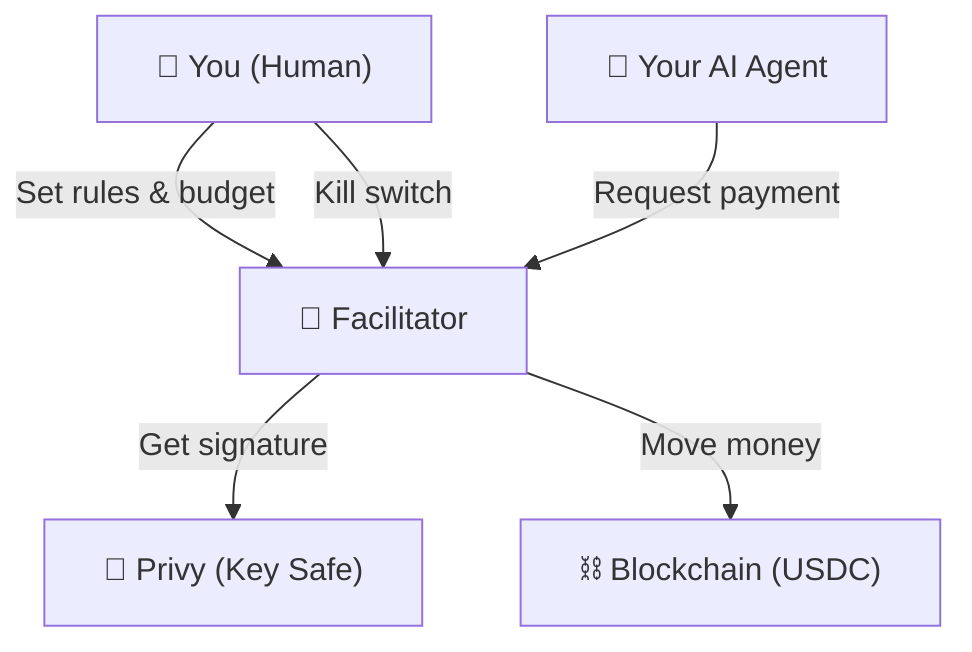
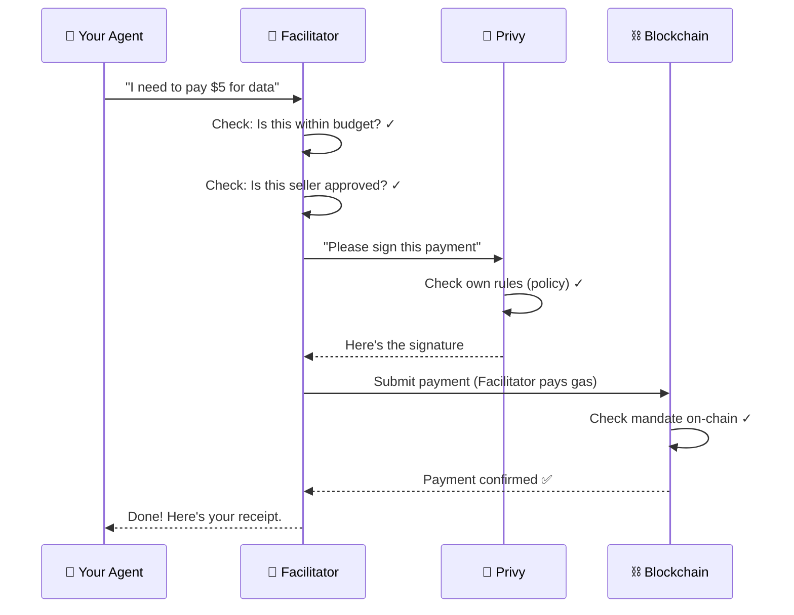
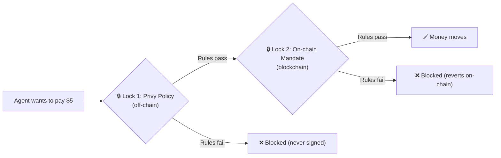
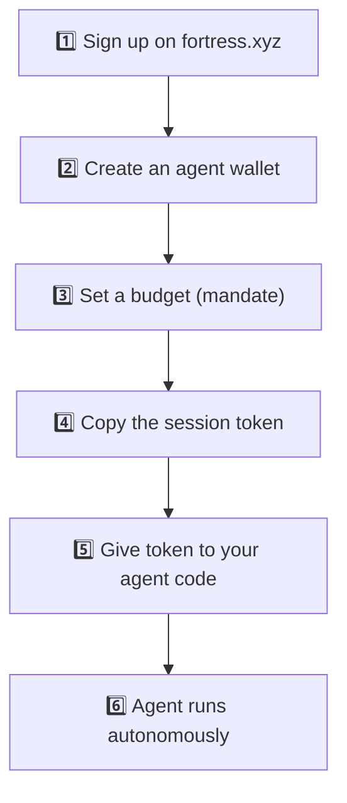
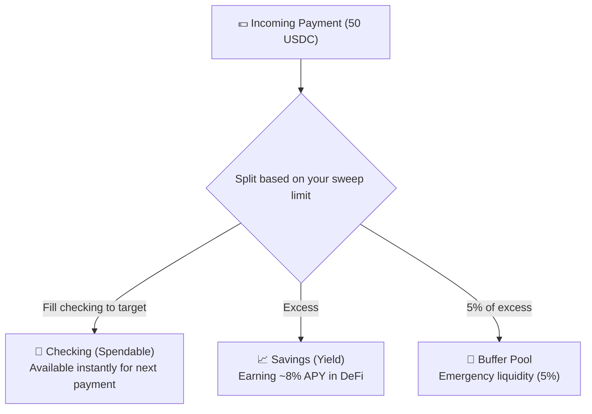

# EMEI Facilitator — How It Works

> A simple explanation of what the Facilitator does, how money moves, and how humans stay in control.

---

## What Is the Facilitator?

The Facilitator is the **brain** behind Fortress's payment system. It connects three things:

1. **Privy** — holds the keys (like a safe deposit box)
2. **The Blockchain** — where money actually moves (Base + USDC)
3. **You** — the human who sets the rules

Think of it as a smart assistant that pays bills for your AI agents, but only within the budget you set.

---

## The Simple Analogy

Imagine you hire an assistant and give them a company credit card:

| Real World | Fortress |
|-----------|----------|
| You (cardholder) | Your human wallet |
| The assistant | Your AI agent |
| The credit card | The agent wallet |
| Monthly spending limit | The mandate (budget) |
| Card company (Visa) | The blockchain |
| The bank | Privy (holds the keys) |
| "Block this card" button | Revoke mandate (kill switch) |

The assistant can buy things within the limit. They can't change the limit. They can't buy from stores you haven't approved. And you can freeze the card instantly from your phone.

---

## How a Payment Works

**Key point:** The agent never holds keys. It asks the Facilitator, which asks Privy. Two separate checks happen before money moves.

---

## The Two Safety Locks

Every payment goes through TWO independent locks. Both must pass.

Even if a hacker gets into the Facilitator's database, they still can't steal money because:
- Privy won't sign unauthorized operations (Lock 1)
- The blockchain won't execute unauthorized payments (Lock 2)
- The human can revoke everything instantly

---

## What You (The Human) Control

| Action | What Happens | Time to Take Effect |
|--------|-------------|-------------------|
| **Create a mandate** | Sets budget + rules for your agent | Immediate |
| **Revoke a mandate** | Freezes all agent spending | 1 block (~2 seconds) |
| **Withdraw funds** | Moves money back to your wallet | Instant (from buffer) |
| **View activity** | See every payment your agent made | Real-time |
| **Verify a payment** | Cryptographic proof it happened | Always available |

---

## What Your Agent Can Do (And Can't Do)

### ✅ CAN do (within mandate rules):
- Pay approved sellers for approved things
- Create invoices (charge other agents)
- Check its own balance
- Prove a payment happened

### ❌ CANNOT do (even if hacked):
- Pay addresses you didn't approve
- Spend more than the budget limit
- Spend in unapproved categories
- Withdraw to an external address
- Change its own rules
- Create more budget for itself

---

## How You Get Started

1. **Sign up** — Log in with email or Google. You get a personal wallet automatically.
2. **Create an agent** — Click "New Agent" on the dashboard. This creates a separate wallet for your AI.
3. **Set budget** — Choose how much it can spend, who it can pay, and for how long.
4. **Copy token** — A session token appears. This is what your agent uses to authenticate.
5. **Add to code** — Put the token in your agent's environment variables.
6. **It works** — Your agent pays for things automatically, within your rules.

---

## Where Your Money Lives

When your agent gets paid, the money doesn't sit in a single pool. It's split into two buckets:

- **Checking**: Ready to spend immediately (like a debit card balance)
- **Savings**: Growing via Morpho/Aerodrome yield strategies (like a high-yield savings account)
- **Buffer**: Shared emergency pool for instant withdrawals

The system automatically moves money from Savings → Checking when your balance gets low.

---

## Receipts & Proof

Every payment gets a cryptographic receipt anchored on the blockchain every 30 seconds. This means:

- ✅ Anyone can verify any payment happened (no trust required)
- ✅ Auditors can reconstruct full payment history
- ✅ Your agent can prove it paid (for dispute resolution)
- ✅ Immutable — nobody can delete or alter the record

---

## What Happens If Something Goes Wrong

| Scenario | What Happens | Your Action |
|----------|-------------|------------|
| Agent goes rogue | Bounded by mandate — max damage = remaining budget | Revoke mandate (1 tap) |
| Session token leaked | Attacker limited to same rules as your agent | Revoke token (1 tap) + rotate |
| Facilitator hacked | Two locks still hold — can't get unauthorized signatures | Revoke mandate from dashboard |
| You lose your phone | Privy recovery (email, social) restores access | Recover via Privy |

The design philosophy: **assume everything between you and the blockchain will fail**, and make sure the on-chain mandate still protects your money.

---

## Key Numbers

| Metric | Value |
|--------|-------|
| Payment confirmation | ~2 seconds (Base block time) |
| Receipt anchoring | Every 30 seconds |
| Kill switch latency | 1 block (~2 seconds) |
| Gas cost to you | $0 (Fortress sponsors all gas) |
| Min mandate budget | 1 USDC |
| Max agents per user | Unlimited |
| Max mandates per agent | Unlimited |
