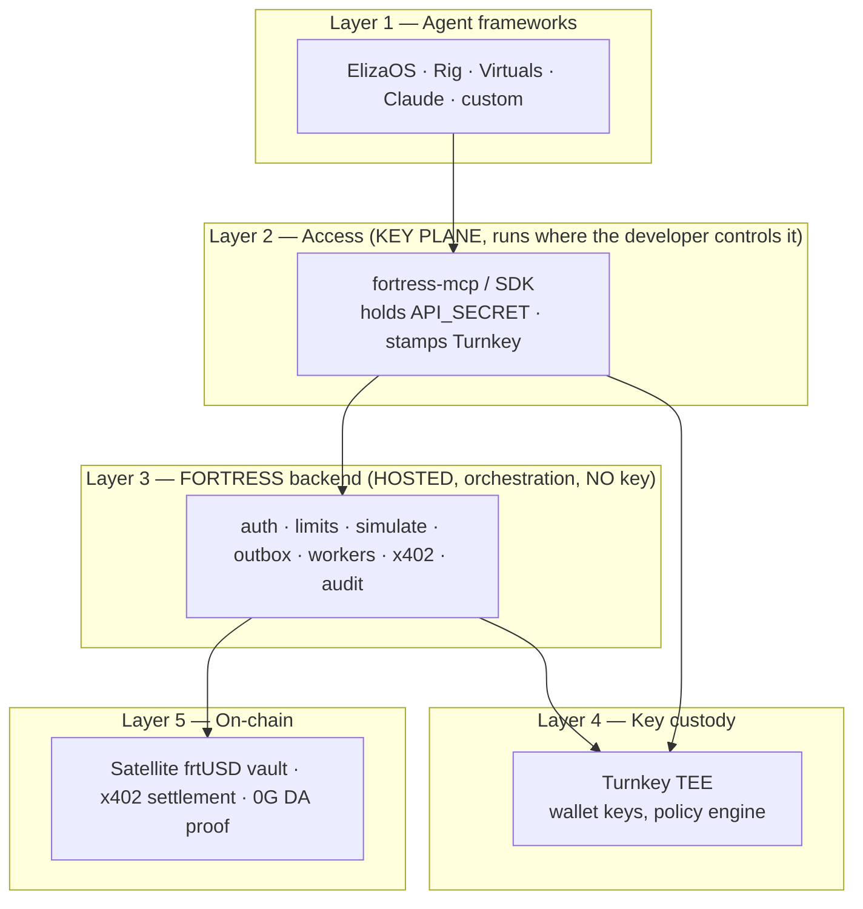
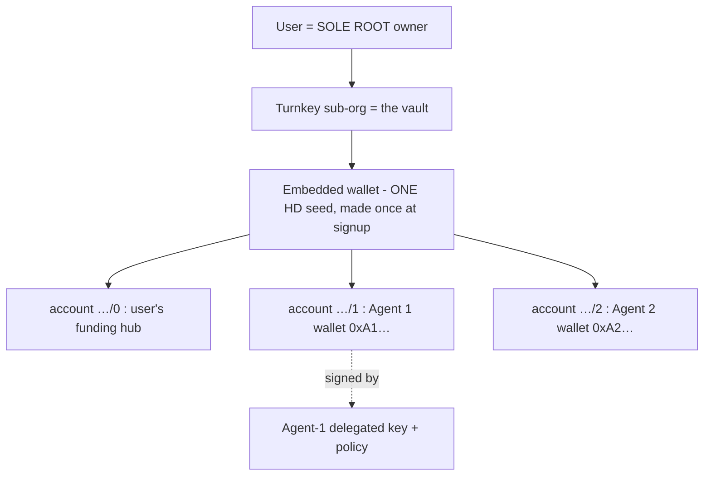
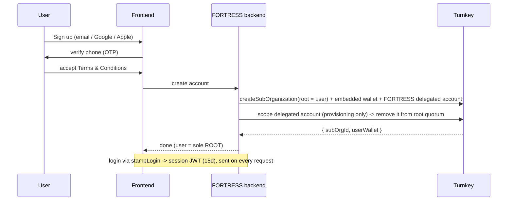
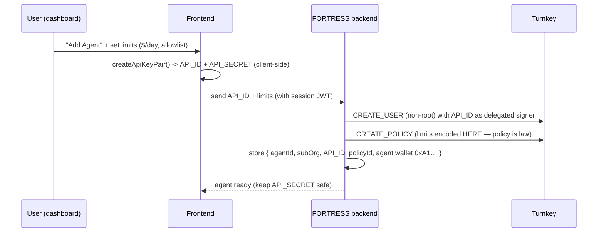
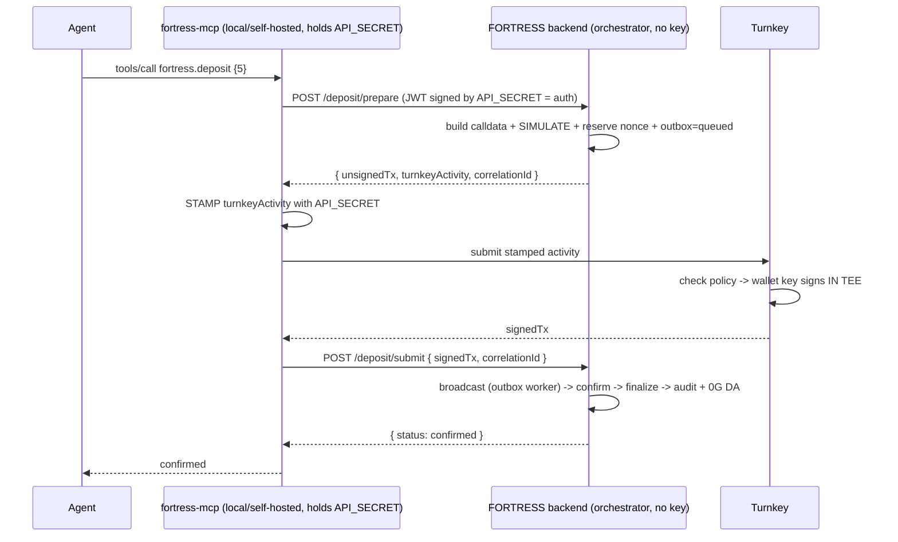

# FORTRESS — Treasury Infrastructure for AI Agents

**Version:** 3.0 (final architecture) · **Networks:** Base, Arbitrum (testnet + mainnet)

FORTRESS gives any AI agent a **yield-bearing treasury + safe payments** — the way a bank gives a
business an account and a debit card. Agents earn and spend all day; FORTRESS makes their idle money
**earn yield (frtUSD)**, lets them **pay under enforced limits (x402)**, and ensures they **never hold
the wallet's private key** (it stays sealed in a TEE).

> **Companion docs**
> - Backend internals → [`BACKEND_DESIGN.md`](./BACKEND_DESIGN.md)
> - Integration flows with examples → [`INTEGRATION_GUIDE.md`](./INTEGRATION_GUIDE.md)
> - Platform usage → [`AGENT_PLATFORMS_ARCHITECTURE.md`](./AGENT_PLATFORMS_ARCHITECTURE.md)
> - User flows → [`USER_FLOWS.md`](./USER_FLOWS.md)

---

## 1. The problem

- AI agents drive a large and growing share of on-chain activity.
- They **earn** (fees, agent-to-agent jobs) and **spend** (compute, data, other agents) continuously.
- Between actions, their capital **sits idle** — earning nothing.
- They have **no treasury built for them**: no safe wallet, no spend limits, no audit trail.
- **FORTRESS fills that gap** — a treasury + payment layer any agent can plug into.

---

## 2. System architecture (the 5 layers + 2 planes)



Two distinct planes are the heart of the design:

- **Control / orchestration plane — the FORTRESS backend (hosted by FORTRESS).** Builds calldata,
  simulates, manages the outbox/nonces, broadcasts, settles x402, audits. **It never holds an
  agent's key and never signs.**
- **Key plane — `fortress-mcp` / SDK (runs where the developer controls it).** Holds the agent's
  `API_SECRET`, exposes the tools to the agent, and **stamps** Turnkey requests. Behind it,
  **Turnkey's TEE** holds the actual wallet keys and signs.

---

## 3. The custody & key model

### 3.1 The actors
- **User (root):** the human. Owns a **Turnkey sub-org** (their vault). Full control.
- **FORTRESS delegated account:** a backend-held, **scoped** Turnkey user (created at signup,
  removed from root quorum) that can **provision agents** (`CREATE_USER` / `CREATE_POLICY`) and
  revoke — but cannot move funds.
- **Agent:** a **non-root, policy-scoped Turnkey user** that **holds its own `API_SECRET`** and can
  sign (stamp) its own transactions, bounded by policy.

### 3.2 The two keys
| Key | Holder | Role |
|-----|--------|------|
| **User Root Key** | the human (passkey / email auth) | owns the vault; create/revoke agents, fund, withdraw |
| **Agent Delegated Key** (`API_ID`/`API_SECRET`) | the agent (in its runtime) | signs its own actions within policy |

The agent's key is **one key doing two jobs** (it authenticates to the FORTRESS backend **and** is
the Turnkey delegated signer). Because of this, **all spend limits live in the Turnkey policy** — not
just in backend code — so they hold even if the backend is bypassed. A leaked agent key is **bounded
by policy + instantly revocable**, never a drained wallet.

### 3.3 What a "stamp" is
A **stamp** is the signature that authenticates a request to Turnkey: the agent signs the Turnkey
*activity* (e.g., "sign this tx") with its `API_SECRET`. Turnkey verifies the stamp, runs the policy,
and only then does the **wallet key inside the TEE** produce the real transaction signature. So:
**stamp = "who's asking" (agent's key); wallet signature = the on-chain signature (TEE).**

---

## 4. The account model



- The **embedded wallet** is created **once** at signup (an HD seed). **Agent wallets are derived
  accounts** within it — adding an agent derives a new account, not a new wallet.
- **Each agent has its own address + balance + policy.** The user funds it; the agent spends only
  from its own balance and **cannot touch the user's funding account**.
- **Root vs delegate:** the **root user** can create/delete/fund/defund/re-policy/**revoke**/withdraw;
  the **agent's delegated key** can only do its policy-allowed ops. Holding a key ≠ root.

---

## 5. Onboarding flow (one time)



Onboarding is **email + phone OTP + T&C** (no external wallet required), which also gives **account
recovery** via email/OTP. The user ends as the **sole root** of their vault.

---

## 6. Add-Agent flow



- Keypair is generated **client-side**; FORTRESS stores only the **public `API_ID`**.
- **Limits are encoded in the Turnkey policy**, because the agent can reach Turnkey directly.

---

## 7. How the MCP is built over the backend

`fortress-mcp` is a **thin transport over the existing service layer** (the backend was designed for
"both HTTP and future MCP transports"). The only structural change under Option A: **signing is split
out of the backend** into the key-holding MCP server.

A write becomes **prepare → stamp → submit**:



**Connection:** `fortress-mcp` is an **authenticated HTTPS REST client** of the backend. Endpoints:
`GET /capabilities` (builds `tools/list`), `POST /{op}/prepare`, `POST /{op}/submit`,
`GET /balance`, `GET /tx/{hash}`. Auth on every call is a **JWT signed by `API_SECRET`**, verified
against the stored `API_ID`.

**What crosses the wire:** the unsigned tx + Turnkey activity (backend → MCP) and the signed tx
(MCP → backend). **What never crosses:** `API_SECRET` (stays in the MCP process) and the wallet key
(stays in Turnkey's TEE).


> Behavioral change: the broadcast worker **no longer signs** — it broadcasts an already-signed tx.
---

## 8. Runtime flows

### 8.1 Deposit (earn yield)
1. Agent calls `fortress.deposit { amount }`.
2. Backend `/prepare`: build `approve + Satellite.deposit`, **simulate**, reserve nonce, outbox=queued.
3. MCP **stamps** with `API_SECRET` → Turnkey checks policy → **TEE signs**.
4. Backend `/submit`: broadcast → Satellite mints **frtUSD** → earning yield → audit + 0G DA proof.

### 8.2 Pay (x402)
1. Agent calls `fortress.pay { url | to, amount }`.
2. **JIT recall:** redeem just-enough frtUSD → USDC (same prepare/stamp/submit path).
3. Backend hits the seller URL → **402** rulebook → builds the **EIP-3009** typed data.
4. MCP **stamps** → TEE signs a **gasless** authorization.
5. Seller's **x402 facilitator** settles on-chain → resource returned. The rest keeps earning.

> Non-x402 sellers (e.g., OpenAI): FORTRESS fronts the API and charges the agent's balance.

---

## 9. How agents integrate (how they work + how they use FORTRESS)

**The rule for all:** run `fortress-mcp` (or the SDK) **where you control the key** — **local** for
self-run agents, **self-hosted** for cloud-run agents. Never hand `API_SECRET` to a third party's
cloud. Underneath, the runtime is identical (§7–8); only the wiring differs.

| Framework | How it works (1 line) | How it uses FORTRESS |
|-----------|-----------------------|----------------------|
| **ElizaOS** | TS "agent OS": Character + AgentRuntime; plugins (Actions/Providers/Evaluators/Services) | Add `@elizaos/plugin-mcp` → local `fortress-mcp`, or `@fortress/plugin` SDK. **Config only.** |
| **Rig** | Rust lib: Agent = model + tools + RAG; runs as your binary; native `rig-mcp` | `rig_mcp::from_server(localUrl, API_SECRET)` → FORTRESS tools become Rig tools. Rust-native fit. |
| **Virtuals** | Launchpad + **GAME** (HLP plans, Workers run **Functions**) + **ACP** (x402 settlement) | Wrap calls in a GAME **Function**; sit **behind the ACP transaction phase** as treasury + settlement. |
| **Claude / MCP host** | LLM host with native MCP; Claude Desktop launches local MCP via stdio | Add `fortress mcp` (stdio) to `claude_desktop_config.json` with `API_SECRET`. Purest local-MCP case. |

Each gets: register → Add Agent → drop `API_SECRET` into its runtime → run/point at `fortress-mcp` →
agent calls `fortress.deposit/pay/balance`.

---

## 10. Build your own agent

1. **Register** (email + OTP + T&C) → vault.
2. **Add Agent** → `API_ID/API_SECRET` + policy.
3. **Run `fortress-mcp`** where your agent runs (holds `API_SECRET`), or use the **SDK**.
4. Call FORTRESS via **MCP** or **SDK/REST**:
   ```
   tools/call fortress.deposit { "amount": "5000000" }
   ```
You bring the brain (any LLM); FORTRESS brings the treasury + payments. No keys, no chain code.

---

## 11. Security model

- **Wallet key never leaves the TEE** (Turnkey) — not the agent, not FORTRESS, holds it.
- **Limits live in the Turnkey policy** — enforced even if the backend is bypassed.
- **Agent key is bounded + revocable** — a leak is capped by policy and killed instantly by the user.
- **User is sole root** — owns the vault; FORTRESS's delegated account can only provision, never move funds.
- **Pre-flight simulation** — bad transactions caught before signing.
- **Short-lived signed JWTs** — captured requests can't be replayed.
- **Immutable audit + 0G DA** — every action provable and tamper-proof.

---

## 12. Key management (lifecycle)

| | User Root Key | Agent Delegated Key |
|---|---|---|
| **Create** | at signup (root authenticator) | at Add-Agent (`createApiKeyPair`, client-side) |
| **Store** | wallet key in TEE; authenticator on user side | `API_SECRET` in the agent's runtime; FORTRESS stores only `API_ID` |
| **Use** | `stampLogin` → session JWT (15d) | stamp Turnkey + auth to backend |
| **Rotate** | add new authenticator, remove old | new keypair → add → delete old |
| **Revoke** | n/a (it's root) | delete the agent user → instant kill |
| **Recover** | email + OTP → new authenticator | none — **rotate** (issue new, revoke old) |

---

## 15. The whole thing in one paragraph

> A user signs up with **email + phone OTP + T&C**, getting a **Turnkey vault they solely own**
> (root), with a backend **delegated account** scoped only to provision agents. On **Add Agent**, the
> frontend generates `API_ID/API_SECRET`; the backend registers the agent as a **non-root,
> policy-scoped Turnkey signer** (limits in the **policy**) with **its own wallet** derived in the
> vault. The agent keeps `API_SECRET` and runs a **local/self-hosted `fortress-mcp`** that holds the
> key and **stamps** Turnkey requests. At runtime the agent calls `fortress.deposit/pay`; the
> **hosted FORTRESS backend orchestrates** (build, simulate, outbox, broadcast, x402, audit) via a
> **prepare → stamp → submit** split, **Turnkey's TEE signs** within policy, and money parks as
> yield-bearing **frtUSD** or settles via **x402** — proven on **0G DA**. ElizaOS/Rig/Virtuals/Claude
> all connect through the same MCP/SDK; the agent **never holds the wallet key**, limits are enforced
> by the **policy**, and the user can **revoke** anything instantly. **One backend, many doors — keys
> stay sealed, the user stays in control.**

---

## 16. Doc index

| Doc | Contents |
|-----|----------|
| [`BACKEND_DESIGN.md`](./BACKEND_DESIGN.md) | Backend internals: outbox, workers, nonces, schema, properties |
| [`INTEGRATION_GUIDE.md`](./INTEGRATION_GUIDE.md) | End-to-end integration flows with examples |
| [`AGENT_PLATFORMS_ARCHITECTURE.md`](./AGENT_PLATFORMS_ARCHITECTURE.md) | How each platform works + uses FORTRESS |
| [`PLATFORM_INTEGRATIONS.md`](./PLATFORM_INTEGRATIONS.md) | Per-platform MCP wiring |
| [`USER_FLOWS.md`](./USER_FLOWS.md) | Dashboard onboarding, Turnkey, x402 phases |
| [`AGENT_RAILS_AND_MCP.md`](./AGENT_RAILS_AND_MCP.md) | Rails + MCP + Envelope (v2) design |
