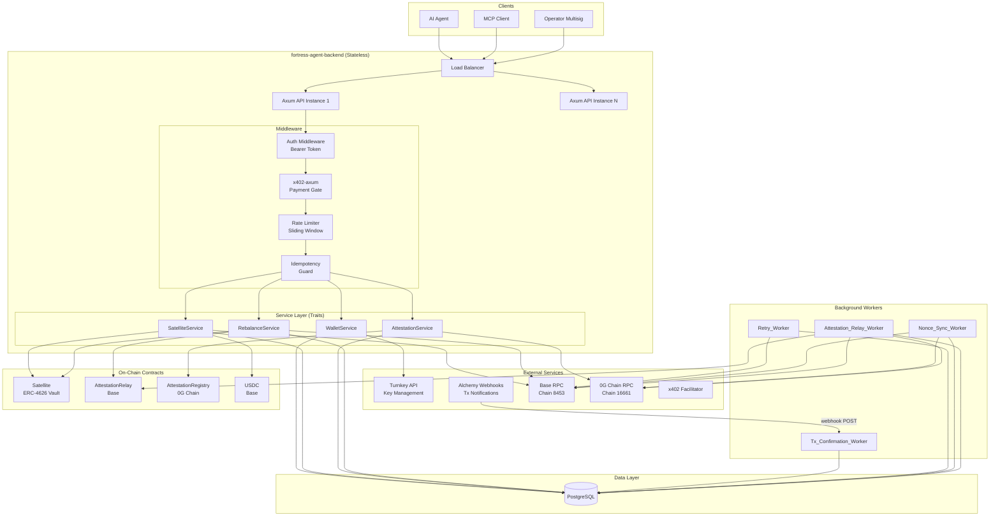
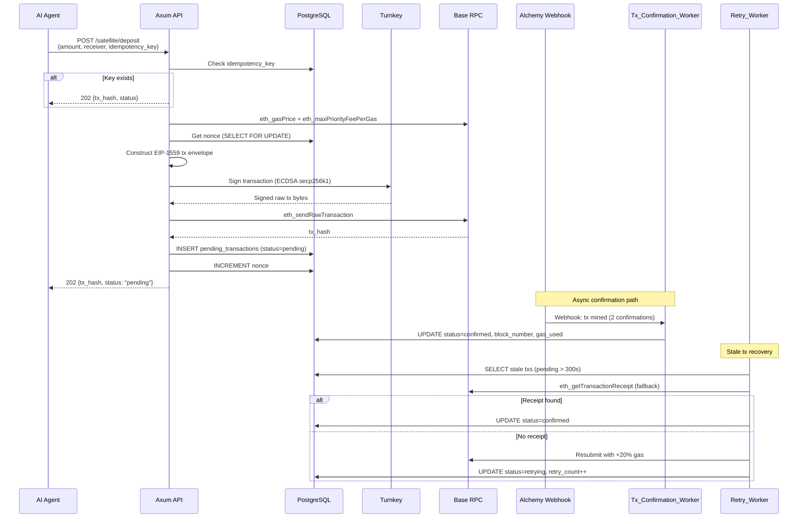
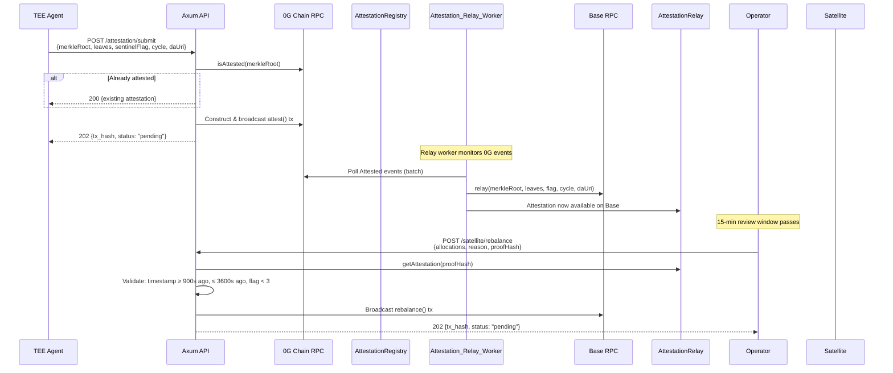
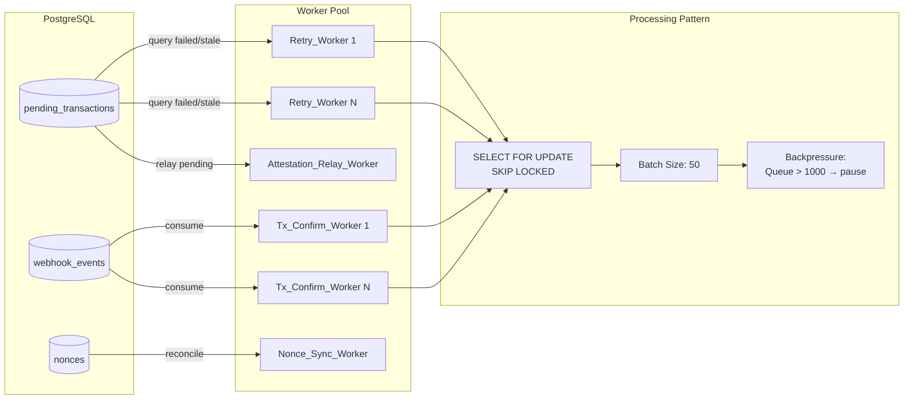
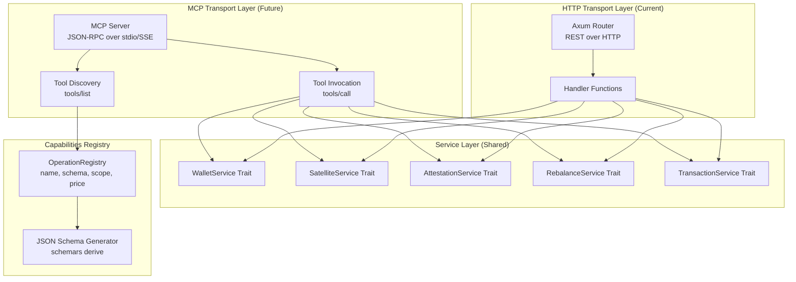
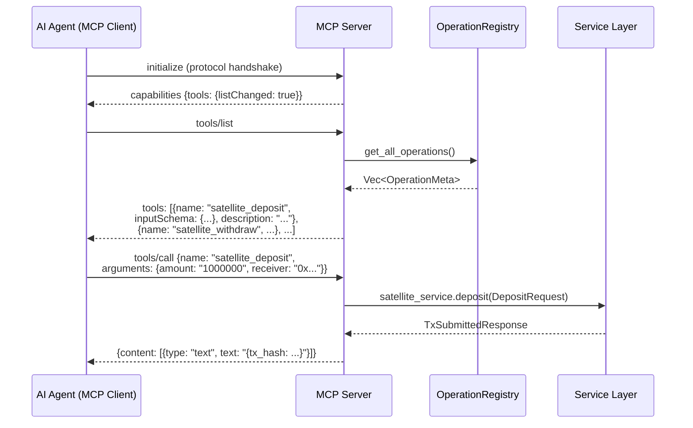
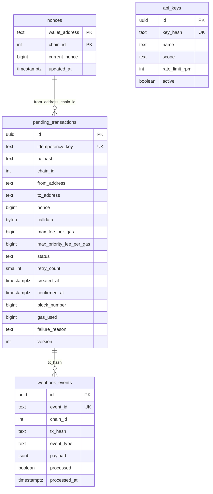
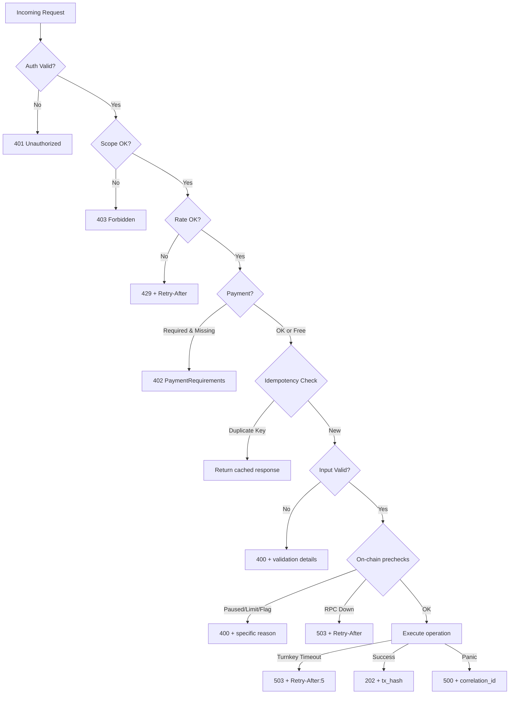

# Design Document: fortress-agent-backend

## Overview

The fortress-agent-backend is a production-grade Rust service built on Axum that provides non-custodial wallet infrastructure and blockchain interaction capabilities for AI agents operating within the FORTRESS protocol. It serves as the execution layer between TEE-sealed AI agents and on-chain smart contracts across Base (chain 8453) and 0G Chain (chain 16661).

The system follows an **async worker architecture**: the API layer constructs, signs (via Turnkey), and broadcasts transactions, then returns HTTP 202 immediately. Specialized background workers handle transaction lifecycle (confirmation via Alchemy webhooks, retries, nonce reconciliation, and attestation relay monitoring). The `pending_transactions` table is the central data structure connecting API and workers.

Key design principles:
- **Stateless API**: No in-process state; all state lives in PostgreSQL
- **Idempotent writes**: Every mutation requires a client-supplied idempotency key
- **Webhook-driven**: No polling; Alchemy Notify pushes tx state changes
- **Horizontal scaling**: Multiple API instances + multiple worker instances using `SELECT FOR UPDATE SKIP LOCKED`
- **Trait-based service layer**: All business logic behind traits, enabling both HTTP and future MCP transports

### Contract Addresses (Mainnet)

| Contract | Chain | Address |
|----------|-------|---------|
| Satellite (frtUSD-C) | Base 8453 | `0x1493522095857A3e28e6573E8a1f6b612dd30B40` |
| AttestationRelay | Base 8453 | `0x1f2Bda259365BF10210AB6C8C0F4A211eE2be5FC` |
| AttestationRegistry | 0G 16661 | `0x252709C4569E096BD4babe3be9175Ca2F49f152F` |
| USDC | Base 8453 | `0x833589fCD6eDb6E08f4c7C32D4f71b54bdA02913` |

## Architecture

### High-Level System Architecture



### Transaction Lifecycle Flow



### Attestation and Rebalance Flow



### Worker Architecture



## Components and Interfaces

### Rust Project File Structure

```
fortress-agent-backend/
├── Cargo.toml
├── Cargo.lock
├── chains.toml                     # Chain/contract configuration
├── config.toml                     # Operational settings
├── .env.example
├── migrations/
│   ├── 001_create_pending_transactions.sql
│   ├── 002_create_nonces.sql
│   ├── 003_create_webhook_events.sql
│   └── 004_create_api_keys.sql
├── src/
│   ├── main.rs                     # Entrypoint, server bootstrap
│   ├── lib.rs                      # Library root, re-exports
│   ├── config/
│   │   ├── mod.rs
│   │   ├── chains.rs               # chains.toml parser + validation
│   │   ├── settings.rs             # config.toml + env var loading
│   │   └── types.rs                # ChainConfig, ContractAddresses types
│   ├── api/
│   │   ├── mod.rs
│   │   ├── router.rs               # Axum router assembly
│   │   ├── handlers/
│   │   │   ├── mod.rs
│   │   │   ├── wallet.rs           # POST /wallet/create, GET /wallet/list
│   │   │   ├── satellite.rs        # POST /satellite/{deposit,withdraw,buy,sell}
│   │   │   ├── rebalance.rs        # POST /satellite/rebalance
│   │   │   ├── attestation.rs      # POST /attestation/submit
│   │   │   ├── transaction.rs      # GET /tx/{hash}
│   │   │   ├── health.rs           # GET /health
│   │   │   ├── metrics.rs          # GET /metrics
│   │   │   ├── config_info.rs      # GET /config/chains
│   │   │   ├── capabilities.rs     # GET /capabilities
│   │   │   └── webhook.rs          # POST /webhook/alchemy
│   │   ├── middleware/
│   │   │   ├── mod.rs
│   │   │   ├── auth.rs             # Bearer token extraction + validation
│   │   │   ├── rate_limit.rs       # Sliding window rate limiter
│   │   │   ├── idempotency.rs      # Idempotency key check
│   │   │   └── x402.rs             # x402-axum payment gate
│   │   ├── errors.rs               # AppError enum, IntoResponse impl
│   │   └── extractors.rs           # Custom Axum extractors
│   ├── services/
│   │   ├── mod.rs
│   │   ├── traits.rs               # Service trait definitions
│   │   ├── wallet.rs               # WalletService impl
│   │   ├── satellite.rs            # SatelliteService impl
│   │   ├── attestation.rs          # AttestationService impl
│   │   ├── rebalance.rs            # RebalanceService impl
│   │   └── capabilities.rs         # CapabilitiesService (JSON Schema gen)
│   ├── workers/
│   │   ├── mod.rs
│   │   ├── tx_confirmation.rs      # Alchemy webhook consumer
│   │   ├── retry.rs                # Failed/stale tx resubmission
│   │   ├── nonce_sync.rs           # Periodic nonce reconciliation
│   │   └── attestation_relay.rs    # 0G → Base attestation relay
│   ├── chain/
│   │   ├── mod.rs
│   │   ├── rpc.rs                  # JSON-RPC client (batch support)
│   │   ├── tx_builder.rs           # EIP-1559 transaction construction
│   │   ├── abi.rs                  # ABI encoding (Satellite, Registry, USDC)
│   │   └── types.rs                # EthAddress, TxHash, etc.
│   ├── turnkey/
│   │   ├── mod.rs
│   │   ├── client.rs               # Turnkey HTTP client
│   │   ├── stamper.rs              # API key stamping (P-256 ECDSA)
│   │   └── types.rs                # Turnkey request/response types
│   ├── x402/
│   │   ├── mod.rs
│   │   ├── server.rs               # x402-axum integration
│   │   └── client.rs               # x402-reqwest outbound payments
│   ├── db/
│   │   ├── mod.rs
│   │   ├── pool.rs                 # sqlx PgPool setup
│   │   ├── pending_transactions.rs # CRUD for pending_transactions
│   │   ├── nonces.rs               # Nonce read/write/sync
│   │   ├── webhook_events.rs       # Webhook event storage
│   │   └── api_keys.rs             # API key lookup
│   ├── models/
│   │   ├── mod.rs
│   │   ├── transaction.rs          # PendingTransaction, TxStatus enum
│   │   ├── wallet.rs               # Wallet, WalletCreateResponse
│   │   ├── attestation.rs          # Attestation, AttestSubmitRequest
│   │   ├── rebalance.rs            # VaultAllocation, RebalanceRequest
│   │   └── satellite.rs            # DepositRequest, WithdrawRequest, etc.
│   └── telemetry/
│       ├── mod.rs
│       ├── logging.rs              # tracing + JSON structured logs
│       └── metrics.rs              # Prometheus counters/histograms
├── tests/
│   ├── integration/
│   │   ├── mod.rs
│   │   ├── wallet_test.rs
│   │   ├── satellite_test.rs
│   │   ├── attestation_test.rs
│   │   ├── webhook_test.rs
│   │   └── helpers.rs
│   └── property/
│       ├── mod.rs
│       ├── tx_builder_props.rs
│       ├── nonce_sync_props.rs
│       ├── idempotency_props.rs
│       └── config_props.rs
└── benches/
    └── throughput.rs
```

### chains.toml Format

```toml
# chains.toml — Single source of truth for chain/contract configuration

[mainnet.base]
chain_id = 8453
rpc_url = "https://base-mainnet.g.alchemy.com/v2/${ALCHEMY_BASE_KEY}"
ws_url = "wss://base-mainnet.g.alchemy.com/v2/${ALCHEMY_BASE_KEY}"
block_confirmations = 2
alchemy_webhook_signing_key = "${ALCHEMY_BASE_WEBHOOK_KEY}"

[mainnet.base.contracts]
satellite = "0x1493522095857A3e28e6573E8a1f6b612dd30B40"
attestation_relay = "0x1f2Bda259365BF10210AB6C8C0F4A211eE2be5FC"
usdc = "0x833589fCD6eDb6E08f4c7C32D4f71b54bdA02913"

[mainnet.og_chain]
chain_id = 16661
rpc_url = "https://evmrpc.0g.ai"
block_confirmations = 1
alchemy_webhook_signing_key = ""

[mainnet.og_chain.contracts]
attestation_registry = "0x252709C4569E096BD4babe3be9175Ca2F49f152F"

[testnet.base]
chain_id = 84532
rpc_url = "https://base-sepolia.g.alchemy.com/v2/${ALCHEMY_BASE_SEPOLIA_KEY}"
ws_url = "wss://base-sepolia.g.alchemy.com/v2/${ALCHEMY_BASE_SEPOLIA_KEY}"
block_confirmations = 2
alchemy_webhook_signing_key = "${ALCHEMY_BASE_SEPOLIA_WEBHOOK_KEY}"

[testnet.base.contracts]
satellite = "0x..."
attestation_relay = "0x..."
usdc = "0x..."

[testnet.og_chain]
chain_id = 16600
rpc_url = "https://evmrpc-testnet.0g.ai"
block_confirmations = 1
alchemy_webhook_signing_key = ""

[testnet.og_chain.contracts]
attestation_registry = "0x..."
```

### Service Traits (Core Interface)

```rust
/// Core service traits — both HTTP handlers and future MCP transport delegate here.
/// Each operation is a single trait method with typed request/response.

#[async_trait]
pub trait WalletService: Send + Sync {
    async fn create_wallet(&self, req: CreateWalletRequest) -> Result<CreateWalletResponse, AppError>;
    async fn list_wallets(&self) -> Result<ListWalletsResponse, AppError>;
    async fn sign_transaction(&self, req: SignTransactionRequest) -> Result<SignTransactionResponse, AppError>;
}

#[async_trait]
pub trait SatelliteService: Send + Sync {
    async fn deposit(&self, req: DepositRequest) -> Result<TxSubmittedResponse, AppError>;
    async fn withdraw(&self, req: WithdrawRequest) -> Result<TxSubmittedResponse, AppError>;
    async fn buy(&self, req: BuyRequest) -> Result<TxSubmittedResponse, AppError>;
    async fn sell(&self, req: SellRequest) -> Result<TxSubmittedResponse, AppError>;
    async fn vault_info(&self) -> Result<VaultInfoResponse, AppError>;
}

#[async_trait]
pub trait RebalanceService: Send + Sync {
    async fn rebalance(&self, req: RebalanceRequest) -> Result<TxSubmittedResponse, AppError>;
}

#[async_trait]
pub trait AttestationService: Send + Sync {
    async fn submit(&self, req: AttestSubmitRequest) -> Result<AttestSubmitResponse, AppError>;
}

#[async_trait]
pub trait TransactionService: Send + Sync {
    async fn get_status(&self, tx_hash: TxHash) -> Result<TxStatusResponse, AppError>;
}
```

### MCP Server Architecture



#### MCP Tool Discovery Flow



#### MCP Operation Registration

Each operation is registered at startup with full metadata:

```rust
pub struct OperationMeta {
    pub name: &'static str,           // "satellite_deposit"
    pub description: &'static str,    // "Deposit USDC into Satellite vault"
    pub input_schema: Value,          // JSON Schema from schemars
    pub output_schema: Value,         // JSON Schema from schemars
    pub permission_scope: Scope,      // ReadOnly | Transact | Admin
    pub x402_price_usdc: Option<u64>, // 6-decimal integer, None = free
    pub errors: Vec<ErrorMeta>,       // Possible error conditions
}
```

## API Reference

### Authentication

All endpoints (except `/health` and `/webhook/alchemy`) require a `Bearer` token in the `Authorization` header.

```
Authorization: Bearer <api_key>
```

Permission scopes: `read-only`, `transact`, `admin`.

### Endpoints

| Method | Path | Scope | x402 | Description |
|--------|------|-------|------|-------------|
| GET | `/health` | none | no | Service health check |
| GET | `/metrics` | read-only | no | Prometheus metrics |
| GET | `/config/chains` | read-only | no | Resolved chain config (no secrets) |
| GET | `/capabilities` | read-only | no | MCP-ready operation manifest |
| POST | `/wallet/create` | admin | no | Create Turnkey wallet |
| GET | `/wallet/list` | admin | no | List all wallets |
| POST | `/satellite/deposit` | transact | yes | Deposit USDC into Satellite |
| POST | `/satellite/withdraw` | transact | yes | Withdraw USDC from Satellite |
| POST | `/satellite/buy` | transact | yes | PSM buy (USDC → frtUSD) |
| POST | `/satellite/sell` | transact | yes | PSM sell (frtUSD → USDC) |
| GET | `/satellite/info` | read-only | no | Vault totalAssets, sharePrice, vaultCount |
| POST | `/satellite/rebalance` | admin | no | Submit rebalance tx |
| POST | `/attestation/submit` | transact | yes | Submit attestation to 0G |
| GET | `/tx/{hash}` | read-only | no | Transaction lifecycle status |
| POST | `/webhook/alchemy` | none* | no | Alchemy webhook ingestion |

*Webhook authenticated via HMAC signature verification.

### Request/Response Schemas

#### POST /wallet/create

```json
// Request
{
  "idempotency_key": "uuid-v4"
}

// Response 201
{
  "address": "0xChecksumed...",
  "key_id": "turnkey-key-uuid",
  "created_at": "2025-01-01T00:00:00Z"
}
```

#### POST /satellite/deposit

```json
// Request
{
  "amount": "1000000",       // USDC amount (6 decimals)
  "receiver": "0x...",       // Share recipient
  "wallet_id": "turnkey-key-uuid",
  "idempotency_key": "uuid-v4"
}

// Response 202
{
  "tx_hash": "0x...",
  "status": "pending",
  "chain_id": 8453
}
```

#### POST /satellite/withdraw

```json
// Request
{
  "amount": "1000000",
  "receiver": "0x...",
  "owner": "0x...",
  "wallet_id": "turnkey-key-uuid",
  "idempotency_key": "uuid-v4"
}

// Response 202
{
  "tx_hash": "0x...",
  "status": "pending",
  "chain_id": 8453
}
```

#### POST /satellite/buy

```json
// Request
{
  "usdc_amount": "1000000",
  "wallet_id": "turnkey-key-uuid",
  "idempotency_key": "uuid-v4"
}

// Response 202
{
  "tx_hash": "0x...",
  "status": "pending",
  "chain_id": 8453
}
```

#### POST /satellite/sell

```json
// Request
{
  "token_amount": "1000000000000",  // frtUSD shares (18 decimals)
  "wallet_id": "turnkey-key-uuid",
  "idempotency_key": "uuid-v4"
}

// Response 202
{
  "tx_hash": "0x...",
  "status": "pending",
  "chain_id": 8453
}
```

#### POST /satellite/rebalance

```json
// Request
{
  "allocations": [
    {
      "vault_index": 0,
      "allocation_bps": 3000,
      "protocol_params": "0x..."   // ABI-encoded bytes
    }
  ],
  "reason": "Risk:YELLOW | Moderate yield divergence",
  "proof_hash": "0x...",           // bytes32
  "wallet_id": "turnkey-key-uuid",
  "idempotency_key": "uuid-v4"
}

// Response 202
{
  "tx_hash": "0x...",
  "status": "pending",
  "chain_id": 8453
}
```

#### POST /attestation/submit

```json
// Request
{
  "merkle_root": "0x...",          // bytes32
  "cartographer_leaf": "0x...",    // bytes32
  "sentinel_leaf": "0x...",        // bytes32
  "strategist_leaf": "0x...",      // bytes32
  "sentinel_flag": 0,             // uint8 (0-4)
  "cycle": 12345,                 // uint64
  "da_uri": "0g-storage://galileo/...",
  "wallet_id": "turnkey-key-uuid",
  "idempotency_key": "uuid-v4"
}

// Response 202
{
  "tx_hash": "0x...",
  "status": "pending",
  "chain_id": 16661
}

// Response 200 (already attested)
{
  "attestation": {
    "merkle_root": "0x...",
    "cartographer_leaf": "0x...",
    "sentinel_leaf": "0x...",
    "strategist_leaf": "0x...",
    "sentinel_flag": 0,
    "cycle": 12345,
    "timestamp": 1700000000,
    "da_uri": "0g-storage://...",
    "attester": "0x..."
  }
}
```

#### GET /tx/{hash}

```json
// Response 200
{
  "tx_hash": "0x...",
  "chain_id": 8453,
  "status": "confirmed",        // pending | confirmed | failed | retrying
  "from_address": "0x...",
  "to_address": "0x...",
  "nonce": 42,
  "created_at": "2025-01-01T00:00:00Z",
  "confirmed_at": "2025-01-01T00:00:15Z",
  "block_number": 12345678,
  "gas_used": 150000,
  "retry_count": 0,
  "failure_reason": null
}
```

#### GET /health

```json
// Response 200 (healthy) or 503 (degraded)
{
  "version": "0.1.0",
  "uptime_seconds": 86400,
  "rpc_status": {
    "base": true,
    "og_chain": true
  },
  "workers": {
    "tx_confirmation": "running",
    "retry": "running",
    "nonce_sync": "running",
    "attestation_relay": "running"
  },
  "database": true
}
```

#### GET /capabilities

```json
// Response 200
{
  "operations": [
    {
      "name": "satellite_deposit",
      "description": "Deposit USDC into Satellite ERC-4626 vault",
      "input_schema": { /* JSON Schema */ },
      "output_schema": { /* JSON Schema */ },
      "permission_scope": "transact",
      "x402_price_usdc": 100000,
      "errors": [
        {"name": "ZeroAmount", "description": "Deposit amount must be > 0"},
        {"name": "DepositLimitExceeded", "description": "Would exceed vault deposit cap"},
        {"name": "VaultPaused", "description": "Satellite contract is paused"}
      ]
    }
  ]
}
```

#### POST /webhook/alchemy

```json
// Request (from Alchemy)
{
  "webhookId": "...",
  "id": "event-uuid",
  "createdAt": "2025-01-01T00:00:00Z",
  "type": "MINED_TRANSACTION",
  "event": {
    "network": "BASE_MAINNET",
    "transaction": {
      "hash": "0x...",
      "status": 1,
      "blockNumber": "0x...",
      "gasUsed": "0x..."
    }
  }
}

// Response 200
{"ok": true}
```

### Error Response Format

All errors follow a consistent structure:

```json
{
  "error": {
    "code": "DEPOSIT_LIMIT_EXCEEDED",
    "message": "Deposit would exceed vault limit",
    "correlation_id": "uuid-v4",
    "details": {
      "current_total_assets": "950000000000",
      "deposit_limit": "1000000000000",
      "requested_amount": "100000000000"
    }
  }
}
```

## Data Models

### Database Schema

```sql
-- pending_transactions: Central lifecycle table
CREATE TABLE pending_transactions (
    id              UUID PRIMARY KEY DEFAULT gen_random_uuid(),
    idempotency_key TEXT NOT NULL,
    tx_hash         TEXT,
    chain_id        INTEGER NOT NULL,
    from_address    TEXT NOT NULL,
    to_address      TEXT NOT NULL,
    nonce           BIGINT NOT NULL,
    calldata        BYTEA NOT NULL,
    max_fee_per_gas BIGINT NOT NULL,
    max_priority_fee_per_gas BIGINT NOT NULL,
    value           NUMERIC(78, 0) NOT NULL DEFAULT 0,
    status          TEXT NOT NULL DEFAULT 'pending'
                    CHECK (status IN ('pending', 'confirmed', 'failed', 'retrying')),
    retry_count     SMALLINT NOT NULL DEFAULT 0,
    created_at      TIMESTAMPTZ NOT NULL DEFAULT now(),
    updated_at      TIMESTAMPTZ NOT NULL DEFAULT now(),
    confirmed_at    TIMESTAMPTZ,
    block_number    BIGINT,
    gas_used        BIGINT,
    failure_reason  TEXT,
    version         INTEGER NOT NULL DEFAULT 1  -- optimistic locking
);

CREATE UNIQUE INDEX idx_pending_tx_idempotency ON pending_transactions(idempotency_key);
CREATE INDEX idx_pending_tx_hash ON pending_transactions(tx_hash);
CREATE INDEX idx_pending_tx_status ON pending_transactions(status, created_at);
CREATE INDEX idx_pending_tx_stale ON pending_transactions(status, updated_at)
    WHERE status = 'pending';

-- Partitioning by chain_id
-- In production: partition pending_transactions by LIST (chain_id)
-- and sub-partition by RANGE (created_at) monthly

-- nonces: Local nonce tracker
CREATE TABLE nonces (
    wallet_address  TEXT NOT NULL,
    chain_id        INTEGER NOT NULL,
    current_nonce   BIGINT NOT NULL DEFAULT 0,
    updated_at      TIMESTAMPTZ NOT NULL DEFAULT now(),
    PRIMARY KEY (wallet_address, chain_id)
);

-- webhook_events: Idempotent event processing
CREATE TABLE webhook_events (
    id              UUID PRIMARY KEY DEFAULT gen_random_uuid(),
    event_id        TEXT NOT NULL UNIQUE,  -- Alchemy event ID
    chain_id        INTEGER NOT NULL,
    tx_hash         TEXT NOT NULL,
    event_type      TEXT NOT NULL,         -- MINED_TRANSACTION, DROPPED_TRANSACTION
    payload         JSONB NOT NULL,
    processed       BOOLEAN NOT NULL DEFAULT false,
    processed_at    TIMESTAMPTZ,
    created_at      TIMESTAMPTZ NOT NULL DEFAULT now()
);

CREATE INDEX idx_webhook_unprocessed ON webhook_events(processed, created_at)
    WHERE processed = false;

-- api_keys: Authentication and rate limiting
CREATE TABLE api_keys (
    id              UUID PRIMARY KEY DEFAULT gen_random_uuid(),
    key_hash        TEXT NOT NULL UNIQUE,  -- SHA-256 of the API key
    name            TEXT NOT NULL,
    scope           TEXT NOT NULL CHECK (scope IN ('read-only', 'transact', 'admin')),
    rate_limit_rpm  INTEGER NOT NULL DEFAULT 60,
    active          BOOLEAN NOT NULL DEFAULT true,
    created_at      TIMESTAMPTZ NOT NULL DEFAULT now()
);
```

### Entity Relationship Diagram




## Correctness Properties

*A property is a characteristic or behavior that should hold true across all valid executions of a system — essentially, a formal statement about what the system should do. Properties serve as the bridge between human-readable specifications and machine-verifiable correctness guarantees.*

### Property 1: Idempotency Preservation

*For any* write operation (wallet creation, transaction broadcast, attestation submission) submitted with the same idempotency key N times (N ≥ 2), the system SHALL return identical responses for all submissions after the first, and the database SHALL contain exactly one row for that idempotency key.

**Validates: Requirements 1.2, 2.10, 5.4**

### Property 2: EIP-1559 Gas Parameter Construction

*For any* base fee B and priority fee P (where P is capped at 2 gwei), the constructed transaction envelope SHALL have `maxPriorityFeePerGas = min(P, 2_000_000_000)` and `maxFeePerGas = (2 × B) + maxPriorityFeePerGas`, and the transaction type SHALL be 2.

**Validates: Requirements 2.1**

### Property 3: ABI Encoding Round-Trip

*For any* valid Solidity function call parameters (uint256, address, bytes32, uint8, uint64, string, tuple arrays matching Satellite/AttestationRegistry signatures), encoding then decoding the calldata SHALL produce values equal to the original parameters.

**Validates: Requirements 2.3, 3.1, 3.3, 3.5, 4.1, 5.1**

### Property 4: Nonce Monotonic Increment

*For any* sequence of N successful transaction broadcasts from the same wallet on the same chain, the nonce values assigned SHALL be consecutive integers (nonce_0, nonce_0+1, ..., nonce_0+N-1), and the local nonce tracker SHALL equal nonce_0+N after all broadcasts complete.

**Validates: Requirements 2.2, 2.6**

### Property 5: Revert Reason Decoding

*For any* ABI-encoded revert data (Error(string) or custom error with known signature), the decoder SHALL extract the human-readable error message, and decoding then re-encoding SHALL produce the original bytes.

**Validates: Requirements 2.5**

### Property 6: Allowance-Conditional Approve

*For any* (current_allowance, required_amount) pair, the system SHALL construct an ERC-20 `approve()` transaction if and only if `current_allowance < required_amount`. When `current_allowance >= required_amount`, no approve transaction SHALL be constructed.

**Validates: Requirements 3.2, 3.4**

### Property 7: Deposit Limit Enforcement

*For any* (total_assets, deposit_limit, requested_amount) triple, the system SHALL reject the deposit if and only if `total_assets + requested_amount > deposit_limit`, and SHALL accept the deposit if and only if `total_assets + requested_amount <= deposit_limit`.

**Validates: Requirements 3.9**

### Property 8: Rebalance Pre-Condition Validation

*For any* (current_timestamp, attestation_timestamp, sentinel_flag) triple, a rebalance request SHALL be accepted if and only if all three conditions hold: (1) `current_timestamp - attestation_timestamp >= 900`, (2) `current_timestamp - attestation_timestamp <= 3600`, and (3) `sentinel_flag < 3`. If any condition fails, the system SHALL indicate which specific check failed.

**Validates: Requirements 4.3, 4.4, 4.5**

### Property 9: Turnkey API Stamp Correctness

*For any* request body bytes, the generated X-Stamp header SHALL be a valid ECDSA P-256 signature that verifies against the configured API public key over the SHA-256 hash of the body.

**Validates: Requirements 1.7**

### Property 10: Webhook Signature Verification

*For any* (payload, signing_key) pair, the system SHALL accept the webhook if and only if the provided HMAC-SHA256 signature matches the computed HMAC of the payload using the per-chain signing key. Invalid signatures SHALL be rejected.

**Validates: Requirements 12.2**

### Property 11: Transaction State Machine

*For any* pending transaction receiving a webhook event, the state transition SHALL be: (1) mined event with confirmations ≥ threshold → status becomes "confirmed" with block_number and gas_used populated, (2) dropped/failed event → status becomes "failed" with failure_reason populated, (3) event referencing unknown tx_hash → no state change occurs. No other transitions from "pending" SHALL occur via webhook.

**Validates: Requirements 12.3, 12.4, 12.6**

### Property 12: Webhook Processing Idempotency

*For any* webhook event processed N times (N ≥ 1), the resulting database state SHALL be identical to processing it exactly once. Duplicate event_id insertions SHALL be silently ignored.

**Validates: Requirements 12.7**

### Property 13: Gas Escalation Formula

*For any* failed transaction with current maxFeePerGas G and retry_count R (0 ≤ R < 3), the resubmitted transaction SHALL have maxFeePerGas = min(G × 1.2, 500_000_000_000) and retry_count = R + 1. When R = 3, no resubmission SHALL occur and status SHALL become permanently failed.

**Validates: Requirements 13.2, 13.3**

### Property 14: Rate Limit Independence

*For any* two distinct API keys K1 and K2 with rate limits L1 and L2 respectively, requests made under K1 SHALL have no effect on the remaining capacity of K2, and vice versa. Each key's sliding window counter SHALL be independent.

**Validates: Requirements 10.3, 10.5**

### Property 15: Scope-Based Access Control

*For any* (api_key_scope, endpoint_required_scope) pair, access SHALL be granted if and only if the key's scope includes the required scope (admin includes transact includes read-only). Scope hierarchy: admin ⊃ transact ⊃ read-only.

**Validates: Requirements 10.5, 10.6**

### Property 16: Configuration Validation Completeness

*For any* chains.toml configuration with one or more missing required fields or invalid Ethereum addresses (not 40-hex-character), the startup validator SHALL reject the configuration and produce an error message naming each specific invalid field.

**Validates: Requirements 8.4, 8.7**

### Property 17: Nonce Sync Correction

*For any* (database_nonce, on_chain_nonce) pair where the values differ, the Nonce_Sync_Worker SHALL update the database nonce to equal the on-chain value and log the old and new values.

**Validates: Requirements 14.7**

### Property 18: Concurrent Worker Exclusivity (SKIP LOCKED)

*For any* set of N pending work items processed by M concurrent worker instances (M > 1), each item SHALL be processed by exactly one worker instance. No item SHALL be processed by two workers, and no item SHALL be skipped indefinitely.

**Validates: Requirements 14.10, 15.3**

## Error Handling

### Error Categories

| Category | HTTP Status | Retry Strategy |
|----------|-------------|----------------|
| Validation Error | 400 | No retry (client fix) |
| Authentication Failed | 401 | No retry (fix credentials) |
| Payment Required | 402 | Retry with valid payment |
| Insufficient Scope | 403 | No retry (upgrade key) |
| Resource Not Found | 404 | No retry |
| Rate Limited | 429 | Retry after `Retry-After` seconds |
| RPC Unavailable | 503 | Retry with exponential backoff |
| Settlement Timeout | 504 | Retry payment flow |
| Internal Error | 500 | Report correlation ID |

### Error Propagation Flow



### Worker Error Handling

- **Recoverable errors** (RPC timeout, temporary DB lock): Retry with backoff, item returns to queue
- **Unrecoverable errors** (malformed data, impossible state): Log at `error!` level with full context, skip item, increment failure metric, continue processing next item
- **Worker crash prevention**: Each item is processed in a `catch_unwind` boundary; panics are logged but don't kill the worker
- **Dead letter queue**: Items that fail 3 times across all retry strategies are moved to a `dead_letter` status for manual investigation

### Correlation ID Propagation

Every request receives a UUID v4 correlation ID at the middleware layer. This ID is:
1. Included in all log entries for the request lifecycle
2. Propagated to Turnkey API calls as `X-Request-Id`
3. Stored in `pending_transactions` as metadata
4. Returned in error responses for support debugging
5. Included in webhook processing logs to trace tx → webhook → worker chain

## Testing Strategy

### Testing Approach

The testing strategy uses a **dual approach** combining property-based tests for universal correctness guarantees with example-based tests for specific scenarios and integration points.

### Property-Based Testing

**Library**: [proptest](https://crates.io/crates/proptest) (Rust)

**Configuration**: Minimum 100 iterations per property test (256 default cases in proptest).

**Tag format**: Each property test includes a doc comment referencing the design property:
```rust
/// Feature: fortress-agent-backend, Property 2: EIP-1559 Gas Parameter Construction
#[test]
fn prop_eip1559_gas_params() { ... }
```

**Properties tested via PBT (from Correctness Properties above):**
- Property 1: Idempotency preservation (generate random requests with same keys)
- Property 2: EIP-1559 gas calculation (generate random base/priority fees)
- Property 3: ABI encoding round-trip (generate random valid Solidity params)
- Property 4: Nonce monotonic increment (generate random broadcast sequences)
- Property 5: Revert reason decoding (generate random error data)
- Property 6: Allowance-conditional approve (generate random allowance/amount pairs)
- Property 7: Deposit limit enforcement (generate random asset/limit/amount triples)
- Property 8: Rebalance pre-condition validation (generate random timestamp/flag triples)
- Property 9: Turnkey API stamp correctness (generate random request bodies)
- Property 10: Webhook HMAC verification (generate random payload/key pairs)
- Property 11: Transaction state machine (generate random events for pending txs)
- Property 12: Webhook idempotency (generate random events, process multiple times)
- Property 13: Gas escalation formula (generate random gas/retry pairs)
- Property 14: Rate limit independence (generate random key/request sequences)
- Property 15: Scope-based access control (generate random scope/endpoint pairs)
- Property 16: Config validation (generate random configs with invalid fields)
- Property 17: Nonce sync correction (generate random divergent nonce pairs)
- Property 18: Concurrent worker exclusivity (simulate concurrent processing)

### Unit Tests (Example-Based)

Focus areas:
- Turnkey API error mapping (401, 503, timeout)
- Specific contract interaction examples (deposit 1 USDC, sell 100 frtUSD)
- Webhook payload parsing for each event type
- Configuration loading from known TOML files
- Health endpoint response format

### Integration Tests

- Full request lifecycle: API → DB → mock RPC → webhook → confirmed
- Turnkey mock: wallet creation, signing flows
- x402 payment flow: 402 → payment → success
- Worker processing: enqueue items, verify consumption
- Database migrations: verify schema correctness

### Test Infrastructure

```
tests/
├── integration/          # Full HTTP tests with test DB
│   ├── helpers.rs       # Test harness: spawn server, mock RPCs
│   ├── wallet_test.rs
│   ├── satellite_test.rs
│   ├── attestation_test.rs
│   └── webhook_test.rs
└── property/            # proptest-based property tests
    ├── tx_builder_props.rs     # Properties 2, 3, 4, 5
    ├── nonce_sync_props.rs     # Properties 4, 17
    ├── idempotency_props.rs    # Properties 1, 12
    ├── config_props.rs         # Property 16
    ├── auth_props.rs           # Properties 14, 15
    ├── validation_props.rs     # Properties 6, 7, 8
    ├── gas_props.rs            # Property 13
    ├── webhook_props.rs        # Properties 10, 11
    └── worker_props.rs         # Property 18
```
