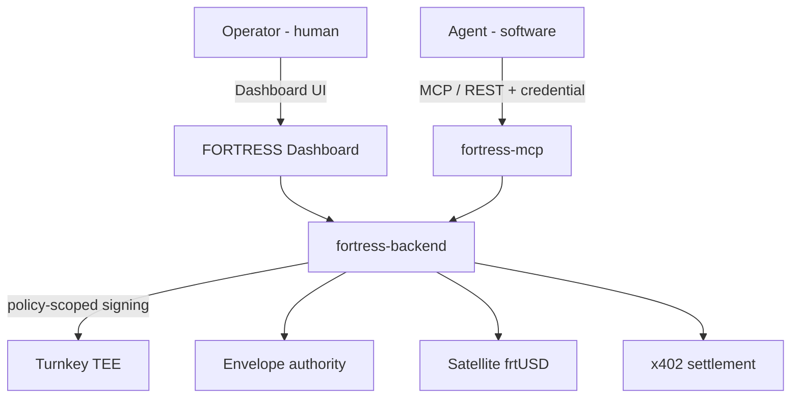
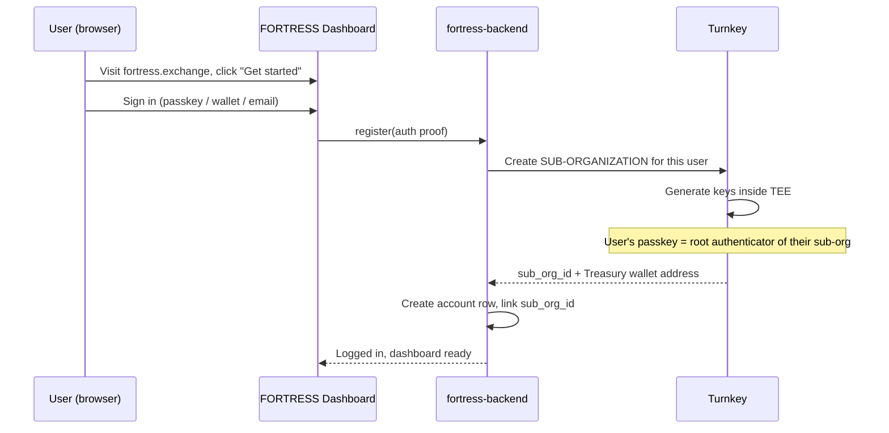
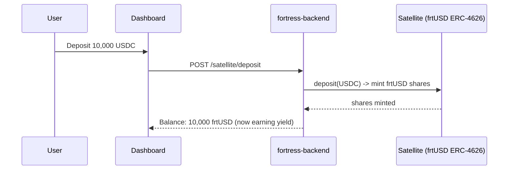
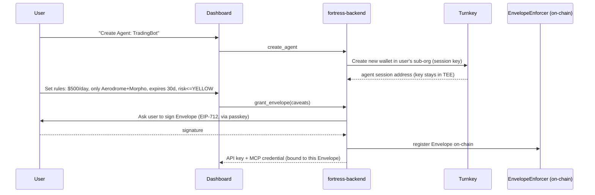
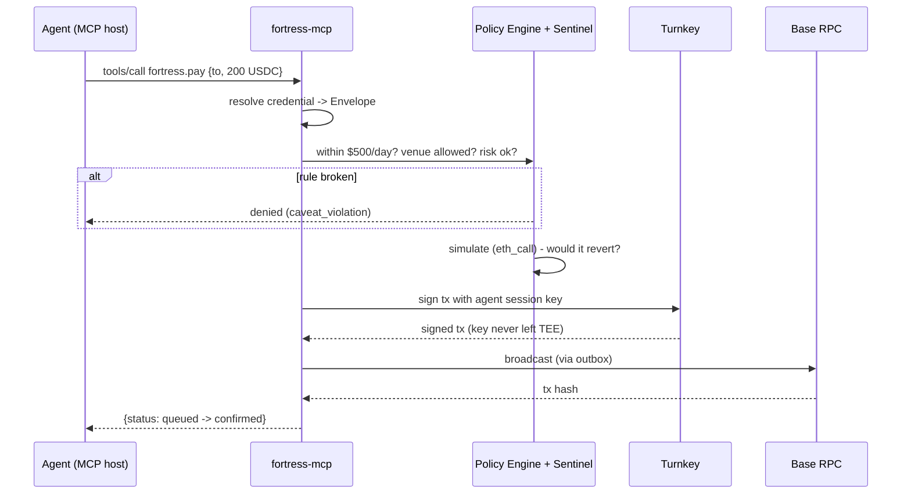
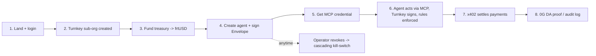

# Design Document: FORTRESS User Flows

## Purpose

This document walks the **end-to-end journey** from a user first landing on the dashboard to an
AI agent autonomously spending under enforced rules. It explains where **Turnkey** (key custody),
the **Envelope** (authority), the **MCP layer** (agent access), and **x402** (payments) each plug
in — and lays out the two-phase x402 plan (spending rail at launch, monetization layer at scale).

It complements:
- [`README.md`](./README.md) — the execution backend (outbox, nonces, simulation, workers).
- [`AGENT_RAILS_AND_MCP.md`](./AGENT_RAILS_AND_MCP.md) — the Envelope authority layer + MCP access layer.

---

## 1. Mental Model: Two Distinct Users

Keeping these two separate makes every flow below intuitive.

| Actor | Who/what | How they interact | What they can do |
|-------|----------|-------------------|------------------|
| **Operator** | A human (fleet owner / team) | Dashboard UI | Log in, fund treasury, create agents, set rules, revoke |
| **Agent** | Software (the AI bot) | MCP / REST + API credential | Only the actions its Envelope allows; never touches the dashboard |

And one piece of infrastructure that sits behind both:

- **Turnkey** — a key vault running inside a secure enclave (TEE). Raw private keys never leave
  it. Neither the operator's browser nor FORTRESS servers ever hold a key; Turnkey signs only
  when policy allows. This is what makes the system **non-custodial**.



---

## 2. Flow A — Land, Connect, Register (linking to Turnkey)



**In plain terms:**
1. The user logs in with a **passkey** (or wallet / email).
2. FORTRESS asks Turnkey to create a **sub-organization** for that user — their own private safe
   inside Turnkey.
3. Turnkey generates keys **inside the enclave**. The user's passkey is the master authenticator
   of their safe. FORTRESS holds only a **policy-scoped API key** — it can request signatures that
   match the rules, but cannot drain the safe.

At the end of this flow the user has a **Treasury Account** address — but it is empty.

---

## 3. Flow B — Fund the Treasury (idle cash starts earning)



USDC goes in, **frtUSD** (yield-bearing dollar, ERC-4626) comes back. From this moment the
treasury earns yield while it waits to be spent — the differentiator vs. wallets that hold idle
USDC.

---

## 4. Flow C — Create an Agent + Set its Envelope (the rules)



**In plain terms:**
1. The operator clicks "create agent." FORTRESS asks Turnkey for a **new session key** for that
   agent (key never leaves the enclave).
2. The operator fills in the **rules**: spend limit, allowed venues, expiry, risk ceiling.
3. The operator **signs** those rules with their passkey. The signed permission slip is the
   **Envelope**, registered on-chain so it is enforced even if the backend is down.
4. FORTRESS returns an **API key / MCP credential bound to that Envelope** — the only thing handed
   to the developer/agent.

---

## 5. Flow D — Agent Uses FORTRESS via MCP (where Turnkey signs)



The agent simply says "pay 200 USDC." FORTRESS:
1. Resolves the agent's Envelope and checks the caveats.
2. Runs Sentinel risk scan + `eth_call` simulation.
3. Asks **Turnkey to sign** with that agent's session key (key stays in the enclave).
4. Broadcasts via the outbox and reports status.

The agent **never holds a key, never sees the treasury credentials, and cannot exceed its
limits.** The developer wrote zero blockchain code — they plugged in the MCP credential.

---

## 6. Flow E — x402: Two Phases

x402 is the Coinbase/Cloudflare standard for paying over HTTP (the `402 Payment Required`
response). FORTRESS adopts it in two phases, growing from the buyer side to the seller side.

> Market context (paraphrased for licensing compliance): x402 has already processed 100M+
> agentic payments on Base, and platforms are layering spending policy + audit on top of it.
> Sources: [Chainalysis](https://www.chainalysis.com/blog/x402-agentic-payments-adoption/),
> [AWS AgentCore Payments](https://aws.amazon.com/blogs/industries/x402-and-agentic-commerce-redefining-autonomous-payments-in-financial-services/).

### Phase 1 (launch) — x402 as the spending rail

x402 is how an agent moves money **out**. When the agent calls `fortress.pay`, FORTRESS settles
the payment via x402; the Envelope is the spending limit, x402 is the cash register.

```
Agent pays for a service -> FORTRESS checks Envelope -> settles via x402 -> receipt to 0G DA
```

At this stage FORTRESS is on the **buyer's side**: helping agents pay safely, within rules.

### Phase 2 (growth) — x402 as a monetization layer

Once there is traffic, FORTRESS itself charges over x402, and lets others charge through it.

```mermaid
graph LR
    A[Calling agent] -->|HTTP 402 "pay to use"| F[FORTRESS metered tool / service]
    A -->|pays x402| F
    F -->|fee split| OPR[Service provider agent]
    F -->|take rate| FEE[FORTRESS revenue]
```

Three revenue moves this unlocks:
1. **Metered tools** — premium FORTRESS endpoints (advanced analytics, faster execution, larger
   limits) return `402, pay X`. Pay-per-call instead of subscriptions.
2. **Marketplace take-rate** — when agent A pays agent B and FORTRESS is the settlement + policy
   layer in the middle, FORTRESS takes a small cut of every settled job. (This is the slot that
   Virtuals' ACP uses x402 for; FORTRESS becomes the wallet + cash register + receipt book.)
3. **Yield / float spread** — the treasury float earning frtUSD yield is a revenue line
   independent of x402.

**Summary of the arc:** x402 = "let agents spend safely" at launch → "charge for usage + take a
cut of agent-to-agent commerce" at scale. Same protocol; FORTRESS moves from the spending side to
the earning side.

---

## 7. Decision to Make Now: Turnkey Custody Model

There are two flavors of the Turnkey integration. Pick based on how non-custodial launch should
be; they are not mutually exclusive (you can offer both).

| Model | How it works | Trade-off |
|-------|--------------|-----------|
| **User-owns-sub-org** (most non-custodial) | User's passkey is the root authenticator of their sub-org; FORTRESS signs only via policy-scoped keys | Strongest trust story; slightly more onboarding friction |
| **FORTRESS-managed sub-org** (smoothest UX) | FORTRESS holds the org authenticator so agents run fully headless | Frictionless agent UX; relies on Turnkey policies + audit trail for safety |

**Recommendation:** launch with **FORTRESS-managed sub-org** for frictionless headless agents,
then offer **user-owns-sub-org** as a "self-custody upgrade" for security-conscious teams.

---

## 8. End-to-End at a Glance



1. Operator lands and logs in (passkey).
2. Turnkey sub-org + Treasury Account created.
3. Operator funds treasury; USDC becomes yield-bearing frtUSD.
4. Operator creates an agent and signs its Envelope (rules).
5. FORTRESS issues an Envelope-bound MCP credential.
6. Agent acts through MCP; FORTRESS checks rules, Turnkey signs, outbox broadcasts.
7. Payments settle via x402 (spending rail now, monetization layer later).
8. Every action is provable on 0G DA and recorded in the immutable audit log.
9. The operator can revoke any Envelope instantly, cascading to all sub-agents.
