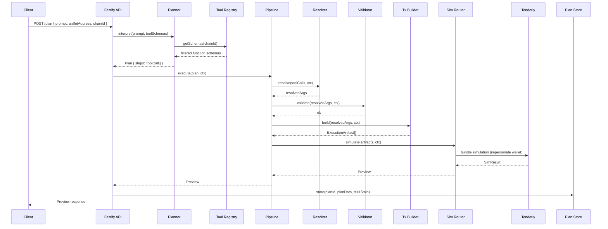
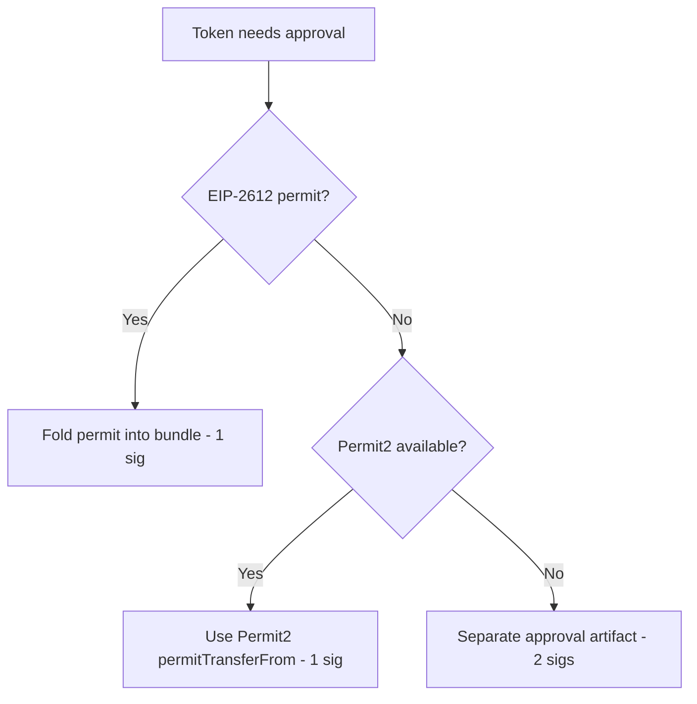
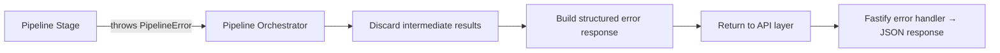

# Design Document: Prompt-to-DeFi Agent

## Overview

The Prompt-to-DeFi Agent is a backend pipeline that transforms natural-language DeFi prompts into simulated, executable transaction plans. The system follows a strict two-phase lifecycle: Plan & Simulate (no signature required) and Confirm & Execute (user signs). The architecture enforces non-custodial operation, deterministic transaction building, and plugin-based protocol extensibility.

Phase 0a targets Base mainnet (8453) in simulation-only mode via Tenderly fork, supporting Morpho (lend, supplyBorrow, multiply), LiFi (swap), and an Aave extensibility stub.

Key design decisions:
- **LLM as untrusted selector**: The Planner only selects tools and fills params. All calldata is built by deterministic code.
- **Plugin boundary**: Tools depend on core interfaces; core never imports tools. This enables protocol additions without core changes.
- **SDK isolation**: All external SDK calls are wrapped in typed adapters under `src/protocols/` and `src/simulators/`, preventing version churn from reaching the pipeline.
- **Simulation-first**: Every plan passes through Tenderly fork simulation before artifacts reach the user.

## Architecture

```mermaid
graph TD
    A[User Prompt] --> B[Fastify API /plan]
    B --> C[Planner - OpenAI GPT-4o]
    C --> D[Pipeline Orchestrator]
    D --> E[Resolver Stage]
    E --> F[Validator Stage]
    F --> G[Tx Builder Stage]
    G --> H[Sim Router]
    H --> I[Tenderly Simulator]
    I --> J[Preview Response]
    
    J -->|User Confirms| K[/execute endpoint]
    K --> L[Executor]
    L --> M[Unsigned Artifacts → Wallet Signs]

    subgraph Core Pipeline
        D
        E
        F
        G
    end

    subgraph Simulators
        H
        I
    end

    subgraph Tools - Plugins
        T1[morpho.lend]
        T2[morpho.supplyBorrow]
        T3[morpho.multiply]
        T4[lifi.swap]
        T5[aave.supply stub]
    end

    subgraph Protocol Adapters
        PA1[Morpho Adapter]
        PA2[LiFi Adapter]
        PA3[Tenderly Adapter]
    end
```

### Request Flow



## Components and Interfaces

### Core Layer (`src/core/`)

The core layer defines interfaces and orchestration. It has zero dependencies on external SDKs or protocol implementations.

#### Tool Interface

```ts
// src/core/tool.ts
import { ZodSchema } from "zod";

export type Capability =
  | "LEND" | "BORROW" | "SUPPLY_COLLATERAL" | "MULTIPLY"
  | "SWAP" | "BRIDGE" | "LP" | "PERP" | "STAKE";

export interface Tool<TArgs = unknown, TResolved = TArgs> {
  readonly id: string;
  readonly capability: Capability;
  readonly chains: number[];
  readonly description: string;
  readonly paramSchema: ZodSchema<TArgs>;

  resolve(args: TArgs, ctx: PipelineContext): Promise<TResolved>;
  validate(resolved: TResolved, ctx: PipelineContext): Promise<void>;
  build(resolved: TResolved, ctx: PipelineContext): Promise<ExecutionArtifact[]>;
  preview(resolved: TResolved, sim: SimResult): PreviewCard;
}
```

#### Tool Registry

```ts
// src/core/registry.ts
export interface ToolRegistry {
  register(tool: Tool): void;
  get(toolId: string): Tool;
  getForChain(chainId: number): Tool[];
  toOpenAIFunctions(chainId: number): OpenAIFunctionSchema[];
}
```

- `register()` throws on duplicate IDs.
- `toOpenAIFunctions()` converts each tool's `paramSchema` to an OpenAI function schema via `zod-to-json-schema`, filtered by chain.

#### Pipeline Orchestrator

```ts
// src/core/pipeline.ts
export interface PipelineResult {
  preview: Preview;
  artifacts: ExecutionArtifact[];
}

export async function executePipeline(
  plan: Plan,
  ctx: PipelineContext,
  registry: ToolRegistry,
  simRouter: SimulationRouter
): Promise<PipelineResult>;
```

The orchestrator runs stages sequentially: resolve → validate → build → simulate. It fails fast on the first error at any stage.

#### Pipeline Context

```ts
// src/core/context.ts
import type { PublicClient } from "viem";

export interface PipelineContext {
  readonly walletAddress: `0x${string}`;
  readonly chainId: number;
  readonly client: PublicClient;
  readonly blockNumber: bigint;
}
```

### Agents Layer (`src/agents/`)

#### Planner

```ts
// src/agents/planner/index.ts
export interface PlannerConfig {
  model: string;         // "gpt-4o"
  temperature: 0;
  maxSteps: 10;
}

export interface Planner {
  interpret(
    prompt: string,
    toolSchemas: OpenAIFunctionSchema[],
    chainId: number
  ): Promise<Plan>;
}
```

Uses OpenAI function-calling. The response is parsed into `ToolCall[]` and each call's args are validated against the tool's `paramSchema`.

#### Executor

```ts
// src/agents/executor/index.ts
export interface ExecutionResponse {
  artifacts: ExecutionArtifact[];
  order: string[];  // artifact IDs in signing order (approvals first)
}

export interface Executor {
  prepare(planId: string): Promise<ExecutionResponse>;
}
```

Returns unsigned artifacts ordered for sequential wallet signing. Phase 0 is simulation-only; broadcast is disabled.

### Simulators Layer (`src/simulators/`)

#### Simulator Interface

```ts
// src/simulators/types.ts
export interface Simulator {
  supports(kind: ExecutionArtifact["kind"]): boolean;
  simulate(artifacts: ExecutionArtifact[], ctx: PipelineContext): Promise<SimResult>;
}
```

#### Simulation Router

```ts
// src/simulators/router.ts
export interface SimulationRouter {
  register(simulator: Simulator): void;
  simulate(artifacts: ExecutionArtifact[], ctx: PipelineContext): Promise<SimResult>;
}
```

The router groups artifacts by kind, dispatches to the matching simulator, and merges results. For Phase 0, only the Tenderly simulator is registered (supports: evmTx, evmBundle, approval).

#### Tenderly Adapter

```ts
// src/simulators/tenderly.ts
export interface TenderlyConfig {
  accessKey: string;
  accountSlug: string;
  projectSlug: string;
  timeoutMs: 30_000;
}

export interface TenderlyBundleRequest {
  networkId: string;
  blockNumber: number;
  from: string;
  transactions: TenderlyTx[];
  simulationType: "full";
  stateObjects?: Record<string, unknown>;
}

export interface TenderlySimulator extends Simulator {
  supports(kind: ExecutionArtifact["kind"]): boolean;  // evmTx | evmBundle | approval
  simulate(artifacts: ExecutionArtifact[], ctx: PipelineContext): Promise<SimResult>;
}
```

### Protocol Adapters (`src/protocols/`)

#### Morpho Adapter

```ts
// src/protocols/morpho.ts
export interface MorphoVault {
  address: `0x${string}`;
  asset: `0x${string}`;
  supplyApy: number;
  totalSupply: bigint;
  chainId: number;
}

export interface MorphoMarket {
  id: string;
  collateralAsset: `0x${string}`;
  borrowAsset: `0x${string}`;
  lltv: bigint;
  chainId: number;
}

export interface MorphoAdapter {
  getVaults(asset: `0x${string}`, chainId: number): Promise<MorphoVault[]>;
  getMarket(marketId: string, chainId: number): Promise<MorphoMarket>;
  getPosition(marketId: string, user: `0x${string}`): Promise<MorphoPosition>;
  buildSupplyBundle(params: SupplyBundleParams): Promise<`0x${string}`>;
  buildSupplyBorrowBundle(params: SupplyBorrowBundleParams): Promise<`0x${string}`>;
  buildMultiplyBundle(params: MultiplyBundleParams): Promise<`0x${string}`>;
}
```

Wraps `@morpho-org/blue-api-sdk` for GraphQL queries and `@morpho-org/bundler-sdk-viem` for bundle construction.

#### LiFi Adapter

```ts
// src/protocols/lifi.ts
export interface SwapRoute {
  fromToken: `0x${string}`;
  toToken: `0x${string}`;
  fromAmount: bigint;
  toAmount: bigint;
  slippage: number;
  approvalAddress: `0x${string}`;
  txData: `0x${string}`;
  txTo: `0x${string}`;
  txValue: bigint;
}

export interface LiFiAdapter {
  getSwapRoutes(params: SwapQuoteParams): Promise<SwapRoute[]>;
  getBestRoute(params: SwapQuoteParams): Promise<SwapRoute>;
  getSwapCalldata(route: SwapRoute): Promise<{ to: `0x${string}`; data: `0x${string}`; value: bigint }>;
}
```

Wraps `@lifi/sdk` for route queries and calldata construction.

### API Layer (`src/api/`)

```ts
// src/api/routes.ts
// POST /plan   → PlanRequestSchema → Preview
// POST /simulate → SimulateRequestSchema → Preview
// POST /execute → ExecuteRequestSchema → ExecutionResponse
```

Built on Fastify with Zod request validation, structured error responses, and IP-based rate limiting (60 req/min/IP).

### Plan Store (`src/core/store.ts`)

```ts
export interface StoredPlan {
  planId: string;
  prompt: string;
  walletAddress: `0x${string}`;
  chainId: number;
  resolvedCalls: ResolvedToolCall[];
  artifacts: ExecutionArtifact[];
  preview: Preview;
  createdAt: number;
}

export interface PlanStore {
  set(planId: string, data: StoredPlan): void;
  get(planId: string): StoredPlan | null;  // returns null if expired
  delete(planId: string): void;
}
```

In-memory Map with 15-minute TTL. A periodic cleanup interval evicts expired entries.

## Data Models

### Core Types

```ts
// src/core/types.ts

export type UnsignedTx = {
  to: `0x${string}`;
  data: `0x${string}`;
  value: bigint;
  chainId: number;
};

export type ExecutionArtifact =
  | { kind: "approval";  chainId: number; tx: UnsignedTx; tokenAddress: `0x${string}`; spender: `0x${string}`; amount: bigint }
  | { kind: "evmTx";     chainId: number; tx: UnsignedTx }
  | { kind: "evmBundle";  chainId: number; tx: UnsignedTx }
  | { kind: "signedAction"; venue: string; typedData: unknown };

export type Plan = {
  planId: string;
  chainId: number;
  walletAddress: `0x${string}`;
  steps: ToolCall[];
};

export type ToolCall = {
  toolId: string;
  args: unknown;
};

export type ResolvedToolCall = {
  toolId: string;
  args: unknown;
  resolved: unknown;
};

export type SimResult = {
  success: boolean;
  revertReason?: string;
  revertIndex?: number;
  gasUsed: bigint;
  gasCostNative: bigint;
  balanceChanges: BalanceChange[];
  positionAfter?: PositionState;
  rawLogs: unknown[];
};

export type BalanceChange = {
  token: string;        // symbol
  tokenAddress: `0x${string}`;
  before: bigint;
  after: bigint;
};

export type PositionState = {
  collateral: bigint;
  debt: bigint;
  ltv: number;          // percentage 0-100
  lltv: number;         // percentage 0-100
};

export type PreviewCard = {
  summary: string;      // max 2 sentences
  balanceChanges: BalanceChange[];
  gasEstimate: { gasUnits: bigint; nativeCost: bigint };
  position?: PositionState;
};

export type Preview = {
  planId: string;
  humanSummary: string;
  simulation: SimResult;
  artifacts: ExecutionArtifact[];
  previewCards: PreviewCard[];
};
```

### API Request/Response Schemas

```ts
// src/api/schemas.ts
import { z } from "zod";

export const PlanRequestSchema = z.object({
  prompt: z.string().min(1).max(2000),
  walletAddress: z.string().regex(/^0x[a-fA-F0-9]{40}$/),
  chainId: z.number().int().positive(),
});

export const SimulateRequestSchema = z.object({
  planId: z.string().uuid(),
});

export const ExecuteRequestSchema = z.object({
  planId: z.string().uuid(),
});

export const ErrorResponseSchema = z.object({
  error: z.object({
    stage: z.enum(["planner", "resolver", "validator", "builder", "simulator", "api"]),
    category: z.enum(["validation", "resolution", "build", "simulation", "timeout", "unknown"]),
    message: z.string(),
    details: z.record(z.unknown()).optional(),
  }),
});
```

### Pipeline Error Model

```ts
// src/core/errors.ts
export type PipelineStage = "planner" | "resolver" | "validator" | "builder" | "simulator";
export type ErrorCategory = "validation" | "resolution" | "build" | "simulation" | "timeout" | "unknown";

export class PipelineError extends Error {
  constructor(
    public readonly stage: PipelineStage,
    public readonly category: ErrorCategory,
    message: string,
    public readonly details?: Record<string, unknown>
  ) {
    super(message);
  }
}
```

### Permit2 / EIP-2612 Approval Folding

The Tx Builder implements a token approval strategy:

1. Check if the token implements EIP-2612 `permit()` by reading `DOMAIN_SEPARATOR` and `nonces`.
2. If EIP-2612 is supported: fold the permit into the bundle's calldata (e.g., Morpho bundler's `permit` action) — single signature.
3. If Permit2 is deployed and the token is approved to Permit2: use Permit2 `permitTransferFrom` — single signature.
4. Fallback: emit a separate `{ kind: "approval" }` artifact requiring an additional signature.



## Correctness Properties

*A property is a characteristic or behavior that should hold true across all valid executions of a system — essentially, a formal statement about what the system should do. Properties serve as the bridge between human-readable specifications and machine-verifiable correctness guarantees.*

### Property 1: Plan schema validation

*For any* ToolCall with arguments, if the arguments conform to the tool's Zod paramSchema then validation succeeds; if the arguments violate the schema then validation rejects with an error identifying the invalid fields and violated constraints.

**Validates: Requirements 1.1, 1.2, 1.4**

### Property 2: Registry chain filtering

*For any* set of registered Tools and any chain ID, the Tool_Registry SHALL return only tools whose `chains` array contains that chain ID; if no tools match, the system rejects with an appropriate error; if a ToolCall references an unregistered tool ID, the system rejects.

**Validates: Requirements 1.3, 1.6, 8.3, 8.6**

### Property 3: Vault selection maximizes APY with TVL tiebreaker

*For any* non-empty list of MorphoVault objects matching a given asset and chain, the selection function SHALL return the vault with the highest `supplyApy`; if multiple vaults share the same highest APY, the one with the highest `totalSupply` is selected.

**Validates: Requirements 2.2**

### Property 4: Route selection maximizes output amount

*For any* non-empty list of SwapRoute objects, the selection function SHALL return the route with the highest `toAmount`; if the user-specified slippage is undefined, the resolved route SHALL have slippage set to 0.005 (0.5%).

**Validates: Requirements 2.3**

### Property 5: Cumulative balance validation

*For any* ordered sequence of ToolCalls where each step consumes a token amount, the Validator SHALL track cumulative consumption across steps such that the effective available balance for step N equals the wallet balance minus the sum of amounts consumed by steps 1 through N-1; if the effective balance is insufficient, the plan is rejected.

**Validates: Requirements 3.1, 3.3**

### Property 6: LTV rejection

*For any* collateral value, debt value, and market LLTV, if `(debt / collateral) > LLTV` then the Validator SHALL reject the plan. If `(debt / collateral) <= LLTV` the plan passes the LTV check.

**Validates: Requirements 3.2, 9.6**

### Property 7: Slippage bound enforcement

*For any* swap operation with a specified slippage value, if `slippage > 0.05` (5%) then the Validator SHALL reject the plan regardless of other parameters.

**Validates: Requirements 3.4, 10.3**

### Property 8: Validator fail-fast

*For any* plan containing multiple constraint violations at different steps, the Validator SHALL report only the first violation encountered (lowest step index) and halt further validation.

**Validates: Requirements 3.5**

### Property 9: Artifact order preservation

*For any* ordered sequence of ToolCalls, the Tx_Builder SHALL produce ExecutionArtifacts in the same sequence — the artifact at index i corresponds to the ToolCall at index i (accounting for inserted approval artifacts).

**Validates: Requirements 4.1**

### Property 10: Approval folding strategy

*For any* token requiring spending allowance: if the token supports EIP-2612 permit or Permit2, the build output SHALL contain no separate "approval" artifact (the permit is folded into the bundle); if the token does not support permit/Permit2, the build output SHALL contain an "approval" artifact immediately preceding the spending artifact with the exact required amount.

**Validates: Requirements 4.4, 4.5, 7.1, 7.3**

### Property 11: Same-chain artifact grouping

*For any* list of ExecutionArtifacts, the Sim_Router SHALL group all artifacts sharing the same chainId into a single simulation bundle, such that the number of distinct simulation calls equals the number of distinct chainIds in the input.

**Validates: Requirements 5.1**

### Property 12: Bundle revert propagation

*For any* simulated bundle where at least one transaction reverts, the SimResult SHALL have `success: false`, SHALL contain the `revertReason`, and SHALL identify the `revertIndex` of the first failing transaction.

**Validates: Requirements 5.4**

### Property 13: Flashloan amount computation

*For any* target leverage multiplier M, collateral amount C, and collateral/debt price ratio P, the morpho.multiply tool SHALL compute the flashloan amount such that the resulting position has effective leverage equal to M (within rounding tolerance), where `leverage = totalCollateral / (totalCollateral - totalDebt)`.

**Validates: Requirements 9.3**

### Property 14: Duplicate tool registration rejection

*For any* Tool_Registry state, if a tool with ID X is already registered and a new tool with the same ID X is registered, the registry SHALL throw an error and the registry state SHALL remain unchanged.

**Validates: Requirements 8.2**

### Property 15: Plan store round-trip with TTL

*For any* StoredPlan written to the PlanStore, retrieving by planId before TTL expiry SHALL return the identical data (prompt, walletAddress, chainId, resolvedCalls, artifacts); retrieving after TTL expiry SHALL return null.

**Validates: Requirements 15.1, 15.2, 15.3, 15.4, 11.7**

### Property 16: Structured error responses

*For any* PipelineError thrown at any stage, the system's error response SHALL contain the `stage` field matching the failing stage, a `category` field, and a non-empty `message` string; no partial results from prior successful stages SHALL appear in the response.

**Validates: Requirements 13.1, 13.5**

### Property 17: Revert reason parsing

*For any* Tenderly simulation response containing a revert reason (hex-encoded or string), the parser SHALL extract a non-empty human-readable string from it; if the revert reason cannot be decoded, the parser SHALL return the raw hex string as the message.

**Validates: Requirements 13.2**

## Error Handling

### Strategy

The system uses a **fail-fast, no-retry** error model. Each pipeline stage either succeeds and passes results forward or throws a `PipelineError` that halts the pipeline immediately.

### Error Flow



### Error Categories by Stage

| Stage | Possible Categories | Examples |
|-------|-------------------|----------|
| Planner | validation | Uninterpretable prompt, no function call produced |
| Resolver | resolution, timeout | No vault found, LiFi timeout, unknown token |
| Validator | validation | LTV exceeded, insufficient balance, slippage > 5% |
| Builder | build | Bundler SDK failure, permit detection failure |
| Simulator | simulation, timeout | Tenderly revert, simulation timeout (30s) |
| API | validation | Invalid request body (Zod), missing planId (404) |

### HTTP Status Mapping

| Condition | Status |
|-----------|--------|
| Request body validation failure | 400 |
| Plan not found / expired | 404 |
| Rate limit exceeded | 429 |
| Pipeline error (any stage) | 422 |
| Unexpected server error | 500 |

### Timeout Configuration

| External Service | Timeout | Behavior on Timeout |
|-----------------|---------|---------------------|
| OpenAI (Planner) | 30s | PipelineError(planner, timeout) |
| Morpho GraphQL | 10s | PipelineError(resolver, timeout) |
| LiFi API | 10s | PipelineError(resolver, timeout) |
| Tenderly Bundle API | 30s | PipelineError(simulator, timeout) |

## Testing Strategy

### Dual Testing Approach

The system uses both property-based tests and example-based unit tests for comprehensive coverage.

**Property-Based Tests** (using [fast-check](https://github.com/dubzzz/fast-check)):
- Verify universal correctness properties across generated inputs
- Minimum 100 iterations per property
- Each test tagged with: `Feature: prompt-to-defi-agent, Property {N}: {title}`
- Focus areas: validation logic, selection algorithms, ordering invariants, state management, error handling

**Example-Based Unit Tests** (using vitest):
- Specific integration scenarios (tool → adapter → mock response)
- Edge cases: empty vault lists, zero balances, max slippage boundary
- Error paths: network timeouts, revert decoding, invalid tool IDs
- Morpho bundler flow (supplyBorrow, multiply)

**Integration Tests**:
- Fastify endpoint tests with supertest
- Full pipeline with mocked protocol adapters
- Rate limiting verification
- Plan TTL lifecycle

### Test Configuration

```ts
// vitest.config.ts
export default defineConfig({
  test: {
    globals: true,
    environment: "node",
    testTimeout: 30_000,
    coverage: { provider: "v8", thresholds: { lines: 80 } },
  },
});
```

### Property Test Structure

```ts
import { fc } from "@fast-check/vitest";

// Feature: prompt-to-defi-agent, Property 6: LTV rejection
describe("Validator LTV check", () => {
  it.prop([fc.bigInt(1n, 10n**18n), fc.bigInt(1n, 10n**18n), fc.bigInt(1n, 10n**18n)])(
    "rejects when debt/collateral exceeds LLTV",
    (collateral, debt, lltv) => {
      // ... test implementation
    }
  );
});
```

### What Is NOT Property-Tested

- Frontend components (React rendering, wagmi interactions) → snapshot + component tests
- External SDK behavior (Morpho bundler output, LiFi route format) → integration tests with mocked adapters
- Tenderly API contract → integration test with recorded fixtures
- Rate limiting timing → integration test

### Test File Organization

```
test/
  properties/
    validation.prop.test.ts     # Properties 1, 5, 6, 7, 8
    registry.prop.test.ts       # Properties 2, 14
    selection.prop.test.ts      # Properties 3, 4
    builder.prop.test.ts        # Properties 9, 10
    simulator.prop.test.ts      # Properties 11, 12
    multiply.prop.test.ts       # Property 13
    store.prop.test.ts          # Property 15
    errors.prop.test.ts         # Properties 16, 17
  unit/
    planner.test.ts
    morpho-lend.test.ts
    morpho-supply-borrow.test.ts
    morpho-multiply.test.ts
    lifi-swap.test.ts
    aave-stub.test.ts
    permit-detection.test.ts
  integration/
    api-plan.test.ts
    api-simulate.test.ts
    api-execute.test.ts
    pipeline-e2e.test.ts
    rate-limit.test.ts
```

